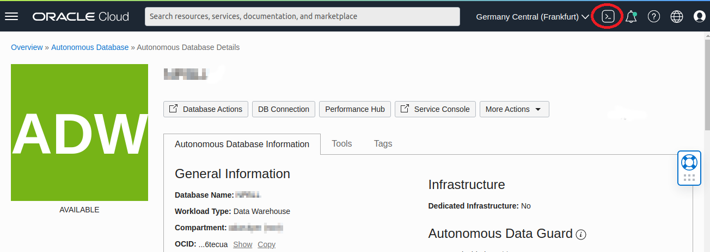
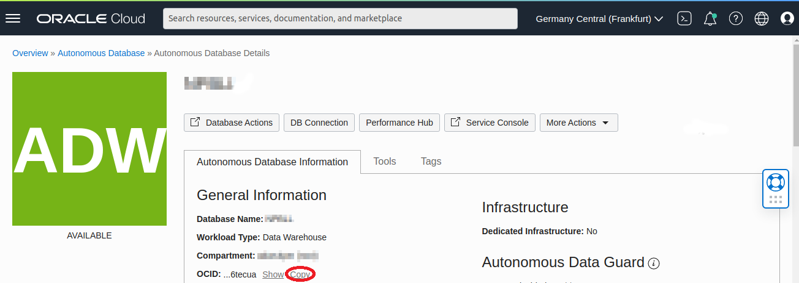
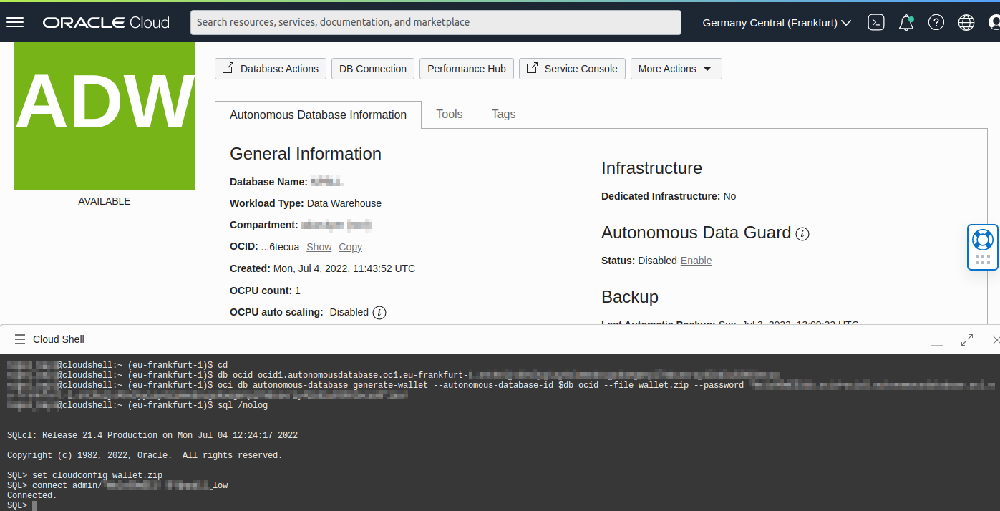

# Create an Application Schema and Prepare for Auto Indexing

## Introduction

In this lab you will create a test schema and enable automatic indexing.

Estimated Time: 10mins

### Objectives
- Create a test schema for auto indexing.

### Prerequisites
This lab assumes you have completed the following:

- Provision an Autonomous Database Instance

## Task 1: Invoke a Cloud Shell from the Oracle Cloud Infrastructure (OCI) 

We will now use OCI Cloud Shell, a web browser-based terminal accessible from the Oracle Cloud Console. Cloud Shell provides access to a Linux shell, with a pre-authenticated Oracle Cloud Infrastructure CLI, and other useful pre-installed tools like SQL command line. 


1. From your Autonomous Database Details page, click the OCI Cloud Shell button (top right, circled in red):

	

2. When the shell has started, we need to download the wallet into Cloud Shell to connect to your autonomous database. 
   First, we need to copy the OCID of your newly created autonomous database. That is the unique identifier of your database. Select "Copy" (circled in red).	

	


3. 	In Cloud Shell, execute the following to connect to your database. You need to insert your copied **autonomous database OCID** into the code below. For the database connection, you are using ADMIN with the admin password you set up when provisioning your autonomous database.

	The name of your service is your database name with suffix "\_high", "\_medium", or "\_low". You can get this information also from the DB Connections button on your **Autonomous Database Details** screen. For the purposes of this lab, we will use the "\_low" service.
	
	```
	# go to home directory
	cd
	
	# set the environment variable for your newly created autonomous database
	db_ocid=<paste your copied ocid here>
	 
	# download wallet using OCI CLI 
	oci db autonomous-database generate-wallet --autonomous-database-id $db_ocid --file wallet.zip --password welcome1
	
	# Connect using sqlcl and your newly downloaded wallet
	sql /nolog
	set cloudconfig wallet.zip
	connect admin/<your_password>@<your_service>
	```
	
	Here is an example:

	


## Task 2: Reset the Lab

1. Using Cloud Shell, connect with user **ADMIN** in sqlcl. Use the "\_low" service.
	
	```
	<copy>
	sql /nolog
	set cloudconfig wallet.zip
	connect admin/<your_password>@<your_service>
	</copy>
	```

2. Perform this step to make sure that there are no auto indexes from a previous lab run. It will drop _all_ auto indexes and ensures everything will function correctly even if you have worked through this lab before. This command can be executed without error, even if there are no auto indexes.

	```
	<copy>
	exec dbms_auto_index.drop_auto_indexes(user,null,true)
	</copy>
	```

## Task 3: Create and Populate an Application Table

1. Using Cloud Shell connect with user **ADMIN** in sqlcl. Use the "\_low" service. All remaining steps in this lab will assume you are connected to this user account.
	
	```
	sql /nolog
	set cloudconfig wallet.zip
	connect admin/<your_password>@<your_service>
	```

2. Drop the table if it exists already.

    ```
	<copy>
	declare
		ORA_00942 exception; pragma Exception_Init(ORA_00942, -00942);
	begin
		execute immediate 'drop table AUTO_INDEX_TEST_TABLE purge';
		exception when ORA_00942 then null;
	end;
	/
	</copy>
	```

3. Create an application table and prepare it for auto indexing. This will take around three minutes.

	```
	<copy>
	create table AUTO_INDEX_TEST_TABLE as
	select 1                sum_col,
		rownum              f1,
		mod(rownum,100000)  f2,
		mod(rownum,1000000) f3,
		mod(rownum,500000)  f4,
		mod(rownum,200000)  f5,
		mod(rownum,100000)  f6,
		mod(rownum,10000)   f7,
		mod(rownum,5000)    f8,
		mod(rownum,1000)    f9,
		mod(rownum,100)     f10,
		pad
	from   (select dbms_random.string('u',1000) pad from dual connect by level<=100) a,
	       (select 1 c from dual connect by level<=100000) b;
	
	--
	-- Statistics will be generated during table creation (above), 
	-- but we'll perform this step to remind ourselves that 
	-- statistics must not be stale. Auto indexing will
	-- not consider new indexes for tables with stale statistics.
	--
	exec dbms_stats.gather_table_stats(user,'AUTO_INDEX_TEST_TABLE')
	--
	-- Oracle Autonomous Database has optimizations 
	-- for aggregate queries,improving query performance
	-- using database statistics.
	--
	-- For the sake of this demo, we'll make sure 
	-- that this will not kick in and queries will
	-- need to scan the table or use the result cache.
	--
	insert into AUTO_INDEX_TEST_TABLE 
	            values (0,0,0,0,0,0,0,0,0,0,0,'X');
	commit;
	</copy>

	```

4.  Enable automatic indexing by setting the auto index mode to IMPLEMENT.
	
	```
	<copy>
	exec dbms_auto_index.configure('AUTO_INDEX_MODE', 'IMPLEMENT')
	</copy>
	```    	

5.  Set the result cache mode to MANUAL. The database result cache is enabled by default in ADW. In this lab we want to clearly see before vs after performance, so we'll set it to manual-only for now.
	
	```
	<copy>
	alter system set result_cache_mode = manual;
	</copy>
	```    	
	
## Acknowledgements
* **Author** - Nigel Bayliss, Jun 2022
* **Last Updated By/Date** - Nigel Bayliss, Jun 2022