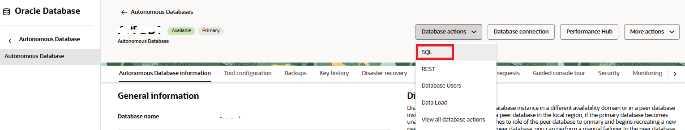

# Create an Application Schema and Prepare for Auto Indexing

## Introduction

In this lab you will create a test schema and enable automatic indexing.

Estimated Time: 10mins

### Objectives
- Create a test schema for auto indexing.

### Prerequisites
This lab assumes you have completed the following:

- Provision an Autonomous Database Instance

## Task 1: Prepare to Execute SQL statements in a SQL Query Window using Database Actions 

We will now prepare to execute SQL statements. 

1. From your Autonomous Database Details page, click "Database actions" and then "SQL":

	

2. Ensure you are connected to ADMIN via the LOW service (circled in red):	

	

3. For the rest of this lab, use the run script button to execute SQL because some of the PL/SQL packages will write output. 
	
	

## Task 2: Reset the Lab

1. In the SQL worksheet, perform this step to make sure that there are no auto indexes from a previous lab run. It will drop _all_ auto indexes and ensures everything will function correctly even if you have worked through this lab before. The following command can be executed without error, even if there are no auto indexes. Paste the text below in the worksheet and click the green "Run Statement" or "Run Script" button to execute it.

	```
	<copy>
	exec dbms_auto_index.drop_auto_indexes(user,null,true)
	</copy>
	```

## Task 3: Create and Populate an Application Table

1. Drop the table if it exists already.

    ```
	<copy>
	declare
		ORA_00942 exception; pragma Exception_Init(ORA_00942, -00942);
	begin
		execute immediate 'drop table AUTO_INDEX_TEST_TABLE purge';
		exception when ORA_00942 then null;
	end;
	/
	</copy>
	```

2. Create an application table and prepare it for auto indexing. This will take around three minutes.

	```
	<copy>
	create table AUTO_INDEX_TEST_TABLE as
	select 1                sum_col,
		rownum              f1,
		mod(rownum,100000)  f2,
		mod(rownum,1000000) f3,
		mod(rownum,500000)  f4,
		mod(rownum,200000)  f5,
		mod(rownum,100000)  f6,
		mod(rownum,10000)   f7,
		mod(rownum,5000)    f8,
		mod(rownum,1000)    f9,
		mod(rownum,100)     f10,
		pad
	from   (select dbms_random.string('u',1000) pad from dual connect by level<=100) a,
	       (select 1 c from dual connect by level<=100000) b;
	
	--
	-- Statistics will be generated during table creation (above), 
	-- but we'll perform this step to remind ourselves that 
	-- statistics must not be stale. Auto indexing will
	-- not consider new indexes for tables with stale statistics.
	--
	exec dbms_stats.gather_table_stats(user,'AUTO_INDEX_TEST_TABLE')
	--
	-- Oracle Autonomous Database has optimizations 
	-- for aggregate queries,improving query performance
	-- using database statistics.
	--
	-- For the sake of this demo, we'll make sure 
	-- that this will not kick in and queries will
	-- need to scan the table or use the result cache.
	--
	insert into AUTO_INDEX_TEST_TABLE 
	            values (0,0,0,0,0,0,0,0,0,0,0,'X');
	commit;
	</copy>

	```

3.  Enable automatic indexing by setting the auto index mode to IMPLEMENT.
	
	```
	<copy>
	exec dbms_auto_index.configure('AUTO_INDEX_MODE', 'IMPLEMENT')
	</copy>
	```    	

4.  Set the result cache mode to MANUAL. The database result cache is enabled by default in ADW. In this lab we want to clearly see before vs after performance, so we'll set it to manual-only for now.
	
	```
	<copy>
	alter system set result_cache_mode = manual;
	</copy>
	```    	

## Task 4: Turn Off DML Awareness

1. Oracle Database 23ai includes a new configuration setting that reduces the propensity for creating indexes on tables subject to a lot of DML activity (INSERT/UPDATE/DELETE/MERGE). Indexes improve SELECT performance, but this can be at the expense of DML performance if a table is subject to high rates of change. If the following configuration setting is enabled, automatic indexing will avoid creating indexes on tables with high levels of DML. For the purposes of this demonstration, we must disable this setting because the test table is subject to a lot of DML activity.

	```
	<copy>
	-- If using Oracle Database 23ai only - not required for Oracle Database 19c
	exec dbms_auto_index.configure('auto_index_include_dml_cost', 'OFF')
	</copy>
	```

You may now **proceed to the next lab**.

## Acknowledgements
* **Author** - Nigel Bayliss, Jun 2022
* **Last Updated By/Date** - Nigel Bayliss, Jan 2025
