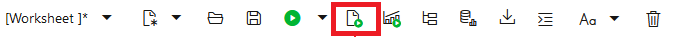
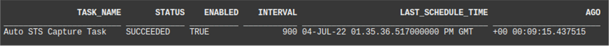
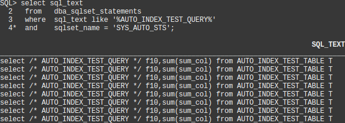

# Execute an Application Workload

## Introduction

Automatic indexing test executes workload SQL statements and measures the performance effects of new indexes. In this lab we will generate a workload for it to work on.

Estimated Time: 20mins

### Objectives
- Generate a query workload on our application table. This will be the workload that auto indexing will optimize.

### Prerequisites
This lab assumes you have completed the following:

- Provision an Autonomous Database Instance
- Create an Application Schema and Prepare for Auto Indexing

## Task 1: Execute an Application Workload   

1. Execute a workload on the application table, AUTO\_INDEX\_TEST\_TABLE. The statements use a variety of different predicates, some of which will benefit from index access. Auto indexing tests _new_ appliation workload SQL statements as soon as possible and will not test them again for at least 30 days. To ensure that our SQL statements are tested as soon as possible (even if you have run this lab before), the PL/SQL block below generates unique SQL statements each time it is executed. It does this using a table alias name incorporating a time-stamp. Note that workload SQL statements need to be executed more than once to be considered by auto indexing.

    Remember to use the script button:

    

    ````
    <copy>
    set serveroutput on
    declare
        qry varchar2(1000);
        talias  varchar2(30);
        n1  number;
        n2  number;
    begin
        for i in 1..10
        loop
            talias := 'T'||to_char(sysdate,'YYYYMMDDHH24MISS');
            qry := 'select /* AUTO_INDEX_TEST_QUERY */ f10,sum(sum_col) from AUTO_INDEX_TEST_TABLE '||talias||' where f'||i||' = 1 group by f10';
            execute immediate qry into n1,n2;
            execute immediate qry into n1,n2;
            execute immediate qry into n1,n2;
            dbms_output.put_line('QRY = '||qry);
            dbms_output.put_line('SUM = '||n2);
        end loop;
        qry := 'select /* AUTO_INDEX_TEST_QUERY */ f10,sum(sum_col) from AUTO_INDEX_TEST_TABLE '||talias||' where f1 = 1 and f2 = 1 group by f10';
        execute immediate qry into n1,n2;
        execute immediate qry into n1,n2;
        execute immediate qry into n1,n2;
        dbms_output.put_line('QRY = '||qry);
        qry := 'select /* AUTO_INDEX_TEST_QUERY */ f10,sum(sum_col) from AUTO_INDEX_TEST_TABLE '||talias||' where f1 = 1 and f2 = 1 group by f10';
        execute immediate qry into n1,n2;
        execute immediate qry into n1,n2;
        execute immediate qry into n1,n2;
        dbms_output.put_line('QRY = '||qry);
    end;
    /
    set serveroutput off
    </copy>
    ````
    
## Task 2: Wait for Workload Capture

The Oracle Autonomous Database collects workload SQL periodically (every 15 minutes). The _Auto STS Capture Task_ stores workload statements in a SQL tuning set called SYS\_AUTO\_STS. This is the _automatic SQL tuning set_ (ASTS). The whole process is self-managing, so all we have to do now is sit back and wait for our new indexes to appear! Nevertheless, we will take a closer look at what happens once a workload has been executed.

1. Using the following query, check if the Auto STS task has executed recently. Wait until it has executed, _after_ the workload queries were executed. This will take up to 15 minutes.

    ````
    <copy>
     select current_timestamp now from dual;
     
     select task_name,
            status,
            enabled,
            interval,
            last_schedule_time, 
            systimestamp-last_schedule_time ago 
     from dba_autotask_schedule_control 
     where dbid = sys_context('userenv','con_dbid') 
     and   task_name like '%STS%';
    </copy>
    ````

2. Keep running the query, and monitor the LAST\_SCHEDULE\_TIME. Wait for the time to change. Alternatively, look at the "AGO" column value and wait for it to show that the task ran a few seconds ago. The interval is 900 seconds, so you will need to wait up to 15 minutes.

    

3. After 15 minutes-or-so, the Autonomous Database will have captured the workload queries. You can confirm that this by inspecting the automatic SQL tuning set. You will see the latest and previous workload SQL statements if you have run this lab before.

    ````
    <copy>
     select sql_text 
     from   dba_sqlset_statements 
     where  sql_text like '%AUTO_INDEX_TEST_QUERY%'
     and    sqlset_name = 'SYS_AUTO_STS';
    </copy>
    ````
    

You may now **proceed to the next lab**.

## Acknowledgements
* **Author** - Nigel Bayliss, Jul 2022
* **Last Updated By/Date** - Nigel Bayliss, Jun 2025
