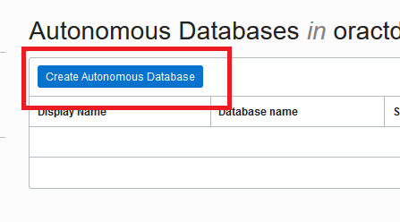
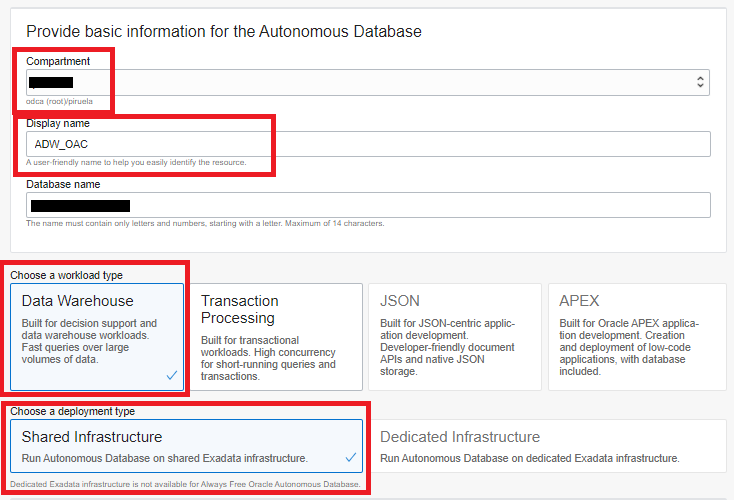
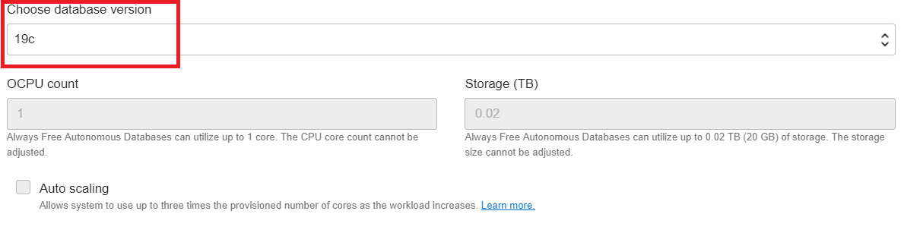
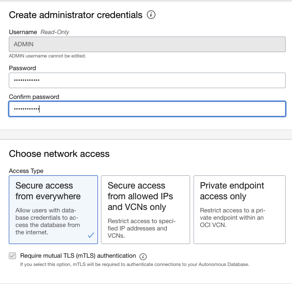
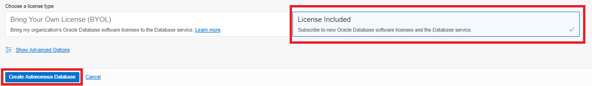
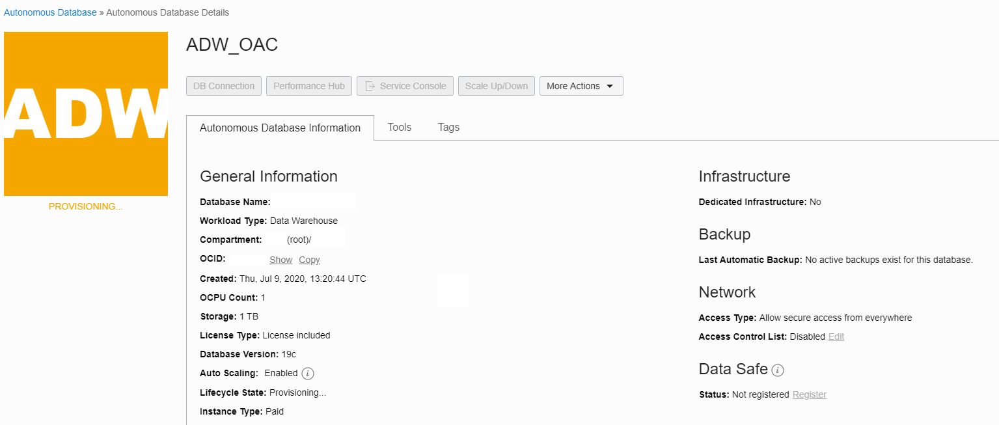
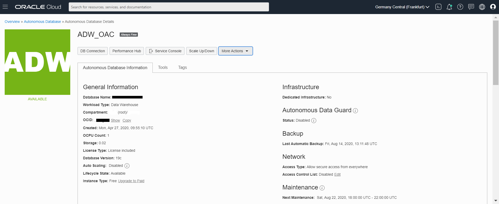

# Provision an Autonomous Database Instance

## Introduction

This workshop walks you through the steps to get started using the Oracle Autonomous Database. For this workshop, we're going to use an **Autonomous Database optimized for Analytics and Warehousing (ADW)**, but you can also Autonomous Database optimized for Transaction Process (ATP). You will provision a new database in just a few minutes.

Oracle Autonomous Databases have the following characteristics:

**Self-driving**
Automates database provisioning, tuning, and scaling.

- Provisions highly available databases, configures and tunes for specific workloads, and scales compute resources when needed, all done automatically.

**Self-securing**
Automates data protection and security.

- Protect sensitive and regulated data automatically, patch your database for security vulnerabilities, and prevent unauthorized access—all with Oracle Autonomous Database.

**Self-repairing**
Automates failure detection, failover, and repair.

- Detect and protect from system failures and user errors automatically and provide failover to standby databases with zero data loss.

Watch our short video that explains how to provision your Autonomous Database instance:

Estimated Time: 15 minutes.

### Objectives 
- Create an Autonomous Database with the latest features of Oracle Databases

## Task 1: Create a new Always Free Autonomous Data Warehouse Database

1. Click on the navigation menu at the upper left corner of the page.

    This will produce a drop-down menu. Click **Oracle Database** and then select **Autonomous Data Warehouse**.

    

    This will take you to the management console page.

    To learn more about comparments, see [Managing Compartments](https://docs.cloud.oracle.com/en-us/iaas/Content/Identity/Tasks/managingcompartments.htm).
    
2.  Make sure your Workload Type is __Data Warehouse__ or __All__ to see your Autonomous Data Warehouse instances. Use the __List Scope__ drop-down menu to select a compartment. <if type="livelabs">Enter the first part of your user name, for example `LL185` in the Search Compartments field to quickly locate your compartment.

    

3. To create a new instance, click the blue **Create Autonomous Database** button.

    

    Enter the required information and click the **Create Autonomous Database** button at the bottom of the form. For the purposes of this workshop, use the information below:

    - **Compartment:** Verify that a compartment ( &lt;tenancy_name&gt; ) is selected.

        By default, any OCI tenancy has a default ***root*** compartment named after the tenancy itself. The tenancy administrator (default root compartment administrator) is any user who is a member of the default Administrators group. For the workshop purpose, you can use ***root***.

    - **Display Name:** Enter the display name for your ADW Instance. For this demo purpose, I have called my database `ADW_OAC`.
    
    - **Database Name:** Enter any database name you choose that fits the requirements for ADW. The database name must consist of letters and numbers only, starting with a letter. The maximum length is 14 characters. You can leave the name provided. That field is not a mandatory one.
    - **Workload Type:** Autonomous Data Warehouse  
    
    - **Deployment Type:** Shared Infrastructure
    
    - **Always Free:** On or Off 

    If "On," you will see the Always Free logo next to the name of your database:

    

    

    - **Choose Database version:** 19c
    
    - **CPU Count:** 1
    
    - **Storage Capacity (TB):** 1

    - **Auto scaling:** Off

        

4. Under **Create administration credentials** section:

    - **Administrator Password:** Enter any password you wish to use noting the specific requirements imposed by ADW.
    
    - **Reminder:** Note your password in a safe location as this cannot be easily reset.

    Under **Choose network access** section:

    - Select **Secure access from everywhere**

        

5. Under **Choose a license type** section, choose **License Type: Licence Included**.

    When you have completed the required fields, scroll down and click on the blue **Create Autonomous Database** button at the bottom of the form:

    

6. The Autonomous Database **Details** page will show information about your new instance. You should notice the various menu buttons that help you manage your new instance - because the instance is currently being provisioned all the management buttons are greyed out.

    

7. A summary of your instance status is shown in the large box on the left. In this example, the color is amber and the status is **Provisioning**.

    

    The provisioning process should take **under 5 minutes**.

8. After a short while, the status will change to **Available** and the "ADW" box will change color to green:

    

9. Once the Lifecycle Status is **Available**, additional summary information about your instance is populated, including workload type and other details.

    This page is known as the **Autonomous Database Details Page**. It provides you with status information about your database, and its configuration. Get **familiar** with the buttons and tabs on this page.

    

You have just created an Autonomous Database with the latest features of Oracle Databases.

## Acknowledgements

- **Author** - Priscila Iruela - Technology Product Strategy Director, Juan Antonio Martin Pedro - Analytics Business Development
- **Contributors** - Victor Martin, Melanie Ashworth-March, Andrea Zengin
- **Last Updated By/Date** - Nigel Bayliss, June 2022
