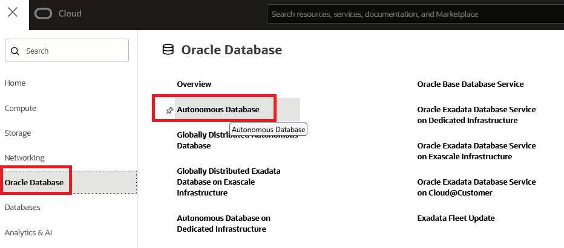
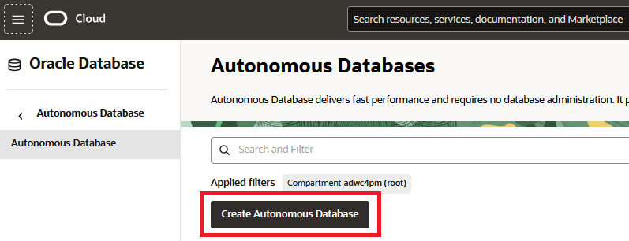
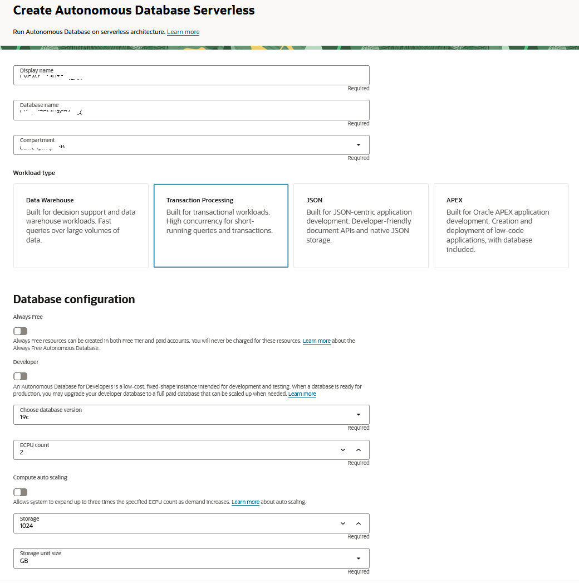
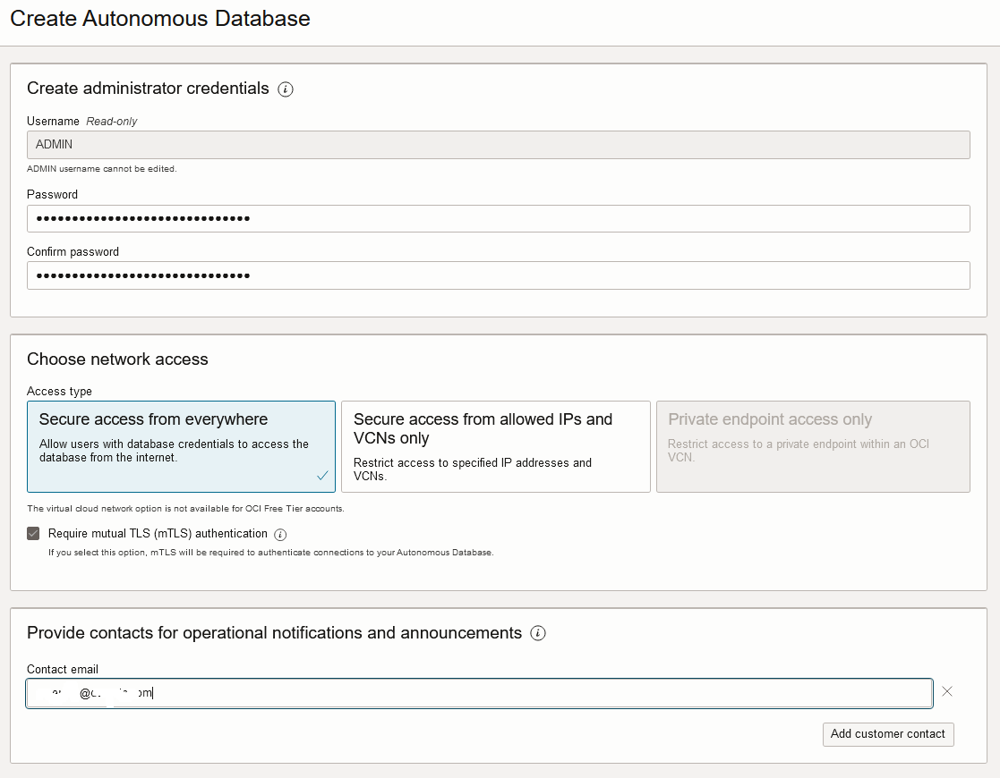
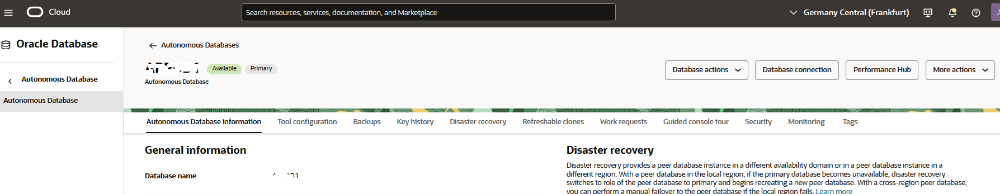

# Provision an Autonomous Database Instance

## Introduction

This workshop walks you through the steps to get started using the Oracle Autonomous Database. For this workshop we're going to use an  **Autonomous Database Optimized for Transaction Processing (ATP)**. You will provision a new database in just a few minutes. 

Oracle Autonomous Databases have the following characteristics:

**Self-driving**
Automates database provisioning, tuning, and scaling.

- Provisions highly available databases, configures and tunes for specific workloads, and scales compute resources when needed, all done automatically.

**Self-securing**
Automates data protection and security.

- Protect sensitive and regulated data automatically, patch your database for security vulnerabilities, and prevent unauthorized access—all with Oracle Autonomous Database.

**Self-repairing**
Automates failure detection, failover, and repair.

- Detect and protect from system failures and user errors automatically and provide failover to standby databases with zero data loss.

Estimated Lab Time: 15 minutes.

### Objectives 
- Create an Autonomous Database with the latest features of Oracle Databases

## Task 1: Create a new Autonomous Transaction Processing Database

1. Click on the navigation menu at the upper left corner of the page and choose **Oracle Database** and then select **Autonomous Database**.

    

2. To create a new instance, click the **Create Autonomous Database** button.

    

    Enter the required information and click the **Create Autonomous Database** button at the bottom of the form. For the purposes of this workshop, use the information below:

    - **Display Name:** Enter the display name for your database.
    
    - **Database Name:** Enter any database name you choose.

    - **Compartment:** Verify that a compartment is selected.

        By default, any OCI tenancy has a default ***root*** compartment, named after the tenancy itself. The tenancy administrator (default root compartment administrator) is any user who is a member of the default Administrators group. For the workshop purpose, you can use ***root***.

    - **Workload Type:** Autonomous Transaction Processing  
    
    - **Always Free:** Off

    - **Developer:** Unchecked    

    - **Choose database version:** 19c or 23ai (you can choose either)

    - **Compute auto scaling:** Unchecked

    - **Other settings:** Leave as default

    

3. Under **Create administration credentials** and **Choose network access** sections:

    - **Administrator Password:** Enter any password you wish to use noting the specific requirements imposed by ATP.
    
    - **Reminder:** Note your password in a safe location.

    - **Access type**: Choose **Secure access from everywhere**

    - **Contact email**: Enter a contact email address.

    

4. Create the database.

    When you have completed the required fields, click on the **Create** button at the bottom of the form.

5. The Autonomous Database **Details** page will show information about your new instance. You should notice the various menu buttons that help you manage your new instance - because the instance is currently being provisioned all the management buttons are greyed out.

    The provisioning process should take **under 5 minutes**.

6. After a short while, the status will change to **Available** and the "ATP" box will change color:

    

You have just created an Autonomous Database with the latest features of Oracle Databases.

You may now *proceed to the next lab.*

## Acknowledgements

- **Author** - Priscila Iruela - Technology Product Strategy Director, Juan Antonio Martin Pedro - Analytics Business Development
- **Contributors** - Victor Martin, Melanie Ashworth-March, Andrea Zengin
- **Last Updated By/Date** - Nigel Bayliss, Jun 2025
