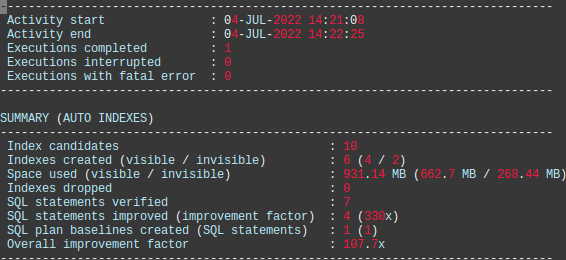
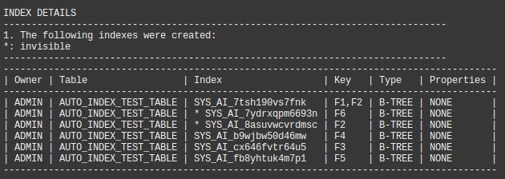
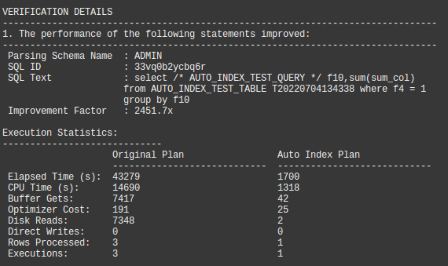
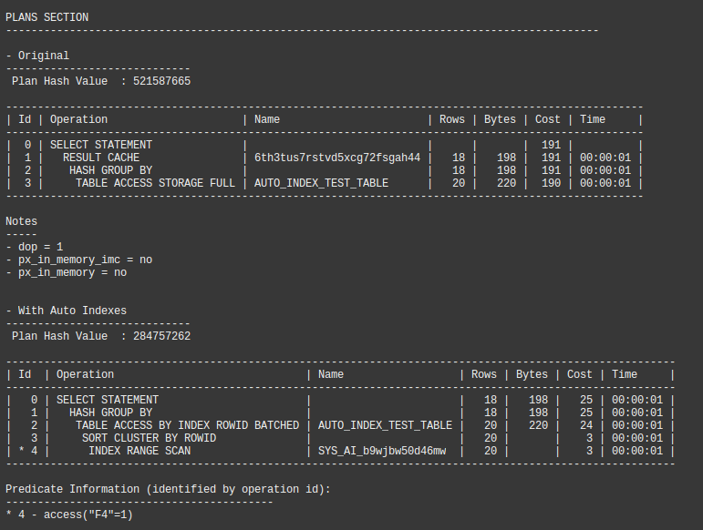
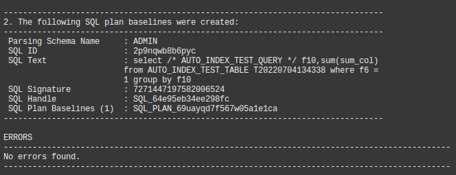

# View the Auto Indexing Report

## Introduction

Wait for auto indexing to complete and view the auto index report.

Estimated Time: 20mins

### Objectives
- View and understand the auto index report.

### Prerequisites
This lab assumes you have completed the following:

- Provision an Autonomous Database Instance
- Create an Application Schema and Prepare for Auto Indexing
- Execute an Application Workload

## Task 1: Wait for Automatic Indexing to Complete

1. This task is optional since you can skip to Task 2 and see if a new auto index report is available. Alternatively, you can use the following query to check if the auto indexing task has executed recently. We need to wait until it has executed _after_ the workload queries have been captured. This will take up to 15 minutes.

    ````
    <copy>
     select current_timestamp now from dual;
     
     select task_name,
            status,
            enabled,
            interval,
            last_schedule_time, 
            systimestamp-last_schedule_time ago 
     from dba_autotask_schedule_control 
     where dbid = sys_context('userenv','con_dbid') 
     and   task_name = 'Auto Index Task';
      
    </copy>
    ````
    
## Task 2: Generate the Automatic Indexing Report   

1. If the auto indexing task has _just_ completed dealing with your workload, you can view the most recent report. In this example, we will generate ALL sections of the report to the maximum level of detail.

    ````
    <copy>
    -- Suitable for SQL Worksheet
    DECLARE
       report clob;
    BEGIN
       report := dbms_auto_index.report_last_activity(section=>'ALL',level=>'ALL');
       dbms_output.put_line(report);
    END;
    /
    </copy>
    ````

    ````
    <copy>
    -- Suitable for using with SQL Plus
    set linesize 300
    set trims on
    set pagesize 1000
    set long 10000000
    column report format a120
    var rep clob

    exec :rep := dbms_auto_index.report_last_activity(section=>'ALL',level=>'ALL') 
    spool report
    select :rep report from dual;
    spool off
    </copy>
    ````
 2. If the auto indexing report has executed more than once since you ran the workload, you can look back in time (2 days in this case).

    ````
    <copy>
    -- Suitable for SQL Worksheet
    DECLARE
       report clob;
    BEGIN
       report := dbms_auto_index.report_activity(activity_start=>sysdate-2,section=>'ALL',level=>'ALL');
       dbms_output.put_line(report);
    END;
    /
    </copy>
    ````

    ````
    <copy>
    -- Suitable for using with SQL Plus
    set linesize 300
    set trims on
    set pagesize 1000
    set long 10000000
    column report_hist format a120
    var rep clob

    exec :rep := dbms_auto_index.report_activity(activity_start=>sysdate-2,section=>'ALL',level=>'ALL') 
    spool report_hist
    select :rep report from dual;
    spool off
    </copy>
    ````

## Task 2: View the Automatic Indexing Report   

1. The summary section of the report will look something like this.

    

You might see some differences in your report because the results depend on measured workload performance, and relative SQL performance may change over time.

In the report above, we can see:

- Ten index candidates were identified. Auto indexing identifies table columns used in query predicates. These columns are candidates for indexing. In general, auto indexing will identify a many candidates.
- Six indexes were created. Usually, a _subset_ of candidates will be deemed potentially useful by the Oracle Optimizer. Auto indexing test parses the workload SQL to see which indexes are likely to be useful. These candidates are built and internal workload performance testing will decide which ones are _sufficiently_ useful to be made visible to the workload.
- Four indexes were made visible. These indexes were found to improve the performance of the workload (above a threshold value).
- Two indexes remain invisible because, when tested using the workload, they did not improve workload sufficiently to be made visible to the workload. If no new workload queries are found that benefit from these indexes, they will remain INVISIBLE and the auto index task will make them INVALID after a period of 24 hours.
- Four queries in the workload we found to have improved performance with the new indexes.
- One workload query suffers a potential performance regression due to the new auto indexes. A SQL plan baseline has been created to prevent this.

2. The indexes created are listed in the report (invisible ones are asterisked):

    

3. In a detailed report, individual SQL performance improvements are listed, including SQL execution plans:

    

    


3. The report includes details of SQL plan baselines and an error section. It is common to see _ORA-00942: table or view does not exist_ errors in the final section if you are testing on a volatile environment. This is normal and indicative of captured workload queries for tables or views that have subsequently been dropped.

    

You may now **proceed to the next lab**.

## Acknowledgements
* **Author** - Nigel Bayliss, Jul 2022
* **Last Updated By/Date** - Nigel Bayliss, Jul 2022
