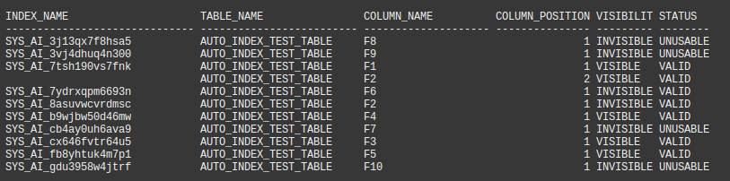
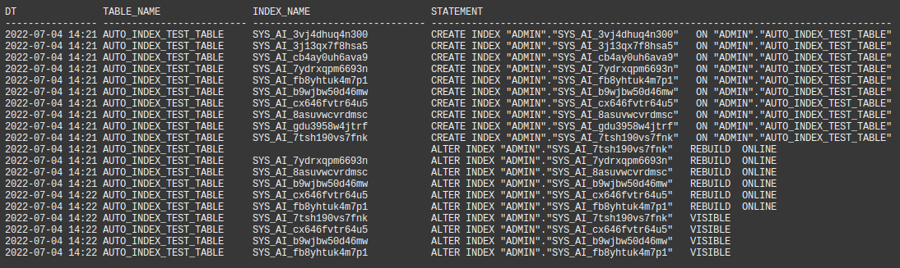

# View Automatic Indexing Details

## Introduction

The best place to find information on auto indexes is to use the auto index report. For the sake of this lab, we will look at a couple of the underlying dictionary views.

Estimated Time: 10mins

### Objectives
- Take a closer look at the actions taken by automatic indexing.

### Prerequisites
This lab assumes you have completed the following:

- Provision an Autonomous Database Instance
- Create an Application Schema and Prepare for Auto Indexing
- Execute an Application Workload
- View the Auto Index Report

## Task 1: Identify Automatic Indexes

1. Use the following query to identify auto indexes. We can conclude from the listing that the columns F8, F9, F7 and F10 were used in predicates, but the optimizer decided that the captured application queries will not use them. Application queries would use indexes on columns F6 and F2, but the performance enhancement is insufficient to warrant exposure to the application workload (so they remain INVISIBLE). F6 and F2 will be marked INVISIBLE UNUSABLE after 24 hours. The other indexes were found to be beneficial to the performance of the captured workload.

    ````
    <copy>
    --
    -- These formatting commands are ignored by the SQL worksheet 
    -- but are useful if you run in SQL Plus
    --
    set linesize 250 trims on
    column column_name format a20
    column table_name format a25
    column table_owner format a30
    column index_name format a30

    break on index_name
    SELECT c.index_name,c.table_name,c.column_name,c.column_position, i.visibility, i.status
    FROM   user_ind_columns c , user_indexes i
    WHERE  c.index_name = i.index_name
    AND    i.auto = 'YES'
    ORDER BY c.table_name,c.index_name,c.column_position;
    </copy>
    ````
	

## Task 2: Locate Information in Data Dictionary

1. Use the following query to see auto index actions. You can see indexes being CREATEd (they will be _unusable_ at first). Indexes that the optimzier decides will be used by application SQL are rebuilt to make them _usable_. Indexes that definitively improve performance (for the captured workload) are made _visible_.

    ````
    <copy>
    set linesize 250 trims on
    column dt format a25
    column table_owner format a30
    column index_name format a30
    column statement format a100

    SELECT to_char(end_time,'YYYY-MM-DD HH24:MI') dt,table_name,index_name,statement
    FROM   dba_auto_index_ind_actions 
    ORDER BY end_time;
    </copy>
    ````

	

You may now **proceed to the next lab**.

## Acknowledgements
* **Author** - Nigel Bayliss, Jun 2022
* **Last Updated By/Date** - Nigel Bayliss, Jun 2022