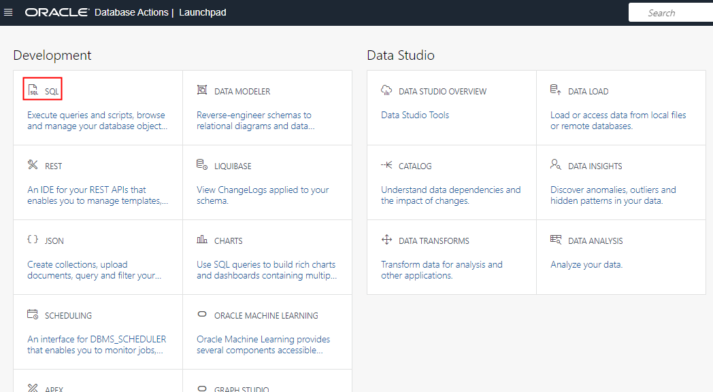
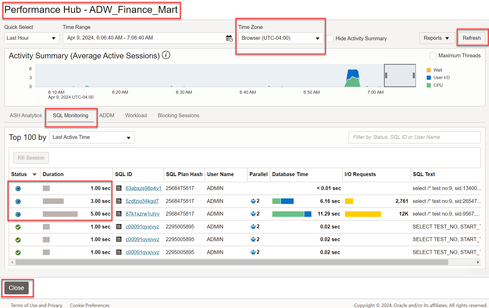
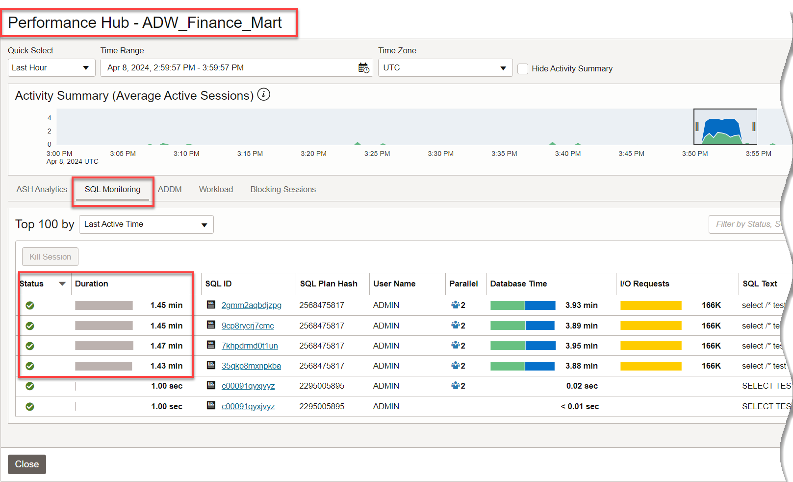
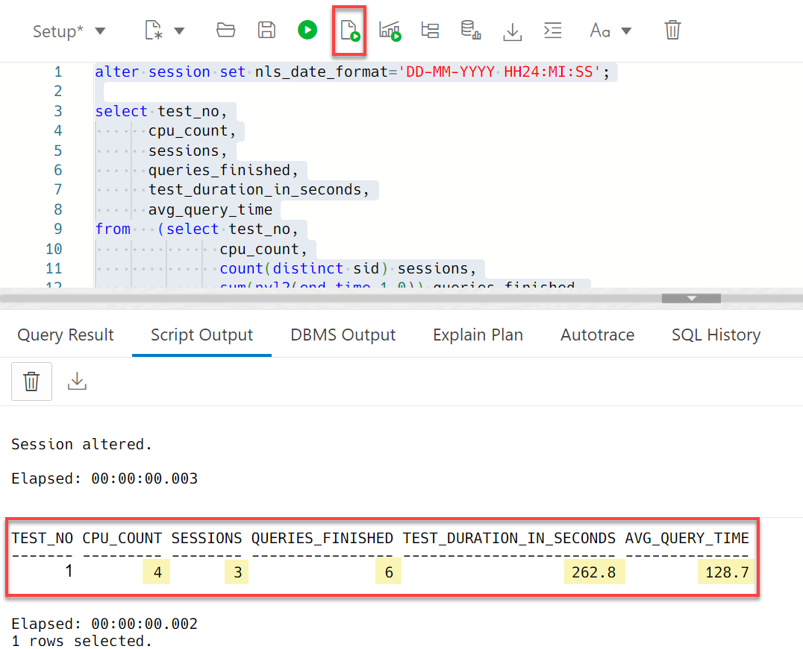

# Apply Auto Scaling on an Autonomous Database

## **Introduction**

In this lab, you will learn the benefits of auto scaling an Oracle Autonomous Database. This lab uses the existing SSB schema in Autonomous Data Warehouse (ADW). The lab executes a PL/SQL procedure which loops through executing a query twice. You will be running this procedure from 3 SQL Developer Web worksheet sessions concurrently to see how CPU is utilized with and without auto scaling.

Estimated time: 30 minutes

**What is Auto Scaling and How Does It Work?**

With auto scaling enabled, the database can use up to **three times** more CPU and IO resources than specified by the number of base OCPUs currently shown in the **Scale Up/Down** dialog.

When you enable auto scaling, if your workload requires additional CPU and IO resources, the database automatically uses the resources without any manual intervention required.

**Note**: You don't need to perform a "triggering action" after which your database can start to scale; the additional CPU and IO are **always** available to you.


When you create an Autonomous Database, the auto scaling checkbox is enabled by default. After the database is created, you can use **Scale Up/Down** on the Oracle Cloud Infrastructure console to disable or enable auto scaling.

If your organization performs intensive queries at varied times, auto scaling will ramp up and ramp down CPU resources when needed.

As in our lab example below, if a customer provisions an Autonomous Database with 1 base OCPU and enables auto scale, they will immediately have access to 3x the 1 base OCPU provisioned, therefore 3 OCPUs. They will also immediately have access to 3x the IO.

The customer is charged only for the actual average number of OCPUs used per hour, between 1 and 3 OCPUs.

### Objectives

-   Learn the benefits of auto scaling
-   Learn how to enable and disable auto scaling
-   Examine the performance benefits of auto scaling

### How You Will Test a Real-World Auto Scaling Example in this Lab

The **business case** we want to answer here is to **summarize orders by month and city, for customers in the US, in the Fall of 1992** over our benchmark <a href="https://docs.oracle.com/en/cloud/paas/autonomous-data-warehouse-cloud/user/autonomous-sample-data.html#GUID-4BB2B49B-0C20-4E38-BCC7-A61D3F45390B" target="\_blank">SSB dataset</a> containing 1 TB of data.

- **Test 1**: With auto scaling **disabled**, you will have 3 SQL Developer Web sessions executing queries sharing the CPU and IO resources, and you will examine query times.
- **Test 2**: You will enable auto scaling and again have 3 SQL Developer Web sessions executing queries. Auto scaling will allow your running sessions to use up to 3x more OCPUs, reducing your execution times significantly.

## **Test 1 - Auto Scaling Disabled**
In tasks 1 through 3, with auto scaling **disabled**, you will have 3 SQL Developer Web sessions executing queries sharing the CPU and IO resources, and you will examine query times.

## Task 1: Disable Auto Scaling and Create Four Connections in SQL Developer Web to your ADW Database

1. You created an Autonomous Data Warehouse database **ADW Finance Mart** in the earlier lab named *Provision Autonomous Database*. Go to the details page for the database, click the **More Actions** button and select **Manage Scaling**. In the Manage scaling dialog, deselect the **OCPU auto scaling** checkbox to disable auto scaling if you have not done so already. Click **Apply**, which will close the dialog and return you to the details page for the database.

    

2. On the Details page for your autonomous database, wait a few minutes for the **SCALING IN PROGRESS** message to change to **AVAILABLE**. Click the **Database Actions** button. In the log-in dialog, provide the username `admin` and the administrator password you specified when you created the Autonomous Database. On the Database Actions **Launchpad**, click the **SQL** card. (Note that you can alternatively use SQL Developer desktop client instead of SQL Developer Web.)

    

3. Create and save 4 SQL Developer Web worksheets. In SQL Developer Web worksheets, you choose the consumer group from the drop-down menu in the upper-right corner.:
    - Save the first worksheet with the name **Setup**. You will use this worksheet with the LOW consumer group in Task 2, to run the setup that creates a procedure for running test queries. The LOW consumer group is appropriate for non-CPU-intensive tasks such as this creation of a procedure.
    - Save the other 3 worksheets with the names **Query 1**, **Query 2**, and **Query 3**. In later tasks, you will use these 3 worksheets to simultaneously run the test queries using the HIGH consumer group. For real production workloads, you will typically use the MEDIUM or HIGH consumer groups, since they have higher parallelism and lower concurrency. A worksheet using the HIGH consumer group gets top priority. You may read [more about consumer groups here](https://docs.oracle.com/en/cloud/paas/autonomous-data-warehouse-cloud/user/manage-priorities.html#GUID-80E464A7-8ED4-45BB-A7D6-E201DD4107B7).

  

    **Note:** When you re-open a saved worksheet, it opens by default with the LOW consumer group. If you want to run a script in the re-opened worksheet using the HIGH consumer group, you need to manually change it from LOW to HIGH. For more information on using the HIGH, MEDIUM and LOW consumer groups, see the documentation [Predefined Database Service Names for Autonomous Data Warehouse](https://docs.oracle.com/en/cloud/paas/autonomous-data-warehouse-cloud/user/connect-predefined.html#GUID-9747539B-FD46-44F1-8FF8-F5AC650F15BE).

  

## Task 2: Create the `test_proc` Procedure to Generate the Test Workload
In this task, you run a script that will:
- Create the procedure **test\_proc** for the workload used in the test.
    - When this procedure is executed, it will run a query in a loop 2 times, to answer the business case from our [SSB database](https://docs.oracle.com/en/cloud/paas/autonomous-data-warehouse-cloud/user/autonomous-sample-data.html#GUID-4BB2B49B-0C20-4E38-BCC7-A61D3F45390B): Aggregate orders by month and city, for customers in the US, in the Fall of 1992.
    - After performing this lab, you may go back and increase the `i_executions` number for further testing.)
- Create a sequence used for each test number.
- Create the table used to save the results.

1. Copy and paste the following script into the first worksheet you named **Setup**. Run the following script using the LOW consumer group.

    ```
    <copy>-- Create a sequence to increment the number of tests running
    create sequence test_run_seq order nocache;

    create table test_run_data
    (test_no    number,
    cpu_count  number,
    sid        number,
    query_no   number,
    start_time timestamp,
    end_time   timestamp
    );

    create or replace procedure test_proc(i_executions number := 2) as
      v_sid        number;
      v_loop       number := 0;
      v_test_sql   varchar2(32767);
      v_test_sql_1 varchar2(32767);
      v_test_sql_2 varchar2(32767);
      v_end_date   date;
      v_begin_date date;
      v_begin_sql_time timestamp;
      v_end_sql_time timestamp;
      v_minute     number;
      v_result     number;
      v_last_test_no  number;
      v_test_no   number;
      v_test_start_time date;
      v_last_test_start_time date;
      v_cpu_count number;

    function get_test_no return number is
      v_last_test_no         number;
      v_last_test_start_time date;
      v_test_no              number;
      v_test_start_time      date;

    begin
      select test_no, start_time into v_last_test_no, v_last_test_start_time
      from   test_run_data
      where  start_time = (select max(start_time)
                          from   test_run_data);
      if v_last_test_start_time > (sysdate - 1/1440)
        then v_test_no := v_last_test_no;
        else v_test_no:= test_run_seq.nextval;
        end if;
      return v_test_no;
    exception
      when others then
        v_test_no:= test_run_seq.nextval;
        return v_test_no;
    end get_test_no;

    begin
      v_test_no := get_test_no;
      select userenv('SID') into v_sid from dual;
      select sum(value) into v_cpu_count from gv$parameter where name = 'cpu_count';
      insert into test_run_data values(v_test_no, v_cpu_count, v_sid, null, systimestamp, null);
      commit;
      v_begin_date := sysdate;
      v_test_sql_1 := q'#select /* #';
      v_test_sql_2 := q'# */ /*+ NO_RESULT_CACHE */ count(*) from (
    -- This query will summarize orders by month and city for customers in the US in the Fall of 1992
    SELECT
        d.d_month,
        d.d_year,
        c.c_city,
        SUM(lo.lo_quantity),
        SUM(lo.lo_ordtotalprice),
        SUM(lo.lo_revenue),
        SUM(lo.lo_supplycost)
    FROM
        ssb.lineorder   lo,
        ssb.dwdate      d,
        ssb.customer    c
    WHERE
        lo.lo_orderdate = d.d_datekey
        AND lo.lo_custkey = c.c_custkey
        AND d.d_year = 1992
        AND d.d_sellingseason='Fall'
        AND c.c_nation = 'UNITED STATES'
    GROUP BY
        d.d_month,
        d.d_year,
        c.c_city
    )
    #';
      loop
        v_loop   := v_loop + 1;
        v_minute := round((sysdate - v_begin_date) * 1440, 1);
        v_test_sql := v_test_sql_1 || 'test no:' || v_test_no || ', sid:' || v_sid || ', loop:' || v_loop || v_test_sql_2;
        v_begin_sql_time := systimestamp;
        execute immediate v_test_sql into v_result;
        v_end_sql_time := systimestamp;
        insert into test_run_data values(v_test_no, v_cpu_count, v_sid, v_loop, v_begin_sql_time, v_end_sql_time);
        commit;
        exit when v_loop = i_executions;
      end loop;
    end;
    /
    </copy>
    ```

## Task 3: Run the `test_proc` Procedure Concurrently in Three Worksheets

1. Open 3 worksheets you named **Query 1**, **Query 2**, and **Query 3**. To open 3 SQL Developer Web worksheets, simply go back to the OCI console's Details page for your database, click the **Database Actions** button and in the Database Actions **Launchpad**, click the **SQL** card to open a SQL worksheet in a tab in your browser. Do this 3 times so that you have 3 SQL worksheets open in your browser. In the first SQL worksheet, select your saved Query 1. In the second worksheet, select Query 2. In the third worksheet, select Query 3.

    

2. **Make sure that each of the 3 worksheets are set to the HIGH consumer group.** Enter - but do not immediately execute - the following execute command in each worksheet. After you have entered the command into all 3 worksheets, quickly execute the command in each worksheet so that they begin at nearly the same time.

    ````
    exec test_proc;
    ````

3. While the 3 procedure instances are running concurrently, which in our test runs for approximately 4.5 minutes on a 1 OCPU system (you may see different execution times), go to your Autonomous Database's console page and click **Performance Hub**. In Performance Hub, click the **SQL Monitoring** tab, and look at the Monitored SQL to see that each worksheet is running your procedure.

    

4. Go back to your SQL Developer Web worksheets. Make sure all 3 tests in the worksheets indicate that the queries have **executed** completely. You can see if the test procedure is still running, completed successfully or failed in the worksheet's status at the bottom of the page.

    **Note**: If your test procedure fails after running for a while, you may be behind a VPN that is timing out your query. You may need to disconnect from that VPN to run this test.

    

5. In your **Setup** worksheet, run the following script to view your test's results:

    ```
    <copy>alter session set nls_date_format='DD-MM-YYYY HH24:MI:SS';

    select test_no,
          cpu_count,
          sessions,
          queries_finished,
          test_duration_in_seconds,
          avg_query_time
    from   (select test_no,
                  cpu_count,
                  count(distinct sid) sessions,
                  sum(nvl2(end_time,1,0)) queries_finished,
                  round(extract(minute from (max(end_time) - min(start_time))) * 60 + extract(second from (max(end_time) - min(start_time))),1) test_duration_in_seconds,
                  round(avg(to_number(extract(minute from (end_time - start_time)) * 60 + extract(second from (end_time - start_time)))),1) avg_query_time
            from   test_run_data
            group by test_no,
                    cpu_count)
    order by 1;
    </copy>
    ```

6. Review the results of running the test. Notice that in our run:
    - The average time each query ran was 275.5 seconds.
    - The total time the test ran was 581.5 seconds.

    (**Note**: The value CPU\_COUNT displays 2x the number of OCPUs available, as each OCPU has 2 CPU threads. Thus, for 1 OCPU we see the CPU_COUNT of 2.)

    

  In the next tasks, let's see if auto scaling reduces query time and increases CPU and IO usage.

## **Test 2 - Auto Scaling Enabled, Providing 3x the Amount of CPU and IO Resources**
In tasks 4 through 6, you will enable auto scaling and again have 3 SQL Developer Web sessions executing queries. Auto scaling will allow your running sessions to use up to 3x more OCPUs, reducing your execution times significantly.

## Task 4: Enable Auto Scaling

1. Enable auto scaling, to allow you to use 3X the amount of base CPU and IO. Go to the details page for the database, click the **More Actions** drop-down menu and select  **Manage Scaling**, and select the **Auto Scaling** checkbox to **re-enable** auto scaling.

    

## Task 5: Run the Procedure Again Concurrently on Three Worksheets After Enabling Auto Scaling

1. Once again, go to your 3 SQL Developer Web **"Query"** worksheet instances (re-open 3 instances if you closed the tabs from before) which are using the HIGH consumer group. Enter - but do not immediately execute - the following execute command in each worksheet. After you have entered the command into all 3 worksheets, quickly execute the command in each worksheet so that they begin at nearly the same time.

    ````
    exec test_proc;
    ````

2. While the procedures are running, the monitored SQL in Performance Hub shows 3 queries executing. In the previous test, before you enabled Auto Scaling, the procedure's 3 query sessions averaged 4.5 minutes to run. After enabling Auto Scaling and immediately getting access to 3x the amount of CPU and IO, the queries now require approximately 3x less time; we see below less than 2 minutes to run.

    

3. As before, go back to your SQL Developer Web worksheets to be sure all 3 tests in the worksheets indicate that the queries have **executed** completely.

    

## Task 6: Review the Improved Performance After Enabling Auto Scaling

1. When the procedures have completed, run this script to see the test results:

    ```
    <copy>alter session set nls_date_format='DD-MM-YYYY HH24:MI:SS';

    select test_no,
          cpu_count,
          sessions,
          queries_finished,
          test_duration_in_seconds,
          avg_query_time
    from   (select test_no,
                  cpu_count,
                  count(distinct sid) sessions,
                  sum(nvl2(end_time,1,0)) queries_finished,
                  round(extract(minute from (max(end_time) - min(start_time))) * 60 + extract(second from (max(end_time) - min(start_time))),1) test_duration_in_seconds,
                  round(avg(to_number(extract(minute from (end_time - start_time)) * 60 + extract(second from (end_time - start_time)))),1) avg_query_time
            from   test_run_data
            group by test_no,
                    cpu_count)
    order by 1;
    </copy>
    ```

2. Let's examine the improved performance after enabling auto scaling. **Test 1** had auto scaling **disabled** and **Test 2** had auto scaling **enabled**:

  

    These numbers look great! After enabling auto scaling we see that:

    - The number of OCPUs available to the database jumps by 3x; in our example, from 1 OCPU to 3 OCPU.

      (Note: The value CPU\_COUNT displays 2x the number of OCPUs available, as each OCPU has 2 CPU threads. Thus, we see the CPU_COUNT values displayed jump from 2 to 6.)

    - All 3 running sessions now had access to 3x the amount of CPU and IO.

    - Consequently, the average query time reduced from ~275 seconds to ~97 seconds and therefore the duration of the total test that ran 3 worksheet sessions concurrently **reduced approximately 3x** from ~581 seconds to ~210 seconds.

3. Go to your Autonomous Database console page and click **Performance Hub**. Move your mouse cursor in the **Activity** panel above the SQL Monitoring panel, and drag the rectangle horizontally across to cover the portion of the timeline that indicates your recent query activity. This will fill in the **ASH Analytics** panel at the bottom, with information from the completed test.

    

4. Scroll down and view the **Average Active Sessions** chart. View the Average Active Sessions chart by Wait Class in the 2nd test after auto scaling is enabled.  Since there are 3 OCPUs available to the running queries, we now see:
- The **inflated I/O waits** (in blue) due to the unavailability of resources reduces significantly.
- Consequently, the workload becomes more efficient (CPU-bound) and is able to utilize more CPU (in dark green) reducing the average time spent on running each query.
- The **Scheduler waits** (in light green) on CPU/IO resources almost entirely disappears.

  

    **Things to Note**

- When auto scaling is enabled, IO is also scaled to 3X the OCPU allocation. So even if only one session is executing a SQL Statement, it benefits from the additional IO.
- To see the average number of OCPUs used during an hour you can use the "Number of OCPUs allocated" graph on the Overview page on the Autonomous Data Warehouse service console. **Note**: These Overview graphs are updated **per hour**, so you will be able to see this data in the next hour.
- When auto scaling is enabled, only the amount of OCPUs and IO available to the database increases by 3x. Other database parameters, including memory, concurrency and parallel statement queueing, do not automatically scale. Depending on where the bottlenecks in your business' query workloads are, you may see different lifts in performance.

## Want to Learn More?

For more information about auto scaling, see the documentation [Use Auto Scaling](https://docs.oracle.com/en/cloud/paas/autonomous-data-warehouse-cloud/user/autonomous-auto-scale.html#GUID-27FAB1C1-B09F-4A7A-9FB9-5CB8110F7141).

## Acknowledgements

- **Authors** - Rick Green, Database User Assistance; Nilay Panchal, ADB Product Management
- **Contributors** - John Zimmerman, Real World Performance Team; Keith Laker, ADB Product Management
- **Last Updated By/Date** - Rick Green, March 2022
