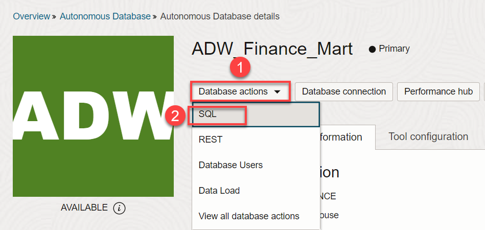
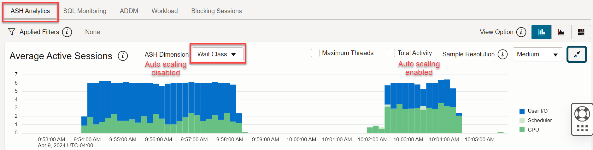

# Apply Auto Scaling on an Autonomous AI Database

### **Introduction**

In this lab, you will learn the benefits of auto scaling an Oracle Autonomous AI Database. This lab uses the existing SSB schema in Autonomous AI Database Lakehouse. The lab executes a PL/SQL procedure which loops through executing a query three times. You will be running this procedure from three SQL Developer Web worksheet sessions concurrently to see how the CPU is utilized with and without auto scaling.

Estimated time: 30 minutes

Watch the video below for a quick walk-through of the lab.
[Apply Auto Scaling on an Autonomous AI Database](videohub:1_bj3lzbp8)

**What is Auto Scaling and How Does It Work?**

With auto scaling enabled, the database can use up to **three times** more CPU and IO resources than specified by the number of base ECPUs currently shown in the **Manage resource allocation** dialog.

When you enable auto scaling, if your workload requires additional CPU and IO resources, the database automatically uses the resources without any manual intervention required.

> **Note:** You don't need to perform a "triggering action" after which your database can start to scale; the additional CPU and IO are **always** available to you.


When you create an Autonomous AI Database, the auto scaling checkbox is enabled by default. After the database is created, you can use the **Manage resource allocation** button on the **Autonomous AI Database details** page to disable or enable auto scaling.

If your organization performs intensive queries at varied times, auto scaling will ramp up and ramp down CPU resources when needed.

As in our lab example below, if a customer provisions an Autonomous AI Database with 4 base ECPUs and enables auto scaling, they will immediately have access to 3x the 4 base ECPUs provisioned; therefore 12 ECPUs. They will also immediately have access to 3x the IO.

The customer is charged only for the actual average number of ECPUs used per hour, between 2 and 6 ECPUs.

### Objectives

- Learn the benefits of auto scaling
- Learn how to enable and disable auto scaling
- Examine the performance benefits of auto scaling

### How You Will Test a Real-World Auto Scaling Example in this Lab

The **business case** we want to answer here is to **summarize orders by month and city, for customers in the US, in the Fall of 1992** over our [benchmark SSB dataset](https://docs.oracle.com/en/cloud/paas/autonomous-data-warehouse-cloud/user/autonomous-sample-data.html#GUID-4BB2B49B-0C20-4E38-BCC7-A61D3F45390B) containing 1 TB of data.

- **Test 1**: With auto scaling **disabled**, you will have **3 SQL Developer Web sessions** executing queries sharing the CPU and IO resources, and you will examine query times.
- **Test 2**: You will **enable** auto scaling and again have **3 SQL Developer Web sessions** executing queries. Auto scaling will allow your running sessions to use up to 3x more ECPUs, reducing your execution times significantly. Again, you will examine query times and see how they compare to test 1 query times.

## **Test 1 - Auto Scaling Disabled**

In **task 1 through task 3**, with auto scaling **disabled**, you will have 3 SQL Developer Web sessions executing queries sharing the CPU and IO resources, and you will examine query times.

## Task 1: Disable Auto Scaling and Create Four Connections in SQL Developer Web to your Autonomous AI Database

In the **Provision Autonomous AI Database** lab, you created the **`ADW_Finance_Mart`** Autonomous AI database. In the previous **Scale for Performance** lab, you increased the ECPU count from **`2`** to **`16`** ECPUs.

1. In this lab, you will decrease the ECPU count to **`4`**, and then disable **Compute auto scaling** slider. Go to the **Autonomous AI Database details** page. Click the **More actions** drop-down list, and then click **Manage resource allocation**. In the **Manage resource allocation** dialog box, change the ECPU count from **`16`** to **`4`**. Next, deselect the **Compute auto scaling** slider to disable auto scaling, if you have not done so already. Click **Apply**. The **Autonomous AI Database details** page is re-displayed.

    

2. Wait a few minutes for the **SCALING IN PROGRESS** message to change to **AVAILABLE**. Next, click the **Database Actions** drop-down list, and then select **SQL**.

    >**Note:** You can alternatively use SQL Developer desktop client instead of SQL Developer Web.

    

3. Create and save the first SQL Developer Web worksheet. Click the **Worksheet** drop-down list, and then select **Save As**. Enter **Setup** as the name and then click **Save**. You will use this worksheet with the LOW consumer group in Task 2, to run the setup that creates a procedure for running test queries. The LOW consumer group is appropriate for non-CPU-intensive tasks such as creating a procedure.

    >**Note:** In SQL Developer Web worksheets, you choose the consumer group from the drop-down list in the upper-right hand corner.

    

    

    The saved worksheet is displayed.

    

4. Create and save the second worksheet. Click the **Worksheet** drop-down list, and then select **Save As**. Enter **Query 1** as the name and then click **Save**.

    

    

    The saved worksheet is displayed.

    

5. Create and save the third worksheet. Click the **Worksheet** drop-down list, and then select **Save As**. Enter **Query 2** as the name and then click **Save**. The saved worksheet is displayed.

    

6. Create and save the fourth worksheet. Click the **Worksheet** drop-down list, and then select **Save As**. Enter **Query 3** as the name and then click **Save**. The saved worksheet is displayed.

    

    In the next task, you will use the **Query 1**, **Query 2**, and **Query 3** worksheets to simultaneously run the test queries using the **HIGH** consumer group. For real production workloads, you will typically use the MEDIUM or HIGH consumer groups, since they have higher parallelism and lower concurrency. A worksheet using the HIGH consumer group gets top priority. For more information about consumer groups, see [Manage Concurrency and Priorities on Autonomous AI Database](https://docs.oracle.com/en/cloud/paas/autonomous-data-warehouse-cloud/user/manage-priorities.html#GUID-80E464A7-8ED4-45BB-A7D6-E201DD4107B7).

7. Click the worksheet's drop-down list, and then select **Open Recent** to display your 4 saved worksheets.

      

    >**Important:** When you re-open a saved worksheet, it opens by default with the **LOW** consumer group. If you want to run a script in the re-opened worksheet using the **HIGH** consumer group, you need to manually change it from LOW to HIGH.

  

## Task 2: Create the test_proc Procedure to Generate the Test Workload

In this task, you run a script that will:
- Create the procedure **`test_proc`** for the workload used in the test.
- When this procedure is executed, it will run a query in a loop 2 times, to answer the business case from our [Star Schema Benchmark (SSB) Schema](https://docs.oracle.com/en/cloud/paas/autonomous-data-warehouse-cloud/user/autonomous-sample-data.html#GUID-4BB2B49B-0C20-4E38-BCC7-A61D3F45390B):    
_Aggregate orders by month and city, for customers in the US, in the Fall of 1992_.
- Create a sequence used for each test number.
- Create the table used to save the results.

    >**Note:** After performing this lab, you may go back and increase the `i_executions` number for further testing.

1. Copy and paste the following script into the first worksheet you named **Setup**. Run the following script using the default **LOW** consumer group. Click the **Run Script** icon in the toolbar.

    ```
    <copy>-- Create a sequence to increment the number of tests running
    create sequence test_run_seq order nocache;

    create table test_run_data
    (test_no    number,
    cpu_count  number,
    sid        number,
    query_no   number,
    start_time timestamp,
    end_time   timestamp
    );

    create or replace procedure test_proc(i_executions number := 2) as
      v_sid        number;
      v_loop       number := 0;
      v_test_sql   varchar2(32767);
      v_test_sql_1 varchar2(32767);
      v_test_sql_2 varchar2(32767);
      v_end_date   date;
      v_begin_date date;
      v_begin_sql_time timestamp;
      v_end_sql_time timestamp;
      v_minute     number;
      v_result     number;
      v_last_test_no  number;
      v_test_no   number;
      v_test_start_time date;
      v_last_test_start_time date;
      v_cpu_count number;

    function get_test_no return number is
      v_last_test_no         number;
      v_last_test_start_time date;
      v_test_no              number;
      v_test_start_time      date;

    begin
      select test_no, start_time into v_last_test_no, v_last_test_start_time
      from   test_run_data
      where  start_time = (select max(start_time)
                          from   test_run_data);
      if v_last_test_start_time > (sysdate - 1/1440)
        then v_test_no := v_last_test_no;
        else v_test_no:= test_run_seq.nextval;
        end if;
      return v_test_no;
    exception
      when others then
        v_test_no:= test_run_seq.nextval;
        return v_test_no;
    end get_test_no;

    begin
      v_test_no := get_test_no;
      select userenv('SID') into v_sid from dual;
      select sum(value) into v_cpu_count from gv$parameter where name = 'cpu_count';
      insert into test_run_data values(v_test_no, v_cpu_count, v_sid, null, systimestamp, null);
      commit;
      v_begin_date := sysdate;
      v_test_sql_1 := q'#select /* #';
      v_test_sql_2 := q'# */ /*+ NO_RESULT_CACHE */ count(*) from (
    -- This query will summarize orders by month and city for customers in the US in the Fall of 1992
    SELECT
        d.d_month,
        d.d_year,
        c.c_city,
        SUM(lo.lo_quantity),
        SUM(lo.lo_ordtotalprice),
        SUM(lo.lo_revenue),
        SUM(lo.lo_supplycost)
    FROM
        ssb.lineorder   lo,
        ssb.dwdate      d,
        ssb.customer    c
    WHERE
        lo.lo_orderdate = d.d_datekey
        AND lo.lo_custkey = c.c_custkey
        AND d.d_year = 1992
        AND d.d_sellingseason='Fall'
        AND c.c_nation = 'UNITED STATES'
    GROUP BY
        d.d_month,
        d.d_year,
        c.c_city
    )
    #';
      loop
        v_loop   := v_loop + 1;
        v_minute := round((sysdate - v_begin_date) * 1440, 1);
        v_test_sql := v_test_sql_1 || 'test no:' || v_test_no || ', sid:' || v_sid || ', loop:' || v_loop || v_test_sql_2;
        v_begin_sql_time := systimestamp;
        execute immediate v_test_sql into v_result;
        v_end_sql_time := systimestamp;
        insert into test_run_data values(v_test_no, v_cpu_count, v_sid, v_loop, v_begin_sql_time, v_end_sql_time);
        commit;
        exit when v_loop = i_executions;
      end loop;
    end;
    /
    </copy>
    ```
  
  

  You can use the **Navigator** tab in the left pane in SQL to view the created objects. Select the **All Objects** from the **Object Type** drop-down list. The created procedure, table, and sequence are displayed.

  

## Task 3: Run the test_proc Procedure Concurrently in Three Worksheets

>_**Important:** The amount of time it takes you to run the queries twice might be different than the results shown in this task. In addition, the results will be different depending on whether you are running the queries using your own tenancy or the LiveLabs Sandbox hosted environment._

1. Open the **Query 1**, **Query 2**, and **Query 3** worksheets that you saved earlier. To open 3 separate SQL Developer Web worksheets, go to your browser tab that shows the **Autonomous AI Database details** page. Click the **Database actions** drop-down list, and then select **SQL**. The worksheet is displayed in a new tab in your browser. Repeat this process to open two more worksheets.

2. In the first new worksheet, click worksheet drop-down list, select **Open Recent**, and then select the **Query 1** saved worksheet. Click the **Consumer group** drop-down list and select **HIGH**.

    

3. In the second new worksheet, click worksheet drop-down list, select **Open Recent**, and then select the **Query 2** saved worksheet. Click the **Consumer group** drop-down list and select **HIGH**.

    

4. In the third new worksheet, click worksheet drop-down list, select **Open Recent**, and then select the **Query 3** saved worksheet. Click the **Consumer group** drop-down list and select **HIGH**.

    

5. **Make sure that each of the 3 worksheets are set to the HIGH consumer group.** Copy and paste the following execute command in each worksheet; however, **_do not run the command yet_**. After you have entered the command into the three worksheets, quickly click **Run Script** to execute the command in each worksheet so that they begin at nearly the same time.

    ```
    <copy>
    exec test_proc;
    </copy>
    ```

  

  

  

6. While the 3 procedure instances are running concurrently on a **`4`** ECPU system with auto scaling disabled, navigate back to the **Autonomous AI Database details** page, and then click **Performance Hub**. In **Performance Hub**, click the **SQL Monitoring** tab, and then look at the Monitored SQL to see that each worksheet is running your procedure. _Note this procedure is executing multiple query runs, so expect to see several queries running when you view Performance Hub. Monitor these queries to completion, it will take a few minutes._. Initially, the status of each running procedure in each worksheet is represented by the **running** blue circular icon.

    

    While monitoring the running queries, you may click the **Refresh** button at the top right of the page until they complete successfully, which is represented by the green circle with a checkmark.

    Since each procedure ran twice in each worksheet, there are a total of six rows. As you can see, our test runs for approximately **`1.47`** minutes. Click **Close** to exit Performance Hub.
  
7. Return to your SQL Developer Web worksheets. Make sure all 3 tests in the worksheets indicate that the queries have **executed** completely. You can see if the test procedure is still running, completed successfully or failed in the worksheet's status at the bottom of the page. If you see the message **Code execution failed**, ignore that error. This can be due to a timeout if your query runs longer than expected. You will check the query execution status using **Performance Hub**.

    >**Note:** If your test procedure fails after running for a while, you may also be behind a VPN that is timing out your query. You may need to disconnect from that VPN to run this test.

    

8. In your **Setup** worksheet, run the following script to view your test's results:

    ```
    <copy>alter session set nls_date_format='DD-MM-YYYY HH24:MI:SS';

    select test_no,
          cpu_count,
          sessions,
          queries_finished,
          test_duration_in_seconds,
          avg_query_time
    from   (select test_no,
                  cpu_count,
                  count(distinct sid) sessions,
                  sum(nvl2(end_time,1,0)) queries_finished,
                  round(extract(minute from (max(end_time) - min(start_time))) * 60 + extract(second from (max(end_time) - min(start_time))),1) test_duration_in_seconds,
                  round(avg(to_number(extract(minute from (end_time - start_time)) * 60 + extract(second from (end_time - start_time)))),1) avg_query_time
            from   test_run_data
            group by test_no,
                    cpu_count)
    order by 1;
    </copy>
    ```

9. Review the results of running the test. In our example:
    - The average time each query ran was **`78.8`** seconds.
    - The total time the test ran was **`158.5`** seconds.

      > **Note:** For **`4`** ECPUs, the **`CPU_COUNT`** value is **`2`**.

    

  In the next tasks, let's see if auto scaling reduces query time and increases CPU and IO usage.

## **Test 2 - Auto Scaling Enabled, Providing 3x the Amount of CPU and IO Resources**
In **task 4 through task 6**, you will enable auto scaling and then execute the queries in your 3 SQL Developer Web sessions. Auto scaling will allow your running sessions to use up to **3x more ECPUs**, reducing your execution times significantly.

## Task 4: Enable Auto Scaling

1. Enable auto scaling to allow you to use 3X the amount of base CPU and IO. Go back to the Autonomous AI Database details page. Click the **More actions** drop-down list, and then click **Manage resource allocation**. In the **Manage resource allocation** dialog box, enable the **Compute auto scaling** slider to **re-enable** auto scaling. Click **Apply** and wait for the database to update.

    

    It will take a few minutes for the **SCALING IN PROGRESS** message to change to **AVAILABLE**.

## Task 5: Run the Procedure Again Concurrently in Three Worksheets

>_**Important:** The amount of time it takes you to run the queries twice might be different than the results shown in this task. In addition, the results will be different depending on whether you are running the queries using your own tenancy or the LiveLabs Sandbox hosted environment._

1. Go to your **Query 1**, **Query 2**, and **Query 3** SQL worksheets (re-open 3 instances if you closed the tabs from before). Change the **Consumer group** drop-down list setting to **HIGH**. Copy the following execute command into each worksheet; however, _but do not immediately execute the command_. After you have entered the command into the three worksheets, quickly click **Run Script** to execute the command in each worksheet so that they begin at nearly the same time.

    ```
    <copy>
    exec test_proc;
    </copy>
    ```

2. While the procedures are running, view the monitored SQL in **Performance Hub**.  Keep clicking the **Refresh** button until the execution is completed successfully.

    

    New one:

      

    Notice, after enabling Auto Scaling and immediately getting access to 3x the amount of CPU and IO, the queries run much faster.

    <!--In the previous test, before you enabled Auto Scaling, the procedure's 3 query sessions averaged **2.17** minutes to run. After enabling Auto Scaling and immediately getting access to 3x the amount of CPU and IO, the queries now require approximately 2x less time; we see about **1.05** minutes to run.-->

3. Go back to your SQL Developer Web worksheets to be sure that the 3 tests in the worksheets indicate that the queries have **executed** completely. If you see the message **Code execution failed**, ignore that error. This can be due to a timeout if your query runs longer than expected. You will check the code execution status using **Performance Hub** next.

    

## Task 6: Review the Improved Performance After Enabling Auto Scaling

1. When the procedures have completed successfully, run the following script in your **Setup** worksheet to view the test results:

    ```
    <copy>alter session set nls_date_format='DD-MM-YYYY HH24:MI:SS';

    select test_no,
          cpu_count,
          sessions,
          queries_finished,
          test_duration_in_seconds,
          avg_query_time
    from   (select test_no,
                  cpu_count,
                  count(distinct sid) sessions,
                  sum(nvl2(end_time,1,0)) queries_finished,
                  round(extract(minute from (max(end_time) - min(start_time))) * 60 + extract(second from (max(end_time) - min(start_time))),1) test_duration_in_seconds,
                  round(avg(to_number(extract(minute from (end_time - start_time)) * 60 + extract(second from (end_time - start_time)))),1) avg_query_time
            from   test_run_data
            group by test_no,
                    cpu_count)
    order by 1;
    </copy>
    ```

2. Let's examine the improved performance after enabling auto scaling. **Test 1** had auto scaling **disabled** and **Test 2** had auto scaling **enabled**:

  

  These numbers look great! After enabling auto scaling we see that:

  - The number of ECPUs available to the database jumps by 3x.

  >**Note:** For **`4`** ECPUs you should expect to see **`2`** **`CPU_COUNT`**; therefore, for this test, we see the **`CPU_COUNT`** value jumps from **`2`** to **`6`**.

  - All 3 running sessions now had access to 3x the amount of CPU and IO.

  - Consequently, the average query time was reduced from **`78.8`** seconds to **`45.4`** seconds and therefore the duration of the total test that ran 3 worksheet sessions concurrently was reduced from **`158.5`** seconds to **`93.7`** seconds.

3. Return to your **Autonomous AI Database details** page and click **Performance Hub**. Move your mouse cursor in the **Activity** panel above the SQL Monitoring panel, and drag the rectangle horizontally across to cover the portion of the timeline that indicates your recent query activity. This will fill in the **ASH Analytics** panel at the bottom, with information from the two completed tests.

    

4. Scroll-down the page and then click the **ASH Analytics** tab, if not already selected. In the **Ash Dimension** drop-down list, select **Top Dimensions > Wait Class**. The **Average Active Sessions** charts by Wait Class before and after auto scaling is enabled are displayed. Since there are 6 ECPUs available to the running queries when auto scaling was enabled, we now see:
- The **inflated I/O waits** (in blue) due to the unavailability of resources was reduced significantly.
- Consequently, the workload becomes more efficient (CPU-bound) and is able to utilize more CPU (in dark green) reducing the average time spent on running each query.
- The **Scheduler waits** (in light green) on CPU/IO resources almost entirely disappears. In the following screen capture, we chose the **Area Chart** from the **View Option** section.

  

    **Things to Note**

- When auto scaling is enabled, IO is also scaled to 3X the ECPU allocation. So even if only one session is executing a SQL Statement, it benefits from the additional IO.
- To see the average number of ECPUs used during an hour, navigate to the Launchpad, and then scroll-down to the **Monitoring** section. Click **Database Dashboard**, and then view the **Number of ECPUs allocated** graph. **Note**: These Overview graphs are updated **per hour**, so you will be able to see this data in the next hour.
- When auto scaling is enabled, only the amount of ECPUs and IO available to the database increases by 3x. Other database parameters, including memory, concurrency and parallel statement queueing, do not automatically scale. Depending on where the bottlenecks in your business' query workloads are, you may see different lifts in performance.

You may now **proceed to the next lab**.

## Want to Learn More?

* [Use Auto Scaling](https://docs.oracle.com/en/cloud/paas/autonomous-data-warehouse-cloud/user/autonomous-auto-scale.html#GUID-27FAB1C1-B09F-4A7A-9FB9-5CB8110F7141)

## Acknowledgements

- **Authors:**
    * Lauran K. Serhal, Consulting User Assistance Developer
    * Nilay Panchal, ADB Product Management
- **Contributors:**
    * John Zimmerman, Real World Performance Team
    * Keith Laker, ADB Product Management
- **Last Updated By/Date** - Lauran K. Serhal, October 2025
