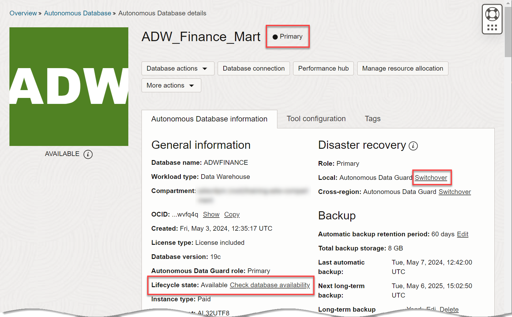
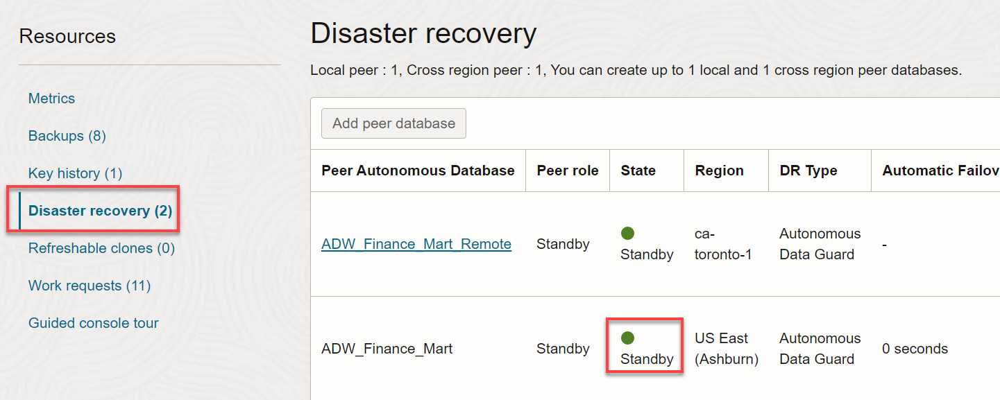
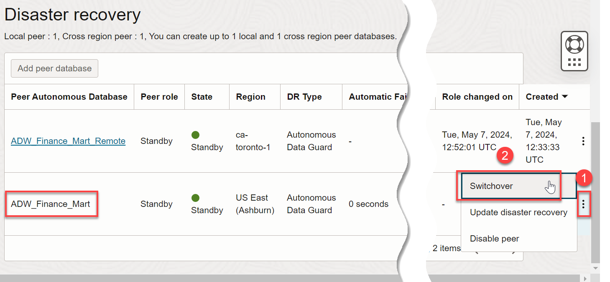
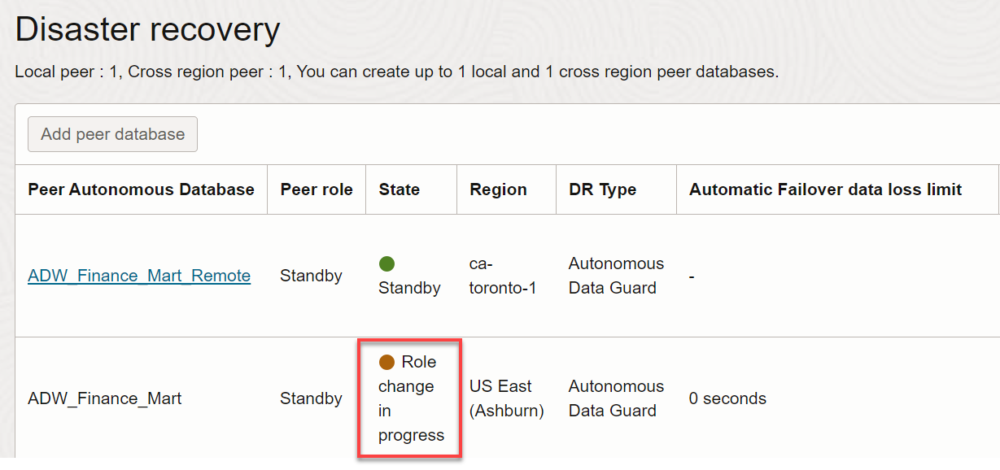
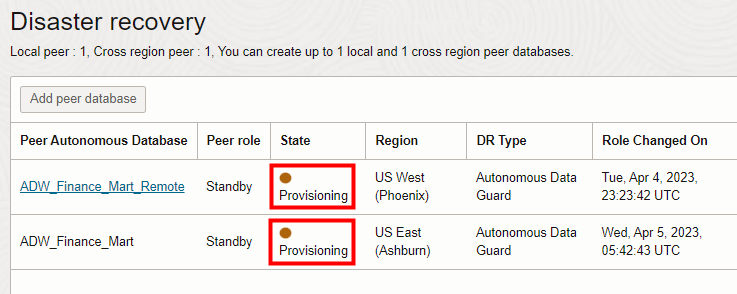
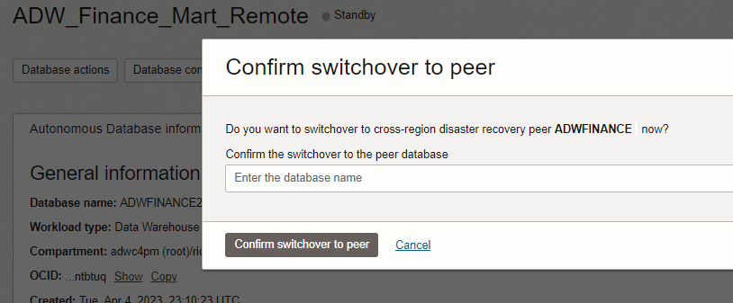
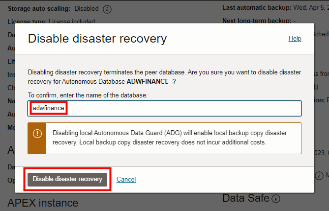
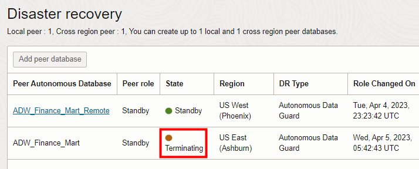

# Enable Disaster Recovery in ADB with Autonomous Data Guard
In this lab, you will enable Autonomous Data Guard (ADG), which is the Disaster Recovery (DR) feature in Autonomous Database (ADB) on Shared Infrastructure (ADB-S).

## Introduction
Every enterprise today needs to protect its data with high availability, data protection, and disaster recovery. Businesses need a comprehensive set of services that create, maintain, manage, and monitor one or more standby databases to enable production databases to survive disasters and data corruption. While ADB already runs on highly available Exadata infrastructure, this feature further protects your databases against unforeseen disaster scenarios like earthquakes, fires, floods, major network outages etc. by automatically switching to a standby database when the primary database goes down.

You can set up an ADG standby database in the same region as its source database, and set up Cross-Region Autonomous Data Guard (X-ADG), running the standby database in a different (remote) region than its source database.

Estimated lab time: 15 minutes

### Objectives

* Learn the benefits of disaster recovery
* Learn how to enable and disable Autonomous Data Guard
* Learn how to switch over and fail over from primary database to a standby database
* Learn how to specify the standby database in the same local region as the primary database, and in a remote region

>**Note:**  This lab uses Autonomous Data Guard, which is **not available** with Oracle's Always Free databases. You can run the lab by reserving a hosted Livelabs environment, or by signing up for free trial credits, or by using your own tenancy. Autonomous Data Guard is available only in Autonomous Database instances 19c and above.

### Basic Disaster Recovery Terminology
**Primary or Source Database**: The main database that is actively being used to read from, and write to, by a user or application.

**Standby Database**: A replica of the primary database which is constantly and passively replicating data from the primary database. This standby database is used in case of failure of the primary. In the case of ADG, the standby database is available on a different Exadata machine (in a different Availability Domain in regions that have more than one) for the highest level of protection. The standby database can also be provisioned in a remote region, using Cross-Region Autonomous Data Guard.

**Recovery Point Objective (RPO)**: An organization's tolerance for data loss, after which business operations start to get severely impacted, usually expressed in minutes. This should be as low as possible.

**Recovery Time Object (RTO)**: An organization's tolerance for the unavailability (or downtime) of a service after which business operations can be severely impacted, usually expressed in minutes. This should be as low as possible.

### How does Autonomous Data Guard Function?

Autonomous Data Guard monitors the primary database and if the Autonomous Database instance goes down, then the standby instance assumes the role of the primary instance.

Unforeseen database failures due to disasters can happen at any time. Autonomous Data Guard offers the highest level of protection for an enterprise's data availability and system performance requirements.

If a disaster were to occur and your primary database is brought down, you can **"Failover"** to your standby database. A failover is a role change, switching from the primary database to the standby database when the primary is down and unavailable, while the standby is available. This has to happen fast so that both RTO and RPO are minimized.

The failover from the Primary to the Standby is seamless and does not require downloading a new wallet or new URLs for the tools users were using before the switch over happened. You can continue to use existing wallets and URL endpoints for your tools ( [APEX](https://docs.oracle.com/en/cloud/paas/autonomous-data-warehouse-cloud/cswgs/autonomous-apex-about.html#GUID-F275EA9F-F9A4-4A72-B777-5548362FDDA5), [OML](https://docs.oracle.com/en/cloud/paas/autonomous-data-warehouse-cloud/omlug/get-started-oracle-machine-learning.html#GUID-2AEC56A4-E751-48A3-AAA0-0659EDD639BA), and [ORDS](https://docs.oracle.com/en/database/oracle/oracle-rest-data-services/20.3/qsord/index.html)).

After a failover, a new standby for your primary will automatically be provisioned.

* A standby database can be created in the **same region** as the primary database. In that case, for better resilience, the standby database is provisioned as follows:
    * In regions with more than one availability domain, the standby database is provisioned automatically in a different availability domain than the primary database.
    * In regions with a single availability domain, the standby database is provisioned automatically on a different physical machine than the primary database.

* A cross-region standby database can also be created in a **remote region**, different from the local region of your primary database.

    

## Task 1: Enable Autonomous Data Guard

1. If you are not logged in to Oracle Cloud Console, log in and navigate to your Autonomous Database.

2. Under **Autonomous Data Guard** section, click **Enable** to enable the Data Guard feature.

    

3. In the Enable Autonomous Data Guard dialog, in the **Region** drop-down menu, select the same local region where your primary database resides. Click **Enable Autonomous Data Guard**.

    

4. The Autonomous Database Lifecycle State changes to **Updating**. Depending on the size of your primary database this may take several minutes.

    

    When the standby database is being provisioned, the primary database status becomes available and all database activities can continue as enabling Autonomous Data Guard is non-blocking.

    

    When provisioning completes, the **Status** field indicates Autonomous Data Guard is enabled, and the **Role** field indicates that this database is the primary.

    

5. You can create a total of two standby databases, one local and the other cross-region. You just enabled Autonomous Data Guard to create a local standby database. If your Oracle Cloud account has at least two regions, you can optionally create a second standby database that is cross-region. In the **Resources** section at the bottom left corner of the Autonomous Database Details page, click **Autonomous Data Guard (1)**.

    **Note:** Creation of a cross region standby database is optional, if your Oracle Cloud account has at least two regions. You cannot create a cross region standby database for a database that you provisioned in a LiveLabs hosted environment, nor in an Always Free Database.

    

6. To perform this **optional step** of adding a second standby database that is cross-region, click **Add Standby Database**.

    

7. Select a region other than the local region of your primary database. Select a compartment.

    **Note**: Read the informational note about additional costs of a cross-region standby database, and the longer recovery time objective (RTO) as compared to standby databases. For Cross-Region Autonomous Data Guard, the RTO is 1 hour and the recovery point objective (RPO) is 5 minutes.

    Again, click **Add Standby Database**.

    

8. Note that in addition to your local standby database, you are provisioning a second standby database that is a remote, cross-region database. The provisioning of the cross-region standby database and the updating of the primary database will take several minutes. Once it becomes available, you are protected against regional outages. The remote standby is visible in the remote region with your source database's name trailed by **"_Remote"**.

    

9. At this point, you now have 3 Autonomous Data Warehouse databases:

* Your **original** database, "adwfinance"
* Your **local standby** database, also named "adwfinance"
* Your optional **cross-region** standby database, "adwfinance_Remote"

    Go back to the **Autonomous Database Details** page of your original database. In the **Autonomous Data Guard** section of the page, you now see a third field, **Region**. This page indicates you are in your original database, "adwfinance", with the role of primary database, in the primary region.

    

## Task 2: Test Switchover to a Standby Database
After Autonomous Data Guard is enabled, if you perform a switchover operation, the primary database becomes the standby database, and the standby database becomes the primary database, with no data loss. A switchover is typically done to test your application's failover procedures when Autonomous Data Guard is enabled.

The Oracle Cloud Infrastructure console shows a switchover link in the **Role** field when both the primary database and the standby database are available. That is, the primary database **Lifecycle State** field shows Available or Stopped:

  

And the standby database is available (in the **Resources** section at the bottom left of the Autonomous Database Details page, the **State** field shows Available):

  

To perform a switchover to the **local standby** database, do the following:

1. On the Details page of your original primary database, under **Autonomous Data Guard**, in the **Role** field, click **Switchover**.

    

2. In the Confirm Switchover to Standby dialog, select your standby database (your **local** standby, not the remote cross-region standby if you also created one). Confirm the switchover to the standby database (enter the database name of your local standby). Click **Confirm Switchover to Standby**.

    

    The database **Lifecycle State** changes to **Updating** and the **State** field shows **Role Change in Progress**.

    

    Then the **State** field of both your local and remote standby databases will show **Provisioning**. Eventually, the State filed for your standbys will show **Available**.

    

    When the switchover operation completes, Autonomous Data Guard does the following:
    * The Primary database goes into the Available state and can be connected to for queries and updates.
    * The Peer State field will change to Available when the standby is ready. (The standby may go into a Provisioning state first, if necessary, without blocking operations on the Primary.)
    * You can see the time of the last switchover when you hover over the tooltip icon in the **Peer State** field.

3. You can also **optionally** switch over to your remote cross-region standby database if you created one, but in that case you'll switch over from the **remote standby**, rather than from the **primary**. Once your remote standby is provisioned, you will see a "Switchover" option on your remote standby database's console. Clicking the Switchover button **from the remote standby database**, while both your primary and standby are healthy (that is, in the Available or Stopped states), performs a role change - Switching from the primary database to the remote standby database.

    

## Task 3: (Optional) Disable Autonomous Data Guard

1. If you are not logged in to Oracle Cloud Console, log in and navigate into your Autonomous Database.

2. On the Autonomous Database Details page, in the **Autonomous Data Guard** section, click **Disable** to disable the Autonomous Data Guard.

    

    In the Disable Autonomous Data Guard dialog, select the standby database you want to disable and terminate. Enter the Autonomous Database name to confirm that you want to disable Autonomous Data Guard for the instance. Click **Disable Autonomous Data Guard**.

    

    **Note:** If Autonomous Data Guard is enabled with both a local Standby and a cross-region Standby, you disable Autonomous Data Guard individually for the local Standby or the remote Standby. If there is only a local standby or only a remote Standby, you have one choice.

    The database Lifecycle State changes to **Updating** and the State field changes to **Terminating**.

    

>**Note:**
* Disabling Autonomous Data Guard terminates the standby database. If you later enable Autonomous Data Guard, the system creates a new standby database.
* If you switched over to remote cross region standby, you must switch back to the primary region before you can disable the cross-region standby.

## Automatic and Manual Failover options in case of a disaster
In a disaster situation when the Primary becomes unavailable, the Switchover button would turn to a Failover one. With ADG, an **Automatic Failover** is automatically triggered (no user action is needed) by the Autonomous Database when a user is unable to connect to their primary database for a few minutes. Since this is an automated action, the automatic failover is allowed to succeed only when no data loss will occur. In ADG, for automatic failover, RTO is 2 minutes and RPO is 0 minutes.

>**Note:** We do not support automatic failover across regions since failing over across regions is more impactful than failing over locally; often users want to failover mid-tiers / applications along with the database for optimum performance. You may manually trigger the switchover/failover button on the console or a scripted API call when required. For the same reason, if you have both a local and a remote standby database available, we always recommend failover to the local standby first.

In the rare case when your primary is down and automatic failover is unsuccessful, the Switchover button will turn into a Failover button and the user can trigger and perform a **Manual Failover**. During a manual failover, the system automatically recovers as much data as possible, minimizing any potential data loss; there may be a few seconds or minutes of data loss. You would usually only perform a manual failover in a true disaster scenario, accepting the few minutes of potential data loss to ensure getting your database back online as soon as possible. For manual failover, the RTO is 2 minutes and RPO is 5 minutes.

## Additional Considerations
* If you have both local and cross-region standby databases, Oracle always recommends that if your local is available, switch over to that first. Only if the region is completely down, and you can't fail over to your local region standby, then fail over to your remote region standby.
* We don't expect you to run in the standby region permanently. The expectation is that you will switch back to the primary side when it becomes available.  
* The Recovery Time Object (RTO) is higher for cross region standby databases (1 hour) than for local standby databases (2 minutes).
* After you enable Autonomous Data Guard with a remote standby, download a new wallet. The wallet file you download from the primary database contains connection strings for both the primary region and the remote region database. The same wallet works after you switchover or failover to the remote region standby.
* When you enable Autonomous Data Guard with both a local and a cross-region standby, Autonomous Data Guard does not provide a local standby while the remote region instance operates in the Primary role. Using the remote region in the Primary role is intended for use while the primary region is unavailable or for testing (a temporary scenario). After the primary region database returns to the Primary role, the local Standby will be available.

## Want to Learn More?
* For more information about Standby Databases, see the documentation [About Standby Databases](https://docs.oracle.com/en/cloud/paas/autonomous-data-warehouse-cloud/user/autonomous-data-guard-about.html#GUID-045AD017-8120-4BDC-AF58-7430FFE28D2B).
* To use OCI REST APIs to enable and use Autonomous Data Guard, see [Use the API](https://docs.oracle.com/en/cloud/paas/autonomous-data-warehouse-cloud/user/autonomous-data-guard-api.html#GUID-3E4C0FA6-DE04-4F7F-A7AF-4C270870DCFF).
* For additional detail about Cross-Region Autonomous Data Guard, see [this blog](https://blogs.oracle.com/datawarehousing/post/cross-region-autonomous-data-guard-your-complete-autonomous-database-disaster-recovery-solution).
* For additional detail about the networking setup required if your database with Cross-Region Autonomous Data Guard is enabled behind a private endpoint, see [this blog](https://blogs.oracle.com/datawarehousing/post/vcn-peering-for-adbs-with-private-endpoints-and-cross-region-autonomous-data-guard).

## Acknowledgements
* Authors - Vandanadevi Rajamani, Database User Assistance; Nilay Panchal, ADB Product Management; Rick Green, Database User Assistance
* Last Updated By/Date - Rick Green, September 2021
