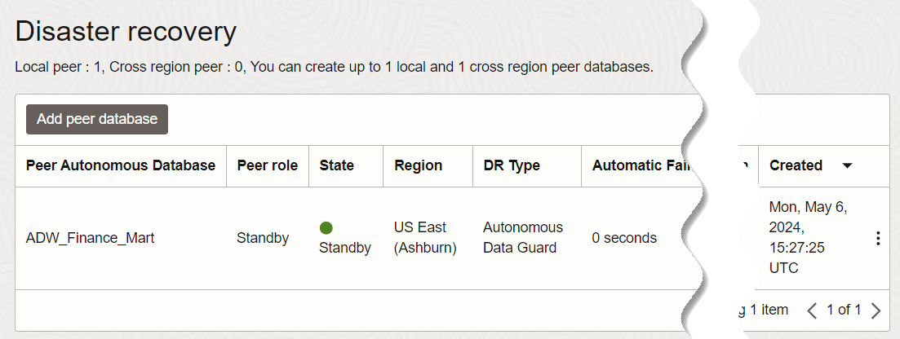
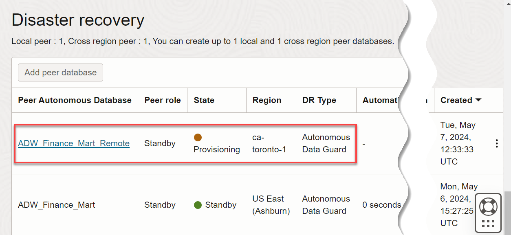
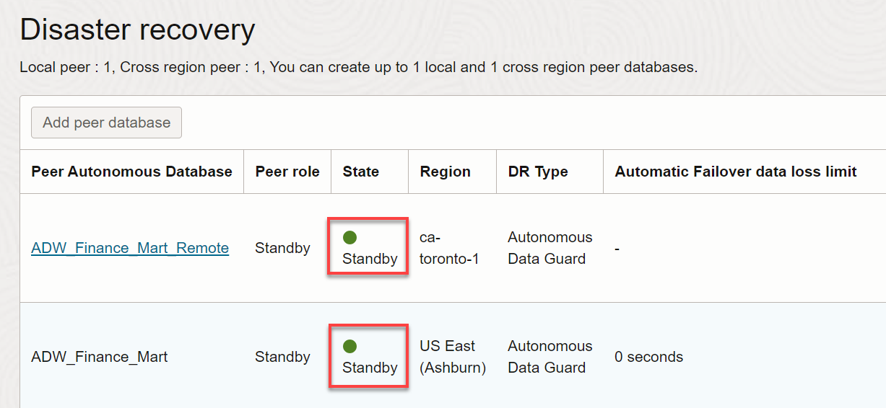
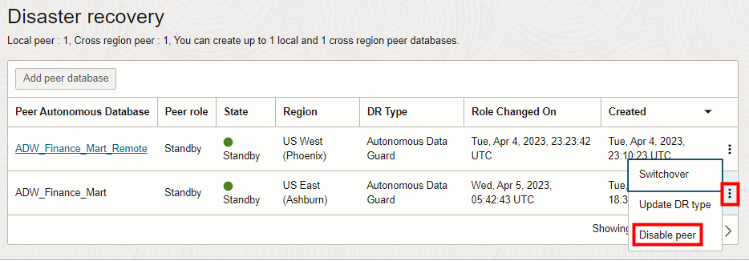

# Enable Disaster Recovery Using Autonomous Data Guard or Backup-Based Disaster Recovery

_**Important:** This lab uses features which are not available on Oracle's Always Free databases or on the Oracle LiveLabs Sandbox hosted environments (the Green button). If you run this lab using an Always Free database or a LiveLabs Sandbox environment, you can only review the steps and later practice the steps using your organization’s own tenancy._

## Introduction

In this lab, you will learn about 2 types of Disaster Recovery features in Autonomous AI Database Serverless.
- You will practice enabling Autonomous Data Guard (AuDG), using a standby database.
- You will learn about Backup-Based Disaster Recovery, which uses a backup copy of your primary database.

Every enterprise today needs to protect its data with high availability, data protection, and disaster recovery. Businesses need a comprehensive set of services that create, maintain, manage, and monitor one or more standby databases to enable production databases to survive disasters and data corruption. While ADB already runs on highly available Exadata infrastructure, this feature further protects your databases against unforeseen disaster scenarios like earthquakes, fires, floods, major network outages etc. by automatically switching to a standby database when the primary database goes down.

You can set up an Autonomous Data Guard standby database or use a backup database in the **same region** as the primary source database, or set up **cross-region** disaster recovery, running in a **different (remote) region** than the region of the primary source database.

Estimated lab time: 20 minutes

Watch the video below for a quick walk-through of the lab.
[Enable Disaster Recovery Using Autonomous Data Guard or Backup-Based Disaster Recovery](videohub:1_gw8nupuq)

### Objectives

* Learn the benefits of disaster recovery
* Enable an Autonomous Data Guard standby database
* Learn how to switch over from the primary database to a standby database
* Learn how to specify the standby database in the same local region as the primary database, or in a remote region
* Learn how Backup-Based Disaster Recovery works

>**Note:**  This lab uses Autonomous Data Guard, which is **not available** with Oracle's Always Free databases. You can run the lab by reserving a hosted Livelabs environment, or by signing up for free trial credits, or by using your own tenancy. Autonomous Data Guard is available only in Autonomous AI Database instances 19c and above.

### Basic Disaster Recovery Terminology

**Disaster Recovery (DR) Peers**: Two or more databases that are peered (linked and replicated) between each other. In ADB, peers may be:
- a **Primary** (that is, source database)
- an Autonomous Data Guard **Standby** (that is, a refreshing, physical copy of the Primary)
- a **Backup Copy**

**Switchover**: This is a user operation that can be triggered to switch roles between the Primary and the DR peer (the Standby / Backup Copy assumes the Primary role, and the Primary switches into being the Standby / Backup Copy). A switchover will only succeed if no data loss can be guaranteed, and so this is the recommended operation while testing your disaster recovery setup.

**Failover**: This is a user operation that can also be triggered to switch roles between the Primary and the DR peer database. However, unlike a switchover, triggering a failover may incur some data loss during the operation. A failover is generally recommended during an actual failure.

**Primary or Source Database**: The main database that is actively being used to read from, and write to, by a user or application.

**Autonomous Data Guard Standby Database**: A replica of the primary database which is constantly and passively replicating data from the primary database. This standby database is used in case of failure of the primary. In the case of ADG, the standby database is available on a different Exadata machine (in a different Availability Domain in regions that have more than one) for the highest level of protection. The standby database can also be provisioned in a remote region, using Cross-Region Autonomous Data Guard.

**Backup Copy**: This is the newer type of disaster recovery peer introduced with Backup-Based Disaster Recovery - This type of peer is not a physical standby database but is simply a set of backups stored from the source (primary) database, that are used to instantiate a new database at the time of switchover or failover.

**Local (same-region) peer**: This type of disaster recovery peer protects your system against local outages (such as localized disk corruption or network failures). Your local peer will lie in a different Availability Domain (AD) than the Primary database, in regions with multiple ADs, or a different Exadata machine in regions with only one AD.

**Remote (cross-region) peer**: This type of disaster recovery peer protects your system against full regional outages (such as natural disasters or complete regional network outages). Your remote peer will lie in a different region than the Primary database.

**Recovery Point Objective (RPO)**: An organization's maximum tolerance for data loss, after which business operations start to get severely impacted, usually expressed in minutes. Lower is better.

**Recovery Time Object (RTO)**: An organization's maximum tolerance for the unavailability (or downtime) of a service after which business operations start to get  severely impacted, usually expressed in minutes. Lower is better.

### How Does Autonomous Data Guard Function?

Autonomous Data Guard monitors the primary database and if the Autonomous AI Database instance goes down, then the standby instance assumes the role of the primary instance.

Unforeseen database failures due to disasters can happen at any time. Autonomous Data Guard offers the highest level of protection for an enterprise's data availability and system performance requirements.

If a disaster were to occur and your primary database is brought down, you can **"Failover"** to your standby database. A failover is a role change, switching from the primary database to the standby database when the primary is down and unavailable, while the standby is available. This has to happen fast so that both RTO and RPO are minimized.

The failover from the Primary to the Standby is seamless and does not require downloading a new wallet or new URLs for the tools users were using before the switch over happened. You can continue to use existing wallets and URL endpoints for your tools ( [APEX](https://docs.oracle.com/en/cloud/paas/autonomous-data-warehouse-cloud/cswgs/autonomous-apex-about.html#GUID-F275EA9F-F9A4-4A72-B777-5548362FDDA5), [OML](https://docs.oracle.com/en/cloud/paas/autonomous-data-warehouse-cloud/omlug/get-started-oracle-machine-learning.html#GUID-2AEC56A4-E751-48A3-AAA0-0659EDD639BA), and [ORDS](https://docs.oracle.com/en/database/oracle/oracle-rest-data-services/20.3/qsord/index.html)).

After a failover, a new standby for your primary will automatically be provisioned.

* A standby database can be created in the **same region** as the primary database. In that case, for better resilience, the standby database is provisioned as follows:
    * In regions with more than one availability domain, the standby database is provisioned automatically in a different availability domain than the primary database.
    * In regions with a single availability domain, the standby database is provisioned automatically on a different physical machine than the primary database.

* A cross-region standby database can also be created in a **remote region**, different from the local region of your primary database.

    

### RTO and RPO Service Level Objectives

**Highly critical production systems should use Autonomous Data Guard for disaster recovery** rather than Backup-Based Disaster Recovery.

The complete RTO and RPO Availability Service Level Objective that ADB targets can be viewed in [the documentation here](https://docs.oracle.com/en/cloud/paas/autonomous-database/adbsa/availability-slo.html#GUID-D7F065C4-68C5-4F1F-B8D4-4A43538E7384).

- With **Autonomous Data Guard standbys** enabled the Service Level Objective targets are:

    - Local Standby Database: RTO = 2 mins, RPO = 1 min

    - Cross-Region Standby Database: RTO = 15 mins, RPO = 1 min

- With **Backup-Based Disaster Recovery** enabled, the RTO is based on the size of the database. The Service Level Objective targets are:

    - Local and Cross-Region Backup Copy: RTO = (1hr + 1hr per 5TB) mins, RPO = 1 min

## Task 1: Enable Autonomous Data Guard

>**IMPORTANT:**    
_If you are running this workshop in a LiveLabs hosted sandbox, please change the scaling values back to their original settings of 2 ECPU and 1 TB of storage, to enable the lab on activating disaster recovery using Data Guard to have sufficient resources. To do this, go back to the Autonomous AI Database details page and click the Manage scaling button. If you are running this workshop in your own tenancy and you have sufficient ECPUs and storage, you can skip this step._

1. On your **Autonomous AI Database details** page, click the **Disaster recovery** tab.

    

    Note the display of the local backup copy that is one of your database's automatic daily backups. This is not a physical standby database, but simply a **backup copy** stored from the source (primary) database, which can be used to instantiate a new database at the time of switchover or failover. Backup-Based Disaster Recovery is examined in a later task. However, we want to enable Autonomous Data Guard, which will create a **standby database**, a replica of the primary database which will constantly and passively refresh (that is, replicate) data from the primary, which can be used in case of failure of the primary.

2. Click the **Actions** icon (3-dot ellipsis) on the right side of the backup copy row, and then select **Update disaster recovery**.

    

3. The **Edit disaster recovery** panel is displayed. The **Backup-based disaster recovery** tile is selected by default. Select the **Autonomous Data Guard** tile, and then click **Update**.

    >**Note**: Read the information about recovery time and recovery point objectives, and the informational note.

    

4. The Autonomous AI Database Lifecycle State changes to **Updating**. Depending on the size of your primary database this may take several minutes.

    >**Note**: While you provision a new standby database, the primary database is available for read/write operations. Enabling Autonomous Data Guard is non-blocking; there is no downtime on the primary database.

    When the standby database finishes provisioning, observe the **Peer role** column has changed from **Backup copy** to **Standby**, the **State** column has changed from **Provisioning** to **Standby**, and the **DR Type** column has changed from **Backup-based** to **Autonomous Data Guard**.

    

5. You can create a total of two standby databases, one local and the other cross-region. You just enabled Autonomous Data Guard to create a local standby database. If your Oracle Cloud account has at least two regions, you can optionally create a second standby database that is cross-region.

    >**Note:** Creation of a cross region standby database is optional, if your Oracle Cloud account has at least two regions. Please skip these optional steps if you are running this workshop in a LiveLabs hosted sandbox environment or in an Always Free Database. Cross region standby databases are not yet supported in LiveLabs environments.

6. To perform this **optional step** of adding a second standby database that is cross-region, click **Add peer database**.

    

7. In the **Add peer database** panel, select a region other than the local region of your primary database. In our example, we chose the Canada Southeast region. Next, select your compartment.

    >**Note**: Click on the various **Learn** links to read about the additional costs of a **cross-region** standby database, and the longer recovery time objective (RTO) as compared to **local** standby databases. For Cross-Region Autonomous Data Guard, the RTO is less than `10` minutes and the recovery point objective (RPO) is `1` minute.

8. Click **Add**.

    

9. Note that in addition to your local standby database, you are provisioning a second standby database that is a remote, cross-region database. The provisioning of the cross-region standby database and the updating of the primary database will take several minutes. Once it becomes available, you are protected against regional outages. The remote standby is visible in the remote region with your source database's name trailed by the selected region's key. In our example, the region key for the Canada Southeast (Toronto) region is **"_YYZ"**. The initial status of the instance is **UPDATING**. Wait for a few minutes for the status to change to **AVAILABLE**.

    

    Wait for a few minutes for the status to change to **AVAILABLE**.

    

    >**Note:** The databases display names are displayed and not the actual database names.

10. At this point, you now have 3 Autonomous Data Warehouse databases:

    * Your **original** database, **`adwfinance`**
    * Your **local standby** database, also named **`adwfinance`**
    * Your optional **cross-region** standby database, **`adwfinance_your_region_key`**. In our example, the database name is **`adwfinance_YYZ`**.

11. Go back to the **Autonomous AI Database details** page of your original database. In the **Disaster recovery** section of the page, the **Cross-region** field status has changed from **Not enabled** to **Autonomous Data Guard** with a button to perform a **Switchover**. This page indicates you are in your original database, **`adwfinance`**, with the role of primary database, in the primary region.

    

## Task 2: Test Switchover to a Standby Database

After Autonomous Data Guard is enabled, if you perform a switchover operation, the primary database becomes the standby database, and the standby database becomes the primary database, with no data loss. A switchover is typically done to test your application's failover procedures when Autonomous Data Guard is enabled.

The Oracle Cloud Infrastructure console **Disaster recovery** section in the **Autonomous AI Database information** tab shows a **Switchover** button in the **Cross-region** field when both the primary database and the standby database are available.

  

You can view the available standby database in the **Disaster recovery** tab.

  

You can perform a switchover to the **local standby** database as follows:

1. On the **Autonomous AI Database** details page of your original primary database, click the **Disaster recovery** tab. Click the **Actions** icon (3-dot ellipsis) on the right side of the local backup copy (your **local** standby, not the remote cross-region standby if you also created one), and select **Switchover**.

    

2. In the **Confirm switchover to peer** dialog box, confirm the switchover to the standby database. Enter the database name of your local standby, **`ADW_Finance_Mart`**. Click **Switchover**.

    

    The database **Lifecycle State** changes to **Updating** and the **State** field shows **Role change in progress**.

    

    After a few minutes, the **State** field for your standbys will show **Standby**.

    

    When the switchover operation completes, Autonomous Data Guard does the following:
    * The Primary database goes into the Available state and can be connected to for queries and updates.
    * The Peer State field will change to Available when the standby is ready. (The standby may go into a Provisioning state first, if necessary, without blocking operations on the Primary.)
    * You can see the time of the last switchover in the **Role changed on** (scroll to the right) in the **Disaster recovery** tab.

    

3. You can also **optionally** switch over to your remote cross-region standby database if you created one, but in that case you'll switch over from the **remote standby**, rather than from the **primary**. Once your remote standby is provisioned, you will see a "Switchover" option on your remote standby database's console. Clicking the Switchover button **from the remote standby database**, while both your primary and standby are healthy (that is, in the Available or Stopped states), performs a role change - Switching from the primary database to the remote standby database.

    **Note:** Again, please note that if you are running this workshop in a LiveLabs hosted sandbox environment, cross region standby databases are not yet supported in LiveLabs environments.

## Task 3: Disable Autonomous Data Guard
_If you are running this workshop in a hosted LiveLabs sandbox, you must perform this task to free up resources for the next lab on creating refreshable clones. If you are running this workshop on your own tenancy and have sufficient resources, you can skip this task._

1. If you are not logged in to Oracle Cloud Console, log in and navigate into your Autonomous AI Database.

2. On the Autonomous AI Database details page, click the **Disaster recovery** tab. For each Standby database you created, click the **Actions** icon (3-dot ellipsis) on the right side of the Standby database, and then click **Disable peer** to disable the Autonomous Data Guard.

    

    In the **Disable** dialog box, select the standby database you want to disable and terminate. Enter the Autonomous AI Database name to confirm that you want to disable Autonomous Data Guard for the instance. Click **Disable**.

    

    If Autonomous Data Guard is enabled with both a local Standby and a cross-region Standby, you disable Autonomous Data Guard individually for the local Standby or the remote Standby. If there is only a local standby or only a remote Standby, you have one choice.

    The database Lifecycle State changes to **Updating** and the State field changes to **Terminating**.

    >**Notes:**
    * Disabling Autonomous Data Guard terminates the standby database. If you later enable Autonomous Data Guard, the system creates a new standby database.
    * If you switched over to remote cross region standby, you must switch back to the primary region before you can disable the cross-region standby.

## Task 4: Examine Backup-Based Disaster Recovery

### How Does Backup-Based Disaster Recovery Function?

  

Backup-Based Disaster Recovery has a **lower cost than Autonomous Data Guard but a higher recovery time, for less critical and non-production systems**. As the name suggests, Backup-Based Disaster Recovery provides recovery from outages not by providing a physical, refreshing Standby like AuDG does, but simply by instantiating a database using the latest available backups and redo logs for your database.

This also means that, unlike Autonomous Data Guard, you will not be billed for any additional CPU usage on your backup copy while it is simply standing by, which is what significantly reduces the cost of this DR option. Local backup copies make use of your database's automatic backups and therefore do not incur any additional costs. Cross-region (remote) backup copies are only billed for twice (2x) of the storage consumed for the backup data replicated to the remote region (billed as database storage for OCPU-based databases and as backup storage on ECPU-based databases).

### RTO and RPO Service Level Objectives

**Highly critical production systems should use Autonomous Data Guard for disaster recovery** rather than Backup-Based Disaster Recovery.

The complete RTO and RPO Availability Service Level Objective that ADB targets can be viewed in [the documentation here](https://docs.oracle.com/en/cloud/paas/autonomous-database/adbsa/availability-slo.html#GUID-D7F065C4-68C5-4F1F-B8D4-4A43538E7384).

- With **Autonomous Data Guard standbys** enabled the Service Level Objective targets are:

    - Local Standby Database: RTO = 2 mins, RPO = 1 min

    - Cross-Region Standby Database: RTO = 15 mins, RPO = 1 min

- With **Backup-Based Disaster Recovery** enabled, the RTO is based on the size of the database. The Service Level Objective targets are:

    - Local and Cross-Region Backup Copy: RTO = (1hr + 1hr per 5TB) mins, RPO = 1 min

## Automatic and Manual Failover options in case of a disaster

In a disaster situation when the Primary becomes unavailable, the Switchover button would turn to a Failover one. With ADG, an **Automatic Failover** is automatically triggered (no user action is needed) by the Autonomous AI Database when a user is unable to connect to their primary database for a few minutes. Since this is an automated action, the automatic failover is allowed to succeed only when no data loss will occur. In ADG, for automatic failover, RTO is 2 minutes and RPO is 0 minutes.

>**Note:** We do not support automatic failover across regions since failing over across regions is more impactful than failing over locally; often users want to failover mid-tiers / applications along with the database for optimum performance. You may manually trigger the switchover/failover button on the console or a scripted API call when required. For the same reason, if you have both a local and a remote standby database available, we always recommend failover to the local standby first.

In the rare case when your primary is down and automatic failover is unsuccessful, the Switchover button will turn into a Failover button and the user can trigger and perform a **Manual Failover**. During a manual failover, the system automatically recovers as much data as possible, minimizing any potential data loss; there may be a few seconds or minutes of data loss. You would usually only perform a manual failover in a true disaster scenario, accepting the few minutes of potential data loss to ensure getting your database back online as soon as possible. For manual failover, the RTO is 2 minutes and RPO is 5 minutes.

## Additional Considerations

* If you have both local and cross-region standby databases, Oracle always recommends that if your local is available, switch over to that first. Only if the region is completely down, and you can't fail over to your local region standby, then fail over to your remote region standby.
* We don't expect you to run in the standby region permanently. The expectation is that you will switch back to the primary side when it becomes available.  
* The Recovery Time Object (RTO) is higher for cross region standby databases (15 minutes) than for local standby databases (2 minutes).
* When you enable Autonomous Data Guard with a cross-region standby database, the wallets for the primary and the standby specify different database hostnames and use different connection strings. Oracle recommends that applications use the connection string or wallet downloaded from the same region as the primary database. If you need to use a single connection string or wallet containing both the primary and the standby database hostnames, you may construct this manually. To manually construct a wallet that contains both the primary and the remote database connections strings:

    1. From the primary database's Oracle Cloud Infrastructure Console, click **Database connection** to download the primary's wallet.zip.

    2. From the remote standby database's Oracle Cloud Infrastructure Console, click **Database connection** to download the standby's wallet.zip.

    3. Unzip both wallet files and open the two tnsnames.ora files.

    4. Copy the remote database's connect descriptor into the primary database's connection string in the primary's `tnsnames.ora` file using your preferred retry delays.

    5. Zip the updated primary database wallet folder.

    With this updated `tnsnames.ora`, your primary database connection strings in the updated wallet.zip will contain both the primary and the standby hostnames, to support failover. An application using the updated wallet attempts to connect and retries connecting to the first listed database hostname, and if that connection fails due to the database being Unavailable, the application then automatically attempts to connect to the second database hostname.
* When you enable Autonomous Data Guard with both a local and a cross-region standby, Autonomous Data Guard does not provide a local standby while the remote region instance operates in the Primary role. Using the remote region in the Primary role is intended for use while the primary region is unavailable or for testing (a temporary scenario). After the primary region database returns to the Primary role, the local Standby will be available.

You may now **proceed to the next lab**.

## Want to Learn More?
* [Autonomous Data Guard Notes](https://docs.oracle.com/en/cloud/paas/autonomous-database/serverless/adbsb/autonomous-data-guard-notes.html#GUID-06514279-EB46-4BAE-A943-8F8B51C51817)
* [About Standby Databases](https://docs.oracle.com/en/cloud/paas/autonomous-data-warehouse-cloud/user/autonomous-data-guard-about.html#GUID-045AD017-8120-4BDC-AF58-7430FFE28D2B)
* [Use the API](https://docs.oracle.com/en/cloud/paas/autonomous-data-warehouse-cloud/user/autonomous-data-guard-api.html#GUID-3E4C0FA6-DE04-4F7F-A7AF-4C270870DCFF)
* [Cross-Region Autonomous Data Guard](https://blogs.oracle.com/datawarehousing/post/cross-region-autonomous-data-guard-your-complete-autonomous-database-disaster-recovery-solution)
* [Introducing Backup-Based Disaster Recovery](https://blogs.oracle.com/datawarehousing/post/backup-based-disaster-recovery)

## Acknowledgements

* **Authors:**
    * Vandanadevi Rajamani, Database User Assistance
    * Lauran K. Serhal, Consulting User Assistance Developer
    * Nilay Panchal, ADB Product Management
* **Last Updated By/Date:** Lauran K. Serhal, October 2025
