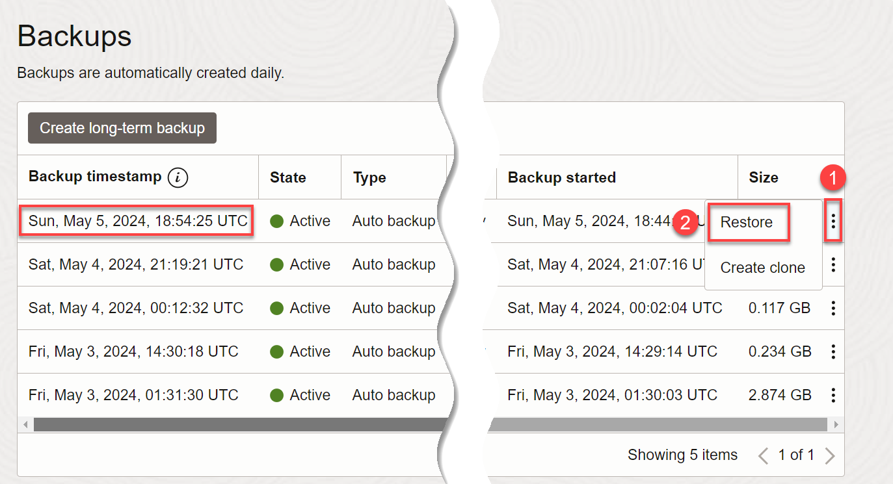
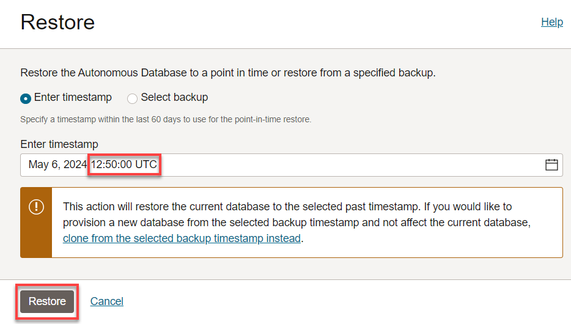

# Backup and Restore Your Autonomous Database

## Introduction

Data is one of the most important assets of any organization today. Whether you're a small business or a large enterprise, your data is critical to your success. In turn, data corruption or data loss that may be caused by disasters, hardware failures, human error or even malicious attacks can have a major impact. It is crucial to have an effective backup and recovery strategy in place. Autonomous Database Serverless provides some of the best and most user-friendly backup and restore options, made reliable by being fully managed by Oracle automation.

This lab shows where to examine automatic backups, how to restore a backup, and how to configure a long-term backup schedule.

Estimated Lab Time: 10 minutes

### Objectives

In this lab, you'll:

- Identify where to examine automatic daily database backups
- Restore your Oracle Autonomous Database from a specific point in time.
- Configure a long-term backup schedule.

## Task 1: Examine the automatic backups
Autonomous Database automatically backs up your database for you daily. The retention period for backups is 60 days. You can restore and recover your database to any point-in-time in this retention period.

Let's examine where to find available backups of your Autonomous Database.

1. On the Autonomous Database Details page, scroll down to the **Backup** section, and note the information.

    

2. Scroll down further to the **Resources** section, and click the **Backups** tab. This tab lists the backups that have been automatically created for you daily.

    > Note: In this workshop, your newly-created Autonomous Database will not yet have a list of daily backups.

    

## Task 2: Restore a backup
You can restore any of the daily backups listed, or you can restore from a point in time by entering a timestamp within the last 60 days.

1. To restore a specific backup in the list of backups, you could simply click the 3-dot ellipsis beside one of the backups and click **Restore**. However, in this workshop, you may not yet have a list of backups. So let us instead move on to Step 2.

    

2. On the **Autonomous Database details** page, click the **More actions** drop-down menu, and select **Restore**.

    

3. The **Restore** dialog has a **Select Backup** choice that lets you restore from a list of daily backups similar to the previous step, but let's use the default choice, **Enter Timestamp**. Click the **calendar icon** at the side of the Enter Timestamp field.

    

4. Click today's date on the calendar. Today's date will appear in the Enter Timestamp field. However the hours, minutes and seconds will be zeros. For the purpose of this workshop, we want to change this timestamp to a few minutes prior to the current universal time. Leave this dialog open.

    

5. Open another browser window. Go to https://time.is/UTC and note the current universal time. Go back to the **Restore** dialog that you left open, and enter a time that is approximately 10 minutes earlier than the current universal time you found. (In this example, if the current time is 16:20:45, we would change the time from 00:00:00 to 16:10:00.) After you enter a time approximately 10 minutes earlier than the current universal time, click **Restore**

    

6. Wait a few minutes while the database restores from the point in the timestamp you just entered.

## Task 3: Configure a long-term backup schedule

In today's world, regulations, audits, and compliance requirements often demand long-term retention of data. For instance, in the financial or healthcare sector, you may have to keep transactional and patient data for several years, if not decades. You may need long-term backups for compliance and regulatory requirements, legal and contractual obligations, historical analysis, or for business continuity in response to data loss.

It is essential to have a database backup plan that covers both short-term and long-term retention. As with other aspects of Oracle Autonomous Database, the process of long-term backups is completely automated and managed by Oracle.

Using the long-term backup feature you can create a long-term backup as a one-time backup or as scheduled long-term backup. You select the retention period for long-term backups in the range of a minimum of 3 months and a maximum of 10 years.

Autonomous Database takes scheduled long-term backups automatically according to the schedule you create: one-time, weekly, monthly, or yearly.

1. Scroll down the Autonomous Database details page for your database and again select **Backups** under your database's **Resources** section. You will see the **Create long-term backup** button.

    

2. The **Create long-term backup** dialog appears. Backups on Autonomous Database are completely automated. Provide the following information:
    - When you would like a long-term backup to be taken (Immediately, at a scheduled time in the future, or repeatedly at your preferred cadence)
    - How long you would like us to keep a long-term backup for you (that is, the backup retention period). While your existing automatic backups have a backup retention period of 60 days, long-term backups can be retained starting from 90 days all the way up to 10 years.

    You may also automate long-term backups at your own, personalized cadence by calling long-term backup CLI APIs in your scripts or via Terraform.

    

    Click **Create**.

3. When you click Create, Oracle starts an asynchronous job to create a long-term backup for you in the background, so your database is not held up waiting for the backup to complete. You can track this long-term backup and other lifecycle management (LCM) operations triggered on your database by clicking the **Work Requests** tab.

    

4. When your long-term backup is available, you will see it in your list of backups. Each long-term backup is a standalone backup that can be managed individually. You may edit the retention period of a long-term backup, delete it if you no longer need it, or clone from the backup when you need an instantiated database copy from that long-term backup.

    It is good practice to test your long-term backup after creating it by cloning from it, to ensure your backed up data is as required.

    

5. From the Autonomous Database details page, you can view the details of any scheduled long-term backups and you can edit a long-term backup schedule. Note that the  console also presents the size of backups you are paying for - While 60 day automatic backups are included with OCPU-based databases, long-term backups will be billed additionally at your database storage rate.

    

You may now **proceed to the next lab**.

## Want to Learn More?

- ADW Documentation: [Backing Up and Restoring Autonomous Database](https://docs.oracle.com/en/cloud/paas/autonomous-database/adbsa/backup-restore.html#GUID-9035DFB8-4702-4CEB-8281-C2A303820809)
- ADW Documentation: [Create Long-Term Backups on Autonomous Database](https://docs.oracle.com/en/cloud/paas/autonomous-database/adbsa/backup-long-term.html)
- Product Management Blog: [Keep backups long-term (up to 10 years!) on Autonomous Database](https://blogs.oracle.com/datawarehousing/post/long-term-backups-autonomous-database)

## Acknowledgements

- **Author** - Rick Green, Principal Developer, Database User Assistance
- **Last Updated By/Date**  - Rick Green, June 2023
