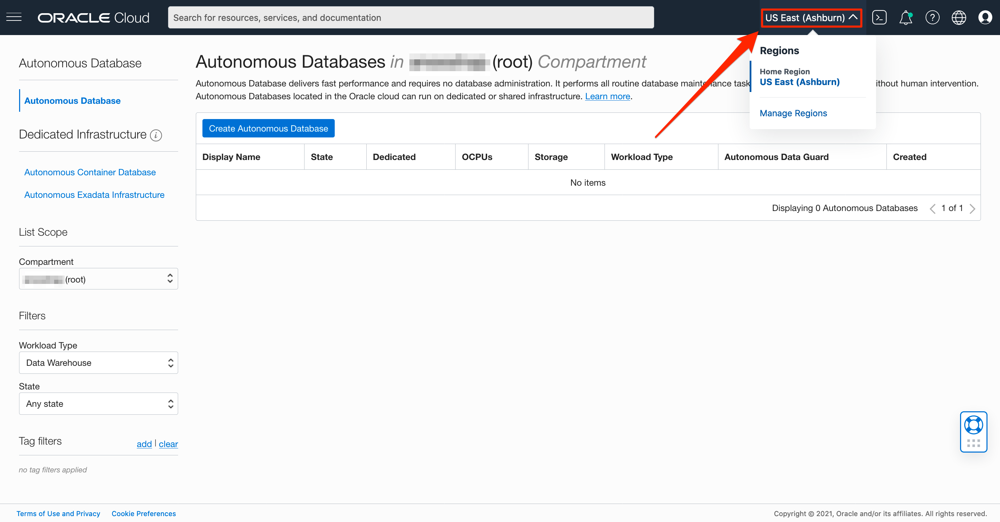
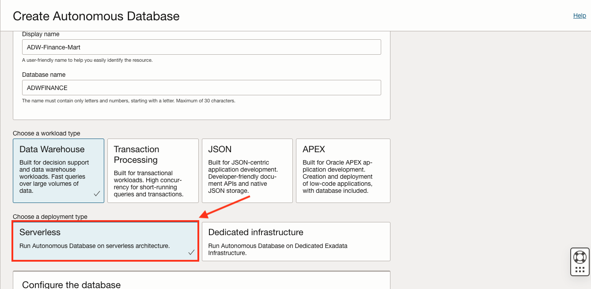
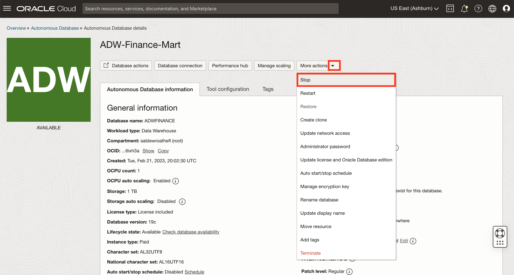

# Autonomous Database on Serverless Infrastructure

## Introduction

This lab walks you through the steps to get started using the Oracle Autonomous Database on Oracle Cloud. In this lab, you will provision a new ADW instance, stop and start your autonomous database instance, scale up your Oracle Autonomous Data Warehouse (ADW) service to have more CPUs, move an ADB instance to a different compartment in your tenancy, clone an existing ADB instance, backup and restore an Autonomous Database, and create events and alarms in OCI for an ADB instance.

Estimated Time: 45 minutes

### Objectives

In this lab, you will:

- Learn how to provision a new Autonomous Database
- Learn how to stop and start your Autonomous Database instance.
- Learn how to scale up an ADW or ATP service.
- Learn how to move an ADB instance to a different compartment in your tenancy.
- Learn how to clone an existing ADB instance.
- Learn how to backup and restore an Autonomous Database.
- Learn how to create events and alarms in OCI for an ADB instance.

## Task 1: Create the Oracle Autonomous Database instance

1. Log in to the Oracle Cloud.
2. Once you log in, the cloud services dashboard shows all the services available to you. Click the navigation menu in the upper left to show top level navigation choices.

    > **Note:** You can also directly access your Autonomous Data Warehouse or Autonomous Transaction Processing service in the __Quick Actions__ section of the dashboard.

    

3. The following steps apply similarly to either Autonomous Data Warehouse or Autonomous Transaction Processing. This lab shows provisioning of an Autonomous Data Warehouse database, so click **Oracle Database**, then **Autonomous Data Warehouse**.

    

4. Make sure your Workload Type is __Data Warehouse__ or __All__ to see your Autonomous Data Warehouse instances. Use the __List Scope__ drop-down menu to select a compartment. <if type="livelabs">Enter the first part of your user name, for example `LL185` in the Search Compartments field to quickly locate your compartment.

    
    </if>
    <if type="freetier">
    

   > **Note:** Avoid the use of the `ManagedCompartmentforPaaS` compartment, as this is an Oracle default used for Oracle Platform Services.
   </if>

5. This console shows that no databases yet exist. If there were a long list of databases, you could filter the list by the **State** of the databases (Available, Stopped, Terminated). You can also sort by __Workload Type__. In this example, __Data Warehouse__ is the workload type.

    

<if type="freetier">
6. If you are using a Free Trial or Always Free account, and you want to use Always Free Resources, you need to be in a region where Always Free Resources are available. You can see your current default **region** in the top, right hand corner of the page.

    
</if>

6. Click **Create Autonomous Database** to start the instance creation process.

    

7.  This brings up the __Create Autonomous Database__ screen where you will specify the configuration of the instance.

    <if type="livelabs">
    
    </if>
    <if type="freetier">
    
    </if>

8. Specify basic information for the autonomous database:

    - __Compartment__ - Leave the default compartment.
    - __Display Name__ - Enter a memorable name for the database for display purposes. For this lab, use __ADW-Finance-Mart__.
    - __Database Name__ - Use letters and numbers only, starting with a letter. Maximum length is 14 characters. (Underscores not initially supported.)
    <if type="livelabs">For this lab, use __ADWFINANCE__ and **append your user id**. For example, if your user id is **LL-185**, then enter __ADWFINANCE185__
    </if><if type="freetier">For this lab, use __ADWFINANCE__.</if>

    <if type="livelabs">
    
    </if>
    <if type="freetier">
    
    </if>

9. Choose a workload type. Select the workload type for your database from the choices:

    - __Data Warehouse__ - For this lab, choose __Data Warehouse__ as the workload type.
    - __Transaction Processing__ - Or, you could have chosen Transaction Processing as the workload type.

    

10. Choose a deployment type. Select the deployment type for your database from the choices:

    - **Serverless** - For this lab, choose **Serverless** as the deployment type.
    - __Dedicated Infrastructure__ - Or, you could have chosen Dedicated Infrastructure as the deployment type.

    

11. Configure the database:

    - __Always Free__ - If your Cloud Account is an Always Free account, you can select this option to create an always free autonomous database. An always free database comes with 1 CPU and 20 GB of storage. For this lab, we recommend you leave Always Free unchecked.
    - __Choose database version__ - Select a database version from the available versions.
    - __OCPU count__ - Number of CPUs for your service. For this lab, specify __1 CPU__. If you choose an Always Free database, it comes with 1 CPU.
    - __Storage (TB)__ - Select your storage capacity in terabytes. For this lab, specify __1 TB__ of storage. Or, if you choose an Always Free database, it comes with 20 GB of storage.
    - __Auto Scaling__ - For this lab, keep auto scaling enabled, to enable the system to automatically use up to three times more CPU and IO resources to meet workload demand.
    - __New Database Preview__ - If a checkbox is available to preview a new database version, do NOT select it.

    > **Note:** You cannot scale up/down an Always Free autonomous database.

    

12. Create administrator credentials:

    - __Password and Confirm Password__ - Specify the password for ADMIN user of the service instance. The password must meet the following requirements:
    - The password must be between 12 and 30 characters long and must include at least one uppercase letter, one lowercase letter, and one numeric character.
    - The password cannot contain the username.
    - The password cannot contain the double quote (") character.
    - The password must be different from the last 4 passwords used.
    - The password must not be the same password that you set less than 24 hours ago.
    - Re-enter the password to confirm it. Make a note of this password.

    

13. Choose network access:
    - For this lab, accept the default, "Secure access from everywhere."
    - If you want to allow traffic only from the IP addresses and VCNs you specify - where access to the database from all public IPs or VCNs is blocked, select "Secure access from allowed IPs and VCNs only" in the Choose network access area.
    - If you want to restrict access to a private endpoint within an OCI VCN, select "Private endpoint access only" in the Choose network access area.
    - If the "Require mutual TLS (mTLS) authentication" option is selected, mTLS will be required to authenticate connections to your Autonomous Database. TLS connections allow you to connect to your Autonomous Database without a wallet, if you use a JDBC thin driver with JDK8 or above. See the [documentation for network options](https://docs.oracle.com/en/cloud/paas/autonomous-database/adbsa/support-tls-mtls-authentication.html#GUID-3F3F1FA4-DD7D-4211-A1D3-A74ED35C0AF5) for options to allow TLS, or to require only mutual TLS (mTLS) authentication.

    

9. Choose a license type. For this lab, choose __License Included__. The two license types are:

    - __Bring Your Own License (BYOL)__ - Select this type when your organization has existing database licenses.
    - __License Included__ - Select this type when you want to subscribe to new database software licenses and the database cloud service.

    

14. For this lab, do not provide a contact email address. The "Contact Email" field allows you to list contacts to receive operational notices and announcements as well as unplanned maintenance notifications.

    

15. Click __Create Autonomous Database__.

    

16.  Your instance will begin provisioning. In a few minutes, the state will turn from Provisioning to Available. At this point, your Autonomous Data Warehouse database is ready to use! Have a look at your instance's details here including its name, database version, OCPU count, and storage size.

    

## Task 2: Stop and start your Autonomous Database instance

The lifecycle state for your Instance should now show Available. Let's go through the steps to stop your Autonomous Database instance.

1.  If you are not logged in to Oracle Cloud Console, log in and select **Autonomous Data Warehouse** from the navigation menu and navigate into your ADW Finance Mart instance.

    

    

2. In your ADW Finance Mart database's details page, click the **More Actions** button and Select **Stop**.

    

3.  In the Confirm Stop pop-up, click **Stop** to confirm that you want to stop the Autonomous Database.

    

4. The Autonomous Database instance is in the stopping Lifecycle state. It will take a few minutes for the Autonomous Database instance to stop.

    

5. Once your lifecycle state shows stopped, your Autonomous Database is now unavailable to accept connections.

    

The lifecycle state for your Instance should now show Stopped. Let's go through the steps to start your Autonomous Database instance.

6.  In your ADW Finance Mart database's details page, click the **More Actions** button and Select **Start**.

    

7.  In the Confirm Start pop-up, click **Start** to confirm that you want to start the Autonomous Database.

    

8.  The Autonomous Database instance is in the starting Lifecycle state. It'll take a moment for your Autonomous Database instance to start back up.

    

9.  Once your lifecycle state shows available, your Autonomous Database instance is ready to accept connections.

    

## Task 3: Scaling your Autonomous Database Instance

1. Go back to the Cloud Console you used during the provisioning exercise and open the database instance's Details page. Click the **Manage Scaling** button.

    

2.  Fill in the form with the following information:

    -   **OCPU count :** 8
    -   **Storage (TB):** 2
    -   **Storage Auto Scaling:** Disabled

  *Note: You can scale up/down your autonomous database only if your autonomous database is NOT Always Free.*

3.  Click **Update** after filling in the form. This will take you to the database instance's Details page.

    

    *Note: Applications can continue running during the scale operation without downtime.*

4.  **Refresh** the page to see the result of the scale operation.

    

## Task 4: Move your Autonomous Database to Another Compartment

1.  If you are not logged in to Oracle Cloud Console, log in and select **Autonomous Data Warehouse** from the navigation menu.

    

2. Locate the Autonomous Database instance you'd like to move. In this lab, we will move the ADW Finance Mart instance. Click on the three buttons all the way to the right and click **Move Resource**.

    

3. Choose the new compartment that you'd like to move your Autonomous Database instance to and click **Move Autonomous Database**. 

    

4. To find my ADW Finance Mart instance, I now need to select the Demo compartment I moved it to.

    

## Task 5: Create an Autonomous Database clone

In this task, we will clone an existing ADB instance. You can use the cloning feature to create a point-in-time copy of your ADB instance for testing, development, or analytics.

1. Navigate to the Database Details page for the ADW Finance Mart instance.

    

2. Select the More Actions button and click **Create Clone**.

    

3. We're going to accept all of the defaults.

    - **Choose a clone type**: Full Clone
    - **Clone source**: Clone from database instance
    - **Choose your preferred region**: Select your region
    - **Create in compartment**: Select your compartment
    - **Display name**: Clone-of-ADW-Finance-Mart
    - **Database name**: Leave the default Database name
    - **Choose database version**: 19c
    - **OCPU count**: 1
    - **OCPU auto scaling**: Leave this box checked
    - **Storage (TB)**: 1

    
    

4. Create a database administrator password. The password must be 12 to 30 characters and contain at least one uppercase letter, one lowercase letter, and one number.

    

5. Select **Secure access from everywhere** and **License Included**. Click **Create Autonomous Database Clone** to create your new clone.

    

6. Notice that the autonomous database clone is in the provisioning lifecycle state. In just a few moments, your clone, the metadata, and the data will be created.

    

7. The new ADW instance is available for use.

    

## Task 6: Backup and restore an Autonomous Database Instance

1.  If you are not logged in to Oracle Cloud Console, log in and select **Autonomous Data Warehouse** from the navigation menu.

    

2. Click the ADW Finance Mart database.

    

3. Scroll down and click **Backups** under Resources.

    

4. All of the automatic backups that have already been created are listed. Let's restore one of the backups.

    

5. Scroll back up and click **More Actions** -> **Restore**.

    

6. Click **Select Backup** and choose the backup that you'd like to restore your database to. Click **Restore**

    

7. The database will be in the restore in progress lifecycle state.

    

8. On the autonomous database details page, scroll down and click **Work Requests** to view the progress of the restore request. You can see in the screenshot below that the restore is 18% complete. Click on the request to view more information. 

    

9. The progress will continue until the Autonomous Database is available and the work request has succeeded. 

    

10. Once the database is in the available lifecycle state and the work request has succeeded, your restore is complete.

## Task 7: Create events and alarms for an Autonomous Database instance.

1. Click on the menu button in the upper left corner. Select **Developer Services** -> **Notifications**.

    

2. Click **Create Topic**. 

    

3. A topic is a channel for sending messages to the subscriptions in the topic. Each topic name is unique. We will choose the topic name Database-Notification. For the description, enter Notification topic for sending notification email about change in database status. Click **Create**.

    

4. Now that the topic is created, let's click on the topic to see the topic details page.

    

5.  A subscription is an endpoint for a topic. Published messages are sent to each subscription for a topic. Click **Create Subscription** under the Resources section.

    

6. We will be using the email protocol. Enter your desired email. Click **Create**.

    

7. The subscription is in pending status. To confirm this subscription, follow the instructions in your email. 

    

8. Navigate to your ADW-Finance-Mart details page.

    

9. Scroll down on the Details page and find the CPU utilization. Click on the Options button and click **Create an Alarm on this Query**.

    

10. We are going to create an alarm on the percentage of CPU utilization for our instance. The alarm will be triggered if OCI notices that this Autonomous Database is using more CPU than usual. Enter the following information:

    Define alarm box:
    - **Alarm name**: CPU Usage Alarm
    - **Alarm severity**: Critical
    - **Alarm body**: CPU usage alarm; an Autonomous Database may be utilizing more CPU than usual.

        
    
    Metric description box:
    - **Compartment**: Select your compartment
    - **Metric namespace**: oci\_autonomous\_database
    - **Resource group**: Leave this empty
    - **Metric name**: CpuUtilization
    - **Interval**: 1m
    - **Statistic**: Mean

    Metric dimensions box:
    - **DeploymentType**: Shared

    Trigger rule box:
    - **operator**: greater than
    - **Value**: 1
    - **Trigger delay minutes**: 1

     

    Notifications box:
    - **Destination Service**: Notifications
    - **Compartment**: Select your compartment
    - **Topic**: Database-Notification

         

11. Confirm that the Enable this alarm? box is checked and click **Save alarm** to save the alarm.

         

12. We now have an alarm created for an event on the Autonomous Database. Our desired email target will receive an email when the CPU utilization exceeds expected thresholds.

    

You may now **proceed to the next lab**.

## Acknowledgements

- **Author** - Kamryn Vinson, Database Product Management
- **Last Updated By/Date** - Kamryn Vinson, June 2023
