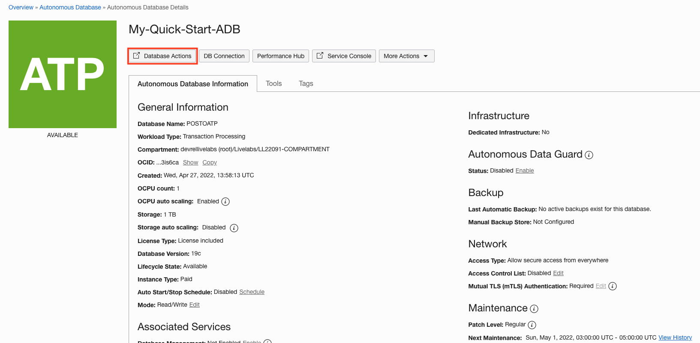
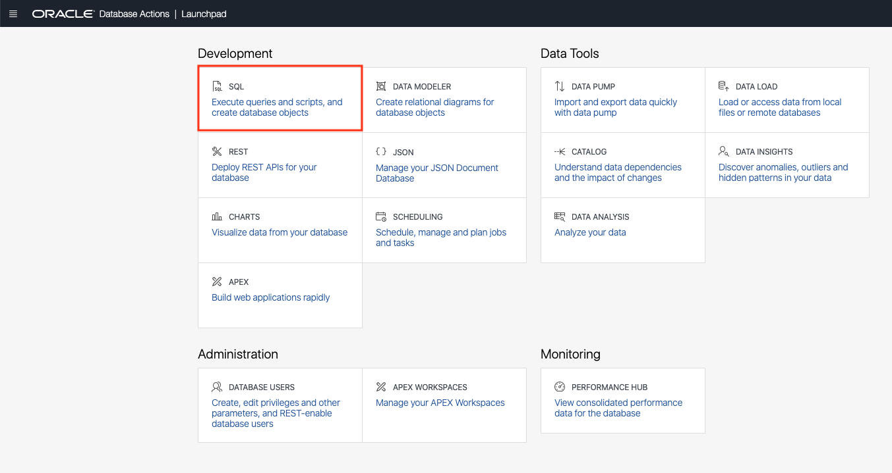
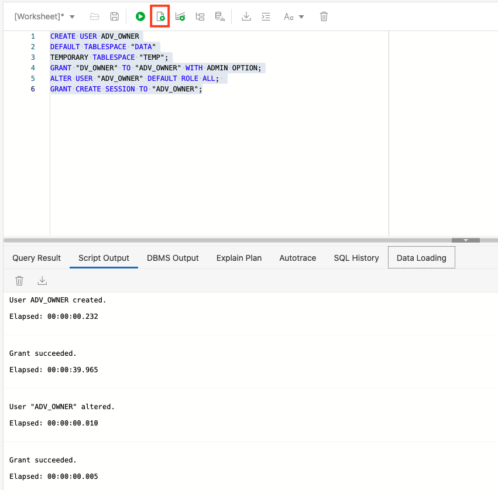
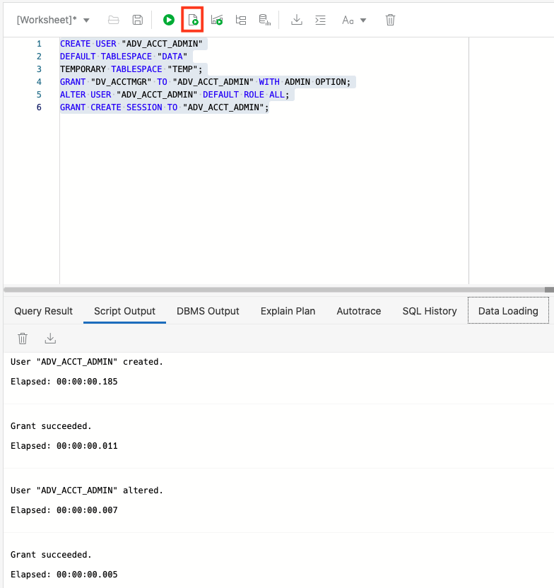
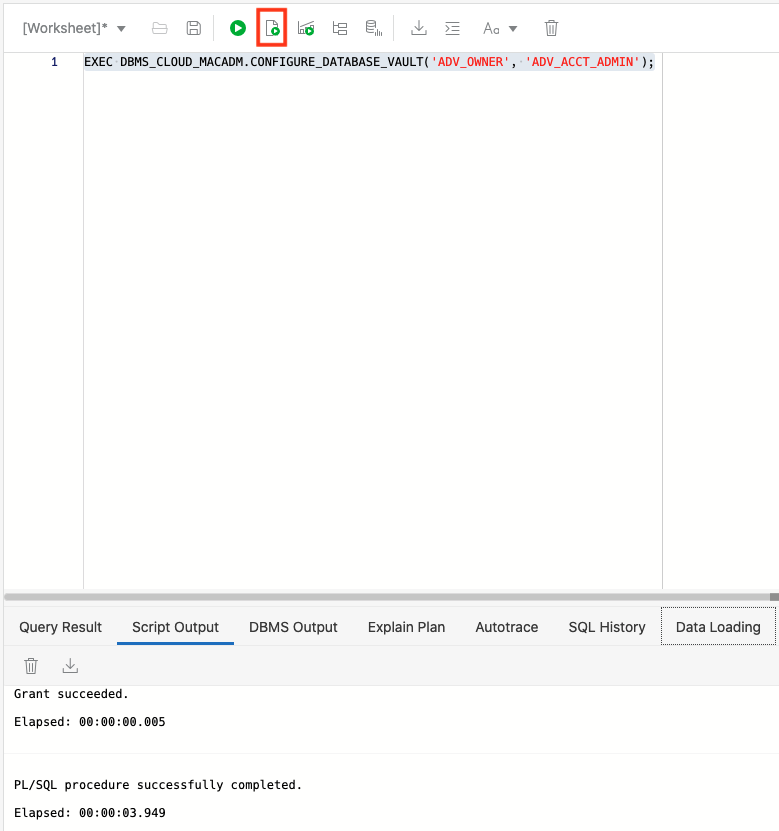
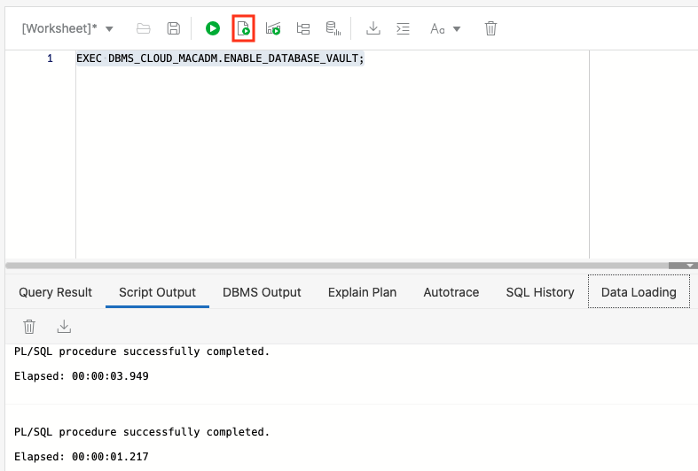
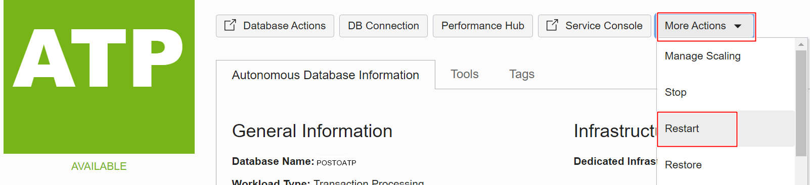
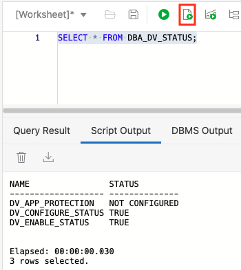

# Enable Database Vault in Autonomous Database

## Introduction

Database Vault implements powerful, unique security controls that restrict access to application data by privileged database users and enforce context-aware policies for data access by any user. Database Vault reduces the risk of insider and outside threats and addresses common compliance requirements.

Estimated Time: 10 minutes

### Objectives

In this lab, you will:

-   Enable Database Vault in Autonomous Database

### Prerequisites

This lab assumes you have:

- Created the Autonomous Transaction Processing database in the previous lab.

## Task 1: Create Database Vault users in ADB-S

Database Vault enables separation of duties by implementing two dedicated database roles DV\_OWNER (used to create and manage security policies enforced by Database Vault) and DV\_ACCTMGR (used to separate the duty of database user management – including password resets – from the DBA role)

1. In your database's details page, click the **Database Actions** button.

    

3. A sign-in page opens for Database Actions. For this lab, simply use your database instance's default administrator account, Username "*`admin`*", and click [**Next**]

    

4. Enter the admin Password you specified when creating the database.

    

5. Click [**Sign in**]
 
6. The Database Actions page opens. In the Development box, click **SQL**.

    

  **Note:** The first time you open SQL Worksheet, a series of pop-up informational boxes introduce you to the main features. Click [**Next**] to take a tour through the informational boxes

7. Set up separate users for DV\_OWNER and DV\_ACCTMGR accounts

    For DV_OWNER:

    ---

        
        <copy>CREATE USER ADV_OWNER
        DEFAULT TABLESPACE "DATA"
        TEMPORARY TABLESPACE "TEMP";
        GRANT "DV_OWNER" TO "ADV_OWNER" WITH ADMIN OPTION;
        ALTER USER "ADV_OWNER" DEFAULT ROLE ALL; 
        GRANT CREATE SESSION TO "ADV_OWNER";

    

    For DV_ACCTMGR :

    ---

        <copy>CREATE USER "ADV_ACCT_ADMIN"
        DEFAULT TABLESPACE "DATA"
        TEMPORARY TABLESPACE "TEMP";
        GRANT "DV_ACCTMGR" TO "ADV_ACCT_ADMIN" WITH ADMIN OPTION;
        ALTER USER "ADV_ACCT_ADMIN" DEFAULT ROLE ALL;
        GRANT CREATE SESSION TO "ADV_ACCT_ADMIN";

    ---

    

## Task 2: Enable Oracle Database Vault on Autonomous Database

Oracle Database Vault is disabled by default on Autonomous Database. To configure and enable Oracle Database Vault on Autonomous Database, do the following:

1. Configure Oracle Database Vault using the following command using the user and role created in above step:

    ---
        <copy>EXEC DBMS_CLOUD_MACADM.CONFIGURE_DATABASE_VAULT('ADV_OWNER', 'ADV_ACCT_ADMIN');

    

2. Enable Oracle Database Vault:

    ---
        <copy>EXEC DBMS_CLOUD_MACADM.ENABLE_DATABASE_VAULT;

    

3. Restart the Autonomous Transaction Processing instance from OCI console.

4. Use the following command to check if Oracle Database Vault is enabled or disabled:

    ---

        <copy>SELECT * FROM DBA_DV_STATUS;

    Output similar to the following appears:
    

    The DV\_ENABLE\_STATUS value TRUE indicates Oracle Database Vault is enabled.

You may now **proceed to the next lab**.

## Learn more

* [Oracle Autonomous Database Documentation](https://docs.oracle.com/en/cloud/paas/autonomous-data-warehouse-cloud/index.html)
* [Additional Autonomous Database Tutorials](https://docs.oracle.com/en/cloud/paas/autonomous-data-warehouse-cloud/tutorials.html)
* [Oracle Database Vault with Autonomous Database](https://docs.oracle.com/en/cloud/paas/autonomous-database/adbsa/autonomous-database-vault.html#GUID-70F233AF-458F-44B7-9418-F9AF70CFDD15)

## Acknowledgements
* **Author** - Goutam Pal, Senior Cloud Engineer, NA Cloud Engineering
* **Last Updated By/Date** - Kamryn Vinson, April 2022
