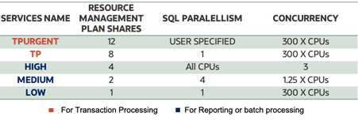

# Introduction

## About this Workshop

Resource Managers or Consumer Groups or Service names are the integral part of Autonomous Databases as they manage the workload based on the performance characteristics of the Application.
There are cases where we see a lot of application users misusing the consumer groups to their advantage and in doing so leading to performance overhead in the database.
We are going to show how to restrict users to certain consumer groups using database vault built into autonomous database.

Estimated Time: 25 minutes

### Objectives
In this workshop, you will:
* Deploy an Autonomous Database instance 
* Enable Database Vault in ADB-S
* Create a repository table which maps users with the consumer group
* Create function to validate User-Consumer group mapping
* Create a database vault rule that enforces the user access restriction for non-mapped users upon connecting to database.
### Prerequisites

* An Oracle Cloud Account - Please view this workshop's LiveLabs landing page to see which environments are supported.

## Learn more

* [Oracle Autonomous Database Documentation](https://docs.oracle.com/en/cloud/paas/autonomous-data-warehouse-cloud/index.html)
* [Additional Autonomous Database Tutorials](https://docs.oracle.com/en/cloud/paas/autonomous-data-warehouse-cloud/tutorials.html)

## Acknowledgements
* **Author** - Goutam Pal, Senior Cloud Engineer, NA Cloud Engineering
