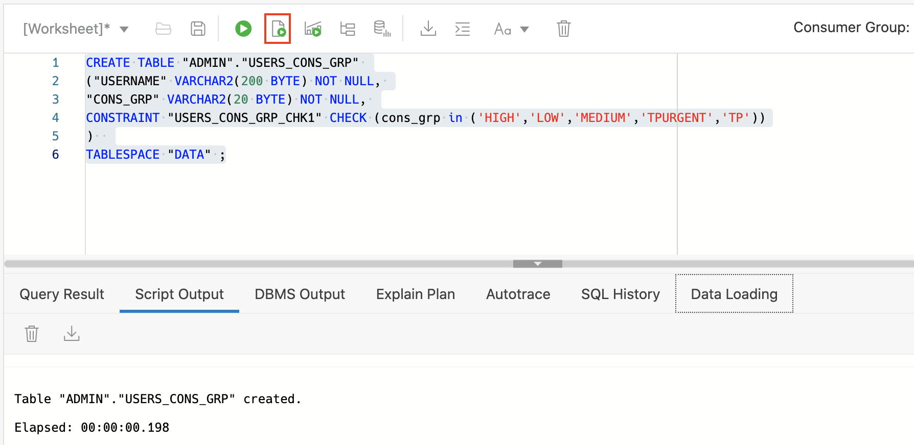
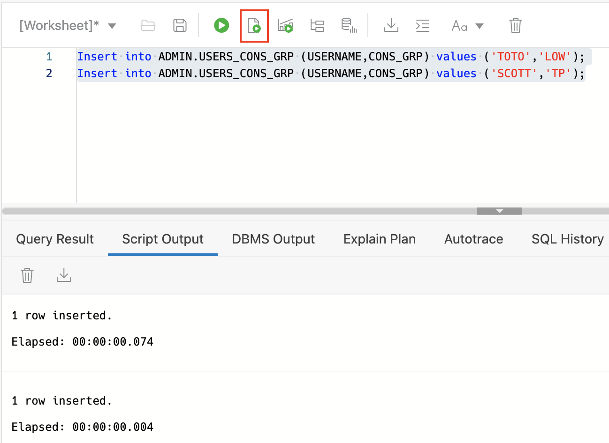
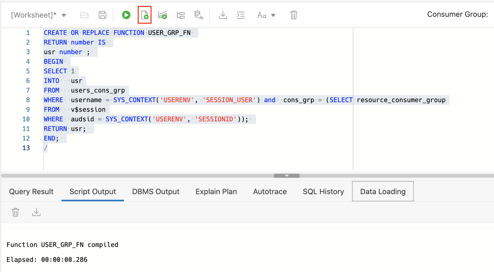
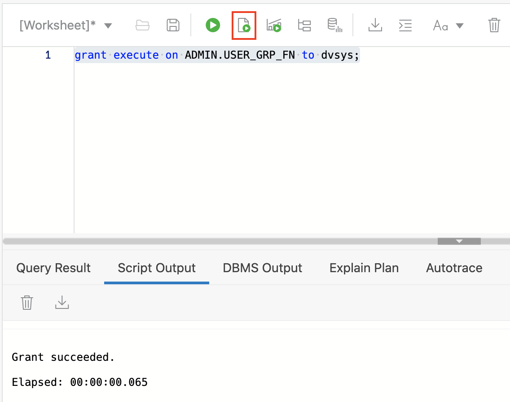

# Mapping Users to Consumer Groups in Autonomous Database

## Introduction

In this lab, we will be creating a repository table in an Autonomous database that maps the user to the consumer group and a PL/SQL function to validate the user session on connect.

Estimated Time: 5 minutes

### Objectives

In this lab, you will:

-   Create Repository Table in ADB-S
-   Create function to validate User-Consumer group mapping

### Prerequisites

This lab assumes you have:

- Enabled database vault in Autonomous Database in the previous lab.

## Task 1: Create Repository Table in ADB-S

1.  Now that we have Database Vault enabled, we are going to create a repository table “USERS\_CONS\_GRP” which maps the user with the consumer group. You can add any number of users and map it to any consumer group or groups as required. Users not included in the table will not be part of Database Vault filter and will have access to all the consumer groups as provided by default.

    ---

        
        <copy>CREATE TABLE "ADMIN"."USERS_CONS_GRP" 
        ("USERNAME" VARCHAR2(200 BYTE) NOT NULL, 
        "CONS_GRP" VARCHAR2(20 BYTE) NOT NULL, 
        CONSTRAINT "USERS_CONS_GRP_CHK1" CHECK (cons_grp in ('HIGH','LOW','MEDIUM','TPURGENT','TP'))
        )  
        TABLESPACE "DATA" ;

    

2. Lets add two users “SCOTT” and “TOTO” and map it to respective consumer group “TP” and “LOW” services.

    ---

        <copy>Insert into ADMIN.USERS_CONS_GRP (USERNAME,CONS_GRP) values ('TOTO','LOW');
        Insert into ADMIN.USERS_CONS_GRP (USERNAME,CONS_GRP) values ('SCOTT','TP');

    

3. Lets check the repository table contents

    ---
        <copy>Select * from USERS_CONS_GRP

    

## Task 2: Create function to validate User Consumer group mapping

1. Create function “USER\_GRP\_FN” to provide true value when session user fulfils mapped consumer group. We will use this function in database vault rule.

    ---
        <copy>CREATE OR REPLACE FUNCTION USER_GRP_FN 
        RETURN number IS 
        usr number ; 
        BEGIN 
        SELECT 1
        INTO   usr
        FROM   users_cons_grp
        WHERE  username = SYS_CONTEXT('USERENV', 'SESSION_USER') and  cons_grp = (SELECT resource_consumer_group
        FROM   v$session
        WHERE  audsid = SYS_CONTEXT('USERENV', 'SESSIONID')); 
        RETURN usr; 
        END; 
        /

    

2. Grant execute on the function to DVSYS user.

    ---
        <copy>grant execute on ADMIN.USER_GRP_FN to dvsys;

    

You may now **proceed to the next lab**.

## Learn more

* [Oracle Autonomous Database Documentation](https://docs.oracle.com/en/cloud/paas/autonomous-data-warehouse-cloud/index.html)
* [Additional Autonomous Database Tutorials](https://docs.oracle.com/en/cloud/paas/autonomous-data-warehouse-cloud/tutorials.html)

## Acknowledgements
* **Author** - Goutam Pal, Senior Cloud Engineer, NA Cloud Engineering
* **Last Updated By/Date** - Kamryn Vinson, April 2022
