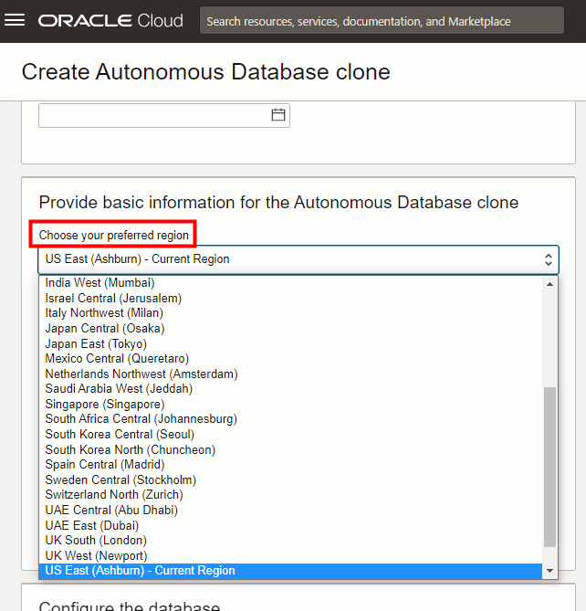


# Create a Clone from a Backup Database

## Introduction

One of the most widely used features in Autonomous Database on Shared Infrastructure (ADB-S) is the ability to clone your database, no matter how big or small, with little to no effort.

A previous lab showed how to create a **refreshable** clone from the **currently running** database. This lab shows how to create a **full** clone from a **backup** timestamp of that database.

In addition, you will see how to create that clone from backup as a **cross-region** clone, if your tenancy is subscribed to multiple regions.

  

Estimated Lab Time: 5 minutes

### Objectives

In this lab, you'll:

- Create a clone from a backup database.
- Examine how to create a clone from backup as a cross-region clone.

## Task 1: Navigate to Clone Creation

1. Return to the Autonomous Database details page of your source database. From the **More actions** drop-down menu, select **Create clone**.

    

## Task 2: Create a Clone Database from a Backup Timestamp of your Database

You will create a full clone database from a backup timestamp of your currently running primary database.

1. The Create Autonomous Database clone dialog appears. For **Choose a clone type**, accept the default **Full Clone**. Note the text describing it; you are creating a new database with the source database's data and metadata.

    

2. For **Clone source**, note that the default selection is **Clone from database instance**. Instead, select **Clone from a backup**. More selection fields appear in the **Clone source** area.

In the **Backup clone type** area, you can choose a **Point in time clone**, **Select the backup from a list**, or simply choose the **Latest backup timestamp.**

   

3. In the **Backup clone type** area, click **Select the backup from a list**. A list of backups appear. Choose one of the backups to create the clone.

    **Note:** Backups are created daily. In this lab environment, you may not yet have any backups listed if you recently created your autonomous database.

    

4. Provide the required information to create the clone database. The preferred region by default is your current region. Provide a display name and database name. Fill the other sections of this screen as you did in the earlier lab on provisioning an autonomous database:
- Configure the Database
- Create administrator credentials
- Choose network access
- Choose license and Oracle Database edition
- Provide contacts for operational notifications and announcements

    Click **Create Autonomous Database clone**.

    

5. When the clone finishes provisioning, check the clone information in the Autonomous Database details page.

    

## Task 3: Examine How to Create a Clone from Backup in a Remote Region

If your tenancy subscribes to multiple regions, you can clone across regions from any of your selected database backups. When creating your cross-region clone, you can easily select the remote region to which you wish to clone from backup. You may clone a database from any available backup timestamp within the last 60 days to any region to which your tenancy is subscribed.

1. Let's take a look back at the **Create Autonomous Database clone** dialog. In the **Provide basic information for the Autonomous Database clone** section, the **Choose your preferred region** field defaults to your current region. To create a cross-region clone, simply open this field and choose among the regions to which your tenancy subscribes.

    

## Learn More

- ADW Documentation: [Clone an Autonomous Database from a Backup](https://docs.oracle.com/en/cloud/paas/autonomous-database/adbsa/autonomous-clone-backup.html#GUID-20D2D970-0CB4-472F-BF89-1EE769BFB5E8) 

## Acknowledgements

- **Author** - Rick Green, Principal Developer, Database User Assistance
- **Last Updated By/Date**  - Rick Green, March 2023
