# Secure Your Data Using Oracle Data Safe

## Introduction

This lab introduces you to the features of Oracle Data Safe. You will prepare your environment in Oracle Cloud Infrastructure for the lab, register your Autonomous Database with Oracle Data Safe, and discover sensitive data.

You can do this lab in Oracle's free tier with trial credits, in your own tenancy using a paid Oracle Cloud account, or in an Oracle-provided environment, such as LiveLabs.

Estimated Lab Time: 35 minutes (25 minutes if you are running this workshop in an **Oracle LiveLabs sandbox** hosted environment)

Watch the video below for a quick walk-through of the lab.
[Secure Your Data Using Oracle Data Safe](videohub:1_ylchywlp)

### About Oracle Data Safe

Oracle Data Safe is Oracle’s platform for securing data in databases. As a native Oracle Cloud Infrastructure service, Oracle Data Safe lets you assess the security of your database configurations, find your sensitive data, mask that data in non-production environments, discover the risks associated with database users, and monitor database activity.

Watch a preview of "*Introduction to Oracle Data Safe (June 2022)*" [](youtube:UUc26bpdFnc)

### Objectives

In this lab, you will:

- Create a user group and add an Oracle Cloud account to the group
- Create an IAM policy for the user group
- (If using LiveLabs Sandbox reservation only) View your LiveLabs reservation information and sign in
- Access Oracle Database Actions
- Load sample data into your database
- Register your database with Oracle Data Safe
- Access Oracle Data Safe and view your list of registered target databases
- Discover sensitive data in your target database using Data Discovery
- Analyze the sensitive data model

### Prerequisites

This lab assumes you have:

- Obtained an Oracle Cloud account and signed in to the Oracle Cloud Infrastructure Console at `https://cloud.oracle.com`
- Performed the previous lab on provisioning an Oracle Autonomous Database

## Task 1: Create a user group and add an Oracle Cloud account to the group

*Note: If you are running this workshop in an Oracle LiveLabs sandbox hosted environment, please skip Tasks 1 and 2, as their steps have already been performed for you in the hosted environment.*

As a tenancy administrator, create a user group and add an Oracle Cloud account to the group.

1. From the navigation menu, select **Identity & Security**, and then **Groups**.

    The **Groups** page in IAM is displayed.

2. Click **Create Group**.

    The **Create Group** dialog box is displayed.

3. Enter a name for the group, for example, `dsg01` (short for Data Safe group 1).

4. Enter a description for the group, for example, **User group for data safe user 1**. A description is required.

5. (Optional) Click **Show Advanced Options** and create a tag.

6. Click **Create**.

    The **Group Details** page is displayed.

7. Under **Group Members**, click **Add User to Group**.

    The **Add User to Group** dialog box is displayed.

8. From the drop-down list, select the user for this workshop (perhaps you are using the **admin** user to run this workshop), and then click **Add**.

    The user is listed as a group member.


## Task 2: Create an IAM policy for the user group

> **Note**: If you are running this workshop in an **Oracle LiveLabs sandbox** hosted environment, please skip Tasks 1 and 2, as their steps have already been performed for you in the hosted environment.

As a tenancy administrator, create an IAM policy that grants the user permission to create and manage all Oracle Data Safe resources and an Autonomous Database in the user's compartment.

1. From the navigation menu, select **Identity & Security**, and then **Policies**.

    The **Policies** page in IAM is displayed.

2. On the left under **COMPARTMENT**, leave the **root** compartment selected.

3. Click **Create Policy**.

    The **Create Policy** page is displayed.

4. Enter a name for the policy. It is helpful to name the policy after a group name, for example, `dsg01 `.

5. Enter a description for the policy, for example, **Policy for Data Safe group 1**.

6. From the **COMPARTMENT** drop-down list, leave the **root** compartment selected.

7. In the **Policy Builder** section, move the **Show manual editor** slider to the right to display the policy field.

8. In the policy field, enter the following policy statements. Substitute `{group name}` and `{compartment name}` with the appropriate values.

    ```
    <copy>
    Allow group {group name} to manage data-safe-family in compartment {compartment name}
    Allow group {group name} to manage autonomous-database in compartment {compartment name}
    </copy>
    ```

    The first statement allows the user group to register an Oracle Database with Oracle Data Safe and create and manage Oracle Data Safe resources in the specified compartment. The second statement allows the user group to create an Autonomous Database in the specified compartment and use it with Oracle Data Safe.

9. Click **Create**.

## Task 3: Load Sample Data Into Your Database

As the `ADMIN` user on the database, run the `load-data-safe-sample-data_admin.sql` SQL script to load sample data into your database. This script creates several tables with sample data that you can use to practice with the Oracle Data Safe features. It also generates database activity for the `ADMIN` user.

1. Download the [**load-data-safe-sample-data_admin.sql**](https://objectstorage.us-ashburn-1.oraclecloud.com/p/AUKfPIGuTde04z4OnuaZN2EP0LxNl4hJWI2jZiTw23aWzSoa2_Byvs8OGPw20-dt/n/c4u04/b/livelabsfiles/o/security-library/load-data-safe-sample-data_admin.sql) script and open it in a text editor, such as NotePad.

2. Navigate back to your database's **Autonomous Database Details** page, and click the **Database actions** button. Sign in with the username `ADMIN`. Use the `ADMIN` password you specified when you created the database. From the **Database Actions Launchpad**, in the **Development** section, click **SQL**.

3. Copy the entire script to the clipboard and paste it into the worksheet in Database Actions. The last line of the script is as follows:

     `select null as "End of script" from dual;`

4. On the toolbar, click the **Run Script** button and wait for the script to finish running.

    

    - The script takes a few minutes to run.
    - In the bottom-left corner, the cog wheel may remain still for about a minute, and then it turns as the script is processed. The script output is displayed after the script is finished running.
    - Don't worry if you see some error messages on the **Script Output** tab. These are expected the first time you run the script.
    - The script ends with the message **END OF SCRIPT**.

5. To ensure the sample data is loaded successfully, at the end of the script output, review the row count for each table in the `HCM1` schema. The counts should be as follows:

    - `COUNTRIES` - 25 rows
    - `DEPARTMENTS` - 27 rows
    - `EMPLOYEES` - 107 rows
    - `EMP_EXTENDED` - 107 rows
    - `JOBS` - 19 rows
    - `JOB_HISTORY` - 10 rows
    - `LOCATIONS` - 23 rows
    - `REGIONS` - 4 rows
    - `SUPPLEMENTAL_DATA` - 149 rows


    If your results are different than what is specified above, rerun the [load-data-safe-sample-data_admin.sql](https://objectstorage.us-ashburn-1.oraclecloud.com/p/VEKec7t0mGwBkJX92Jn0nMptuXIlEpJ5XJA-A6C9PymRgY2LhKbjWqHeB5rVBbaV/n/c4u04/b/livelabsfiles/o/data-management-library-files/load-data-safe-sample-data_admin.sql) script.

6. Refresh Database Actions: Refresh the _browser's_ page and then verify that the `HCM1` schema is listed in the first drop-down list on the **Navigator** pane.

    >- **Note**: It is important that you refresh the **browser page**, not just click the refresh circular arrow icon in the SQL Worksheet, to see the new schemas like `HCMI` that were just created.

7. Leave the **SQL | Oracle Database Actions** tab open because you return to it throughout this workshop. Return to the **Autonomous Database | Oracle Cloud Infrastructure** tab.

## Task 4: Register Your Autonomous Database With Oracle Data Safe

To use a database with Oracle Data Safe, you first need to register it with Oracle Data Safe. A registered database is referred to as a _target database_ in Oracle Data Safe.

After registering an Autonomous Database, you can grant and revoke roles from the Oracle Data Safe service account on your Autonomous Database to control which Oracle Data Safe features you can use with the database. You need to register your Autonomous Database before granting roles because registration unlocks the Oracle Data Safe pre-seeded service account on your target database. Keep in mind that the roles for Autonomous Databases are different than those for non-Autonomous Databases. For non-Autonomous Databases, you can grant roles before or after registering your database.
- For an **Oracle Autonomous Database Serverless**, which is what we are using in this workshop, all Oracle Data Safe roles are granted by default during registration, except for the Data Masking role (`DS$DATA_MASKING_ROLE`).

**Assumption**: Your data values are most likely different than those shown in the screenshots.

If you plan to use a database other than an Oracle Autonomous Database for this workshop, please follow the registration instructions specific for your database type in the _Administering Oracle Data Safe_ guide. See the **Learn More** section at the bottom of this page.

1. Return to the **Autonomous Database | Oracle Cloud Infrastructure** browser tab. You last left off on the **Autonomous Database Details** page.

    If you navigated away from this page: From the navigation menu, select **Oracle Database**, and then **Autonomous Data Warehouse**. Select your compartment (if needed), and then click the name of your database.

2. Scroll down the page, and then under **Data Safe**, click **Register**.

    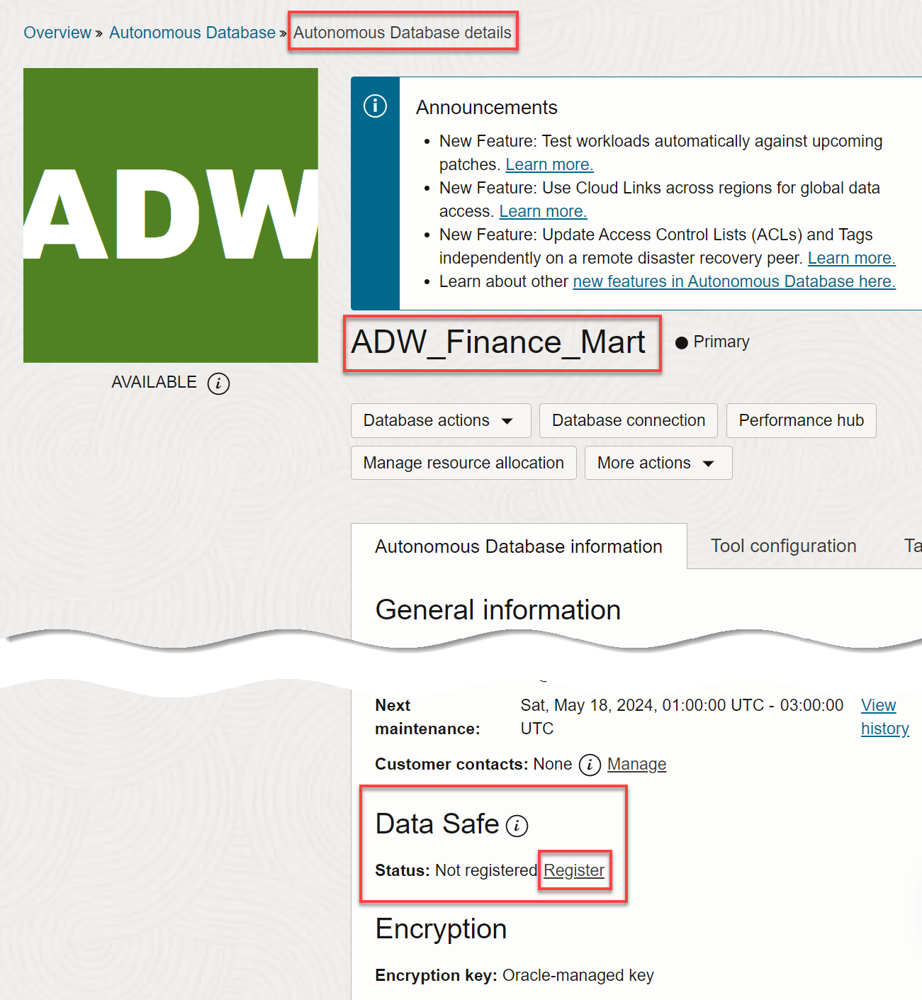

3. In the **Register Database with Data Safe** dialog box, click **Confirm**.

    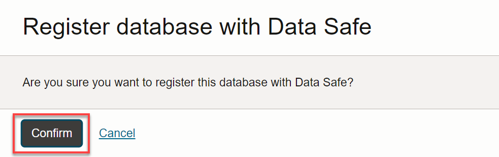


4. Wait for the registration process to finish and for the status to change to **Registered**.

    

## Task 5: Access Oracle Data Safe And View Your List Of Registered Target Databases

1. Return to the **Autonomous Database | Oracle Cloud Infrastructure** browser tab.

2. From the navigation menu, select **Oracle Database**, and then **Data Safe**.

    The **Overview** page for the Oracle Data Safe service is displayed. On this page, you can access Security Center, register target databases, and find links to useful information.

3. On the left, click **Target Databases**.

4. From the **Compartment** drop-down list under **List Scope**, select your compartment. Optionally, deselect **Include child compartments**. Your registered target database is listed on the right.

    - A target database with an **ACTIVE** status means that it is currently registered with Oracle Data Safe.
    - A target database with a **DELETED** status means that it is no longer registered with Oracle Data Safe. The listing is removed after 45 days.

    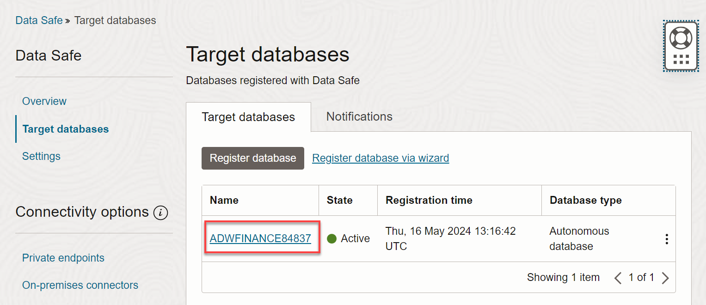

5. Click the name of your target database to view its registration details. The **Target Database Details** page is displayed.

    - You can view/edit the target database name and description.
    - You can view the Oracle Cloud Identifier (OCID), when the target database was registered, the compartment name to where the target database was registered, the database type (Autonomous Database), and the connection protocol (TLS). The information varies depending on the target database type.
    - You have options to edit connection details (change the connection protocol), move the target database registration to another compartment, deregister the target database, and add tags.

    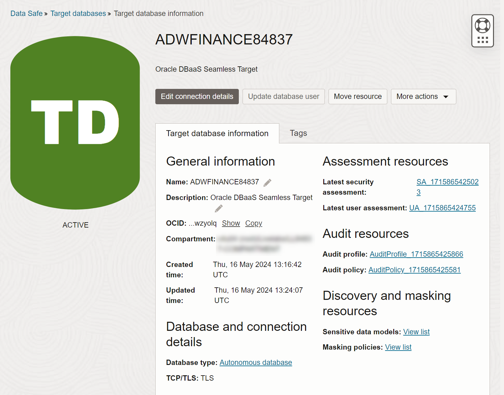

## Task 6: Discover Sensitive Data In Target Database Using Data Discovery

Data Discovery helps you find sensitive data in your target databases. You tell Data Discovery what kind of sensitive data to search for, and it inspects the actual data in your target database and its data dictionary, and then returns to you a list of sensitive columns. By default, Data Discovery can search for a wide variety of sensitive data pertaining to identification, biographic, IT, financial, healthcare, employment, and academic information.

Start by examining sensitive data in one of the tables on your target database by using Oracle Database Actions. Then, use Oracle Data Safe to discover sensitive data on your target database and generate a sensitive data model that lists sensitive columns in your target database.

1. Make sure that you are on the browser tab for Oracle Data Safe. If needed, sign in again.

2. In the breadcrumb at the top of the page, click **Data Safe**.

3. On the left under **Security Center**, click **Data Discovery**.

4. From the **Compartment** drop-down list, select your compartment.

    A Data Discovery dashboard is displayed with statistics for the top five target databases in your compartment. Your dashboard is most likely empty because this is the first time you are using Data Discovery in this workshop.

    

5. Click **Discover Sensitive Data**.

    The **Create Sensitive Data Model** page is displayed.

6. On the **Provide Basic Information** page, do the following, and then click **Next**.

    - In the **Name** box, enter **SDM1**.
    - Leave the compartment set to your compartment.
    - In the **Description** box, enter **Sensitive Data Model 1**.
    - Select your target database

    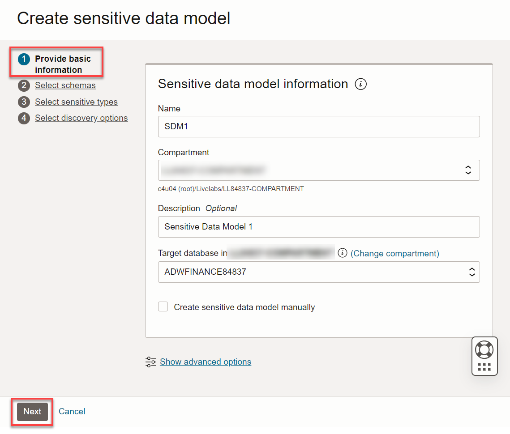

7. On the **Select Schemas** page, leave **Select specific schemas only** selected. Scroll down and select the **HCM1** schema, and then click **Next**. You might need to click the right arrow button at the bottom of the page to navigate to page 2.

    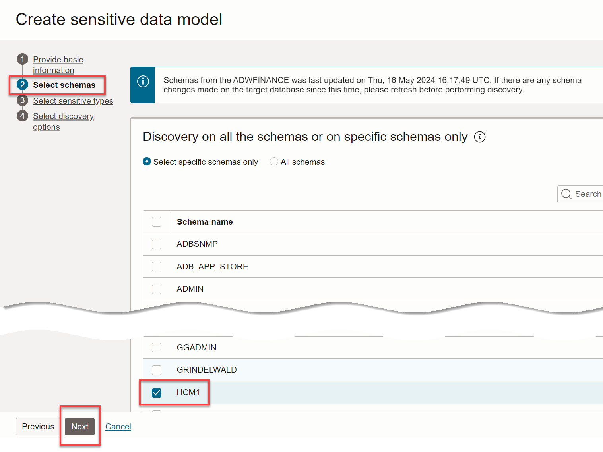

8. On the **Select Sensitive Types** page, expand all of the sensitive categories by moving the **Expand All** slider to the right. Scroll down the page and review the sensitive types. Notice that you can select individual sensitive types, sensitive categories, and all sensitive types at one time. At the top of the page, select the **All** check box, and then click **Next**.

    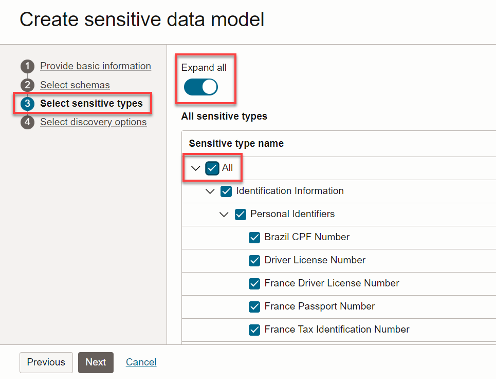

9. On the **Select Discovery Options** page, select **Collect, display and store sample data**, and then click **Create Sensitive Data Model** at the bottom of the page to begin the data discovery process.

    

10. Wait for the sensitive data model to be created. The **Sensitive Data Model Details** page is displayed.

## Task 7: Analyze The Sensitive Data Model

1. Review the information on the **Sensitive Data Model Details** page.

    - The **Sensitive Data Model Information** tab lists information about your sensitive data model, including its name and Oracle Cloud Identifier (OCID), the compartment to which you saved it, the date and time when it was created and last updated, the target database associated with it, and totals for discovered sensitive schemas, sensitive tables, sensitive columns, sensitive types, and sensitive values.
    - You can click the **View Details** link to view the work request information.
    - The pie chart compares the number of sensitive values per sensitive category and sensitive type.
    - The **Sensitive Columns** table lists the discovered sensitive columns. By default, the table is displayed in **Flat View** format. For each sensitive column, you can view its schema name, table name, column name, sensitive type, parent column, data type, estimated row count, and sample data (if you chose to retrieve sample data and if it exists). Review the sample data to get an idea of what it looks like.

    
    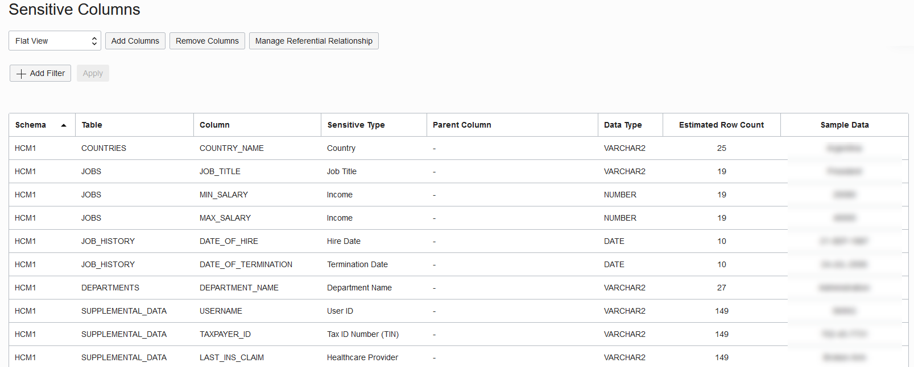

2. Position your mouse over the **Identification Information** category in the chart to view its value. Your percentage value may be different than the value shown in the screenshot.

    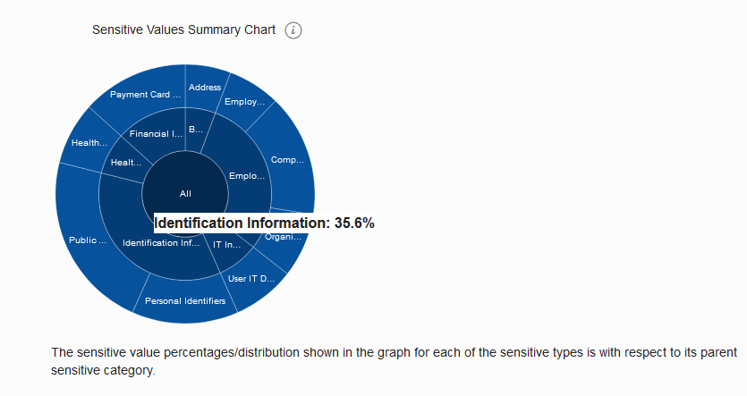

3. With your mouse still over **Identification Information**, click the pie slice to drill down. Notice that the **Identification Information** category is now divided into two smaller categories (**Personal Identifiers** and **Public Identifiers**).

    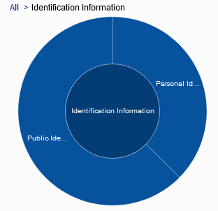

4.  To drill-up, click the **All** link in the chart's breadcrumb.

5. Under **Sensitive Columns**, from the drop-down list, select **Sensitive Type View** to sort the sensitive columns by sensitive type. By default, all items are expanded in the view. You can collapse the items by moving the **Expand All** slider to the left.

    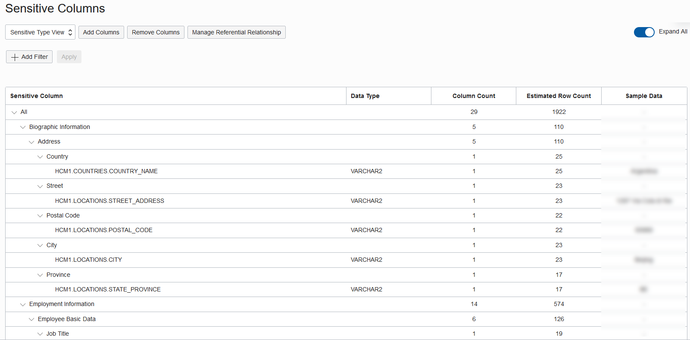

6. From the drop-down list, select **Schema View** to sort the sensitive columns by table name.

    - If a sensitive column was discovered because it has a relationship to another sensitive column as defined in the database's data dictionary, the other sensitive column is displayed in the **Parent Column**. For example, `MANAGER_ID` in the `DEPARTMENTS` table has a relationship to `EMPLOYEE_ID` in the `EMPLOYEES` table.

    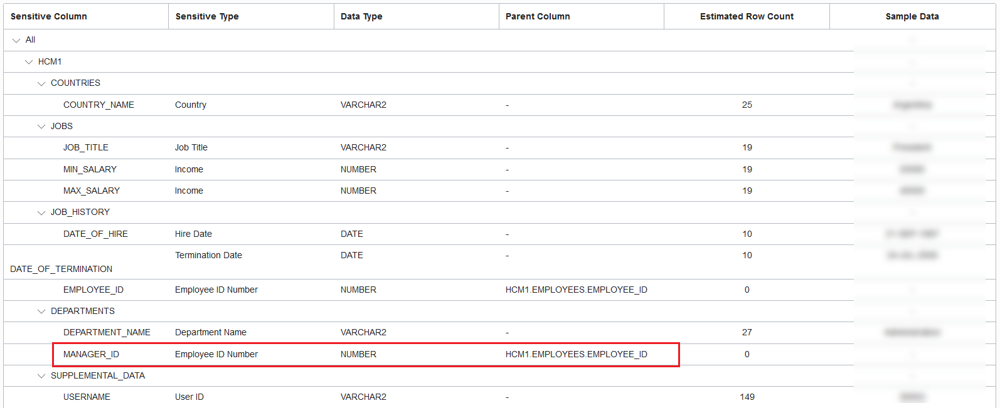

## Want to Learn More?

The following links provide more information about Oracle Data Safe:

- [In-depth 2-hour workshop including data masking: Get Started with Oracle Data Safe Fundamentals](https://apexapps.oracle.com/pls/apex/f?p=133:180:13269576864925::::wid:598)
- [Oracle Data Safe website](https://www.oracle.com/database/technologies/security/data-safe.html)
- [Oracle Data Safe user assistance](https://docs.oracle.com/en/cloud/paas/data-safe/index.html)
- [Oracle Data Safe data sheet](https://www.oracle.com/a/tech/docs/dbsec/data-safe/ds-security-data-safe.pdf)
- [Oracle Data Safe frequently asked questions](https://www.oracle.com/a/tech/docs/dbsec/data-safe/faq-security-data-safe.pdf)
- [Target Database Registration](https://www.oracle.com/pls/topic/lookup?ctx=en/cloud/paas/data-safe&id=ADMDS-GUID-B5F255A7-07DD-4731-9FA5-668F7DD51AA6)
- [Data Discovery](https://docs.oracle.com/en-us/iaas/data-safe/doc/data-discovery.html)

## Acknowledgements

- **Author** - Jody Glover, Consulting User Assistance Developer, Database Development
- **Adapted by** - Rick Green, Principal User Assistance Developer, Database Development
- **Last Updated By/Date** - Rick Green, June, 2023
