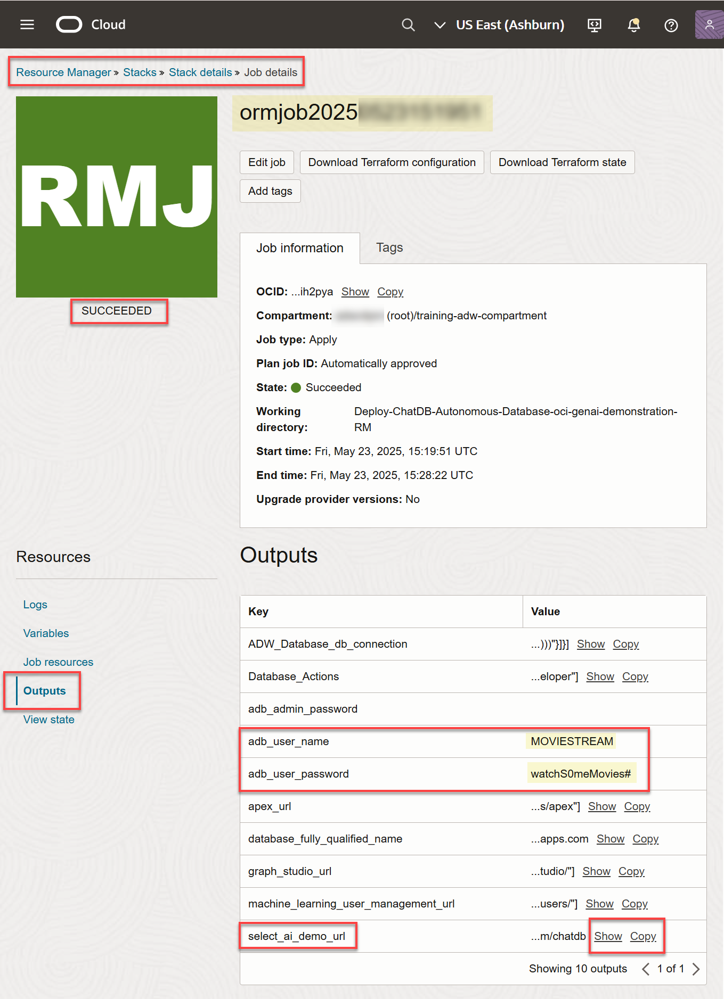
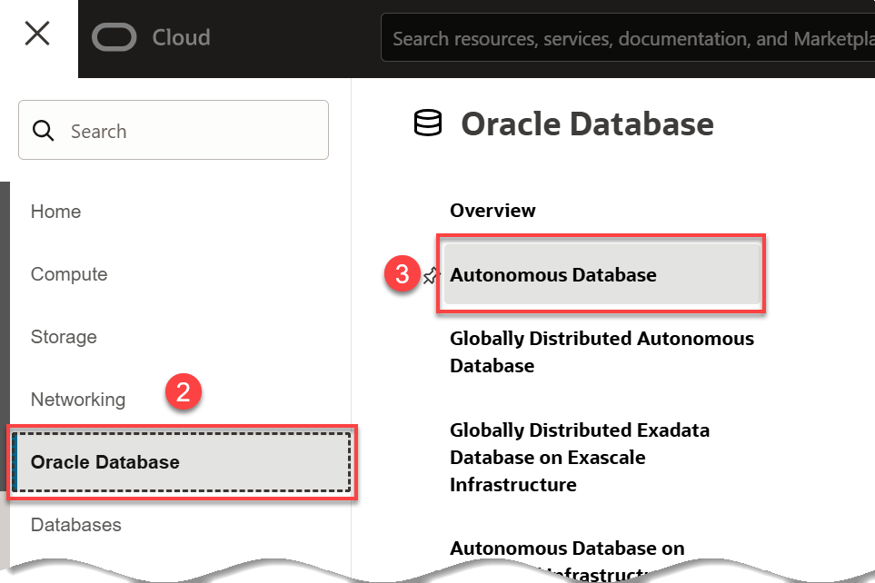
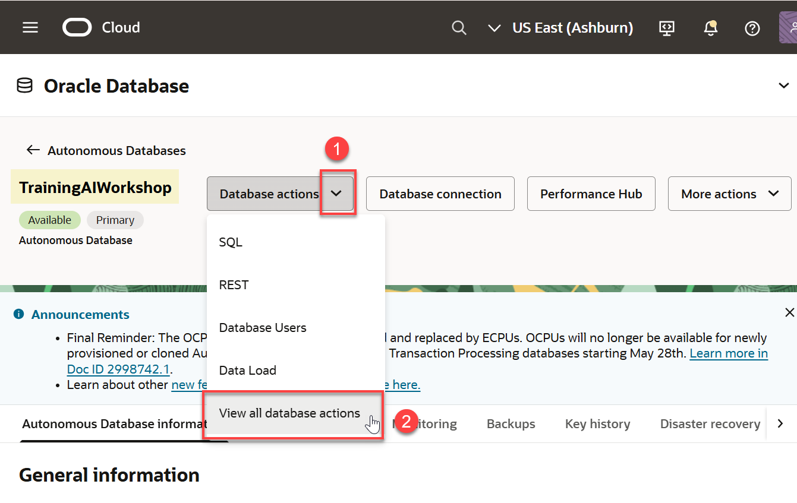
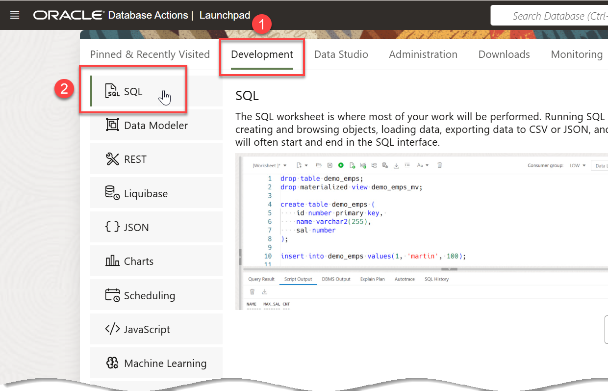
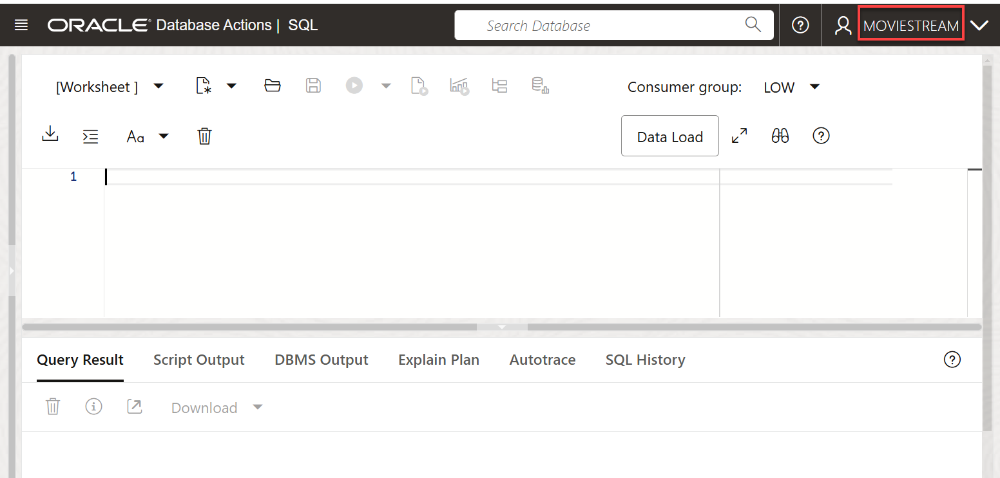
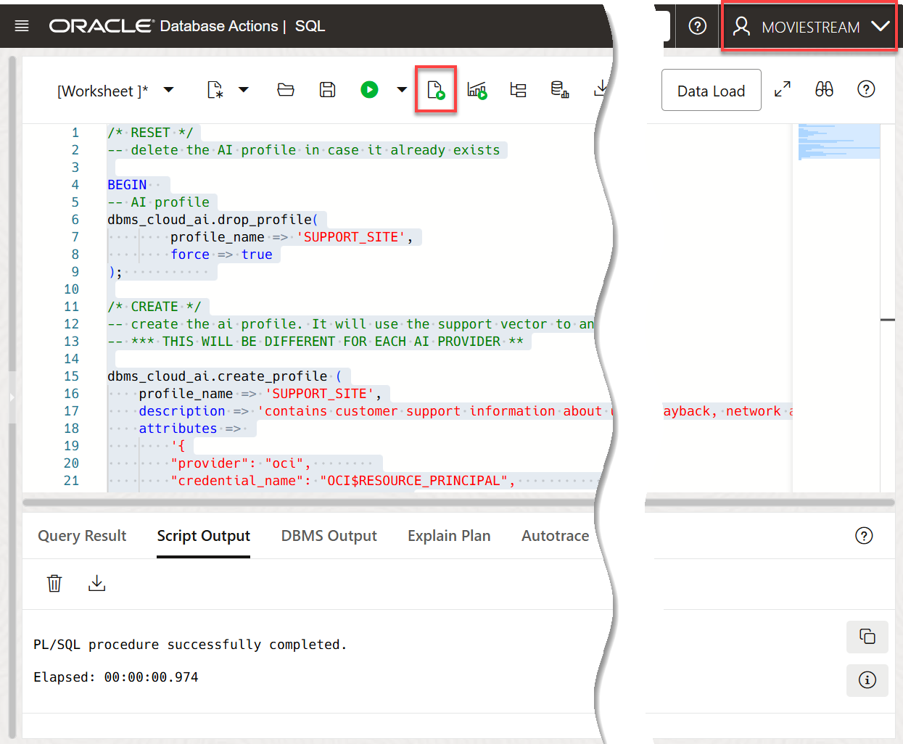
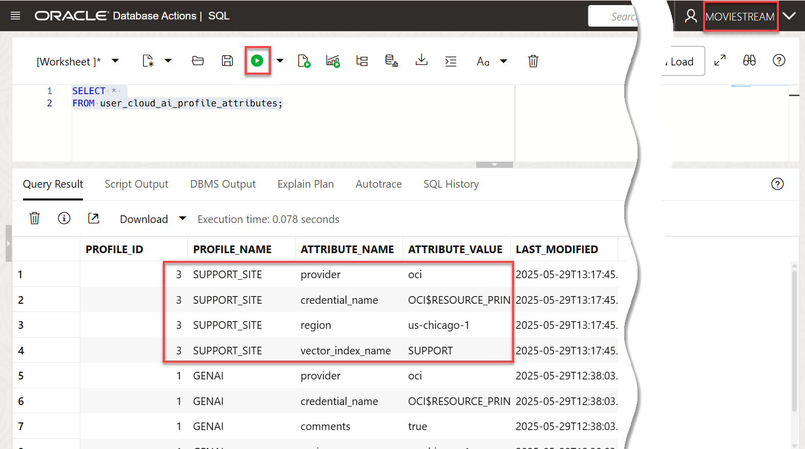

# Create an AI Profile and a Vector Index

## Introduction

LLMs can produce incredibly creative responses to prompts, generate SQL from natural language, and so much more. In order to be most effective, you want to leverage LLMs with your organization's private data. The first step is to integrate your models with Autonomous AI Database.

You can use different LLMs with Autonomous AI Database. This lets you pick the best model for your use case. Select AI profiles encapsulate the connections to each model; you specify which profile to use when generating results. In this lab, you will enable the user **`MOVIESTREAM`** to connect to models from Oracle OCI GenAI, Azure OpenAI and Google Gemini.

Estimated Time: 10 minutes.

### Objectives

In this lab, you will:
* Connect Autonomous AI Database to an AI provider
* Test the AI profile

### Prerequisites

* This lab requires the completion of the previous labs that deployed your Autonomous AI Database.

## Task 1: Log into the SQL Worksheet

>**Note:** The **`MOVIESTREAM`** user and its tables were created as part of the setup. You can find the **`MOVIESTREAM`** user password by navigating to **Developer Services** from the Navigation menu. Next, click **Resource Manager** > **Stacks** > Select the stack that was created for you, **Deploy-ChatDB-Autonomous-Database...** > Select the job that was created for you, **ormjob2025...** > Click **Outputs** in the **Resources** section.



1. If you are not logged in to Oracle Cloud Console, log in and select **[](var:db_workload_type)** from the Navigation menu.

    

    

2. Make sure you are in the correct compartment where you ADB instance was provisioned and then click your **TrainingAIWorkshop** instance.

    

3. On your **TrainingAIWorkshop** Autonomous AI Database details page, click the **Database Actions** drop-down list, and then select **View all database actions**.

    

    Logging in from the OCI service console requires you to be the **`ADMIN`** user. Log in as the **`ADMIN`** user if you are not automatically logged in.
    
    * **Username:** **`ADMIN`**
    * **Password:** *your-password* (e.g. **`WlsAtpDb1234#`**)

4. The **Database Actions** page is displayed. Click the **Development** tab, and then click the **SQL** tab.

    

5. The first time you open SQL Worksheet, a series of pop-up informational boxes may appear. Click the **Tour** icon (binoculars) in the upper right corner to get a tour that introduces the main features. Close the boxes.

    

    You can expand the SQL Worksheet editor area by collapsing the left navigation area.

    

6. We'll run the SQL analytics as the **`MOVIESTREAM`** user. Sign out of the **`ADMIN`** user. Click the the drop-down list next to the **`ADMIN`** user in the banner, and then click **Sign Out**.
    
    

7. Log in to the SQL Worksheet using the following credentials, and then click **Sign in** to display the **Database Actions Launchpad**.

    * **Username:** **`MOVIESTREAM`**
    * **Password:** **`your-password`** (e.g. **`watchS0meMovies#`**)

    

8. The **Database Actions Launchpad** page is displayed. Click the **Development** tab if not already selected, and then click the **SQL** tab.

    

    The SQL Worksheet is displayed. Close the **Run Statement** informational box.

    

## Task 2: Review the Moviestream Internal Support Website

1. Navigate to and review the **MOVIESTREAM** internal support Web site. Click the following URL.

   https://objectstorage.us-ashburn-1.oraclecloud.com/n/c4u04/b/building_blocks_utilities/o/support-site/index.html

2. Explore the Web site as desired. For example, to see the list of account and billing issues, click the **Account & Billing Issues** menu.

    

3. Ensure that you are signed in as the **`moviestream`** user. Review the files in the public object storage bucket that comprise the moviestream support web site. Copy the following code and then paste it into your SQL Worksheet. Next, click the **Run Statement** icon in the toolbar.

    ```sql
    <copy>
    SELECT object_name, bytes
    FROM dbms_cloud.list_objects(
        location_uri => 'https://objectstorage.us-ashburn-1.oraclecloud.com/n/c4u04/b/building_blocks_utilities/o/support-site/'
    );
    </copy>
    ```

    

## Task 3: Connect Autonomous AI Database to an AI Provider

### Background

There are 4 things to do in order to connect Autonomous AI Database to an AI provider:

1. Grant the **`MOVIESTREAM`** user network access to the AI provider endpoint
2. Create a credential containing the secret used to sign requests to the AI provider
3. Create a Select AI profile (see below for more details)

>**Note:** The three steps above have already been done for accessing OCI GenAI when you deployed your Autonomous AI Database. You can review the deployment steps below. You will need to execute these steps when connecting to non-Oracle AI providers.

A Select AI profile encapsulates connection information for an AI provider and vector search. This includes:

1. A security credential (e.g. the resource principal for OCI GenAI or a credential that captures a secret for a 3rd party AI provider)
2. The name of the provider
3. The name of the LLM (optional) used to process the natural language request
4. The name of the embedding model (optional) that will create the vectors from the source data
5. A vector index

For a complete list of the Select AI profile attributes, see the [DBMS\_CLOUD\_AI\_Package] (https://docs.oracle.com/en/cloud/paas/autonomous-database/serverless/adbsb/dbms-cloud-ai-package.html#GUID-D51B04DE-233B-48A2-BBFA-3AAB18D8C35C) in the Using Oracle Autonomous AI Database Serverless documentation.

### **Connect to one of the following AI providers using each provider's default model**

The following examples will use the default models for OCI and Google. For Azure, there is no default. You need to pick the Azure resource and deployment.

For Azure, there are two models that needs to be selected:

1. A deployment name
2. An embedding deployment name

The following applies to all AI providers in this workshop, not just OCI GenAI. The script is using the default models for OCI; however, you can override the defaults if you like. There are two models that are required:

1. An **embedding model**. For example, the  profile attribute for OCI could be **`embedding_model":"cohere.embed-english-v3.0"`** which encodes the question as a vector to be used for similarity search.
2. **LLM model**. The LLM that answers your request (language). For example, the profile attribute for OCI could be **`"model":"meta.llama-3.1-70b-instruct"`**.

When you use the defaults, Select AI will always choose the latest/best model for processing the request.

For additional information, see the following documentation resources:

* [Pretrained Foundational Models in Generative AI](https://docs.oracle.com/en-us/iaas/Content/generative-ai/pretrained-models.htm)

* [Select AI with Retrieval Augmented Generation (RAG)](https://docs.oracle.com/en/cloud/paas/autonomous-database/serverless/adbsb/select-ai-retrieval-augmented-generation.html#GUID-6B2A810B-AED5-4767-8A3B-15C853F567A2)

* [Profile Attributes](https://docs.oracle.com/en/cloud/paas/autonomous-database/serverless/adbsb/dbms-cloud-ai-package.html#GUID-12D91681-B51C-48E0-93FD-9ABC67B0F375)

_To view the detailed steps for any of the following models, click the drill-down icon for a model._


<details>
    <summary>**OCI Generative AI** (default)</summary>

1. A policy must be created by the user.

    ```
    allow any-user to manage generative-ai-family in tenancy
    ```

    You need to use resource principal which is already enabled for the **`moviestream`** user in this workshop; therefore, _you don't need to run the following script_; however, if you do need to run it, make sure you are signed in as the **admin** user.

    ```
    exec dbms_cloud_admin.enable_resource_principal(username  => 'MOVIESTREAM');
    ```

### **Create the AI profile**

1. Make sure you are still logged in to your SQL Worksheet as the **`moviestream`** user. Create an AI profile named **SUPPORT_SITE**. Copy the following code and then paste it into your SQL Worksheet. Next, click the **Run Script** icon in the toolbar.

    ```sql
    <copy>
    /* RESET */
    -- delete the AI profile in case it already exists

    BEGIN  
    -- AI profile
    dbms_cloud_ai.drop_profile(
            profile_name => 'SUPPORT_SITE',
            force => true
    );           
    
    /* CREATE */
    -- create the ai profile. It will use the support vector to answer questions
    -- *** THIS WILL BE DIFFERENT FOR EACH AI PROVIDER **

    dbms_cloud_ai.create_profile (
        profile_name => 'SUPPORT_SITE',
        description => 'contains customer support information about using the moviestream application, including managing the account, playback, network and device compatibility issues',
        attributes =>
            '{
            "provider": "oci",
            "credential_name": "OCI$RESOURCE_PRINCIPAL",
            "region": "us-chicago-1",
            "vector_index_name": "SUPPORT"
            }'
    );
    END;
    </copy>
    ```
    >**Note:** The **region** attribute indicates the location of the Generative AI cluster that you want to use. The default region is **`us-chicago-1`**. If you are using another region such as Frankfurt, **`eu-frankfurt-1`**, replace the **`us-chicago-1`** region's attribute value in the above code with **`eu-frankfurt-1`**. For the current list of regions with OCI Generative AI, see [Regions with Generative AI](https://docs.oracle.com/en-us/iaas/Content/generative-ai/overview.htm).

    

</details>

<details>
    <summary>**Azure OpenAI**</summary>
You will need an Azure subscription and an [Azure OpenAI resource](https://learn.microsoft.com/en-us/azure/ai-services/openai/how-to/create-resource?pivots=web-portal) in order to use the GPT models. After creating the Azure OpenAI resource, navigate to the resource page and select **Resource Management -> Keys and Endpoint**. Copy its **Endpoint** (the server name only - not including "https://" or "/") and a **KEY**. For example, consider a resource named **openaigpt40** (your name will be different):


You will also need the Azure OpenAI deployment name. In that same portal page, navigate to **Resource Management -> Model Deployments** and click **Manage Deployments**. Copy the **Deployment name** for your GPT model.

1. Grant the **`MOVIESTREAM`** user network access to the Azure OpenAI resource endpoint.    
    ```sql
    <copy>
    BEGIN
    DBMS_NETWORK_ACL_ADMIN.APPEND_HOST_ACE(
        host => 'your-azure-openai-resource-endpoint',
        ace  => xs$ace_type(privilege_list => xs$name_list('http'),
                            principal_name => 'MOVIESTREAM',
                            principal_type => xs_acl.ptype_db)
    );
    END;
    /    
    </copy>
    ```

2. Create a credential.
    ```sql
    <copy>
    BEGIN                                                                          
    dbms_cloud.create_credential (                                                 
        credential_name => 'azure_openai_credential',                                            
        username => 'azure',                                                 
        password => 'your-api-key-goes-here'
    );                             
    END;                                                                           
    /  
    </copy>
    ```

3. Create a Select AI profile.
    ```sql
    <copy>
    BEGIN

    dbms_cloud_ai.create_profile (
      profile_name => 'SUPPORT_SITE',
      description => 'contains customer support information about using the moviestream application, including managing the account, playback, network and device compatibility issues',
      attributes => 
        '{
          "provider": "azure",        
          "credential_name": "azure_openai_credential",
          "azure_resource_name":"enter your azure resource name here", 
          "azure_deployment_name":"enter your azure openai deployment name",         
          "azure_embedding_deployment_name":"enter your openai embeding model name",
          "vector_index_name": "SUPPORT"
        }'      
    );  
    END;
    /
    </copy> 
    ```
</details>

<details>
    <summary>**Google Gemini**</summary>
You will need a [Google AI Studio account](https://ai.google.dev) and [an API key](https://aistudio.google.com/app/apikey) in order to use Google Gemini. 

1. Grant the **`MOVIESTREAM`** network access to the Google Gemini endpoint. 
    ```sql
    <copy>
    BEGIN
    DBMS_NETWORK_ACL_ADMIN.APPEND_HOST_ACE(
        host => 'generativelanguage.googleapis.com',
        ace  => xs$ace_type(privilege_list => xs$name_list('http'),
                            principal_name => 'MOVIESTREAM',
                            principal_type => xs_acl.ptype_db)
    );
    END;
    /    
    </copy>
    ```

2. Create a credential.
    ```sql
    <copy>
    BEGIN                                                                          
    dbms_cloud.create_credential (                                                 
        credential_name => 'gemini_credential',                                            
        username => 'google',                                                 
        password => 'your-api-key-goes-here'
    );                             
    END;                                                                           
    /  
    </copy>
    ```

3. Create a Select AI profile.
    ```sql
    <copy>
    begin    
        -- Drop the profile in case it already exists
        dbms_cloud_ai.drop_profile(
            profile_name => 'support_site',
            force => true
        );    

        -- Create an AI profile that uses the default Gemini model
    BEGIN
    dbms_cloud_ai.create_profile (
    profile_name => 'SUPPORT_SITE',
        description => 'contains customer support information about using the moviestream application, including managing the account, playback, network and device compatibility issues',
        attributes => 
        '{
          "provider": "google",
          "credential_name": "gemini_credential",
          "vector_index_name": "SUPPORT"
        }'      
    );  
    END;
    /  
    </copy> 
    ```
</details>

### **Review your Select AI profiles**

Now that you have created the profile, you can now query the available profiles as follows.

1. Query your available profiles. A **GENAI** profile was created by the set up script in **Lab 1**. In addition, you should now see the newly created **SUPPORT_SITE** profile. Copy the following code and then paste it into your SQL Worksheet. Next, click the **Run Statement** icon in the toolbar.

    ```sql
    <copy>
    SELECT *
    FROM user_cloud_ai_profiles;
    </copy>
    ```

    

2. Query your profiles attributes. Copy the following code and then paste it into your SQL Worksheet. Next, click the **Run Statement** icon in the toolbar.

    ```sql
    <copy>
    SELECT * 
    FROM user_cloud_ai_profile_attributes;
    </copy>
    ```

    

## Task 4: Create the Vector index

Select AI simplifies the creation and maintenance of a vector index that’s sourced from files on an object store. The **`dbms_cloud_ai.create_vector_index`** procedure will create a table containing the vector index. Then, it will create a pipeline that is used to populate the vector index and keep it up to date. The pipeline will run periodically; you can control how often it runs. For more details, see the [Select AI with Retrieval Augmented Generation (RAG)](https://docs.oracle.com/en/cloud/paas/autonomous-database/serverless/adbsb/select-ai-retrieval-augmented-generation.html#GUID-6B2A810B-AED5-4767-8A3B-15C853F567A2) documentation.

1. Create your vector index that points to the object storage location that contains the website files that you reviewed earlier. This will create a table containing the vector. The API call will also create a pipeline that loads the index and keeps it up to date. Copy the following code and then paste it into your SQL Worksheet. Next, click the **Run Script** icon in the toolbar.

    ```sql
    <copy>
    /* RESET */
    -- delete vector index in case it exists
    BEGIN  
    -- Vector index
    dbms_cloud_ai.drop_vector_index (
        index_name => 'SUPPORT',
        force => true
    );    

    -- Create the vector. This will create a table containing the vector.
    -- That API call will also create a pipeline that loads the index and keeps it up to date

    -- Create a vector index that points to the public object storage location that contains the website files. Since we are using a public object storage bucket; we don't to create a credential to access the public bucket.

    dbms_cloud_ai.create_vector_index(
        index_name  => 'SUPPORT',
        attributes  => '{"vector_db_provider": "oracle",
                        "location": "https://objectstorage.us-ashburn-1.oraclecloud.com/n/c4u04/b/building_blocks_utilities/o/support-site/",
                        "profile_name": "SUPPORT_SITE",
                        "vector_table_name":"support_site_vector",
                        "vector_distance_metric": "cosine"
                    }'
        );                                       
    END;                                                                           
    /  
    </copy>
    ```

    

2. A pipeline was created and you can query it. The pipeline runs periodically to update the vectors. Review the status table to see progress and vector details. Copy the following code and then paste it into your SQL Worksheet. Next, click the **Run Statement** icon in the toolbar.

    ```
    <copy>
    SELECT pipeline_id, pipeline_name, status, last_execution, status_table 
    FROM user_cloud_pipelines;
    </copy>
    ```

    

    >**Note:** It could take up to minute for the pipeline to be created. Initially, the `LAST_EXECUTION` and `STATUS_TABLE` columns values are `NULL`. In our example, the status of the pipeline is **STARTED** and the name of the generated status_table is displayed.

3. Copy the name of the **`STATUS_TABLE`** from the results. You will need this table name in the next step. In our example, the table's name is **`PIPELINE$8$21_STATUS`**. Your table name will be different. Right-click the table's name in the **`STATUS_TABLE`** column, and then select **Copy** from the context menu.

    

4. Query the **`STATUS_TABLE`**. Copy the following code and then paste it into your SQL Worksheet. Substitute the **`STATUS_TABLE`** name with your own table name that you copied in the previous step. Next, click the **Run Statement** icon in the toolbar.

    ```
    <copy>
    SELECT *
    FROM pipeline$8$21_status;
    </copy>
    ```

    

5. Query the pipeline attributes table. Copy the following code and then paste it into your SQL Worksheet. Substitute the **`STATUS_TABLE`** name with your own table name that you copied in the previous step. Next, click the **Run Statement** icon in the toolbar.

    ```
    <copy>
    SELECT *
    FROM user_cloud_pipeline_attributes;
    </copy>
    ```

    

6. Query the pipeline history table. Copy the following code and then paste it into your SQL Worksheet. Substitute the **`STATUS_TABLE`** name with your own table name that you copied in the previous step. Next, click the **Run Statement** icon in the toolbar.

    ```
    <copy>
    SELECT *
    FROM user_cloud_pipeline_history;
    </copy>
    ```

    

7. Describe the generated vector table. This table contains the chunks and the vector embedding. Copy the following code and then paste it into your SQL Worksheet. Next, click the **Run Statement** icon in the toolbar.

    ```
    <copy>
    desc support_site_vector;
    </copy>
    ```

    

8. Query the vector table. Copy the following code and then paste it into your SQL Worksheet. Next, click the **Run Script** in the toolbar.

    ```
    <copy>
    SELECT *
    FROM support_site_vector;
    </copy>
    ```

    

You may now proceed to the next lab.

## Learn More
* [DBMS\_NETWORK\_ACL\_ADMIN PL/SQL Package](https://docs.oracle.com/en/database/oracle/oracle-database/19/arpls/DBMS_NETWORK_ACL_ADMIN.html#GUID-254AE700-B355-4EBC-84B2-8EE32011E692)
* [DBMS\_CLOUD\_AI Package](https://docs.oracle.com/en/cloud/paas/autonomous-database/serverless/adbsb/dbms-cloud-ai-package.html#GUID-000CBBD4-202B-4E9B-9FC2-B9F2FF20F246)
* [Using Oracle Autonomous AI Database Serverless](https://docs.oracle.com/en/cloud/paas/autonomous-database/adbsa/index.html)
* [Overview of Generative AI Service](https://docs.oracle.com/en-us/iaas/Content/generative-ai/overview.htm)

## Acknowledgements

 * **Authors:**
    * Marty Gubar, Product Management
    * Lauran K. Serhal, Consulting User Assistance Developer
 * **Contributor:** Michelle Malcher, Product Management
* **Last Updated By/Date:** Lauran K. Serhal, November 2025

Data about movies in this workshop were sourced from **Wikipedia**.

Copyright (c) 2025 Oracle Corporation.

Permission is granted to copy, distribute and/or modify this document
under the terms of the GNU Free Documentation License, Version 1.3
or any later version published by the Free Software Foundation;
with no Invariant Sections, no Front-Cover Texts, and no Back-Cover Texts.
A copy of the license is included in the section entitled [GNU Free Documentation License](https://oracle-livelabs.github.io/adb/shared/adb-15-minutes/introduction/files/gnu-free-documentation-license.txt)