# Set up the Workshop Environment

<!---
comments syntax
--->

## Introduction

This workshop focuses on teaching you how to setup and use generative AI to query your data using natural language from a SQL prompt and from an application. To fast track using Select AI, you will deploy a ready-to-go environment using a terraform script that will:

* Provision your Autonomous Database instance with the required users and data
* Install the Select AI demo application that was built using APEX

The automation uses a predefined OCI Cloud Stack Template that contains all the resources that you need. You'll use OCI Resource Manager to deploy this template and make your environment available in just a few minutes. You can use Resource Manager for your own projects. For more details, see the [Overview of Resource Manager](https://docs.oracle.com/en-us/iaas/Content/ResourceManager/Concepts/resourcemanager.htm) Oracle Cloud Infrastructure documentation.

Autonomous Database supports models from **OCI Generative AI**, **Azure OpenAI**, **OpenAI**, and **Cohere**. This workshop will use the **Llama 3** model that's delivered with OCI Generative AI.

Estimated Time: 5 minutes.

### Objectives

In this lab, you will:

* Run the stack to perform all the prerequisites required to analyze data

<!---
Removed the following as Task 1 since we will start using OCI Generative AI

Sign up for Access to a Large Language Model (LLM)

Autonomous Database uses a large language model (LLM) to translate natural language to SQL. You can choose the LLM to use for your application.

Sign up for an **OpenAI** account as follows:

1. Click the following link to [create your OpenAI account](https://platform.openai.com/signup?launch). To create an account, you can use either an email address or a Google, Microsoft, or Apple account. In this workshop, we created a new account using the  **Continue with Google** option, and then followed the prompts.

      _**Important:** Make sure you create a paid account. API calls will fail if you use a free account._

      

    >**Note:** If you encounter problems creating a new account using an email address, then try using your Microsoft, Google, or Apple account instead of using an email address.

    Each LLM will have its own process for enabling access to its API. This workshop will use the **OpenAI GPT-3.5** model. This model requires that you sign up for a _paid developer account_. The cost for using OpenAI for this workshop is minimal, less than $ 1.

2. Create a **Paid developer account**. Navigate to the [Welcome to the OpenAI platform](https://platform.openai.com/) page. Click the account label, **Personal** in our example, and then select **Manage account** from the drop-down menu.

    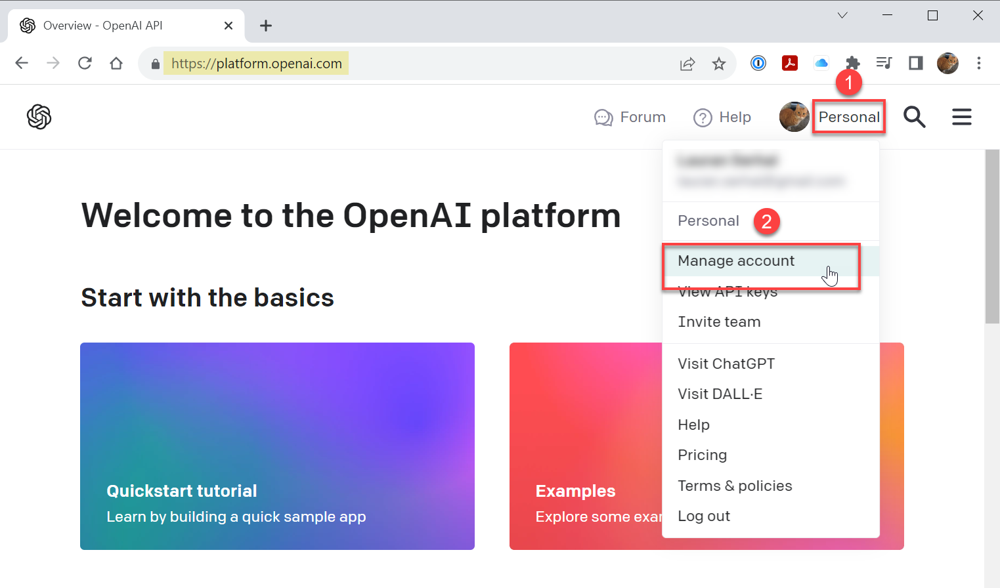

3. On the **Organization settings** page, click **Billing**.

    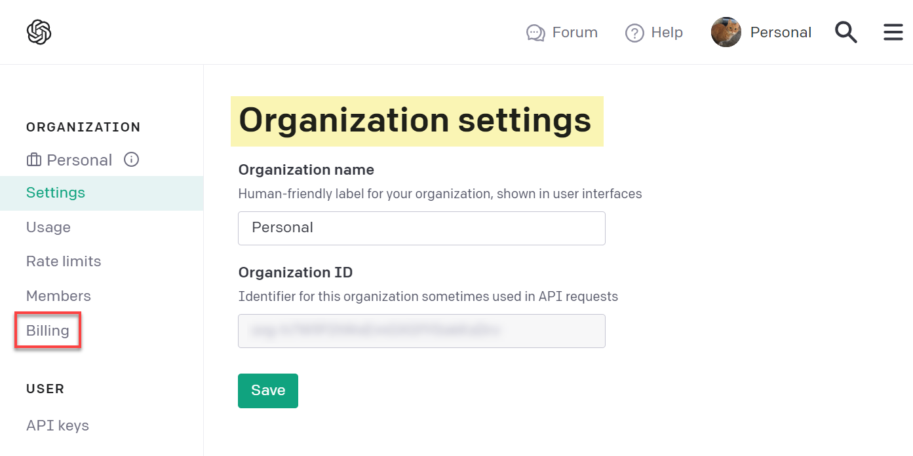

4. On the **Billing overview** page, click **Start payment plan**.

    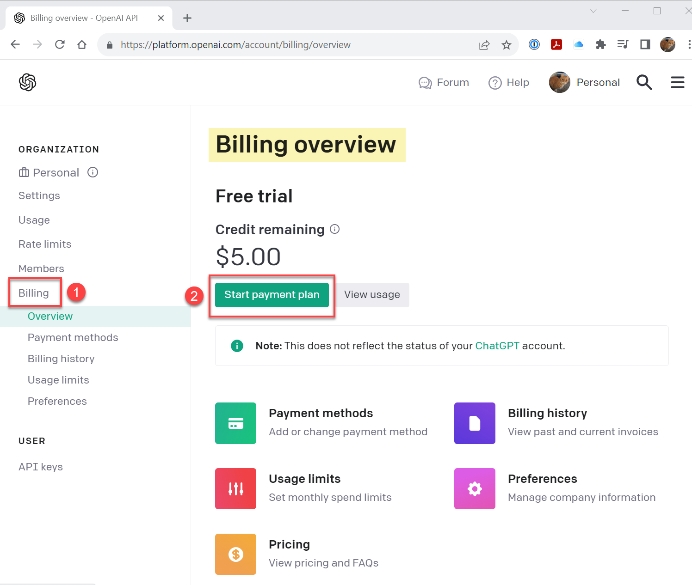

5. In the **What best describes you?** dialog box, click either **Individual** or **Company**. In this example, we will choose **Individual**.

    

6. Complete the **Set up payment plan** dialog box, and then **Continue**.

    

7. In the **Configure payment** dialog box, enter the dollar amount of the credit you want to purchase (between 5 and 50), and then click **Continue**. In this example, we chose **$ 5**.

    

    A successful purchase message is displayed briefly. The **Billing overview** page is re-displayed. The updated credit balance is displayed. In our example the credit balance is now $10 because we had a free credit of $5 and we just purchased another $5.

    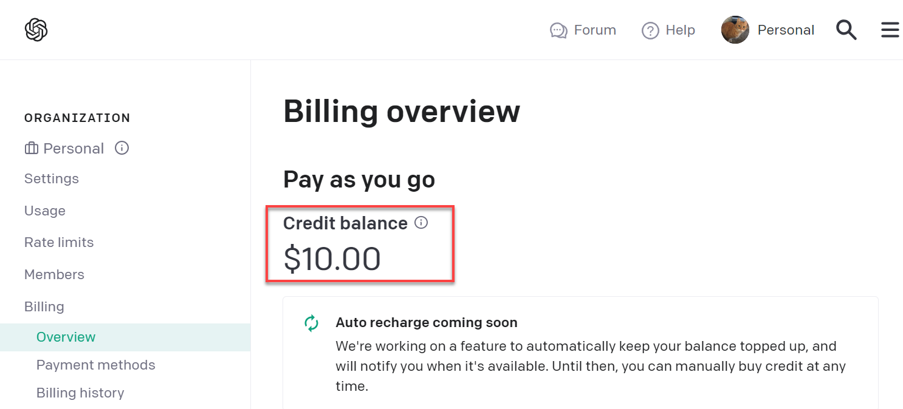

Create a secret key as follows:

1. Click the following link to [create a new API secret key](https://platform.openai.com/account/api-keys). The secret key is used to sign requests to OpenAI's API. You will need it when creating a credential later. On the **API keys** page, click **Create new secret key**.

    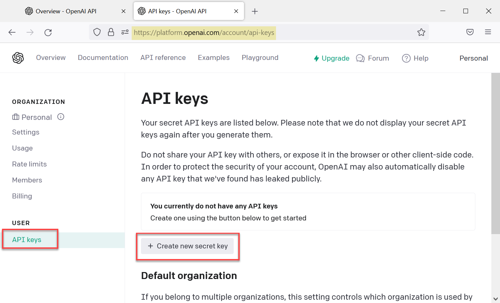

3. The **Create new secret key** dialog box is displayed with the newly created secret key which is blurred in this example for security reasons. Click the **Copy** icon to copy the key to the clipboard (in MS-Windows) and then save it to a text editor of your choice as you'll need it when you set up your connection to the service. Next, click **Done**.

    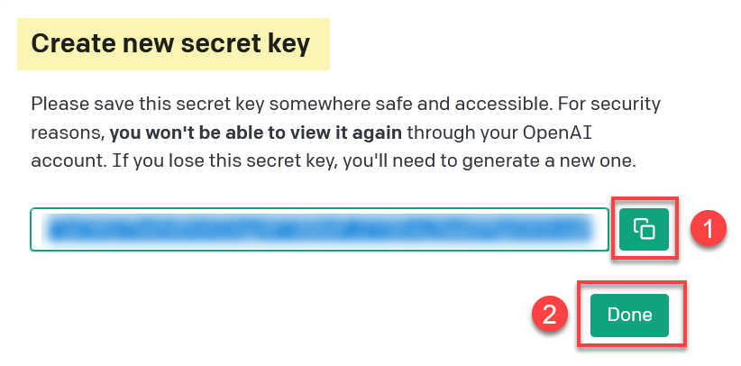

    >**NOTE:** The secret key is only displayed once. You will need to create a new secret key if you lose this value.
--->

## Task 1: (Optional) Create an OCI Compartment

A compartment is a collection of cloud assets, such as compute instances, load balancers, databases, and so on. By default, a root compartment was created for you when you created your tenancy (for example, when you registered for the trial account). It is possible to create everything in the root compartment, but Oracle recommends that you create sub-compartments to help manage your resources more efficiently.

If you are using an Oracle LiveLabs-provided sandbox, you don't have privileges to create a compartment and should skip this first task. Oracle LiveLabs has already created a compartment for you and you should use that one. Even though you can't create a compartment, you can review the steps below to see how it is done.

1. Log in to the **Oracle Cloud Console**. On the **Sign In** page, select your tenancy, enter your username and password, and then click **Sign In**. The **Oracle Cloud Console** Home page is displayed.

2. Open the **Navigation** menu.

    

3. Click **Identity & Security**. Under **Identity**, click **Compartments**.

       

4. On the **Compartments** page, click **Create Compartment**.

   

5. In the **Create Compartment** dialog box, enter an appropriate name such as **`training-adw-compartment`** in the **Name** field and a description such as **`Training ADW Compartment`** in the **Description** field.

6. In the **Parent Compartment** drop-down list, select your parent compartment, and then click **Create Compartment**.

   

   The **Compartments** page is re-displayed and the newly created compartment is displayed in the list of available compartments. You can use the compartment for your cloud services!

   

## Task 2: Create Policy to Enable Access to OCI Generative AI

**Note:** This task is only required if you are using **OCI Generative AI** as your AI provider.

Create a policy that will enable you to use **OCI Generative AI** within your previously defined compartment. **Make sure your policy uses the compartment where your Autonomous Database is deployed.** The policy will be necessary for Autonomous Database to interact with OCI Generative AI.

1. From the **Console,** open the **Navigation** menu and click **Identity & Security.** Under **Identity,** click **Policies.**.

2. Click **Create policy** and specify the following into the appropriate fields:

    >**Note:** Slide the **Show manual editor** control to display the text field in order to paste the policy.

    * **Name:** `PublicGenAI`
    * **Description:** `Public Gen AI Policy`
    * **Compartment:** Select your own compartment
    * **Policy Builder:** **`allow any-user to manage generative-ai-family in compartment training-adw-compartment`**
    
        > **Note:** Substitute `training-adw-compartment` in the above policy with your own compartment's name.

3. Click **Create**.

    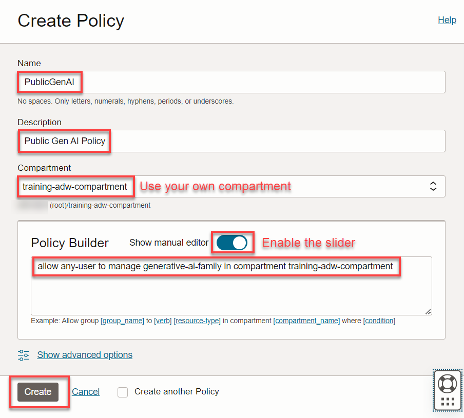
    
>**Note:** This policy allows any Autonomous Database in the specified compartment to access OCI Generative AI. In a production environment, ensure your policy's scope is minimally inclusive.

## Task 3: Provision an ADB Instance, Load Data, and Install the Select AI Demo Application

Use an OCI Cloud Stack to set up your workshop environment by creating an ADB instance, upload the data to the instance, and install the Select AI demo application that was built using APEX.

1. Deploy the required cloud resources for this workshop using the OCI Resource Manager. Click the button below:
    
    <a href="https://cloud.oracle.com/resourcemanager/stacks/create?region=home&zipUrl=https://github.com/oracle-devrel/terraform-oci-oracle-cloud-foundation/releases/download/v1.0.0/Deploy-ChatDB-Autonomous-Database-oci-genai-demonstration-RM.zip&zipUrlVariables=%7B%22tag%22%3A%22gen-ai%22%2C%22db_compute_count%22%3A2%2C%22db_name%22%3A%22MovieStreamWorkshop%22%7D" class="tryit-button">Deploy workshop</a>

    The automation uses a predefined OCI Cloud Stack Template that contains all of the resources that you will need in this workshop. You'll use OCI Resource Manager to deploy this template and make your environment available in just a few minutes. Your first step will be to log in to Oracle Cloud. Next, you will land on the Resource Manager page where you will kick off a job that will do the following:
    * Create a new Autonomous Database named **`MovieStreamWorkshop`** by default; however, you can replace the database name with your own name.
    
        >**Note:** Your database name that you choose must be unique in the tenancy that you are using; otherwise, you will get an error message.

    * Create a new user named **`moviestream`**
    * Create movie related tables and views in the **`moviestream`** schema
    * Grant the required privileges to perform various actions in the workshop
    * Download the **Autonomous Database Select AI** APEX application

    >**Note:** For detailed information about Resource Manager and managing stacks in Resource Manager, see the [Overview of Resource Manager](https://docs.oracle.com/en-us/iaas/Content/ResourceManager/Concepts/resourcemanager.htm#concepts__package) and [Managing Stacks](https://docs.oracle.com/en-us/iaas/Content/ResourceManager/Tasks/stacks.htm) documentation.

2. After you log in to your Oracle Cloud account, the **Create stack** page is displayed. In the **Stack information** step 1 of the wizard, select the **I have reviewed and accept the Oracle Terms of Use** check box. In the **Create in compartment** drop-down list, select your desired compartment. Accept the default values for the rest of the fields, and then click **Next**.

    >**Note:** When you access the **Create Stack** page, the **US East (Ashburn)** region is selected by default. This is where the stack will be created. If you want to create the stack in a different region, select that region from the **Regions** drop-down list in the Console's banner.

    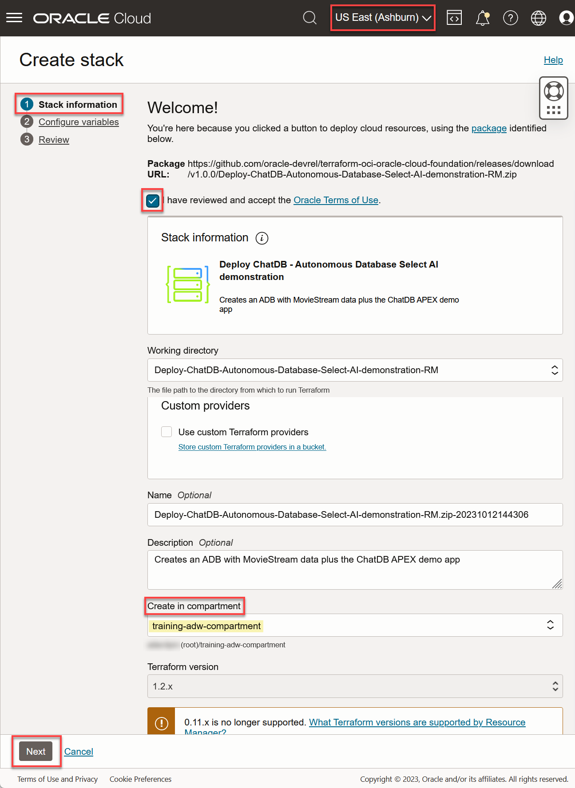

3. In the **Configure variables** step 2 of the wizard, provide the following:
    * **Region:** Select the target region for the new Autonomous Database instance. In our example, we chose the `us-ashburn-1` region.
    * **Compartment:** Select the target compartment for the new Autonomous Database instance.
    * **Database Name:** The default database name is **`MovieStreamWorkshop`**. _Replace this name with your own database name_. In our example, we changed the database name to **``TrainingRAGWorkshop``**. The database name must contain only letters and numbers, starting with a letter, and between 12 and 30 characters long. The name cannot contain the double quote (") character, space, underscore "_", or the username `admin`.

        >**Note:** Your database name that you choose must be unique in the tenancy that you are using; otherwise, you will get an error message.

    * **Do you want an always Free Oracle Autonomous Database instance?** Accept the default **`false`** value. Select **`true`** from the drop-down list if you want to deploy an Always Free database.

        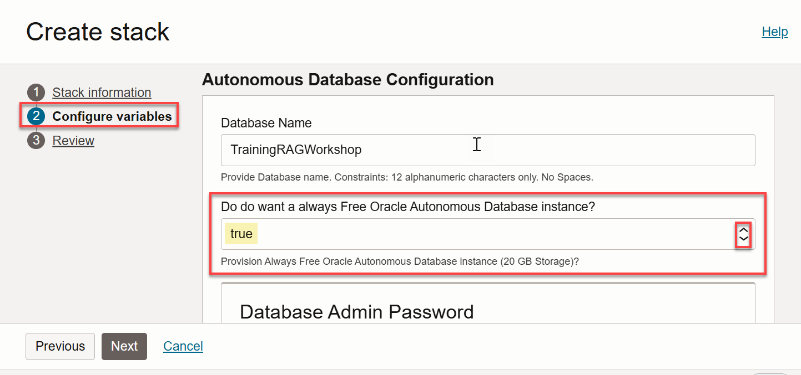

    * **Password:** Enter a password for the `ADMIN` user of your choice such as **`Training4ADW`**. **Important**: Make a note of this password as you will need it to perform later tasks.
    
        >**Note:** In the **Workshop Settings** section, if a **Secret API key used to connect to AI model** field is displayed, that is not **_not Required_** for this Lab since OCI Generative AI does not use a secret key for Resource Operations.
   
    * For the other fields, accept the default selections. For the **A valid Oracle Database version for Autonomous Database** field, ensure that **23ai** is selected for the database version.
    
        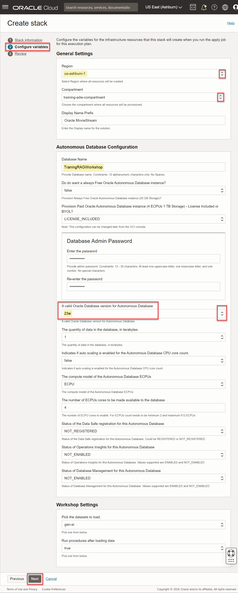

4. Click **Next**. If clicking **Next** does not take you to the page 3 of the wizard, check the **Region** field. It may have been reset.

    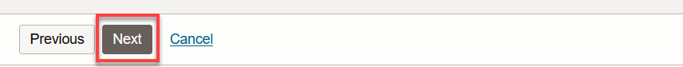

5. In the **Review** step 3 of the wizard, review your configuration variables and make any necessary changes on the previous pages. If everything looks good, then it's time for you to create and apply your stack! Ensure that the **Run apply** check box is checked, and then click **Create**.

    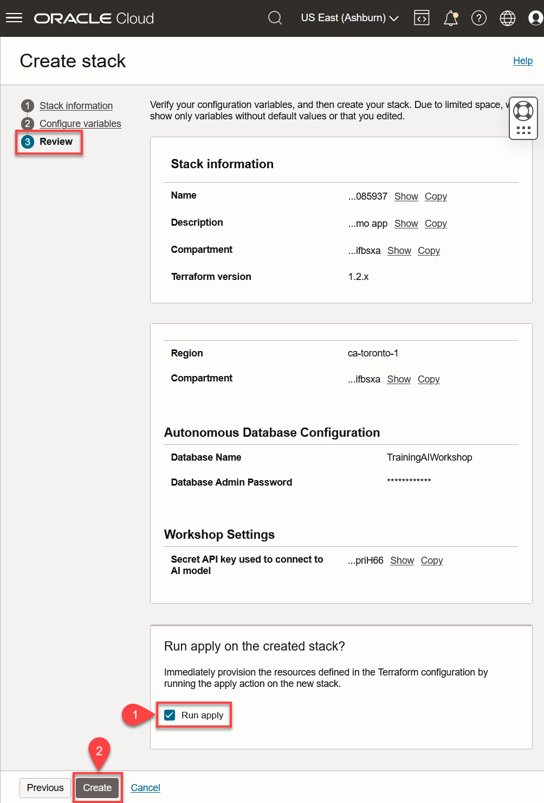

6. The **Job details** page is displayed. The initial status (in orange color) is **ACCEPTED** and then **IN PROGRESS**.

  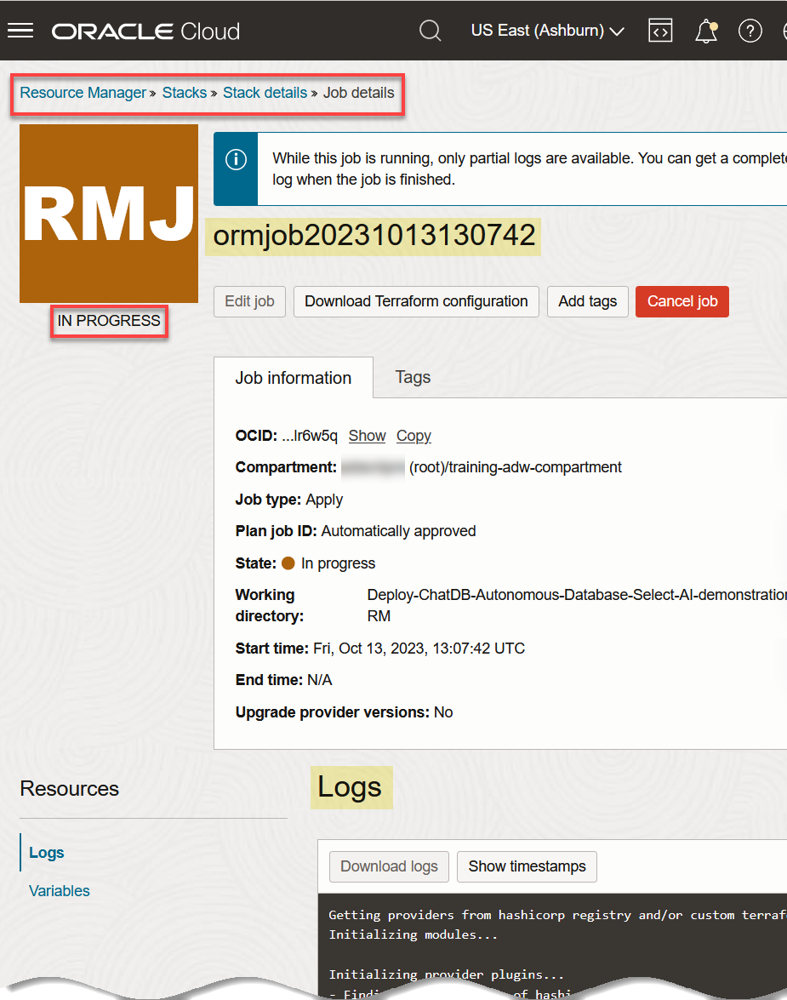

  If the job completes successfully, the status changes to **SUCCEEDED** (in green color). This process can take 5 to 10 minutes to complete.

  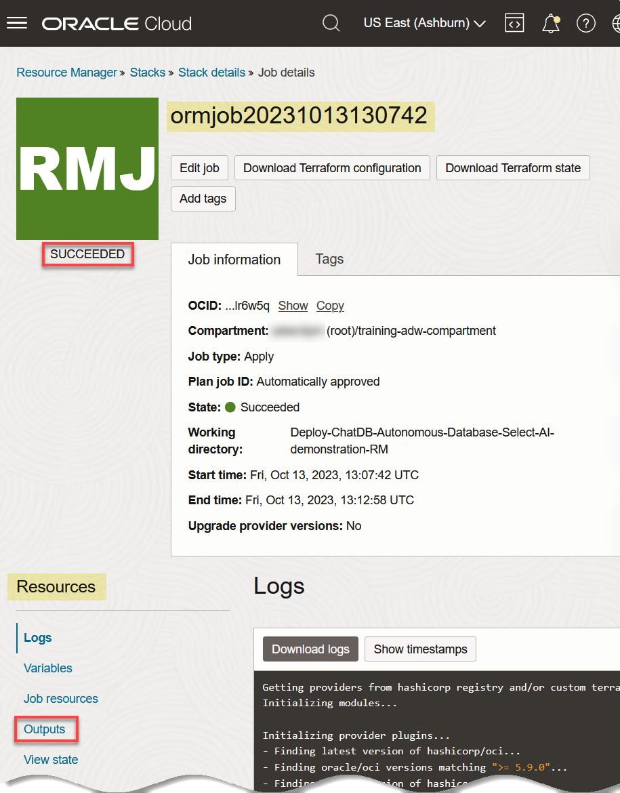

7. Scroll-down to the **Resources** section at the bottom of **Job details** page, and then click **Outputs**. The keys and values are displayed in the **Outputs** section.

    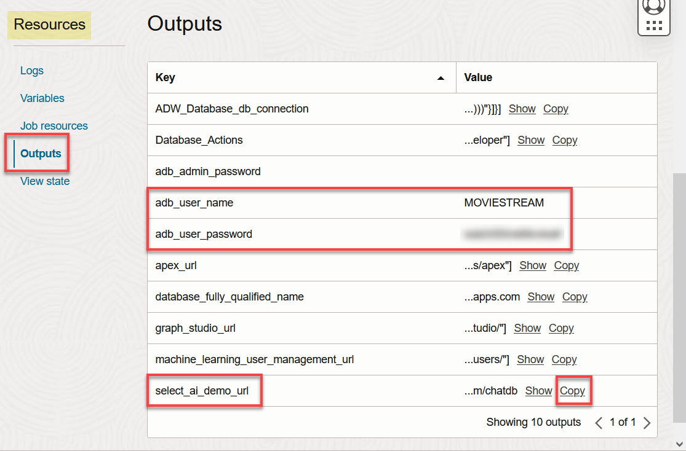

8. Save the values for the following keys in a text editor of your choice as you will need this information later. For the **`select_ai_demo_url`** value, click the **Copy** button in that row to copy the value into the clipboard, and then paste it into your text editor. _This is the URL that you will use later to launch the **Autonomous Database Select AI** demo application._

    * **`adb_user_name`**
    * **`adb_user_password`**
    * **`select_ai_demo_url`**

      

## Task 4: Review Your Deployment

1. Let's view the newly created stack and job. From the Console, open the **Navigation** menu.

    

2. Click **Developer Services**. Under **Resource Manager**, click **Stacks**.

    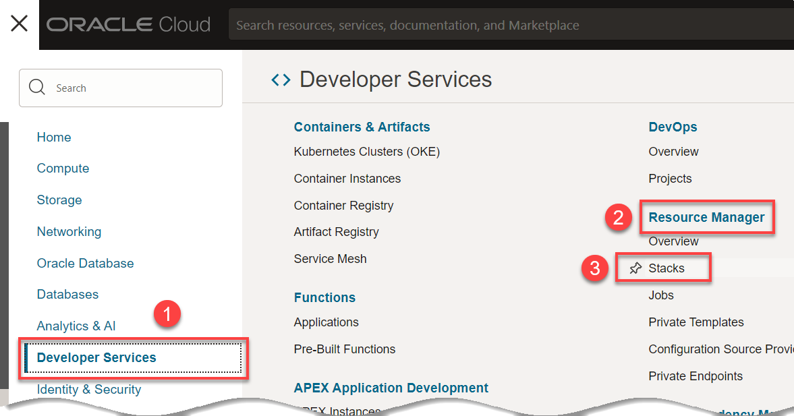

    The newly created stack is displayed in the **Stacks** page. Select the region and compartment that you specified when you deployed the stack.
    
    
    
3.  Click the stack name. The **Stack details** page is displayed.

    

4.  In the **Jobs** section, click the job name. The **Job details** page is displayed.

    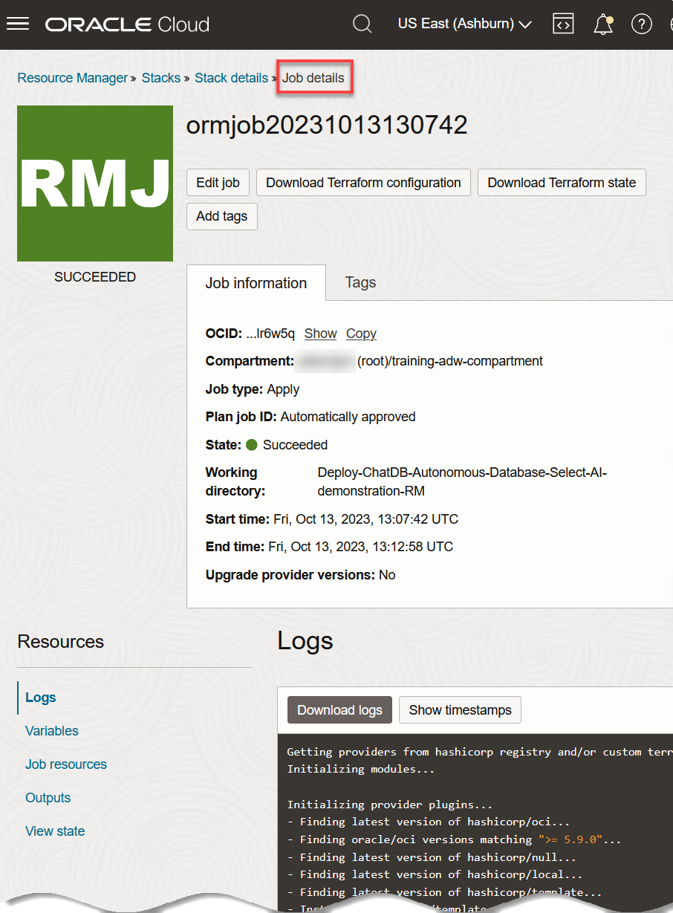

    You can use the **Logs** section to view the created resources such as the **moviestream** user. You can also use the **Output** link in the **Resources** section to find out the values of different keys.

    The **Logs** section is useful when you have a failed job and you try to find out why it failed. In the following failed job example, we scrolled down the log and then searched for text in red font color which describes the potential problem. In this specific example, we specified a database name with an underscore which does not meet the requirements for a database name.

    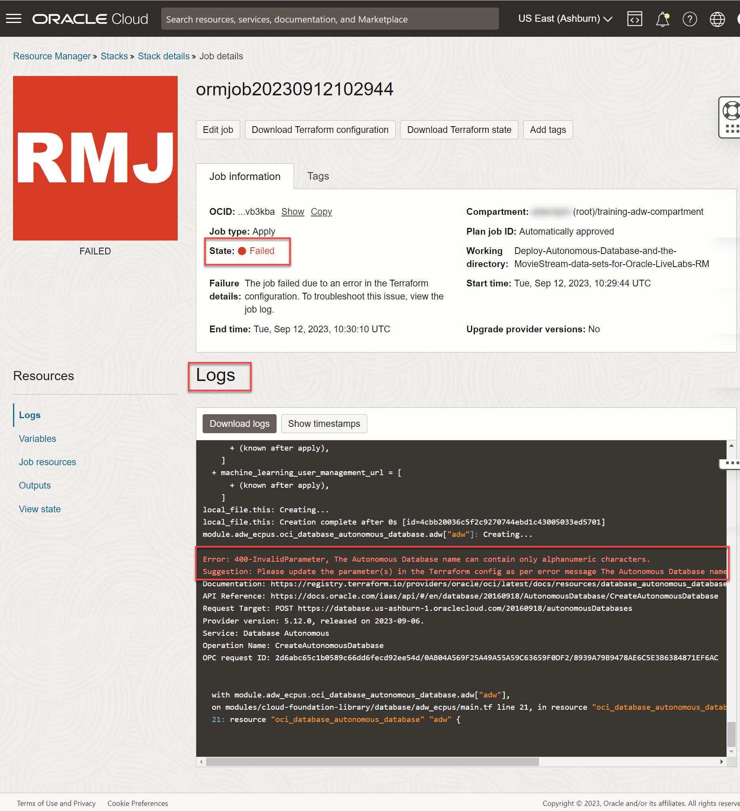

## Task 5: Navigate to Your New Autonomous Database Instance

Let's view the newly provisioned ADB instance.

1. From the Console, open the **Navigation** menu and click **Oracle Database**. Under **Autonomous Database**, click **Autonomous Data Warehouse**.

2. On the **Autonomous Databases** page, select the _compartment and region_ that you specified in the **Configure variables** step 2 of the wizard. The Autonomous Database that was provisioned by the stack is displayed, **``TrainingRAGWorkshop``**.

    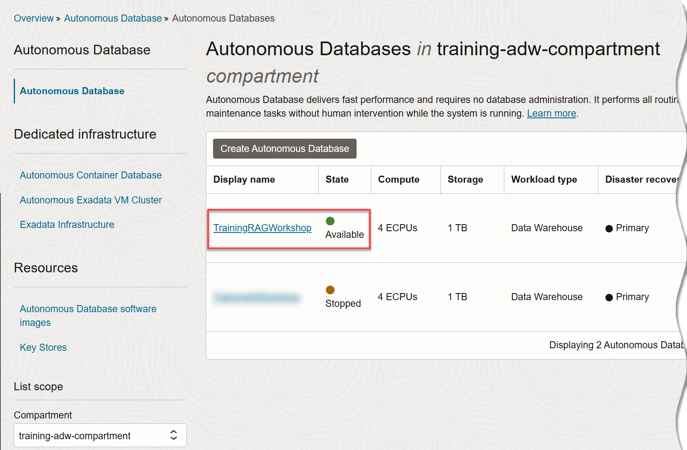

You may now proceed to the next lab.

## Learn More

* [Using Oracle Autonomous Database Serverless](https://docs.oracle.com/en/cloud/paas/autonomous-database/adbsa/index.html)
* [Oracle Cloud Infrastructure](https://docs.cloud.oracle.com/en-us/iaas/Content/GSG/Concepts/baremetalintro.htm)
* [OpenAI API Get Started](https://platform.openai.com/docs/introduction)

## Acknowledgements

* **Author:** Lauran K. Serhal, Consulting User Assistance Developer
* **Contributor:** Marty Gubar, Product Manager
* **Last Updated By/Date:** Lauran K. Serhal, February 2025

Data about movies in this workshop were sourced from **Wikipedia**.

Copyright (c) 2025 Oracle Corporation.

Permission is granted to copy, distribute and/or modify this document
under the terms of the GNU Free Documentation License, Version 1.3
or any later version published by the Free Software Foundation;
with no Invariant Sections, no Front-Cover Texts, and no Back-Cover Texts.
A copy of the license is included in the section entitled [GNU Free Documentation License](https://oracle-livelabs.github.io/adb/shared/adb-15-minutes/introduction/files/gnu-free-documentation-license.txt)
