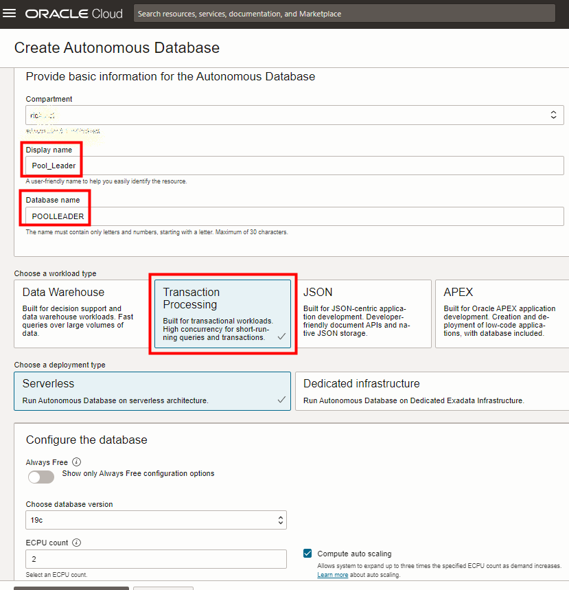
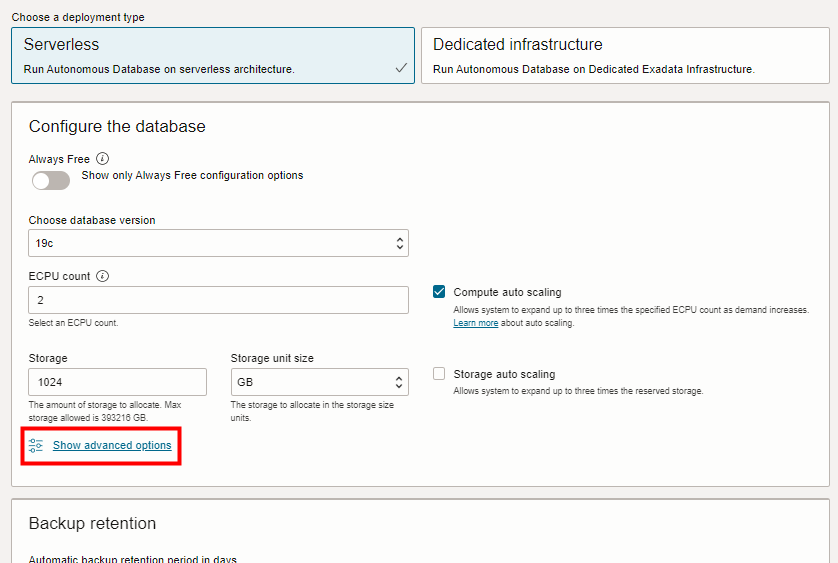
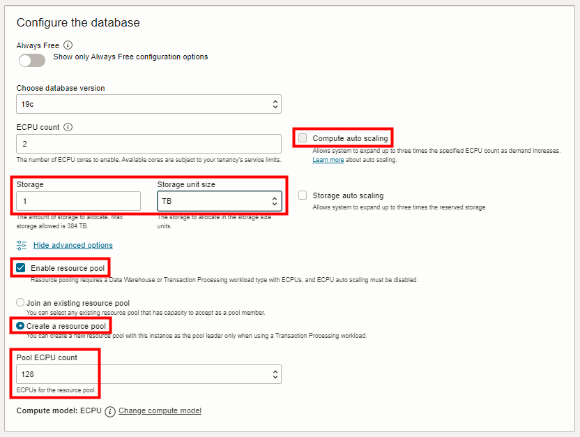
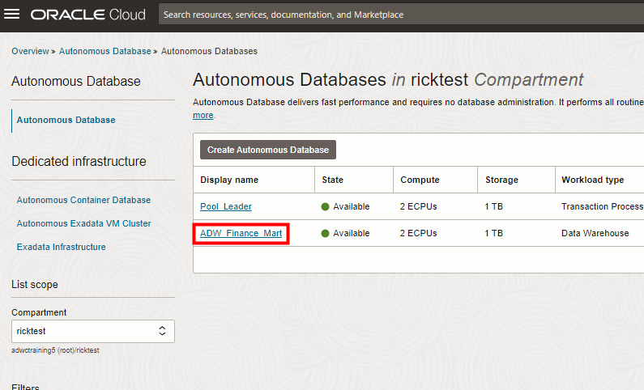
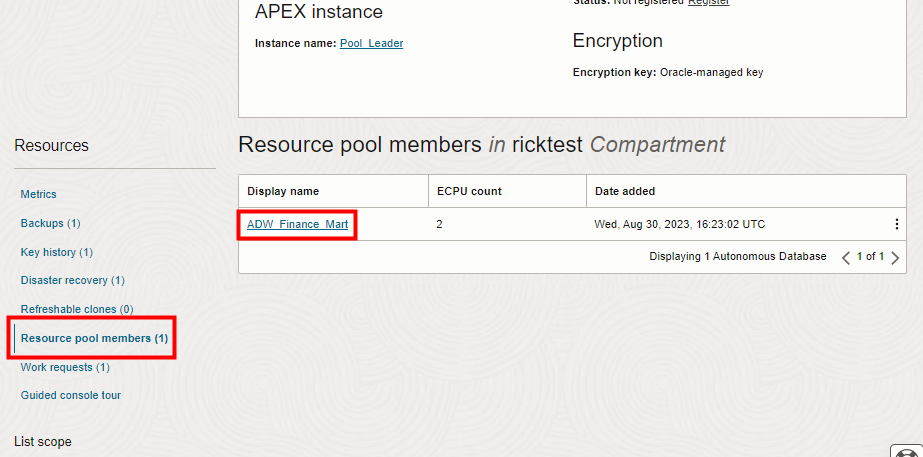
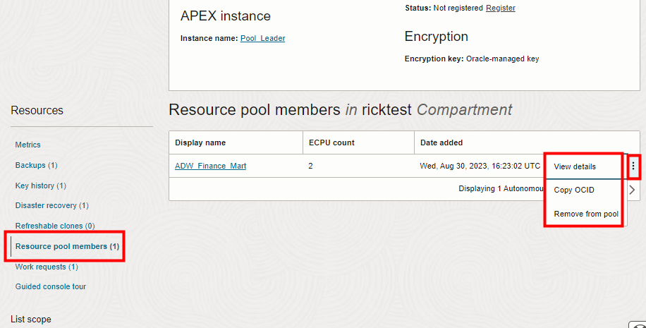
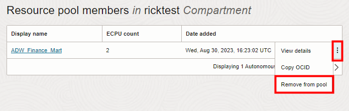
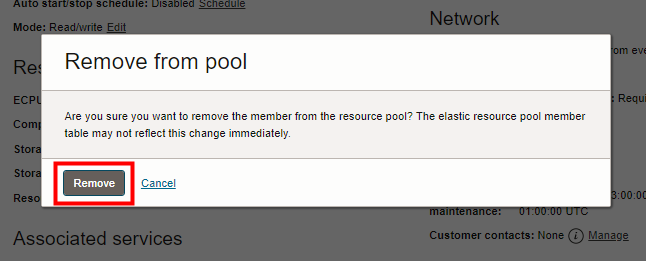
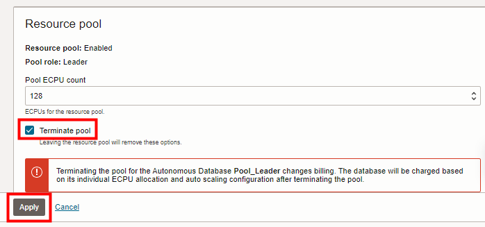

# Create an Elastic Resource Pool

## Introduction

Use an elastic resource pool to consolidate your Autonomous Database instances, in terms of their allocation of compute resources, and to provide up to 8 times cost savings.

Elastic resource pools help you improve operating efficiency and reduce costs by bringing all of your databases to the Cloud. This also supports consolidating resources and simplifying administration and operations by using Autonomous Database. When you need a large number of databases, that can scale up and down elastically without downtime, you can benefit by creating and using resource pools.

Elastic resource pools:

* Enable operating with a fixed budget for a group of databases, while delivering performance elasticity for each individual database.

* Allow for easy migration from on-prem Oracle environments that include oversubscription, to provide a cost effective way to move to Autonomous Database.

* Support SaaS vendors with a large number of individual customer databases.

* Provide resources for using a microservices architecture, where the ability to supply of large number of databases is required.

> **Note**: Elastic resource pools are only available for Autonomous Database instances that use the ECPU compute model and that are provisioned with the Transaction Processing or Data Warehouse workload types.

There are several terms to use when you work with elastic resource pools:

* **Pool Leader**: Is the Autonomous Database instance that creates a resource pool. The pool leader must be an Autonomous Database instance with the Transaction Processing workload type.

* **Pool Member**: Is an Autonomous Database instance that is added to a resource pool. While the pool leader must have the Transaction Processing workload type, pool members can be a mix of databases with either the Data Warehouse or Transaction Processing workload type.  

* **Pool Size**: Is a value that you set when you create a resource pool. The pool size must be one of the available resource pool shapes.

* **Pool Shape**: A pool shape is one of the valid pool sizes that you select when you create a resource pool. The pool shape must be one of: 128, 256, 512, 1024, 2048, or 4096.

* **Oversubscription value**: The oversubscription value is the maximum number of ECPUs that a resource pool can use, and is four (4) times the pool size.

### Requirements to Create a Resource Pool (Pool Leader Requirements)

The following are the requirements for an Autonomous Database instance to create a resource pool and become a pool leader:

* The instance must use the ECPU compute model.

* The instance must be an Autonomous Database instance with the Transaction Processing workload type. This only applies for the pool leader. A resource pool can hold a mix of databases with Transaction Processing and Data Warehouse workloads.

* Auto scaling must be disabled.

* The instance must not be a member of a resource pool.

* The maximum allowed individual ECPU count for an Autonomous Database instance that creates a resource pool is 4096 ECPUs.

### Requirements to Join a Resource Pool

The following are the requirements for an Autonomous Database instance to join a resource pool:

* The instance must use the ECPU compute model.

* A resource pool can hold a mix of Autonomous Databases with Transaction Processing and Data Warehouse workloads.

* Auto scaling must be disabled.

* The instance must not be a member of a resource pool.

* The maximum allowed individual ECPU count for an Autonomous Database instance is the smaller value of the available allocation for the resource pool or 4095 ECPUs. When an instance contains either an ECPU count greater than the available allocation for the resource pool or 4096 or more ECPUs, it is not allowed to join a resource pool.

### Resource Leader and Member Instance ECPU Allocation

* When an Autonomous Database instance is part of a resource pool, the minimum allowed individual ECPU allocation for an instance is **as little as 1 ECPU**.

* When an Autonomous Database instance is part of a resource pool, even or odd numbers of ECPUs are allowed for individual ECPU allocation. That is, the ECPU count for an instance in a resource pool can be set to 1, 2, 3, 4, 5, …, up to the smaller of the available allocation for the pool or the maximum allowed individual ECPU count of 4096.

### Over Subscribing a Resource Pool Can Enable Significant Cost Savings

A resource pool can contain more than the pool size number of compute resources (ECPUs), up to 4 times as many compute resources as the pool size. The **oversubscription** value of 4 times the pool size maps to the number of Autonomous Database instances that a resource pool can contain and is based on the sum of the number of ECPUs allocated to the resource pool members. For example, if you create a resource pool with a pool size of 128 ECPUs, you can provision up to 512 ECPUs in a 128 ECPU pool and you pay only for 128 ECPUs. The sum of the number of ECPUs that come from individual members cannot exceed 512 ECPUs (128 x 4).

The following Autonomous Database instances could be in a resource pool with a pool size of 128 and an oversubscription value of 512 ECPUs:

* 1 instance with 512 ECPUs
* 128 instances with 4 ECPUs
* 256 instances with 2 ECPUs
* 1 instance with 128 ECPUs, 2 instances with 64 ECPUs, 32 instances with 4 ECPUs, and 64 instances with 2 ECPUs
* 256 instances with 1 ECPU, 64 instances with 2 ECPUs (for a total of 384 ECPUs, which is less than the maximum allowed 512 ECPUs).

You can perform this lab in Oracle's free tier with trial credits, in your own tenancy using a paid Oracle Cloud account, or in an Oracle-provided environment, such as LiveLabs.

Estimated Lab Time: 20 minutes

### Objectives

In this lab, you will:

- Provision a new Autonomous Database to serve as the pool leader
- Create a resource pool while provisioning that Autonomous Database
- Add your original database instance as a pool member
- Examine the list of pool members
- Remove that database from the resource pool
- Terminate the resource pool

### Prerequisites

This lab assumes you have:

- Obtained an Oracle Cloud account and signed in to the Oracle Cloud Infrastructure Console at `https://cloud.oracle.com`
- Performed the previous lab on provisioning an Oracle Autonomous Database

## Task 1: Provision a new database instance to be the pool leader
The first task for setting up an elastic resource pool is to create or modify an existing autonomous database instance to serve as the pool leader. For this lab, you will create a new instance to be the pool leader. The lab introduction mentioned several requirements for a pool leader:
* The instance must use the ECPU compute model.
* The instance must be an Autonomous Database instance with the Transaction Processing workload type.
* Auto scaling must be disabled.

1. In the Oracle Cloud Infrastructure Console, navigate back to Oracle Database. On the Autonomous Databases page, click **Create Autonomous Database**.

2. Specify basic information for the autonomous database:

    * **Compartment** - Choose the compartment in which you created your first autonomous database in the first lab.
    * **Display Name** - Enter a memorable name for the database for display purposes. For example, use **Pool_Leader**. (Spaces are not supported.)  
    * **Database Name** - Use letters and numbers only, starting with a letter. For example, use **POOLLEADER**. Maximum length is 14 characters. (Spaces and underscores are not supported.)
    * **Workload type** - Select **Transaction Processing** as the workload type.

    

## Task 2: Define the resource pool while provisioning the database
As stated earlier, you can define a resource pool while provisioning a new database as the pool leader, or you can modify an existing autonomous database to serve as the pool leader of a new resource pool. In this lab, we continue to define the resource pool while provisioning a database.

1. In the **Configure the database** area, click **Show advanced options** to show advanced options.

    

2. Deselect **Compute auto scaling**. For storage, in the **Storage unit size** drop-down menu, select **TB**. Then in the **Storage** field, specify 1 terabyte. Select **Enable resource pool**. Select **Create a resource pool**. In the **Pool ECPU count** field, select a pool size from the list of pool shapes. For this lab, select **128** as the Pool ECPU count.

    

3. Complete the remaining provisioning steps, accepting the defaults. Create an ADMIN password. Click **Create Autonomous Database**.

## Task 3: Add your original database instance as a pool member
Now that you have defined the resource pool, you can add pool members. Let's add the autonomous database that you provisioned in the first lab of this workshop.

1. Navigate back to the  Autonomous Database details page of the database you defined in the first lab. You may have named it **ADW\_Finance\_Mart**.

    

  Select the **Manage resource allocation** button on the Autonomous Database details page. The **Manage resource allocation** dialog appears. Verify that **Compute auto scaling** is disabled. If Compute auto scaling is selected, disable Compute auto scaling:

    * If **Compute auto scaling** is enabled, deselect it.
    * In the **Resource pool** section, select **Enable resource pool**.
    * Keep the default selection of **Join an existing resource pool**.
    * In the **Select pool leader in (your compartment)** field, choose the **Pool_Leader** database you just created.
    * Click **Apply** to add your **ADW\_Fiance\_Mart** database to your **Pool_Leader** resource pool.

    

  When you click Apply, the **Lifecycle state** changes to **Scaling in Progress**. After a number of minutes, when the Lifecycle state changes to **Available**, the changes apply immediately.

  After you create a resource pool, click **Manage resource allocation** to see the resource pool details. In the Manage resource allocations area, under Resource pool, the Resource pool field shows Enabled, the Pool role field shows Member, and the Resource pool leader field shows a link to the pool leader.

## Task 4: Examine the list of pool members
Now that you have added your original database from the first lab to the resource pool, let's go back to the newer database - the resource pool leader - to examine the list of pool members.

1. On the resource pool leader's Autonomous Database details page, under **Resources**, click **Resource pool members**.

    

  The **Resource pool members** area shows a list of resource pool members for this **pool leader** Autonomous Database instance. For now, it shows that you have added one resource pool member, ADW\_Finance\_Mart.

2. If you click the 3-dot **More actions** button at the end of any row in the list of pool members, you can select an action to perform for the member. The possible actions are:

  * **View details**: Shows the member's Oracle Cloud Infrastructure Console.
  * **Copy OCID**: Copies the member's Autonomous Database instance OCID.
  * **Remove from pool**: Brings up a dialog where you can confirm to remove the Autonomous Database instance from the pool.

    

## Task 5: Remove that resource pool member
A resource pool leader can remove pool members from a resource pool. Pool members can remove themselves from a resource pool. As resource pool leader, let's remove the resource pool member we added.

1. In the list of resource pool members, click the 3-dot **More actions** button at the end of the row for the pool member you added. In the pop-up menu, select **Remove from pool**.

    

2. The **Remove from pool**  confirmation dialog appears. Click **Remove** to confirm. Wait a minute or two for removal to finish.

    

  * When a pool member or the leader leaves a resource pool, auto scaling is disabled. After leaving the resource pool you can enable auto-scaling for the instance.

  * When a pool member leaves a resource pool, the resource pool has more resources available. For example, if the resource pool were fully allocated up to the oversubscription value, and an instance with 10 ECPUs leaves the pool, the resource pool would have 10 available ECPUs.

## Task 6 Terminate the resource pool
> **Note**: Terminating a resource pool is only allowed when there are no pool members in the resource pool.

1. On the **Autonomous Database details** page of the **pool leader** database, select **Manage resource allocation**.

2. Select **Terminate pool**.

3. Click **Apply** to terminate the resource pool. When you click Apply, the **Lifecycle State** changes to **Scaling in Progress**. After the Lifecycle State changes to **Available**, the changes apply immediately.

    

## Want to Learn More?

The following link provide documentation about using and managing elastic resource pools on Autonomous Database:

- [Use and manage elastic resource pools](https://docs.oracle.com/en/cloud/paas/autonomous-database/serverless/adbsb/elastic-resource-pools-autonomous.html#GUID-FEA9B01D-BD76-40E9-9E72-7BAFBD694470)

## Acknowledgements

- **Author** - Rick Green, Principal User Assistance Developer, Database Development
- **Last Updated By/Date** - Rick Green, September 2023
