
# Set Event and Alarm Notifications for an Autonomous Database

## Introduction

*Note: the OCI Notifications service is not supported in the Livelabs hosted sandbox environment. If you are running this workshop in a LiveLabs sandbox, please view the steps in this lab to learn about setting event and alarm notifications. However, please do not attempt to perform the steps.*

The Oracle Cloud Infrastructure (OCI) Notifications service broadcasts messages to distributed components through a publish-subscribe pattern, delivering secure, highly reliable, low latency and durable messages for applications hosted on OCI and externally.

The Notifications service enables you to set up communication channels for publishing messages using topics and subscriptions . When a message is published to a topic, the Notifications service sends the message to all of the topic's subscriptions.

This lab shows you how to define events and alarms with conditional rules that will generate email notifications when the state of an Autonomous Database changes or an alarm condition has been met.

**An event** is triggered for a lifecycle management (LCM) type operation performed in Oracle Cloud, such as creating a database, stopping a database, and so on.

**An alarm** is triggered over a resource utilization metric, such as a database's CPU utilization going over a certain percentage or Object Storage bucket going over a certain size limit.

Estimated Lab Time: 20 minutes

### Objectives

In this lab, you'll:

- Use the OCI Console to define a notification topic and subscribe to the topic.
- Create a rule for an Autonomous Database event that will trigger an email notification.
- Perform an activity that activates the rule and confirm that an email notification was sent. 
- Create and test an Autonomous Database alarm that will trigger an email notification.

## **PART 1 - Define an Event that Will Email a Notification When a Database Is Stopped**

OCI Notifications service enables you to set up communication channels for publishing messages using topics and subscriptions.

**Topic**: A communication channel for sending messages to the subscriptions in the topic.

**Subscription**: An endpoint for a topic. Published messages are sent to each subscription for a topic.

**Message**: The content that is published to a topic. Each message is delivered at least once per subscription.

In Tasks 1 through 7, you create a notification topic with an email subscription, then create a rule that triggers a message (email) when a database is stopped.

## Task 1: Sign in to OCI Console and Create a Notification Topic

*Note: Again, please note that the OCI Notifications service is not supported in the Livelabs hosted sandbox environment. If you are running this workshop in a LiveLabs sandbox, please view the steps in this lab to learn about setting event and alarm notifications. However, please do not attempt to perform the steps.*

1. First, you will create a Notification topic. From OCI Services menu, click **Developer Services** -> **Notifications**
  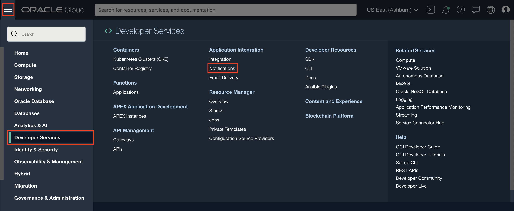
2. Click **Create Topic**. 

3. Fill out the dialog box:

    - **Name**: Provide a name
    - **Description**: Provide a description

5. Click **Create**.

  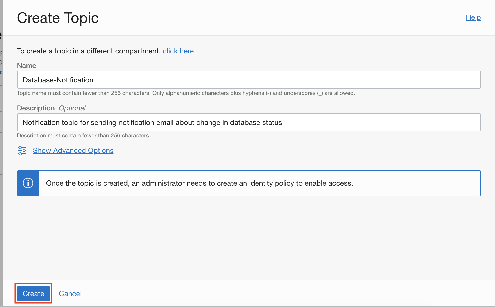

## Task 2: Create a Subscription to the Topic

Now that you have created a notification topic, create a subscription to that topic, so that you can receive email alerts when a condition changes. (You will create a rule with conditions in a following task.)

In this lab, you create an email subscription. Subscriptions can be defined to trigger emails or pager notifications (for on-call staff whose phones will be paged.)

1. Click the topic Name. Click **Create Subscription**.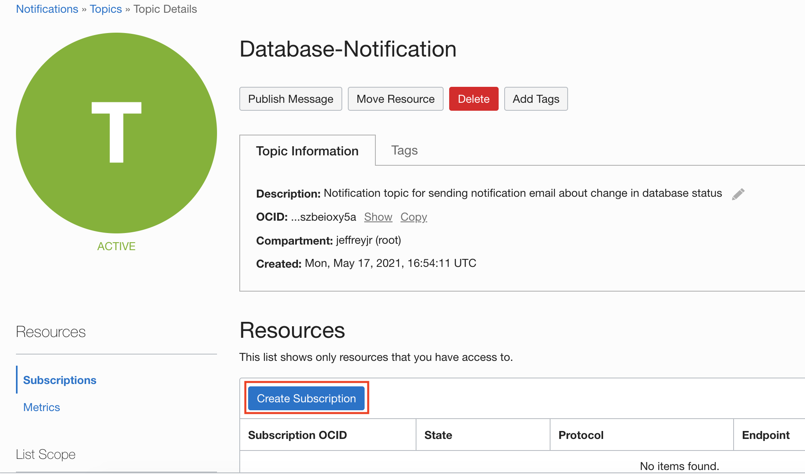

2. Fill out the dialog box:

    - **PROTOCOL**: Email
    - **EMAIL**: Provide your email id

3. Click **Create**.

  

4. The Subscription Details screen will be displayed with subscription status showing **Pending confirmation**.

  

## Task 3: Respond to the Verification Email

You will receive an email notification of your subscription. You will need to respond to the email's verification request.

1. Check the email account you specified and open the verification email. Click the **Confirm subscription** verification link for this subscription.

  

2. A browser tab will open, confirming that you have subscribed your email account to the topic: Database-Notification.

  

## Task 4: Verify that Subscription Status Has Changed from Pending to Active

Your verification of the email will change the subscription status from pending to active.

1. Switch back to OCI console window and verify the subscription status changed to **Active**. You may need to refresh your browser.

  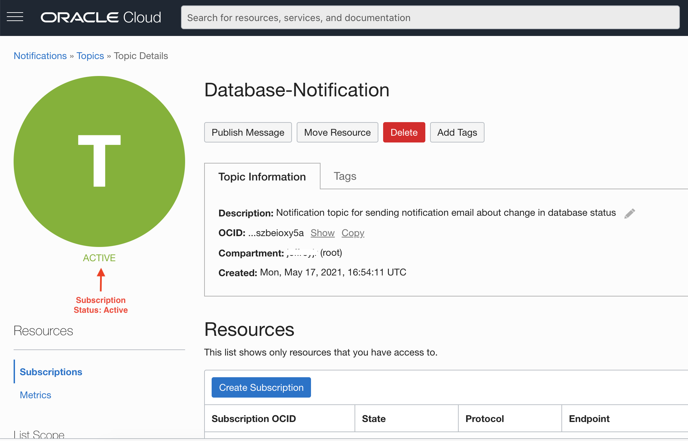

2. You are now subscribed to a Notification topic. Next you will define an event with conditions that, when met, will publish messages to this Notification topic.

## Task 5: Define an Event with Rules that Will Publish Messages

Let's define an event that triggers an email notification when an Autonomous Database is stopped.

1. From OCI Services menu, click **Observability & Management >** **Rules**.

  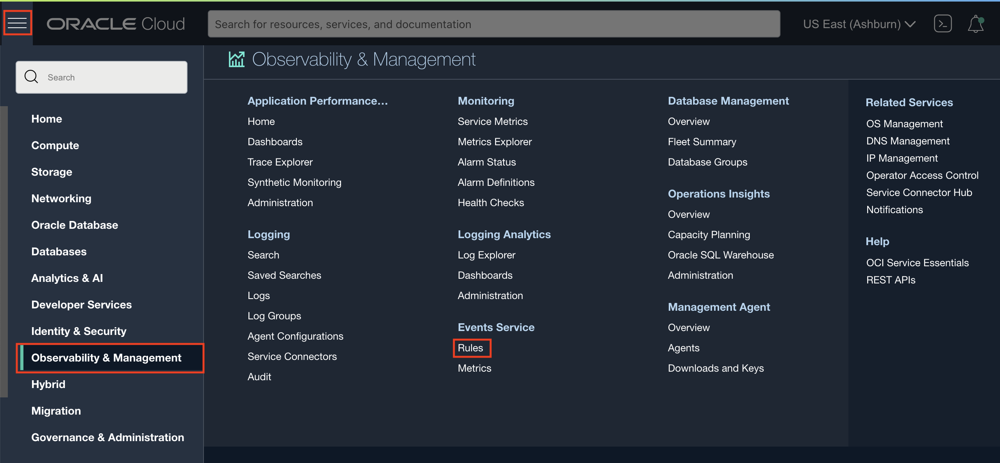

2. Click **Create Rule**.

  

3. Fill out the dialog box:

    - **DISPLAY NAME** : Provide a name, such as the event type that you will be choosing; in this lab, the event type will be Autonomous Database - Stop End.
    - **DESCRIPTION** : Provide a description.

  Under **Rule Conditions**

    - **Condition:** Event Type
    - **SERVICE NAME**: Database
    - **EVENT TYPE** : Choose **Autonomous Database - Stop End** from the drop down menu. 

  Under **Actions**

    - **ACTION TYPE**: Notifications
    - **NOTIFICATIONS COMPARTMENT**: Choose your compartment.
    - **TOPIC**: Choose the topic created earlier, **Database-Notification**.

4. Click **Create Rule**. 

  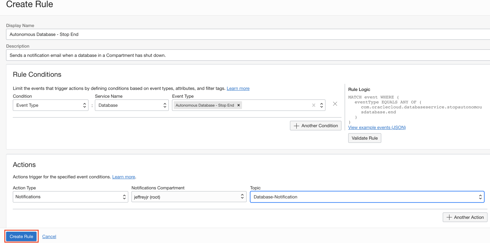

You have configured a Notification service and tied an event to it with a specific compartment. When a database is shut down, an email notification will be sent to the email address specified.

## Task 6: Trigger the Event

Now shut down the Autonomous Database to trigger the notification email.

1. Navigate to your Autonomous Database's Details page. From the **More Actions** drop-down menu, select **Stop**.

  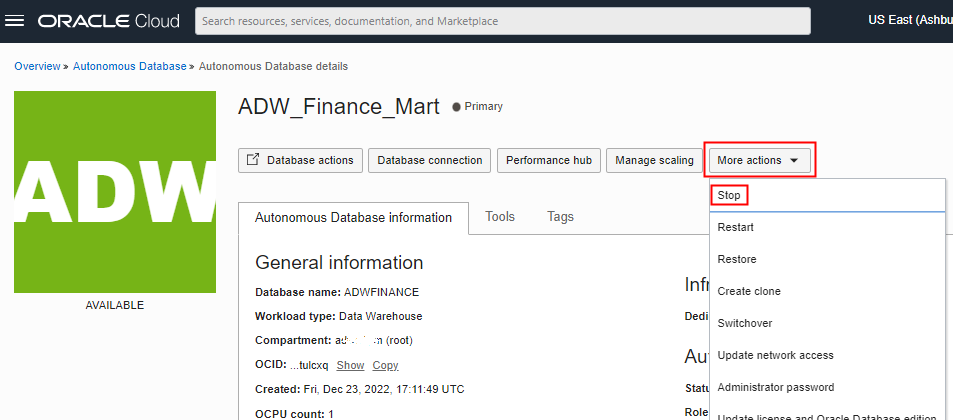

2. In the confirmation dialog box, click **Stop**.

  

3. Wait until the database status changes to **STOPPED**.

## Task 7: Verify that an Email Notification Was Sent

Check the email account you specified to verify that a notification email was sent.

1. Go to the specified email account and verify that a notification of the database stoppage has been sent.

  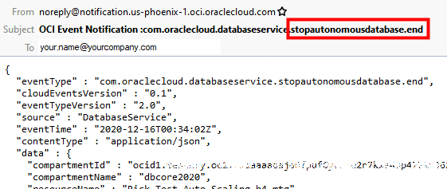

## **PART 2 - Define an Alarm that Will Email a Notification When CPU Utilization Exceeds a Specific Percentage**

In Tasks 8 through 10, define an alarm that triggers an email when CPU utilization exceeds a percentage level that you set.

**Note:** For convenience, use the same topic and subscription that you defined in Part 1. You could define new ones, if you prefer.

## Task 8:  Define an Alarm for the CPU Utilization Chart

1. Navigate to your Autonomous Database's **Details** page. Scroll down to the **Metrics** charts. In the **CPU Utilization** chart, click the **Options** drop-down menu and select **Create an Alarm on this Query**. 

  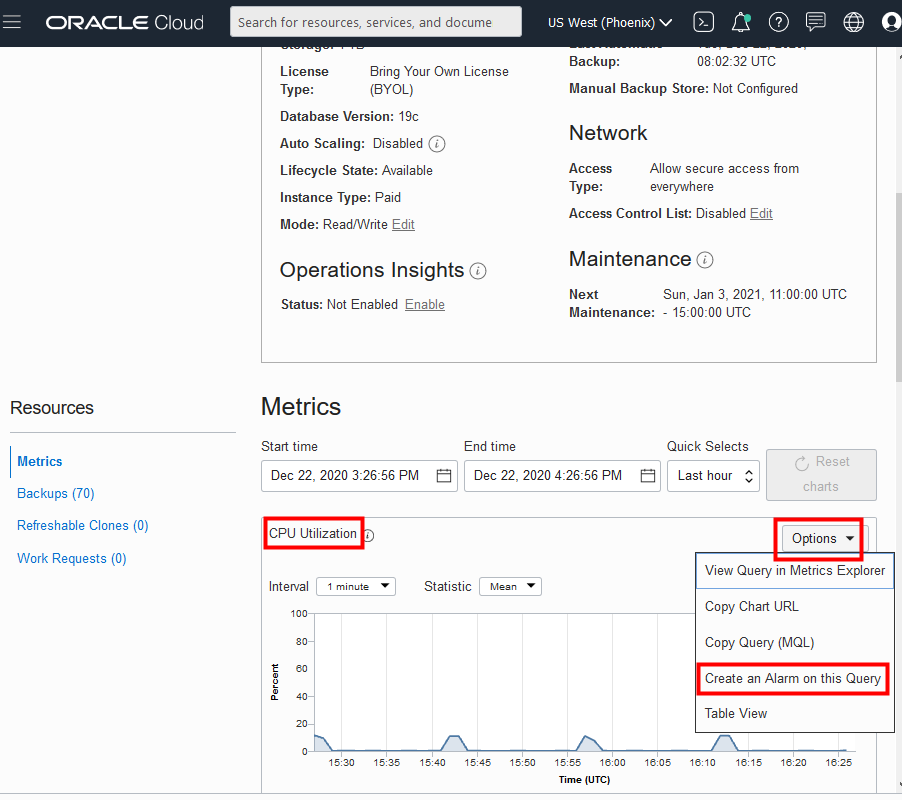

2. Fill in or update the alarm settings in the **Create Alarm** dialog:

- **ALARM NAME** : Provide a name, perhaps indicating the metric that will trigger the alarm. In this lab example, the alarm is to alert unusual CPU usage .
- **ALARM BODY** : Provide a description, for example: CPU usage alarm; an Autonomous Database may be utilizing more CPU than usual.

  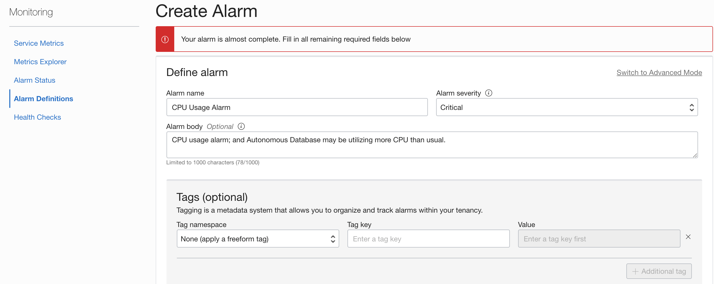

  Under **Metric description**

- **COMPARTMENT:** Choose the compartment containing the Autonomous Database for which you are creating the alarm
- **METRIC NAMESPACE**: Options depend on the types of resources that exist in the selected compartment. In this case, choose **oci_autonomous_database**.
- **METRIC NAME** : **CpuUtilization** 

  Under **Metric dimensions**

- **DIMENSION NAME:** Keep the default value, **resourceId**
- **DIMENSION VALUE**: Keep the default value.
- **DEPLOYMENTTYPE**: Select **Shared**

  Under **trigger rule**

- **OPERATOR:** greater than
- **VALUE**: Specify the value of the condition threshold. In this lab example, specify **30** so that the alarm will trigger if CPU utilization exceeds 30 percent..
- **TRIGGER DELAY MINUTES**: Specify the number of minutes that the condition must be maintained before the alarm is in a firing state. In this lab example, specify **1** minute.

  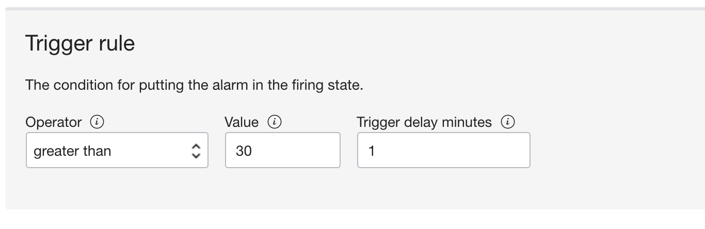

  Under **Notifications**

- **DESTINATION SERVICE:** Select **Notifications Service**
- **COMPARTMENT**: Select your compartment.
- **TOPIC**: Select the topic you defined earlier in Part 1 > Task 1 of this lab. Click **Save alarm**.

  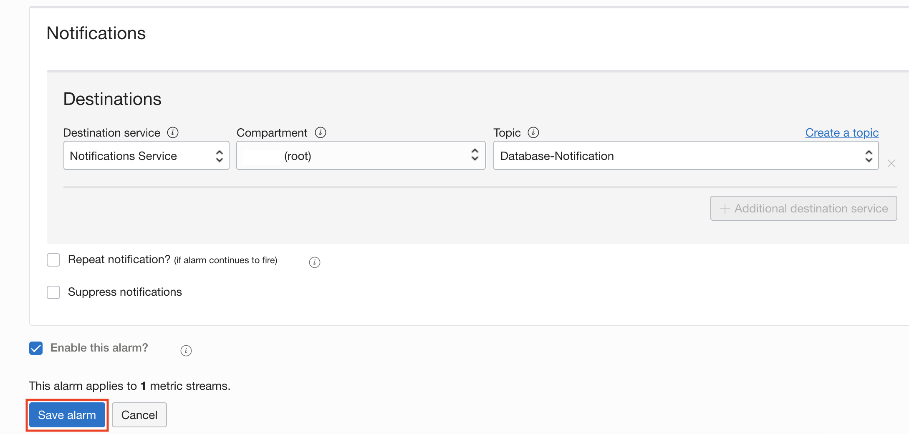

## Task 9: Re-run the Procedure in the Auto Scaling Lab to Create a CPU Utilization that Triggers the Alarm

1. Return to this workshop's Auto Scaling lab.  
2. In Part 2 of that lab, perform Task 5. Run the `**test_proc**` procedure concurrently in 3 SQL Developer Web query worksheet instances, which should result in CPU utilization greater than the 30% specified as the triggering level in the alarm. 

## Task 10: Verify that an Email Notification Was Sent

Check the email account you specified to verify that a notification email was sent.

1. Go to the specified email account and verify that a notification of the CPU utilization has been sent. 

  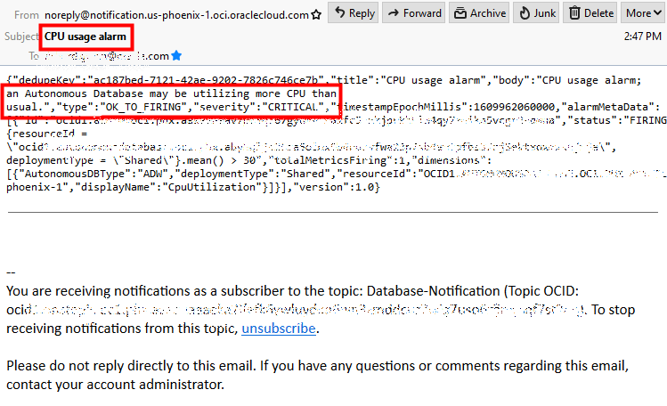

You may now **proceed to the next lab**.

## Want to Learn More?

- ADW Documentation: [Use Autonomous Database Events](https://docs.oracle.com/en/cloud/paas/autonomous-data-warehouse-cloud/user/notification-critical-and-informational-events.html#GUID-7D1E3455-CD54-495B-BAE5-46B4CBB002B1)
- OCI Documentation: [Getting Started with Events](https://docs.cloud.oracle.com/en-us/iaas/Content/Events/Concepts/eventsgetstarted.htm)
- OCI Documentation: [Overview of Events](https://docs.cloud.oracle.com/en-us/iaas/Content/Events/Concepts/eventsoverview.htm)
- OCI Documentation: [Notifications Overview](https://docs.oracle.com/en-us/iaas/Content/Notification/Concepts/notificationoverview.htm)
- LiveLabs Workshop: [Using Events and Notifications](https://apexapps.oracle.com/pls/apex/dbpm/r/livelabs/view-workshop?p180_id=653) 

## Acknowledgements

- **Author **- Rick Green, Principal Developer, Database User Assistance
- **Contributor** - Nilay Panchal, ADB Product Management
- **Last Updated By/Date** - Kamryn Vinson, May 2021
