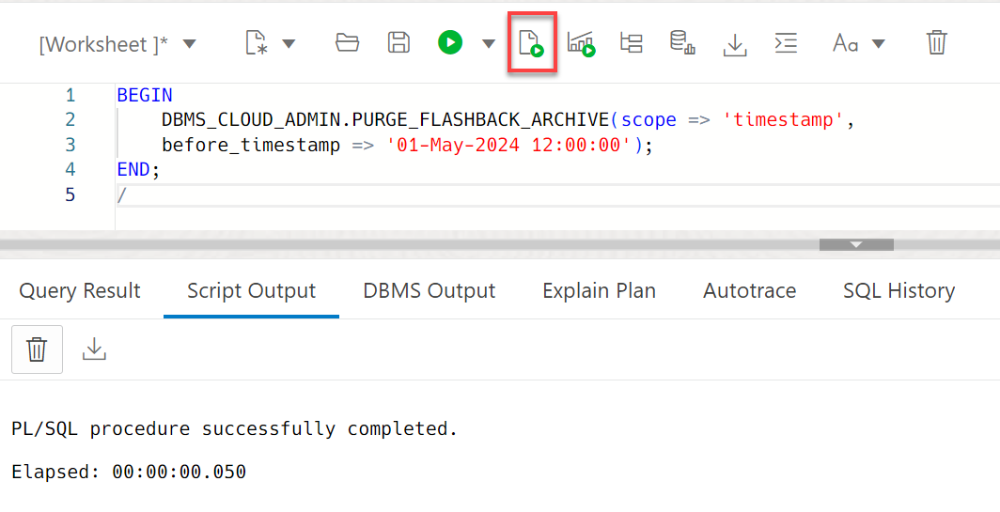

# Flashback Time Travel

## Introduction

This lab shows how to use the `Flashback Time Travel` feature on Oracle Autonomous AI Database.
In this lab you will learn to work with `Flashback Time Travel` for a table in an Oracle Autonomous AI Database (Lakehouse and Autonomous Transaction Processing) on Oracle Cloud Interface.

Estimated Lab Time: 30 minutes (25 minutes if you are running this workshop in an **Oracle LiveLabs sandbox** hosted environment)

### About Oracle Flashback Time Travel

Oracle Flashback Technology is a group of Oracle Database features that let you view past states of database objects or to return database objects to a previous state without using point-in-time media recovery.

Oracle Flashback Time Travel lets you track and store transactional changes to a table over its lifetime. Flashback Time Travel is useful for compliance with record stage policies and audit reports. You can also use Oracle Flashback Time Travel in various scenarios such as accessing historical data, and selective data recovery.

### Objectives

In this lab, you will:

- Connect with SQL Worksheet
- Enable Flashback Time Travel
- Retrieve Historical Data
- Disable Flashback Time Travel
- Restore a Dropped Table
- Modify the Retention Time for Flashback Time Travel
- Purge Historical Data

### Prerequisites

This lab assumes you have:

- Performed the previous lab on provisioning an Oracle Autonomous AI Database instance.
- Performed the previous lab on Work with Free Sample Data Sets.
- You must be logged an as the `ADMIN` user or have `FLASHBACK ARCHIVE` privilege on `FLASHBACK_ARCHIVE`.

## Task 1: Connect with the SQL Worksheet

To complete the subsequent tasks you need to use SQL Worksheet.

1. Return to your SQL Worksheet. On the **Autonomous AI Databases** page, click the **`ADW_Finance_Mart`** database instance that you created in **Lab 1: Provision Autonomous AI Database**. Click the **Database actions** drop-down list, and then select **SQL**.

   

   The SQL Worksheet is displayed.

## Task 2: Enable Flashback Time Travel while Creating a Table

To utilize the Flashback Table features for your tables you must first enable flashback for your table which is by default disabled for new and existing tables.
You can enable Flashback Time Travel for an existing table or a new table that you will create.

1. Enable Flashback Time Travel as you create the `EMPLOYEES` table. Copy and paste the following code into your SQL Worksheet, and then click the **Run Script (F5)** icon in the Worksheet toolbar.

    ```
    <copy>
    CREATE TABLE employees (EMPNO NUMBER(4) NOT NULL,
        ENAME VARCHAR2(10),
        JOB VARCHAR2(9),
        MGR NUMBER(4)) FLASHBACK ARCHIVE;
    </copy>
    ```

    

    The `EMPLOYEES` table is created with Flashback Time Travel enabled.

## Task 3: Enable Flashback Time Travel for an Existing Table

You can enable Flashback Time Travel for an existing table also, if not already enabled.
In this task, you will first create the `DEPARTMENTS` table and then enable the Flashback Time Travel for the table.

1. Create the `DEPARTMENTS` table. Copy and paste the following code into your SQL Worksheet, and then click the **Run Script (F5)** icon in the Worksheet toolbar.


    ```
    <copy>
    CREATE TABLE departments (DEPNO NUMBER(4) PRIMARY KEY,
        DNAME VARCHAR2(10),
        MGR NUMBER(4),
        LOC_ID NUMBER(4));
    </copy>
    ```

    

2. Enable Flashback Time Travel on the `DEPARTMENTS` table. Copy and paste the following code into your SQL Worksheet, and then click the **Run Script (F5)** icon in the Worksheet toolbar.

    ```
    <copy>
    ALTER TABLE departments FLASHBACK ARCHIVE;
    </copy>
    ```

    

    This enables the Flashback Time Travel for the `DEPARTMENTS` table.

## Task 4: Retrieve a Past State of Data from a Table Using Flashback Query

Once the Flashback Time Travel is enabled for a table you can view the past states of data in the table.

You can use the **`SELECT`** statement with an **`AS OF`** clause to retrieve data, as it existed at an earlier time. The query explicitly references a past time through a time stamp or System Change Number (SCN) to return committed data that was current at that point in time.

In this task, you will insert records into the `EMPLOYEES` table, update the records, and view the past states of table data.

1. Insert records into the `EMPLOYEES` table. Copy and paste the following code into your SQL Worksheet, and then click the **Run Script (F5)** icon in the Worksheet toolbar.

    ```
    <copy>
    INSERT INTO employees (empno, ename, job, mgr) VALUES (1001, 'Jhon', 'IT_MAN', NULL);
    INSERT INTO employees (empno, ename, job, mgr) VALUES (1002, 'King', 'HR_MAN', NULL);
    INSERT INTO employees (empno, ename, job, mgr) VALUES (1003, 'Joel', 'IT_MAN', NULL);
    INSERT INTO employees (empno, ename, job, mgr) VALUES (1004, 'Laurent', 'VP', NULL);
    INSERT INTO employees (empno, ename, job, mgr) VALUES (1005, 'Peter', 'VP', NULL);
    COMMIT;
    </copy>
    ```

    

    

2. Keep a note of the current timestamp in order to see the current state of data in the future. Copy and paste the following code into your SQL Worksheet, and then click the **Run Script (F5)** icon. This will retrieve the current timestamp of the database.

    ```
    <copy>
    SELECT SYSTIMESTAMP
    FROM dual;
    </copy>
    ```

    

3. Update a record in the `EMPLOYEES` table. Let's update the `MGR` field for `EMPNO 1002`. Copy and paste the following code into your SQL Worksheet, and then click the **Run Script (F5)** icon.

    ```
    <copy>
    UPDATE EMPLOYEES
    SET mgr=1004
    WHERE empno=1002;
    </copy>
    ```

    

4. Verify the update operation. Copy and paste the following code into your SQL Worksheet, and then click the **Run Script (F5)** icon.

    ```
    <copy>
    SELECT *
    FROM EMPLOYEES
    WHERE empno=1002;
    </copy>
    ```

    

5. Now, you can use Oracle Flashback Query to examine the contents of the table as it existed at a previous timestamp.  Copy and paste the following code into your SQL Worksheet. _Substitute the timestamp in the code with your own database's timestamp from step 2._ Next, click the **Run Script (F5)** icon.

    ```
    <copy>
    SELECT * FROM employees
    AS OF TIMESTAMP
    TO_TIMESTAMP('2025-10-08 12:43:55','YYYY-MM-DD HH24:MI:SS')
    WHERE empno=1002;
    </copy>
    ```

   

    > **Note:** The result displays the `NULL` for the `MGR` field. Also, we are using the 24 hour time format, `HH24`.

## Task 5: Disable Flashback Time Travel

You can disable the `FLASHBACK TIME TRAVEL` for a table using the `NO FLASHBACK ARCHIVE` clause.
In this task you will disable the `FLASHBACK TIME TRAVEL` for the `EMPLOYEES` table.

1. Disable Flashback Time Travel for the EMPLOYEE table. Copy and paste the following code into your SQL Worksheet, and then click the **Run Script (F5)** icon.

    ```
    <copy>
    ALTER TABLE employees NO FLASHBACK ARCHIVE;
    </copy>
    ```

    

## Task 6: Restore a Table Using Flashback Table

You can use the `FLASHBACK TABLE` statement along with the `TO BEFORE DROP` clause to restore a dropped table.

When you drop a table, Oracle assigns a system-generated name to the table and the table becomes a part of the recycle bin. You can restore the dropped table using either the original user-specified name of the table or the system-generated name.
The dropped table is restored from recycle bin, along with all possible dependent objects.

In this task, you will drop the `DEPARTMENTS` table and then restore it back using the `FLASHBACK TABLE` command.

> **Note:** You must first disable `FLASHBACK ARCHIVE` for a table to drop the table that has `FLASHBACK ARCHIVE` enabled for it.

1. Disable Flashback Time Travel for the `DEPARTMENTS` table. This disables the `Flashback Time Travel` on the `DEPARTMENTS` table.

    ```
    <copy>
    ALTER TABLE departments NO FLASHBACK ARCHIVE;
    </copy>
    ```
    

2. Drop the `DEPARTMENTS` table using the following command:

    ```
    <copy>
    DROP TABLE departments;
    </copy>
    ```

    

    The table is dropped and it is now a part of the `recyclebin` and has a system-generated name.

3. Query the `RECYCLEBIN` to view the dropped `DEPARTMENTS` table.

    ```
    <copy>
    SELECT object_name, original_name
    FROM RECYCLEBIN;
    </copy>
    ```

    

4. Restore the `DEPARTMENTS` table.

    ```
    <copy>
    FLASHBACK TABLE departments TO BEFORE DROP
    </copy>
    ```

    

    This restores the `DEPARTMENTS` table from the recycle bin.

5. Verify that the `DEPARTMENTS` table has been restored.

    ```
    <copy>
    DESC departments;
    </copy>
    ```
    

## Task 7: Modify Flashback Archive Retention Time

 A Flashback Archive is configured with retention time. Data archived in the Flashback Archive is retained for the retention time specified when the Flashback Archive was created. You can modify the retention time for Flashback Time Travel for your database.

1. To modify the retention time to 90 days for Flashback Time Travel, run the following script in your SQL Worksheet.

    ```
    <copy>
    BEGIN
      DBMS_CLOUD_ADMIN.SET_FLASHBACK_ARCHIVE_RETENTION(
      retention_days => 90);
    END;
    </copy>
    ```
    
    

    >**Note:** To modify the retention time for Flashback Time Travel you must be logged in as the **`ADMIN`** user or you must have execute privilege on the **`DBMS_CLOUD_ADMIN`** PL/SQL package.

## Task 8: Purge Historical Data

You can purge the `Flashback ARCHIVE` based on the timestamp or SCN or you can also purge all Flashback Time Travel data.

In this task you will learn about the steps to purge `Flashback Time Travel`.

1. To purge `Flashback Time Travel` historical data before a specified timestamp, run the following code in your SQL Worksheet:

    ```
    <copy>
    BEGIN
    DBMS_CLOUD_ADMIN.PURGE_FLASHBACK_ARCHIVE(scope => 'timestamp', before_timestamp => '01-october-2025 12:00:00');
    END;
    /
    </copy>
    ```
    
    

    This purges the flashback historical data based on the provided `timestamp` from the `Flashback Data Archive`.

2. You can also purge `Flashback Time Travel` historical data before a specified system change number. To get the system change number, `SCN`, for your database instance, run the following query. 

    ```
    <copy>
    SELECT CURRENT_SCN 
    FROM V$DATABASE;
    /
    </copy>
    ```

    

 
3. To purge `Flashback Time Travel` historical data before a specified system change number, `SCN`, run the following code in your SQL Worksheet.

    ```

    <copy>
    BEGIN
        DBMS_CLOUD_ADMIN.PURGE_FLASHBACK_ARCHIVE(scope => 'scn',before_scn=> '45652117865953');
    END;
    /
    </copy>
    ```

    

     This purges the flashback historical data based on the system change number `scn` from the `Flashback Data Archive`.

4. To purge all `Flashback Time Travel` historical data, run the following code in your SQL Worksheet:

    ```

    <copy>
    BEGIN
        DBMS_CLOUD_ADMIN.PURGE_FLASHBACK_ARCHIVE(scope => 'ALL');
    END;
    /
    </copy>
    ```

    

    This purges all the flashback historical data from the `Flashback Data Archive`.
    
    >**Note:** To purge the `Flashback Data ARchive` you must be logged in as the **`ADMIN`** user or you must have execute privilege on **`DBMS_CLOUD_ADMIN`** PL/SQL package.

## Want to Learn More?

* [Use Flashback Time Travel](https://docs.oracle.com/en/cloud/paas/autonomous-database/adbsa/flashback-time-travel-autononomous.html#GUID-A98E1F8B-FAE4-4FFF-955D-3A0E5F8EBC4A)
- [How to Use Flashback Time Travel in Autonomous AI Database](https://blogs.oracle.com/datawarehousing/post/flashback-time-travel-autonomous-database#:~:text=Retention%20of%20Historical%20Changes%3A%20Flashback,the%20timestamp%20of%20each%20change.).

## Acknowledgments

- **Author:** Shilpa Sharma, Senior User Assistance Developer, Database Development
- **Contributor:** Lauran K. Serhal, Consulting User Assistance Developer
- **Last Updated By/Date:** Lauran K. Serhal, October 2025
