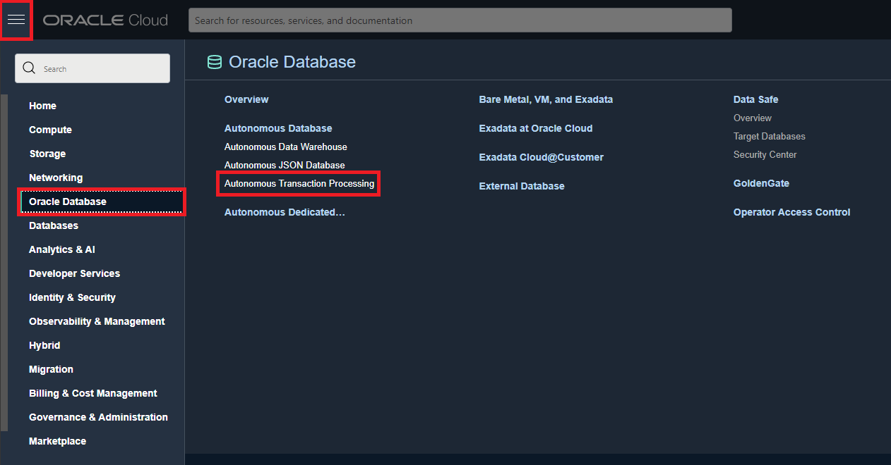
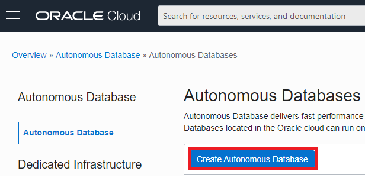
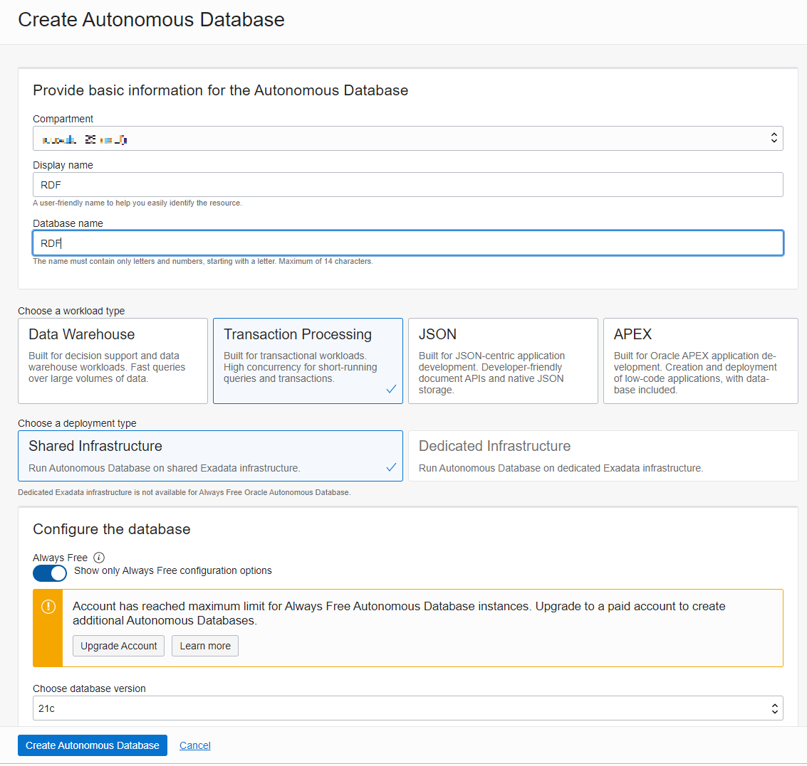
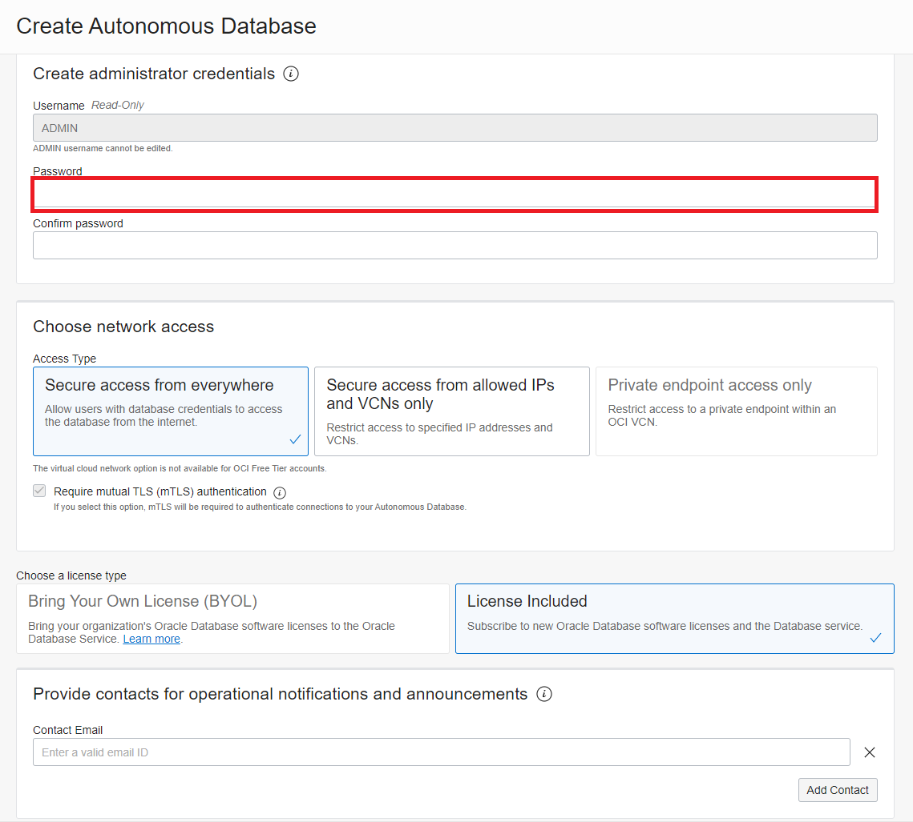
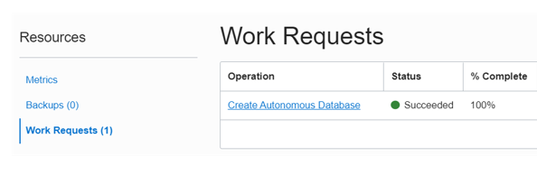

# Prepare the Environment #

## Introduction

Oracle Autonomous Transaction Processing (ATP) is a fully managed Oracle database service with “self-driving” features on the Oracle Cloud Infrastructure (OCI). It is a best practice to create a user with permissions to use Graph Studio.

The following lab guide shows how to provision an ATP and create a user with permissions for Graph Studio.

Estimated Time: 15 minutes

### Objectives

- Create Autonomous Database on Oracle Cloud.

### Prerequisites

  - Web Browser
  - Always ensure you are in your correct Region and Compartment

## **Task 1:** Login to Oracle Cloud

1. From your browser, login into Oracle Cloud.

## **Task 2:** Provision ATP

Provision the Autonomous Transaction Processing database (ATP) with the steps below. Alternatively, an Autonomous Data Warehouse (ADW) can be used similarly.

1. Select your assigned Region from the upper right of the OCI console.

2. From the hamburger menu (top left side), select Oracle Database and then, Autonomous Transaction Processing.

  

3. Click Create Autonomous Database.

  

4. Choose your compartment.

5. Enter any unique name (maybe your name) for your display and database name.
   The display name is used in the  Console UI to identify your database.

  

6. Ensure Transaction Processing workload type is selected.

7.  Enter a password. The username is always ADMIN. (Note: remember your password)

  

8.  Click Create Autonomous Database at the bottom.

    Your console will show that ATP is provisioning. This will take about 2 or 3 minutes to complete.

    You can check the status of the provisioning in the Work Request.

  

This concludes this lab. *You may now proceed to the next lab.*

## Acknowledgements

* **Author** - Nicholas Cusato (Santa Monica Specialist Hub)
* **Contributors** -  Nicholas Cusato (Santa Monica Specialist Hub)
* **Last Updated By/Date** - Nicholas Cusato, February 2022
