# Get Started with RDF Graphs
​
## Introduction
This lab walks you through the steps to get started by uploading the RDF data to a bucket that will be linked to the Autonomous Database. This requires copying the correct OCI username from the profile. To allow Graph Studio to access the RDF data in OCI Object storage (using the DBMS_CLOUD package), you must create an access token using your OCI account. This will be used in the secondary lab.
​

Estimated Time: 5 minutes
​
### Objectives
- Upload RDF Data into OCI Object Storage
- View your OCI User Name
- Generate Access token
​
### Prerequisites
  This lab assumes you have:
  - Oracle Cloud Account
  - Download the MOVIESTREAM file (moviestream\_rdf.nt) using this [link](https://objectstorage.us-ashburn-1.oraclecloud.com/p/VEKec7t0mGwBkJX92Jn0nMptuXIlEpJ5XJA-A6C9PymRgY2LhKbjWqHeB5rVBbaV/n/c4u04/b/livelabsfiles/o/data-management-library-files/moviestream_rdf.nt)
​
​
## **Task 1:** Upload RDF Data into OCI Object Storage
​
1. Sign in to OCI console using your Oracle Cloud credentials.
​
2. Open the navigation menu and click Storage. Under Object Storage & Archive Storage, click Buckets as shown:
​
  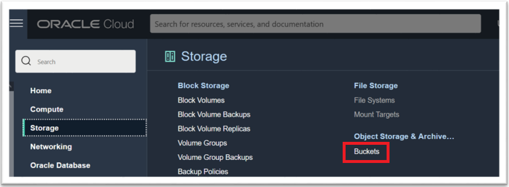
​
3. Select a Compartment that applies to your OCI account.
​
  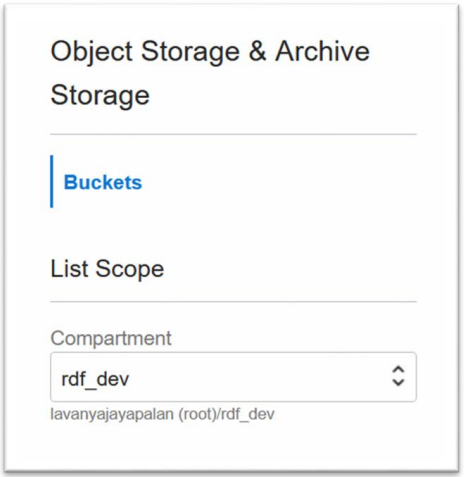
​
4. Click Create Bucket. The Create Bucket slider opens as shown:
​
  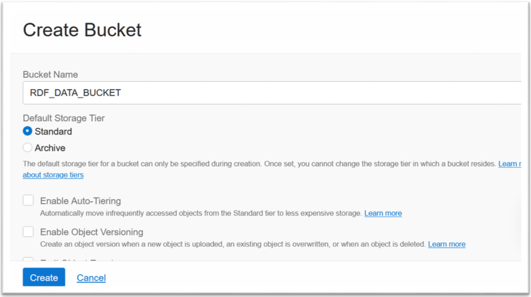
​
​
5. Enter the Bucket Name, leave everything else as default, and click Create. The bucket gets created and is listed on the Buckets page as shown:
​
  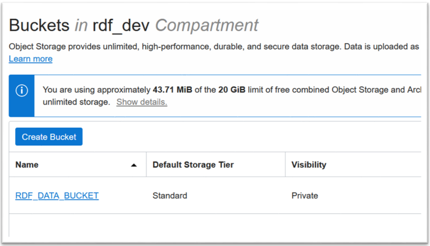
​
6. Click on the RDF\_DATA\_BUCKET link and navigate to the Bucket Details page.

  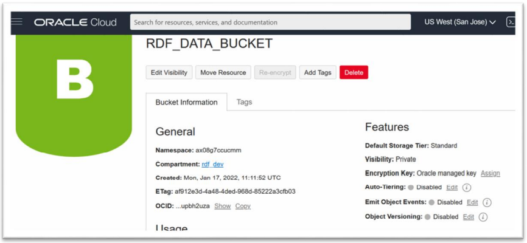
​
7. Click Upload in the Objects section. The Upload Objects slider opens.
​
8. Select the downloaded RDF moviestream\_rdf.nt file [link](https://objectstorage.us-ashburn-1.oraclecloud.com/p/VEKec7t0mGwBkJX92Jn0nMptuXIlEpJ5XJA-A6C9PymRgY2LhKbjWqHeB5rVBbaV/n/c4u04/b/livelabsfiles/o/data-management-library-files/moviestream_rdf.nt) on your local system and click Upload.
The file gets uploaded successfully. Click Close to return to the Bucket Details
page. The uploaded file is listed under Objects as shown:
​
  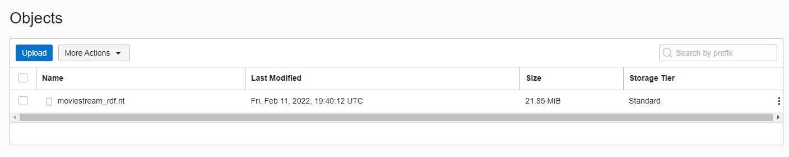
​
1. Select the Actions menu for the uploaded file and click View Object Details to access the properties of the uploaded file. The Object Details slider opens as shown:
​
  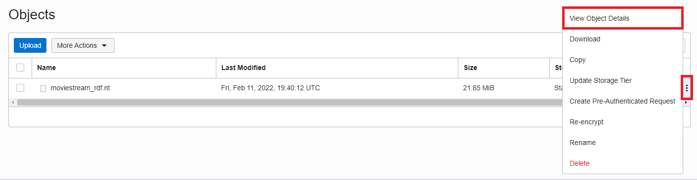
​
2.   Note the URL path of the object. This is used in the RDF import wizard in Graph Studio.
​
  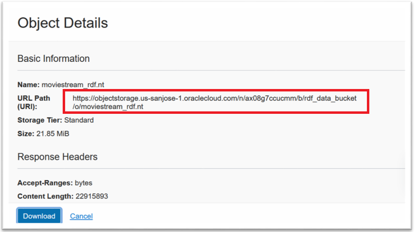
​
## **Task 2:** View your OCI User Name

1. Click the avatar icon in the top right corner to open your profile. The first entry under Profile is your OCI user name.
​
  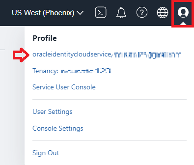
​
2. Note your OCI user name. This is used in the RDF import wizard in Graph Studio.
​
  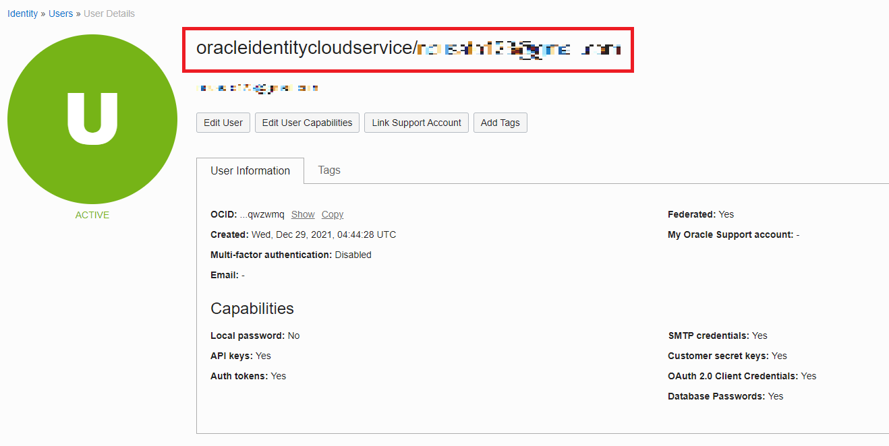
​
## **Task 3:** Generate an Access Token from the OCI Console
​
1. Sign in to the OCI console using your Oracle Cloud credentials.

2. Click the avatar icon in the top right corner to open your profile and click User Settings.
​
  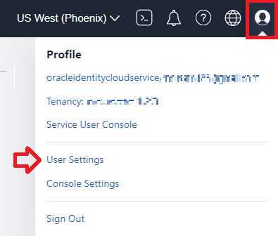
​
3. Click on Auth Tokens under Resources as shown:
​
  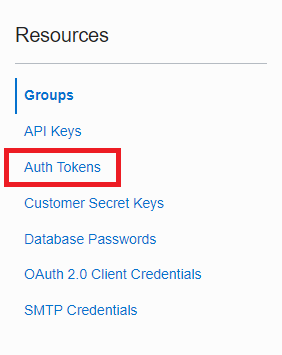
​
5. Click Generate Token. The Generate Token dialog opens.
​
  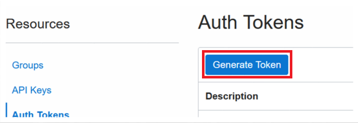
​
6. Enter a Description and click Generate Token. The Generated Token details are displayed as shown:
​
  
​
7. Click Copy to copy the token and save it for later use.

This concludes this lab. *You may now proceed to the next lab.*
​
## Acknowledgements

- **Author**- Melliyal Annamalai, Distinguished Product Manager
- **Technical Contributor** -  Nicholas Cusato, Santa Monica Specialist Hub
- **Last Updated By/Date** - Nicholas Cusato, Santa Monica Specialist Hub, February 25 2022
