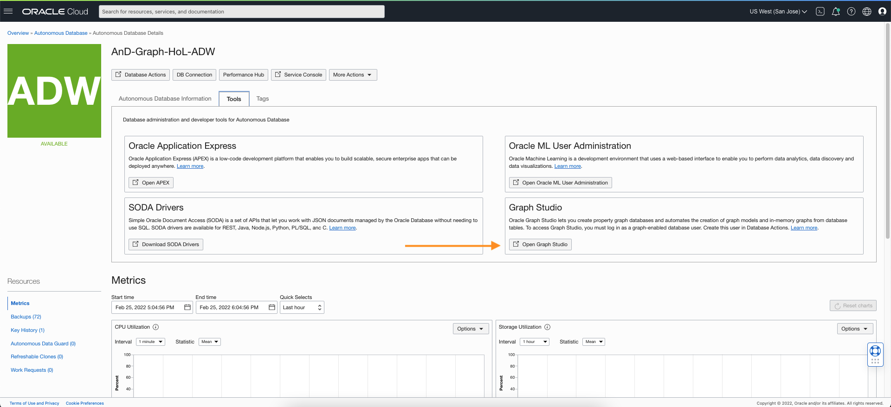
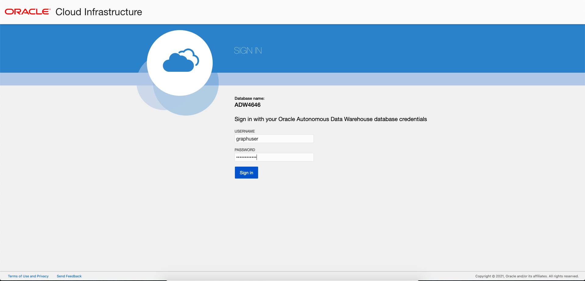
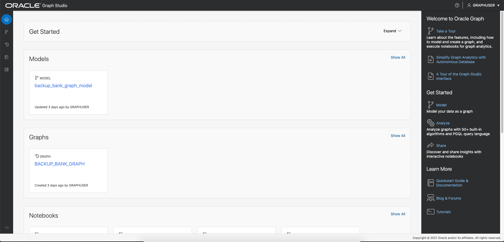
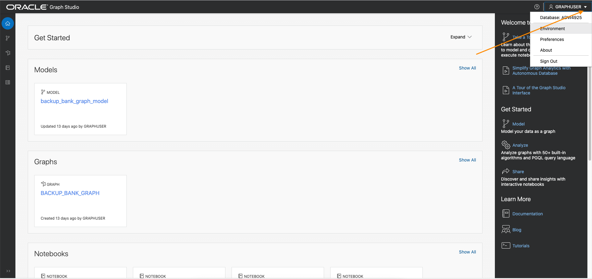
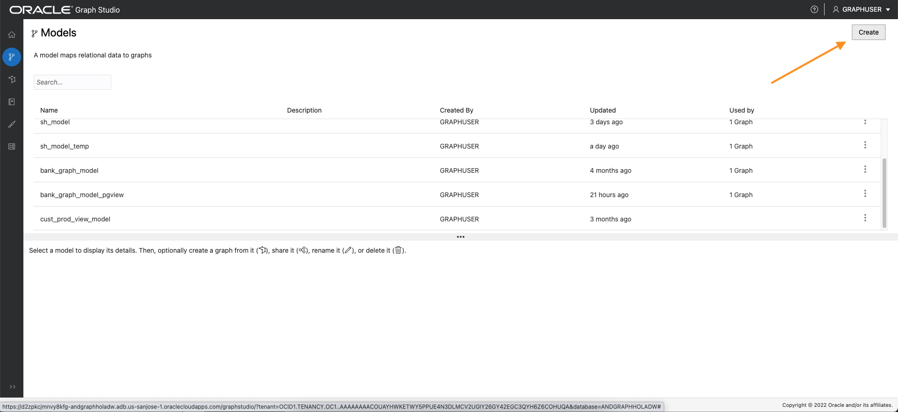
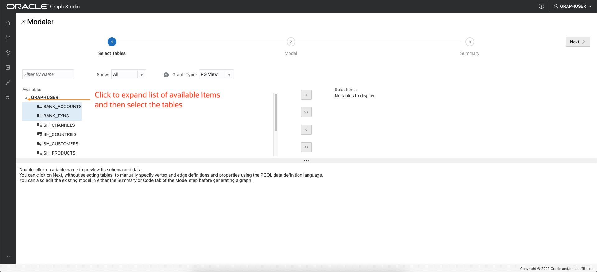
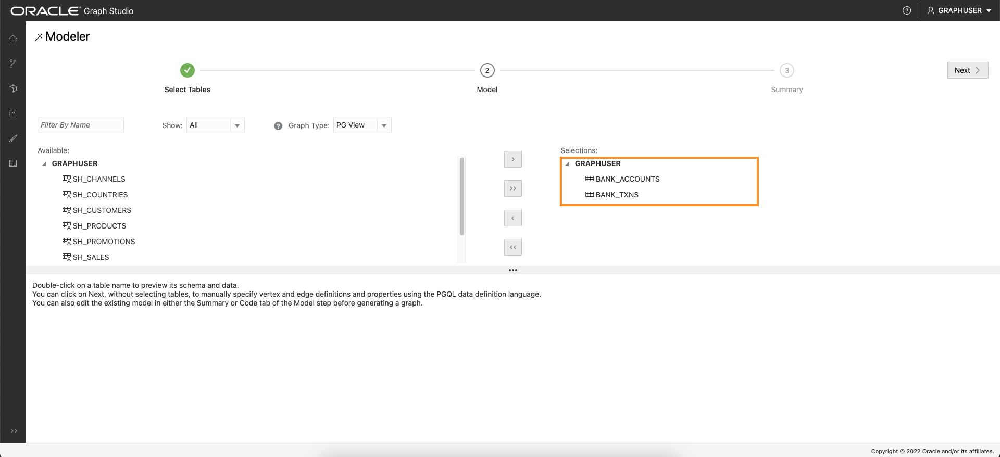
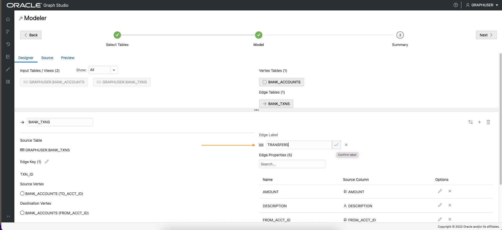
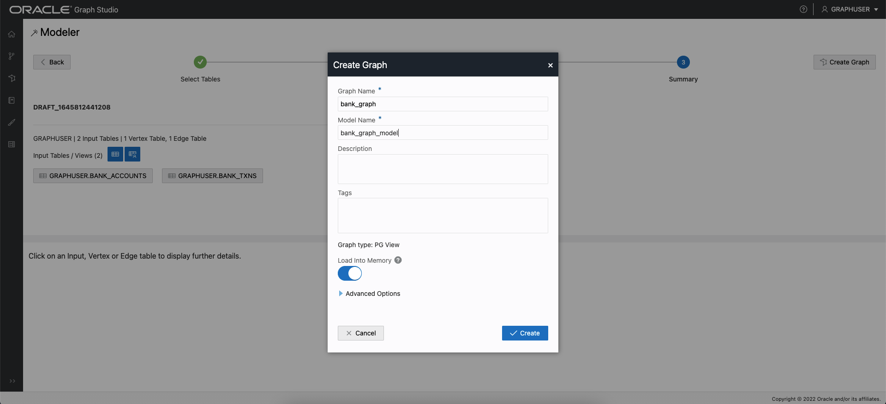
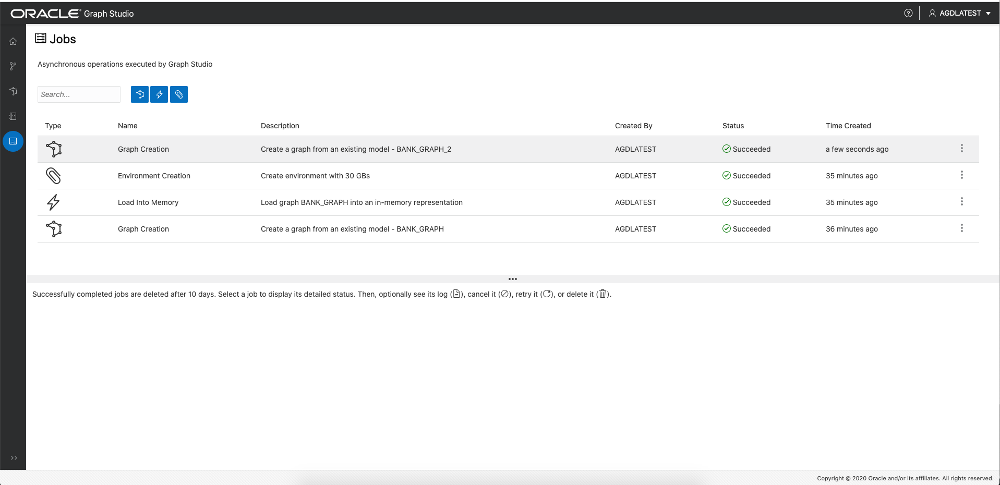

# Graph Studio: Create a graph using PGQL CREATE PROPERTY GRAPH statement

## Introduction

In this lab you will create a graph from the `bank_accounts` and `bank_txns` tables using Graph Studio and the CREATE PROPERTY GRAPH statement.

The following video shows the steps you will execute in this lab.

 Graph Studio: Create a graph.

Estimated Time: 15 minutes. 

### Objectives

Learn how to
- use Graph Studio and PGQL DDL (that is, CREATE PROPERTY GRAPH statement) to model and create a graph from existing tables or views.

### Prerequisites

- The following lab requires an Autonomous Database - Shared Infrastructure account. 
- And that the Graph-enabled user exists. That is, a database user with the correct roles and privileges exists.

## Task 1: Connect to your Autonomous Database using Graph Studio

1. If you have the Graph Studio URL then proceed to step 4. 

    Log in to the Oracle Cloud Console, choose the Autonomous Database instance, then Click the **Tools** tab on the details page menu on the left. 

   

2. Click the Graph Studio card to open in a new page or tab in your browser.   
   
   If your tenancy administrator provided you the Graph Studio URL to connect directly then use that instead.

3. Enter your Autonomous Database account credentials (`GRAPHUSER`/`gs_LLwid770#`) into the login screen:

    

4. Then click the "Sign In" button. You should see the studio home page.   

     

    Graph Studio consists of a set of pages accessed from the menu on the left. 

    The Home icon  takes you to the Home page.  
    The Models icon  takes you to the Models page where you start modeling your existing tables and views as a graph and then create, or instanstiate, a graph.  
    The Graph page  lists existing graphs for use in notebooks.  
    The Notebook page  lists existing notebooks and lets you create a new one.  
    The Jobs page  lists the status of background jobs and lets you view the associated log if any.  

## Task 2: Create a small 4GB execution environment

1. Before creating a graph we will **create an execution environment** for running notebook paragraphs and loading the graph into an in-memory representation.   
   
   Click the pull-down menu under the username `GRAPHUSER` shown in the top right corner of the Graph Studio browser window.  
   Select the `Environment` menu item.  

   
2. Enter a **value of 4 (GB)** for the memory size and then click `Create`.  

    
3. The Jobs page will show the status. Meanwhile let's start modeling and creating a graph from the existing tables.  

   

## Task 3: Create a graph of accounts and transactions from the corresponding tables

1. Click the Models icon to navigate to the start of the modeling workflow.  
   Then Click `Create`.  
     

2. Then select the `BANK_ACCOUNTS` and `BANK_TXNS` tables.   

2. Move them to the right, that is, click the first icon on the shuttle control.   

   

3.  Click next to get a suggested model. We will edit and update this model.  

    The suggested model has `BANK_ACCOUNTS` as a vertex and `BANK_TXNS` as an edge.     
    We wish to update the default vertex label, i.e. change the label for BANK_ACCOUNTS to `ACCOUNTS`. 

      

  

4.  Next we will update the edge label and confirm that the edge has the right direction from source `from_acct_id` to destination `to_acct_id`.   
    
          

  Click within the Edge Label text box and change it from `BANK_TNXS` to `TRANSFERS` to update it.  
  We will be using vertex and labels in (PGQL) queries in the next lab.  

  Next note that the edge **direction** is incorrect. The source vertex is currently the `TO_ACCT_ID` while we want it to be the `FROM_ACCT_ID`. 

   Click the swap edge icon on the right to swap the source and destination vertices and hence reverse the edge direction.

    

   Note that the `Source Vertex` is now the correct one, i.e. the `FROM_ACCT_ID`.

    

   Click the `Source` tab to view the generated CREATE PROPERTY GRAPH statement which will be saved and used later. 

     

   **Important:** Click the **Save** (floppy disk icon) to commit the changes. 

5. Click `Next` and then click `Create Graph` to move on to the next step in the flow.   

   Enter `bank_graph` as the graph name.  
   That graph name is used throughout the next lab.  
   Do not enter a different name because then the queries and code snippets in the next lab will fail.  
   
   Enter a model name (for example, `bank_graph_model`), and other optional information.  
   

6. Graph Studio modeler will now save the metadata and start a job to create the graph.  
   The Jobs page shows the status of this job. 

     

   You can then interactively query and visualize the graph in a notebook after it's loaded into memory.

Please **proceed to the next lab** to do so.

## Acknowledgements
* **Author** - Jayant Sharma, Product Management
* **Contributors** -  Jayant Sharma, Product Management
* **Last Updated By/Date** - Jayant Sharma, February 2022
  
