# Graph Studio: Load data from CSV files into tables

## Introduction

In this lab you will load two CSV files into corresponding tables using the Database Actions interface of your 
Oracle Autonomous Data Warehouse  or Oracle Autonomous Transaction Processing instance.

<!-- COMMENTED THE FOLLOWING OUT FOR DATABSE WORLD:

 The following video shows the steps you will execute in this lab.

[](youtube:F_3xe18kWoo) Graph Studio: Load CSV Files. -->


Estimated Time: 10 minutes.

Watch the video below for a quick walk through of the lab.

[](youtube:wkKKO-RO0lA)


### Objectives

Learn how to
- load CSV files into an Autonomous Database using Database Actions


### Prerequisites

- The following lab requires an Oracle Autonomous Database account. 
- It assumes that a Graph and Web-Access enabled user exists. That is, a database user with the correct roles and privileges exists and that user can log into Database Actions.


## Task 1: Connect to the Database Actions for your Autonomous Database instance

1. Open the service detail page for your Autonomous Database instance in the Oracle Cloud Console.  

     

2. Click  **Database Actions**  to open it.
 

## Task 2: Login as the graph-enabled user

1. Login as the graph user (for example, `GRAPHUSER`) for your Autonomous Database instance. 
   
    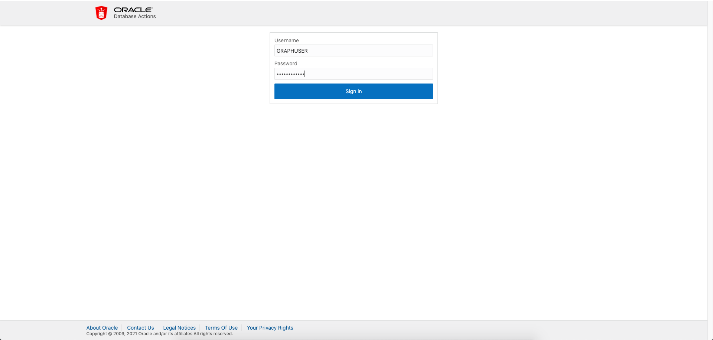  

    >**Note:** *If necessary, do the following to create the user with the right roles and privileges*:
    - Log in to Database Actions as the **ADMIN** user for your Autonomous Database
    - Select **Administration** and then **Database Users** from the navigation menu
    - Click **Create User**
    - Turn on the **Web-Access** and **Graph** buttons

## Task 3: Download the sample datasets from the ObjectStore

1. Copy and paste the url in your browser for the zip archive, that is  

    ```
    <copy>
    https://objectstorage.us-ashburn-1.oraclecloud.com/p/VEKec7t0mGwBkJX92Jn0nMptuXIlEpJ5XJA-A6C9PymRgY2LhKbjWqHeB5rVBbaV/n/c4u04/b/livelabsfiles/o/data-management-library-files/random-acct-txn-data.zip
    </copy>
    ```

   Or use `wget` or `curl` to download the sample data to you computer.   
   An example `curl` request that you can copy and paste is:

    ```
    <copy>
    curl -G -o acct-txn-data.zip https://objectstorage.us-ashburn-1.oraclecloud.com/p/VEKec7t0mGwBkJX92Jn0nMptuXIlEpJ5XJA-A6C9PymRgY2LhKbjWqHeB5rVBbaV/n/c4u04/b/livelabsfiles/o/data-management-library-files/random-acct-txn-data.zip
    </copy>
    ```

2. **Unzip** the archive into a local directory such as ~/downloads.

## Task 4: Upload using Database Actions Data Load

1. Click the **DATA LOAD** card. 
   
   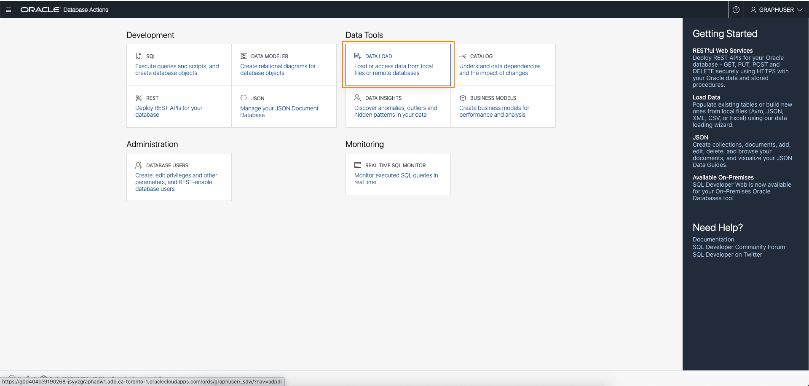
   
   Then specify the location of your data. That is, make sure the **LOAD DATA** and the **LOCAL FILE** cards have a check mark. Click **Next**.

   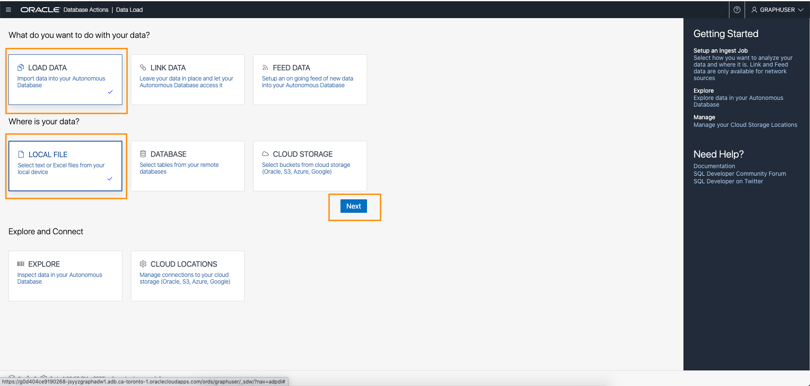

2. Click **Select Files**.
   
      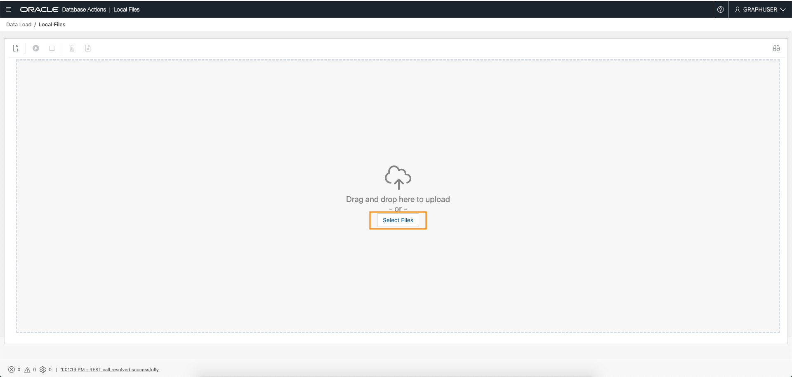 

    Navigate to the correct folder (for example, ~/downloads/random-acct-data) and select the `bank_accounts.csv` and the `bank_txns.csv` files.

    

3. Verify that the correct files were selected and then click **Run** icon.
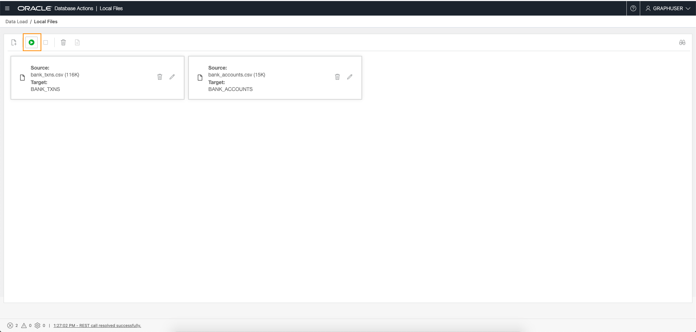

4. Confirm that you wish the data load job.

   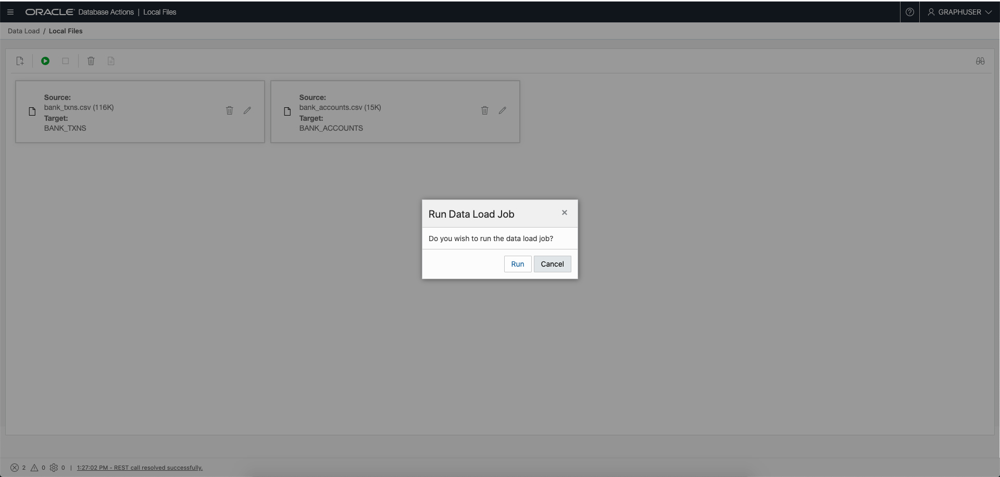

5. Once the files are loaded 
   
   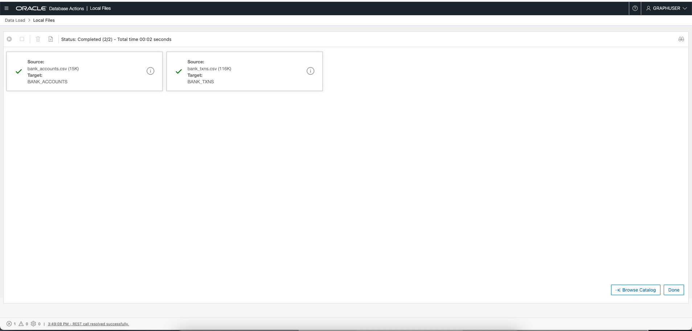  

   Click **Done** to exit.

   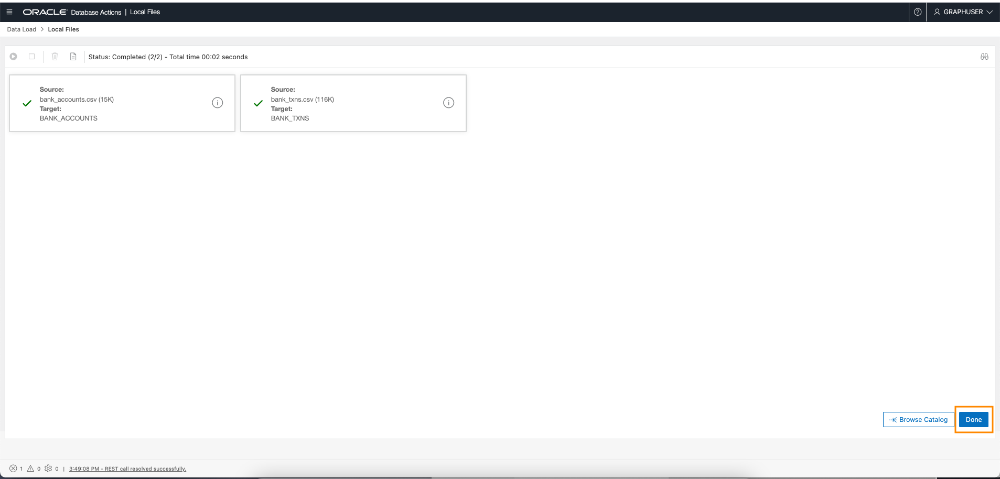

6. Now open the **SQL** Worksheet.
   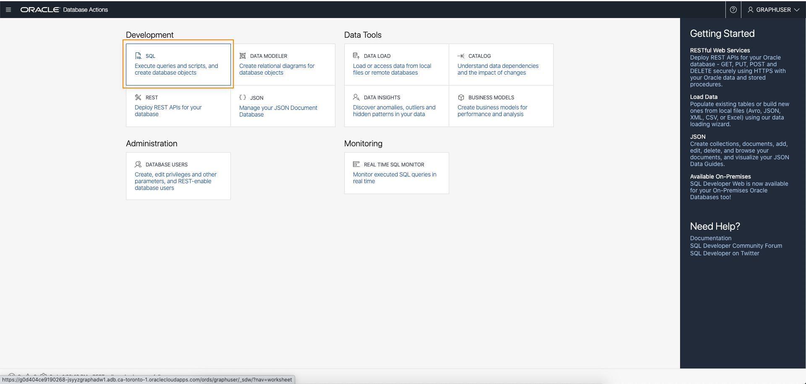

7. Navigate to the correct folder (for example, ~/downloads) and select the `fixup.sql` file and drag it into the SQL worksheet. 
   
   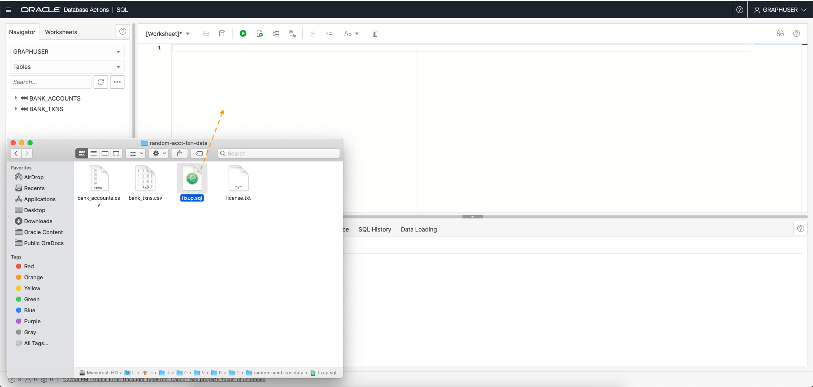  

   If, however, you prefer to copy-n-paste then the contents of `fixup.sql` are:

      ```
      <copy>
      alter table bank_accounts add primary key (acct_id);
      
      alter table bank_txns add txn_id number;
      update bank_txns set txn_id = rownum;
      commit;
      
      alter table bank_txns add primary key (txn_id);
      alter table bank_txns modify from_acct_id references bank_accounts (acct_id);
      alter table bank_txns modify to_acct_id references bank_accounts (acct_id);

      desc bank_txns;
      
      select * from USER_CONS_COLUMNS where table_name in ('BANK_ACCOUNTS', 'BANK_TXNS');
      </copy>      
      ```

      It does the following:
      - Adds a primary key constraint to the `bank_accounts` table
      - Adds a column (`txn_id`) to the `bank_txns` table
      - Sets a value for the `txn_id` and commits the transaction
      - Adds a primary key constraint to the `bank_txns` table
      - Adds a foreign key constraint to the `bank_txns` table specifying that `from_acct_id` references `bank_accounts.acct_id`
      - Adds a second foreign key constraint to the `bank_txns` table specifying that `to_acct_id` references `bank_accounts.acct_id` 
      - Helps you verify that the addition of a `txn_id` column and the constraints

8. Execute the `fixup.sql` script in the SQL worksheet.  
   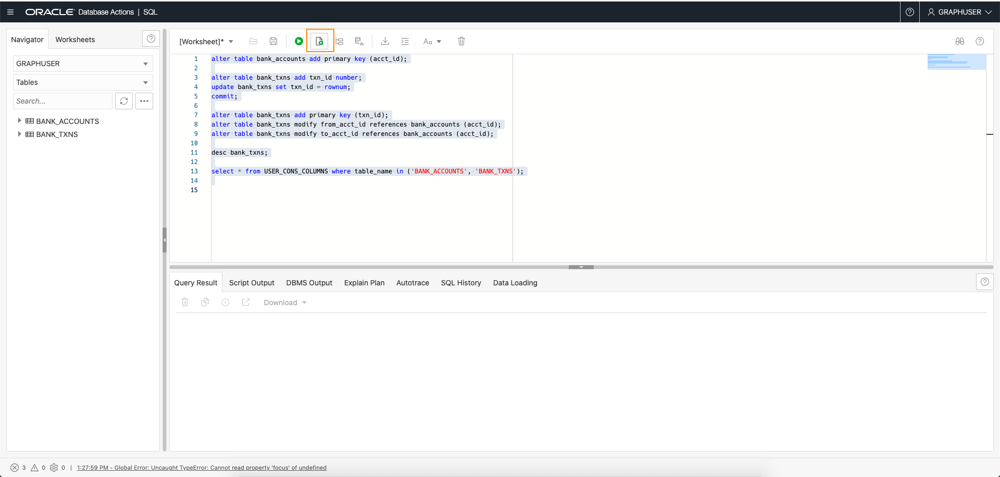  
   
9. The script output should look as follows:
   
   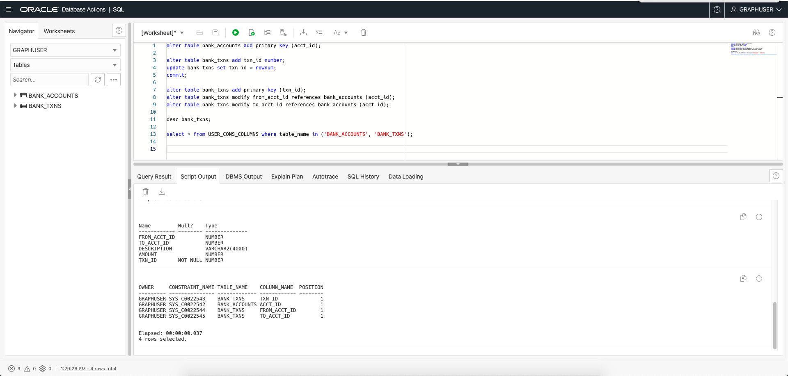
  

Please **proceed to the next lab** to create a graph from these tables.

## Acknowledgements
* **Author** - Jayant Sharma, Product Management
* **Contributors** -  Jayant Sharma, Product Management
* **Last Updated By/Date** - Jayant Sharma, Product Management, February 2022