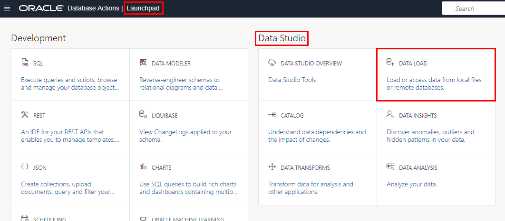
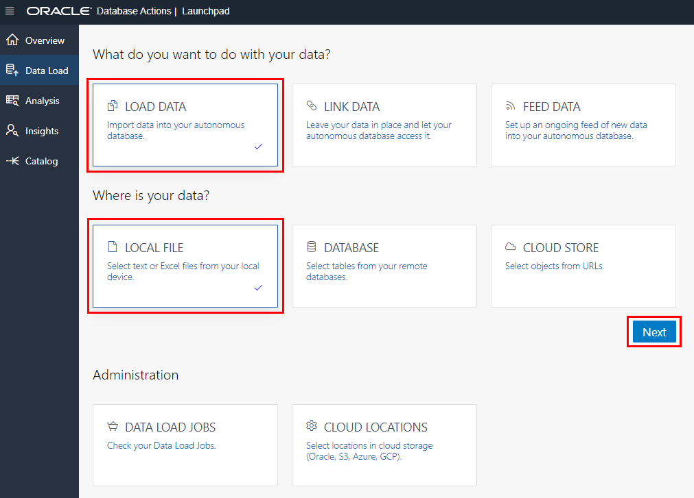
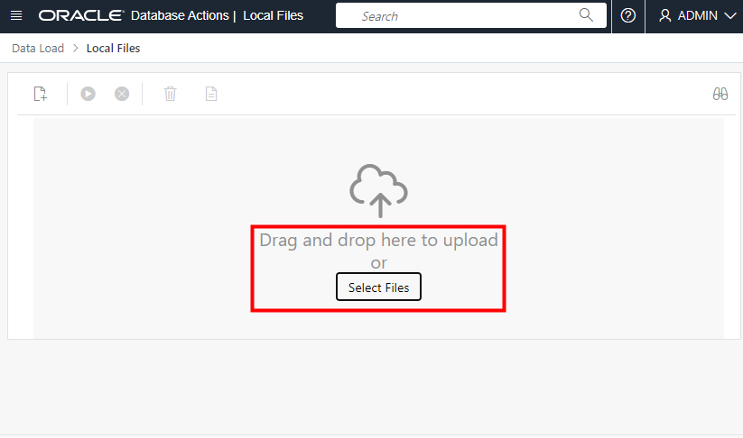

# Create Data Pipelines for Continuous Data Export and Import

## Introduction

Oracle Data Pipelines provide a continuous, incremental and fault-tolerant way to export and import data into ADB. With data pipelines, you can quickly and automatically load data into your database such as from your object store, as your ETL jobs and other data sources bring in new, clean data into your object store.

If you are loading data into or exporting out of ADB today, you are likely familiar with the **`DBMS_CLOUD`** package that provides the ability to load data into your database from the object store with `DBMS_CLOUD.COPY_DATA` or export data to your object store using `DBMS_CLOUD.EXPORT_DATA`. You may find yourself performing these operations repeatedly (you may even have scheduled jobs) to work with new data that is flowing into your object store or tables. The new Data Pipeline feature introduces the package **`DBMS_CLOUD_PIPELINE`** to simplify and automate this process, providing a unified solution of scheduled jobs for periodic data load and export of new data files with intuitive configurable knobs, legible troubleshooting outputs and default parallelism for optimal scalability.

The two types of data pipelines available are:

1. **Load Data Pipelines**: Data pipelines used for periodically loading data into the database, from new data files lying in your object store of choice. Some use cases for load pipelines would be:
    - Continuous migration of new on-premise data sets into the database via the object store of choice, using a load pipeline
    - Loading new, incoming real-time analytic data or outputs of an ETL process into the database using a load pipeline, via data files store in the object store

2. **Export Data Pipelines**: Data pipelines used for periodically exporting new, incremental data as results from a table or query in the database, to the object store of choice. An example use case for export pipelines would be:
    - Exporting new time-series style data generated by your application from the database to the object store at periodic intervals

Now that we understand what a data pipeline is in ADB, let's walk through how to create and set up a pipeline, to understand how it works. The steps you will follow to create and use a data pipeline are:

  1. Create a new data pipeline to either load data into the database or export data from the database.
  2. Configure your data pipeline by setting the right attributes as it relates to your data.
  3. Test that the data pipeline loads or exports some sample data as expected.
  4. Start a pipeline to continuously load or export your data.

    

Estimated Lab Time: 10 minutes

### Objectives

In this lab, you will:
* Create a data pipeline
* Configure the data pipeline attributes
* Test the data pipeline
* Start the data pipeline
* Upload data to your object storage bucket
* Check that the data pipeline loaded the data into the database
* Reset the pipeline's state and history

### Prerequisites

- This lab requires completion of the labs **Provision an Autonomous Database** and **Load Data from Object Storage Private Buckets** found in the Contents menu on the left.

## Task 1: Create a data pipeline

Begin by creating a data pipeline to either load data or export data continuously.

1. Return to Database Actions and click **SQL** to open a **SQL Worksheet**. Click the **Copy** button to copy this code snippet into the worksheet and run this snippet for creating a data pipeline to load data. **Note the pipeline\_type parameter**:

    ```
    <copy>
    BEGIN
     DBMS_CLOUD_PIPELINE.CREATE_PIPELINE(
        pipeline_name => 'MY_FIRST_PIPELINE',
        pipeline_type => 'LOAD',
        description   => 'Load weather data from object store into a table'
    );
    END;
    /
    </copy>
    ```

## Task 2: Configure the data pipeline attributes

Next, you will set the appropriate attributes for the data pipeline, such as the type of data files (for example JSON, CSV) and the location where the data files will exist (for example an object store bucket or file folder). In this lab, the data source will be a weather CSV file that you will download and then upload to your object storage bucket. **WEATHER** will be the destination table that you create in your autonomous database that your pipeline will load data into.

1. Define the attributes for the data pipeline. The pipeline will import all data files of **CSV type** from an object storage bucket location at an interval of every 30 minutes (the default is 15 minutes) with a priority selected as High (that is, the HIGH database service name).

    In **Lab 6: Load Data from Object Storage Private Buckets**, you created an object storage bucket and credentials to access that bucket from your autonomous database. Now you will set up continuous data loading using the object storage URL of your bucket.

    Run the following code snippet in your SQL worksheet.

    **Note**: For the **credential name** value, use the name of the credential you created in Lab 6, Task 6. For the **location** value, swap in the base URL path you identified in Lab 6, Task 4.:

    ```
    <copy>
    BEGIN
     DBMS_CLOUD_PIPELINE.SET_ATTRIBUTE(
       pipeline_name => 'MY_FIRST_PIPELINE',
       attributes => JSON_OBJECT(
                    'credential_name' VALUE 'OBJ_STORE_CRED',
                    'location' VALUE 'https://objectstorage.us-phoenix-1.oraclecloud.com/n/namespace-string/b/mybucket/o/',
                    'table_name' VALUE 'WEATHER',
                    'format' VALUE '{"type": "csv"}',
                    'priority' VALUE 'HIGH', 'interval' VALUE '30') );

    END;
    /
    </copy>
    ```

## Task 3: Test the data pipeline

Before we activate your configured pipeline, let's test that it works. Call the `DBMS_CLOUD_PIPELINE.RUN_PIPELINE_ONCE` procedure to run your pipeline once, on-demand. This will not create a repeating scheduled job.

1. Run the following code snippet in your SQL worksheet:

    ```
    <copy>
    BEGIN
    DBMS_CLOUD_PIPELINE.RUN_PIPELINE_ONCE(
            pipeline_name => 'MY_FIRST_PIPELINE'
    );
    END;
    /
    </copy>
    ```
2. You can monitor and troubleshoot your pipeline's running job by examining the `user_cloud_pipeline_history` view or by querying the `status_table` for each file in the pipeline via the `user_cloud_pipelines` view.

    Run the following code snippet in your SQL worksheet:

    ```
    <copy>
    SELECT pipeline_id, pipeline_name, status, error_message  
    FROM user_cloud_pipeline_history
    WHERE pipeline_name = 'MY_FIRST_PIPELINE';
    </copy>
    ```
    

3. If something did go wrong causing your pipeline's file load to fail, you may query the database table `USER_LOAD_OPERATIONS` along with the operation IDs of your pipeline to get the related LOG and BAD files for the data load. This will provide insight into which lines in the data file cause a problem in the load.

    Run the following code snippets in your SQL worksheet:

    ```
    <copy>
    -- More details about the load operation in USER_LOAD_OPERATIONS.
    SELECT owner_name, type, status, start_time, update_time, status_table, rows_loaded, logfile_table, badfile_table
        FROM user_load_operations
        WHERE id = (SELECT operation_id
                   FROM user_cloud_pipelines
                   WHERE pipeline_name = 'MY_PIPELINE1');
    </copy>
    ```

    ```
    <copy>
    --Query the relevant LOG and BAD files
    SELECT * FROM PIPELINE$4$21_LOG;
    SELECT * FROM PIPELINE$4$21_BAD;
    </copy>
    ```

## Task 4: Optionally reset the pipeline's state and history

Before proceeding to Start your pipeline, you may use the `DBMS_CLOUD_PIPELINE.RESET_PIPELINE` procedure to reset the pipeline's state and history of loaded files. As below, you may also optionally purge the data in database or object store. A data pipeline must be in stopped state to reset it.

1. Run the following code snippet in your SQL worksheet:

    ```
    <copy>
    BEGIN  
    DBMS_CLOUD_PIPELINE.RESET_PIPELINE(
         pipeline_name => 'MY_FIRST_PIPELINE',
         purge_data => TRUE
    );
    END;
    /
    </copy>
    ```

## Task 5: Create the WEATHER table in the target Autonomous database

Before starting the data pipeline, create the WEATHER table in your target autonomous database that the data pipeline will load, when it detects data that you upload  to your object store.

1. Run the following code snippet in your SQL worksheet:

    ```
    <copy>
    CREATE TABLE WEATHER (location VARCHAR2(20), zipcode VARCHAR2(20), reported_date DATE, wind_avg NUMBER, precipitation NUMBER, snow NUMBER, snowdepth NUMBER, temp_max NUMBER, temp_min NUMBER);
    </copy>
    ```

## Task 6: Start the data pipeline

Now that you have tested that your data pipeline is successfully configured, and you have created the target WEATHER table in your autonomous database, all you have left to do is simply start the pipeline.

Once your pipeline has been started, it is now running and since it is a load data pipeline, it will pick up new data files to load that have not been successfully processed yet, as they are moved into your object storage bucket.

It is important to note here that the load pipeline identifies, loads and keeps track of new data files by their filename; updating or deleting data from an existing filename that had already been loaded successfully in the past will not affect data in the database. The pipeline will also retry loading a previously failed file several times.

1. Run the following code snippet in your SQL worksheet:

    ```
    <copy>
    BEGIN
          DBMS_CLOUD_PIPELINE.START_PIPELINE(
          pipeline_name => 'MY_FIRST_PIPELINE'
       );
    END;
    /
    </copy>
    ```

## Task 7: Download data that you will upload to object storage

For this example, download a .CSV file containing weather information. In the next task, you will upload the data to your object storage bucket and test whether the pipeline automatically adds the data to your WEATHER table.

1. Copy and paste the following URL to your browser and press the **Enter** key on your keyboard. In the pop-up dialog, click **Save Link As…** to download the file to your computer.

    ```
    <copy>
    https://objectstorage.us-ashburn-1.oraclecloud.com/n/c4u04/b/moviestream_landing/o/weather/weather-newark-airport.csv
    </copy>
    ```

2. Make note of the folder location - you will be using this file in the next task.

## Task 8: Upload the data to your object storage bucket

Now you upload the `weather-newark-airport.csv` file to your object storage bucket. The pipeline should detect this new data, and automatically load it into your autonomous database.

1. Navigate back to the Data Load main page by returning to the Database Actions Launchpad and in the **Data Studio** section, click **DATA LOAD**.

    

2. Leave the default selections, **LOAD DATA** and **LOCAL FILE**, and click **Next**.

    

3. The Local Files page enables you to drag and drop files to upload, or you can select files. Click **Select Files** and select `weather-newark-airport.csv` from the directory where you downloaded it.

    

4. When the upload is complete, do not simply click the green arrow **Start** button to run the data load job, because we need to associate this file with


Click the 3-dot ellipsis menu to the right of *customer-extension.csv* and click the **Settings** button labeled with a pencil symbol.

    

5. A page opens for the local *customer-extension.csv* file that you will be loading. Take a moment to examine the preview information and loading options. Note that the tool makes intelligent choices for target table name and properties.  Since this is an initial load, accept the default option of **Create Table**, which conveniently creates the target table in the Autonomous Database, without the need to predefine the table in SQL. In the mappings section, notice that you can change the target column names and data types.

    Update the table name to **CUSTOMER\_EXTENSION**. Click **Close** in the lower right corner of the page.

    

6. Click the green arrow **Start** button, and then click **Run** in the confirmation dialog.

    

7. When the load job finishes, a green check mark appears for each table. Click **Catalog** in the menu on the left.

    

8. The Catalog shows the *CUSTOMER\_SEGMENT* and *CUSTOMER\_EXTENSION* tables have been successfully created. You can click a table name to see the data.

    

    

## Task 9: Check that the data pipeline loaded the data into the database

When you uploaded your new weather data to your object store, the pipeline should have detected the new data and loaded it to your target autonomous database.

1. Check that your weather data was loaded from your object store to the WEATHER table in your database. In a SQL Worksheet, run the following query to show 10 rows of data in the WEATHER table:

    ```
    <copy>
    SELECT * from WEATHER
    WHERE ROWNUM <=10;
    /
    </copy>
    ```

## Learn More

Data Pipelines greatly simplify the repetitive nature of loading or exporting new data of similar structure, as it is being populated within a specified location or table. In addition to configuring your own data pipeline, we also provide [Oracle-maintained data pipelines mentioned here](https://docs.oracle.com/en/cloud/paas/autonomous-database/adbsa/pipelines-about.html#GUID-4CC0E833-DD11-4972-B959-508C4EC45A63) out of the box, that are preconfigured to export database logs to a selected object store location.

The following link provides more information about Oracle Data Pipelines:

- [Oracle documentation on data pipelines](https://docs.oracle.com/en/cloud/paas/autonomous-database/adbsa/pipelines-about.html#GUID-333ABC83-57FA-46CE-887A-F0555461ED80)

## Acknowledgements

* **Author** - Rick Green, Principal Developer, Database User Assistance
* **Contributor** Nilay Panchal, Principal Product Manager, Autonomous Database
* **Last Updated By/Date** - Rick Green, May 2023

Data about movies in this workshop were sourced from Wikipedia.

Copyright (C) Oracle Corporation.

Permission is granted to copy, distribute and/or modify this document
under the terms of the GNU Free Documentation License, Version 1.3
or any later version published by the Free Software Foundation;
with no Invariant Sections, no Front-Cover Texts, and no Back-Cover Texts.
A copy of the license is included in the section entitled [GNU Free Documentation License](files/gnu-free-documentation-license.txt)
