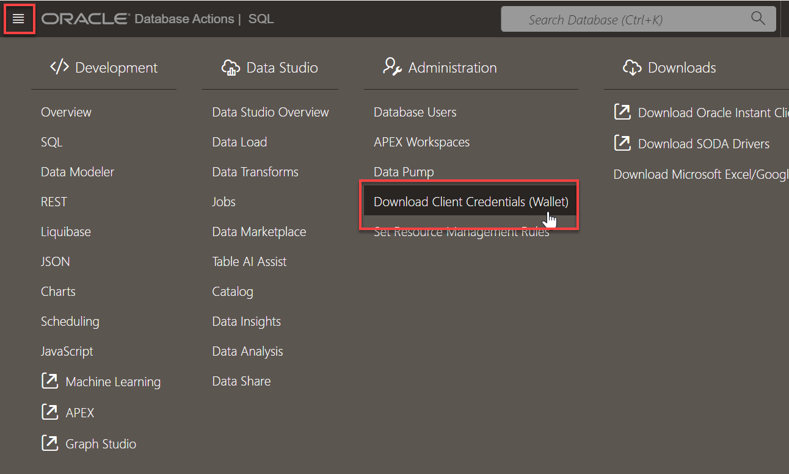
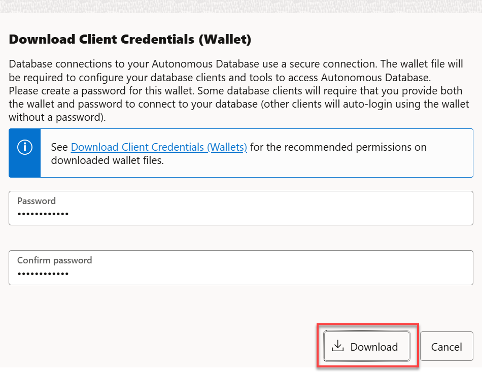
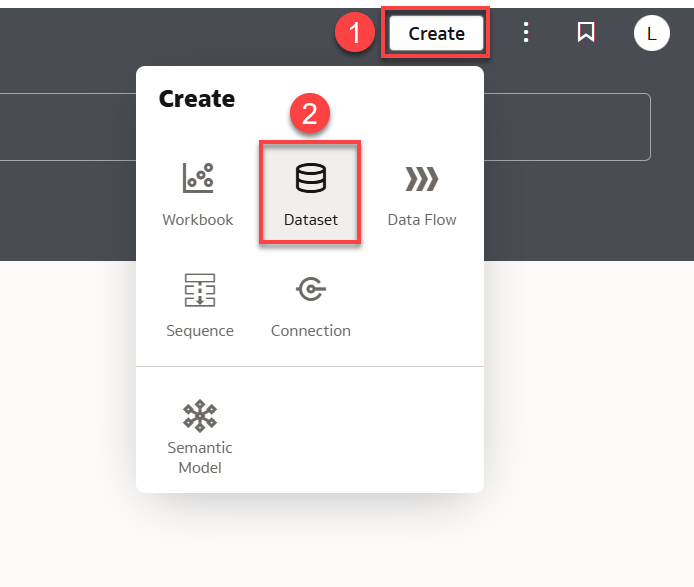
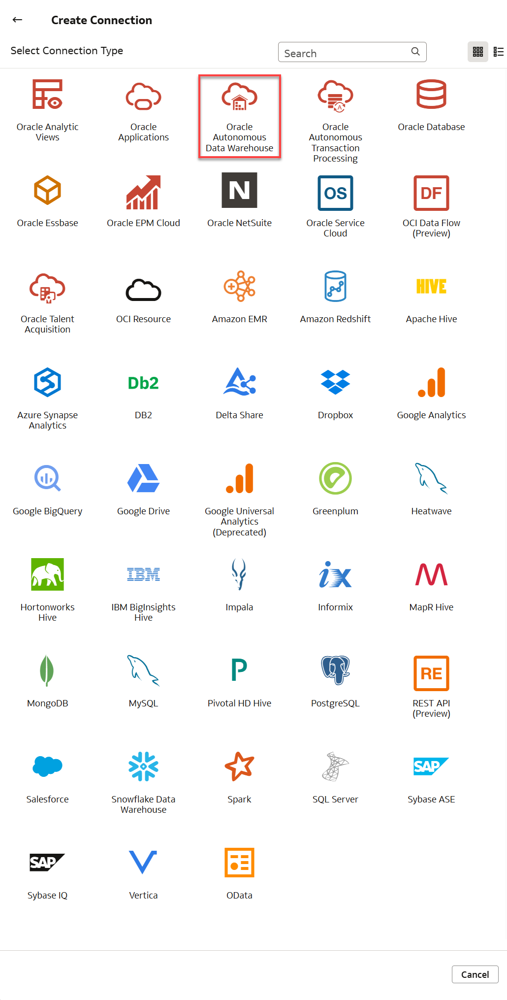
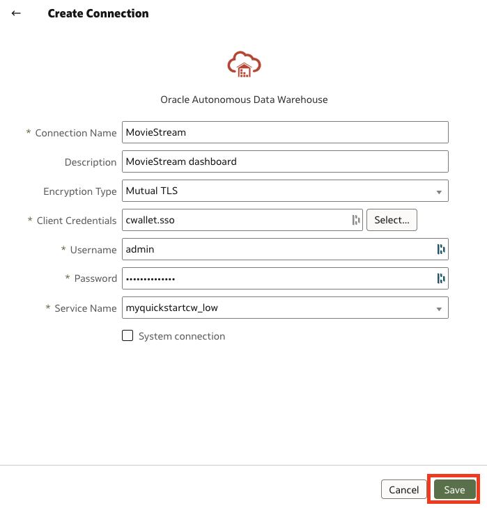
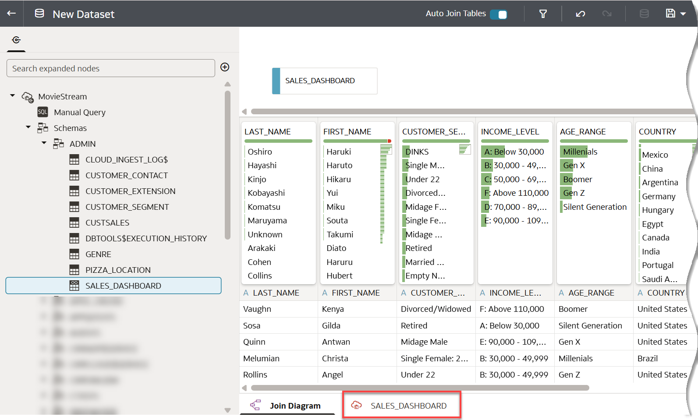
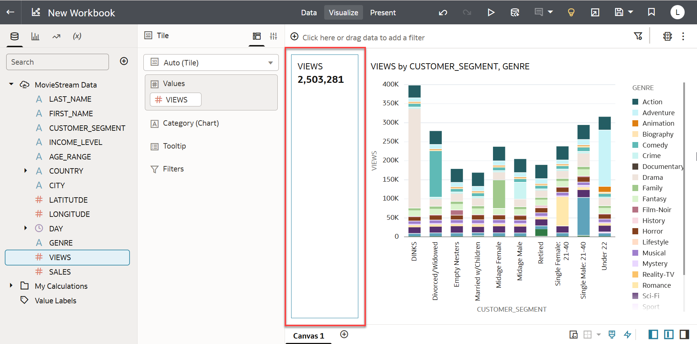
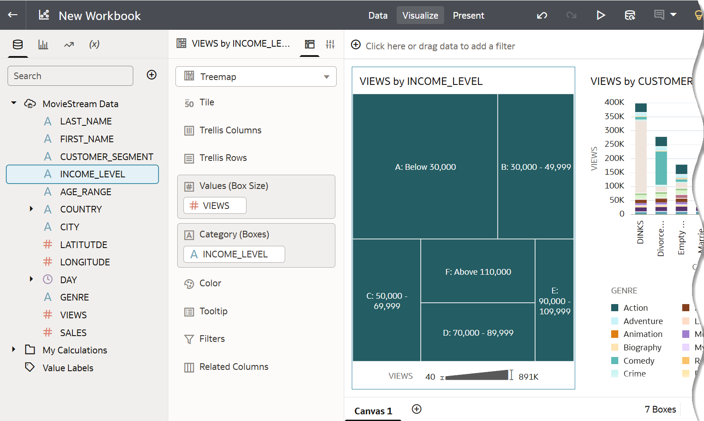
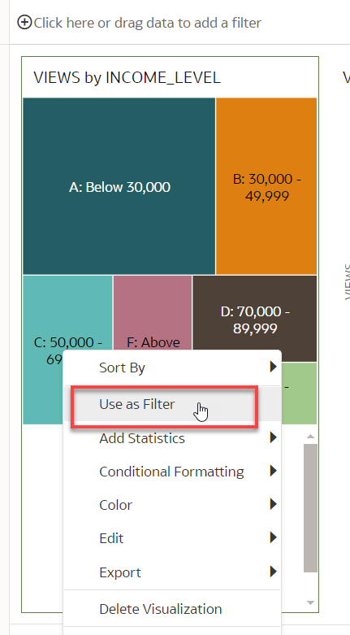

# Develop Self-Service Analytics Cloud Dashboards

## Introduction

This lab walks you through the steps to create data visualizations using Oracle Analytics Cloud (OAC). You will learn how to immediately gain insights and share powerful dashboards to analyze data in your autonomous database.

Estimated Time: 20 minutes

Watch the video below for a quick walk-through of the lab.
[Develop Self-Service Analytics Cloud Dashboards](videohub:1_6lsehv31)

### Objectives
- Learn how to create a simple data visualization project with Oracle Analytics Cloud
- Learn how to access and gain insights from data in the Autonomous Database

### Prerequisites
- This lab requires creation of an Oracle Analytics Cloud instance, or the use of an OAC instance provided by your instructor.
- This lab requires completion of the Provision Autonomous Database lab in the Contents menu on the left.

> **Note**: Oracle Analytics Cloud (OAC) is not available with Oracle Cloud Free Tier (Always Free), nor is it supported in Oracle LiveLabs Sandbox hosted environments. If you run this workshop using an Always Free database or LiveLabs Sandbox environment, you can view Labs 1 and 5 on provisioning and using OAC, and later practice these steps on Oracle Autonomous Databases in your organization's tenancy.

## Task 1: Create a view by executing this script in SQL Worksheet

Run a SQL script that will perform two tasks. First, primary keys are defined on tables to ensure uniqueness between rows. Then, foreign key constraints are added that ensure data integrity between tables. These constraints have the added benefit of improving performance.

Next, the script creates a `SALES_DASHBOARD` view that you will use to create your analytic dashboard. This simplifies the usability for analytics users; they can simply use the one view for all of their queries. You can conveniently access the browser-based SQL Worksheet directly from your Autonomous Database console.

[](include:adb-goto-sql-worksheet.md)

3. In a SQL Worksheet, copy and execute the following script.  

    ```
    <copy>
    -- Add constraints that ensure data integrity and improve performance
    alter table genre add constraint pk_genre_id primary key("GENRE_ID");
    alter table customer_extension add constraint pk_custextension_cust_id primary key("CUST_ID");
    alter table customer_contact add (
                constraint pk_custcontact_cust_id primary key("CUST_ID"),
                constraint fk_custcontact_cust_id foreign key("CUST_ID") references customer_extension("CUST_ID")
                );
    alter table customer_segment add constraint pk_custsegment_id primary key("SEGMENT_ID");
    alter table custsales add (
                constraint fk_custsales_cust_id foreign key("CUST_ID") references customer_contact("CUST_ID"),
                constraint fk_custsales_genre_id foreign key("GENRE_ID") references genre("GENRE_ID")
                );


    create or replace view sales_dashboard as
    select
    ce.last_name,
    ce.first_name,
    cs.short_name as customer_segment,
    ce.income_level,
    case
        when age > 75 then 'Silent Generation'
        when age between 57 and 75 then 'Boomer'
        when age between 41 and 56 then 'Gen X'
        when age between 25 and 40 then 'Millenials'
        when age between 9 and 24 then 'Gen Z'
        end as age_range,
    cc.country,
    cc.city,
    cc.loc_lat as latitutde,
    cc.loc_long as longitude,
    c.day_id,
    g.name genre,
    1 as views,
    actual_price as sales        
    from customer_extension ce, custsales c, genre g, customer_segment cs, customer_contact cc
    where ce.cust_id = c.cust_id
    and ce.cust_id = cc.cust_id
    and g.genre_id = c.genre_id
    and ce.segment_id = cs.segment_id;
    </copy>
    ```

   

## Task 2: Download a wallet to connect Oracle Analytics Cloud to your Autonomous Database

You will need to download your wallet credentials file in order for Analytics Cloud to connect to Autonomous Database. The wallet will enable both the server and client to verify each other. 

1. Click the top left menu and then select **Download Client Credentials (Wallet)**:

    

2. Specify a password of your choice for the wallet. You will need this password when connecting Oracle Analytics Cloud to the database in the next step. Click **Download** to download the wallet file to your client machine.

    > **Note:** If you are prevented from downloading your Connection Wallet, it may be due to your browser's pop-up window blocker. Please disable it or create an exception for Oracle Cloud domains.

    

    In the **Save As** dialog, select a folder on your local PC, and make note of the name and location of the zip file you are downloading. Click **Save** to download the zip file. The Database Connection dialog reappears. Click **Close**.

## Task 3: Create a dataset in OAC

1. Go to the **Instance Details** page of the **Oracle Analytics Cloud** (OAC) instance that you created or that was provided to you. In the **Access Information** section, click the URL to open the OAC application.

    

2. The initial OAC page appears in your browser. Click **Create** in the upper right corner.

    

3. In the **Create** pop-up window, click **Dataset**.

    

4. In the **Create Dataset** dialog, click **Create Connection**.

    

5. In the **Create Connection** dialog, click **Oracle Autonomous Data Warehouse**.

    

6. In the next **Create Connection** dialog, enter the following information:

   | Connection Info       | Entry                                             |  
   | --------------------- | :--------------------------------------------- |
   | Connection Name:      | Type in '**MovieStream**'                             |
   | Description:          | Type in '**MovieStream dashboard**'                   |
   | Encryption Type:      | Select '**Mutual TLS**'                   |
   | Client Credentials:   | Click '**Select...**' and select the wallet zip file that you previously downloaded. A file with .sso extension will appear in the field.   |
   | Username:             | Insert username created in previous labs, likely **admin**. Same username as SQL Worksheet and SQL Developer credentials. |                                            
   | Password              | Insert password created in previous labs. Same password as SQL Worksheet credentials. |
   |Service Name:          | Scroll the drop-down field and select **myquickstart_low**, or the **low** service level of the database name you specified in the Provision an Autonomous Database lab. |

7. After completing the fields, click **Save**.

    

8. In the **New Dataset** page, expand **Schemas > ADMIN** and drag and drop the **SALES_DASHBOARD** view that you previously created onto the palette to add it to the dataset.

    

9. The data is profiled and the following thumbnails are created for each column:

    

10. Note the 2 tabs at the bottom of the dashboard. The dashboard opens by default in the **Join Diagram** tab. Click the **SALES\_DASHBOARD** to make updates to how the columns are displayed in the Analytics Cloud Workbook.

    

11. On the right side of the dashboard, note the list of recommended columns to enrich the data. We will keep it very simple and make two updates. First, scroll right to the **DAY\_ID** column. Double click the card's DAY_ID and rename **DAY\_ID** to **DAY**.

    

13. Next, update the number format for **SALES**. Select the **SALES** column and then click the **#** property to update its format. Change the **Number Format** to **Currency**.

    

15. When you are done setting up filters and other options, save the dataset using the **Save** icon in the upper right corner.

    

## Task 4: Create a workbook and explore the data in your dataset

Analytics Cloud provides a very intuitive experience for analyzing your data and creating interactive dashboards. Follow these steps to create a very simple, yet highly visual Workbook. And, feel free to explore MovieStream data in many more ways than what's listed here!

The final dashboard is depicted below:


The tree map on the left describes the MovieStream customers broken out by income level. The size of the boxes is indicative of the number of customers within that income level. Clicking on one of the income levels will filter the chart on the right to summarize the number of movie views for that income level. The chart shows the breakdown of views by customer segment across movie genres.

Let's build the dashboard!

1.  When you saved the dataset, a **Create Workbook** button appeared in the upper right corner. Click **Create Workbook**.

      

2. The **New Workbook** page appears, on which you can drag and drop measures and attributes.

      

3. Drag and drop **VIEWS** onto the canvas. **VIEWS** represents the number of times a movie was viewed.

      

    The Workbook attempts to create the best presentation using **Auto Visualization**. Here, the total number of views is displayed as a tile.

4. Next drag and drop **CUSTOMER\_SEGMENT** onto any clear white area of the canvas.

    

    The workbook displayed the number of views as a bar chart.

5. Let's now break out each customer segment's views by genre. Drag **GENRE** to the **Color** field in the grammar panel. Then, update the visualization type to **Stacked Bar**.

    

6. Great! Let's now add the tree map. Create a new visualization by dragging and dropping **VIEWS** to the left of the stacked bar chart. Drop the measure when you see a green vertical bar running the length of the stacked bar chart:

    

    Again, the number of views is displayed as a tile.

7. Drag and drop **INCOME_LEVEL** to the view. Change its visualization to **Tree Map**:

    

    The new visualization should look like the following:

        

8. Make the Tree Map a bit more colorful. Drag and Drop INCOME_LEVEL to the **Color** field:
    

9. Finally, use the income level tree map to filter the genre views by customer segment stacked bar. Right click on the tree map and select **Use as Filter**:

    

9. Analyze views by income level, customer segment and genre:

    

10. Now that you've seen how to create dashboards, create more pages and visualizations!

11. When you are done building your workbook, click **Save** in the upper right corner.

At this point, with very few steps, you now have something that can further bring your data to life and you can begin to make some data-driven decisions. As you share this with others, more people will want to gain access to and benefit from the data. To enable this, the Oracle Autonomous Database is easy to use, fast, elastic, and will be able to quickly scale to meet your growing data and user base.

You may now **proceed to the next lab**.

## Want to learn more?

See the [documentation](https://docs.oracle.com/en/cloud/paas/autonomous-data-warehouse-cloud/user/create-reports-analytics.html#GUID-30A575A6-2CAD-4A8A-971E-2F751C8E6F90) on working with analytics and visualization of data in your Oracle Autonomous Database.

## **Acknowledgements**

- **Author** - Richard Green, Principal Developer, Database User Assistance; Marty Gubar, ADB Product Management
- **Last Updated By/Date** - Richard Green, August 2022
