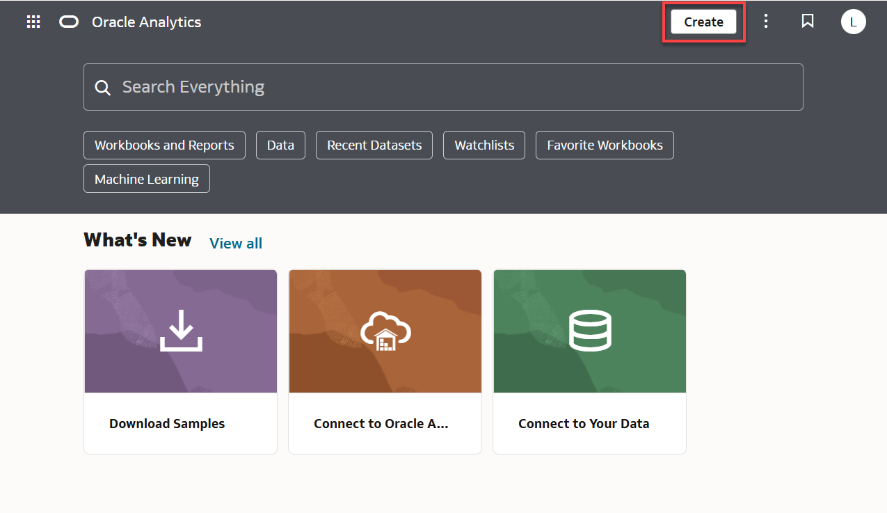
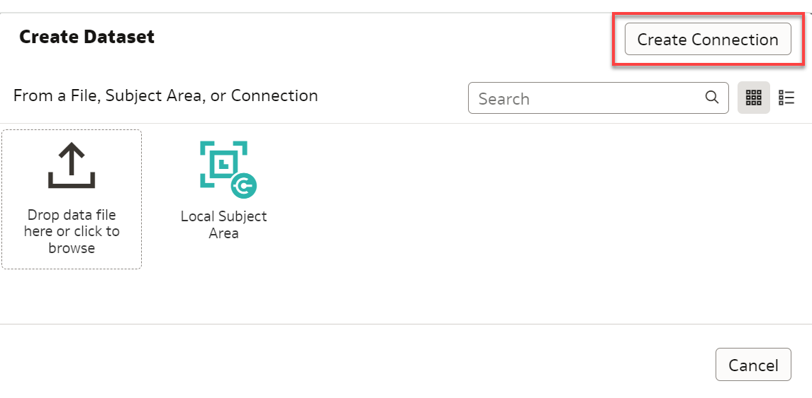
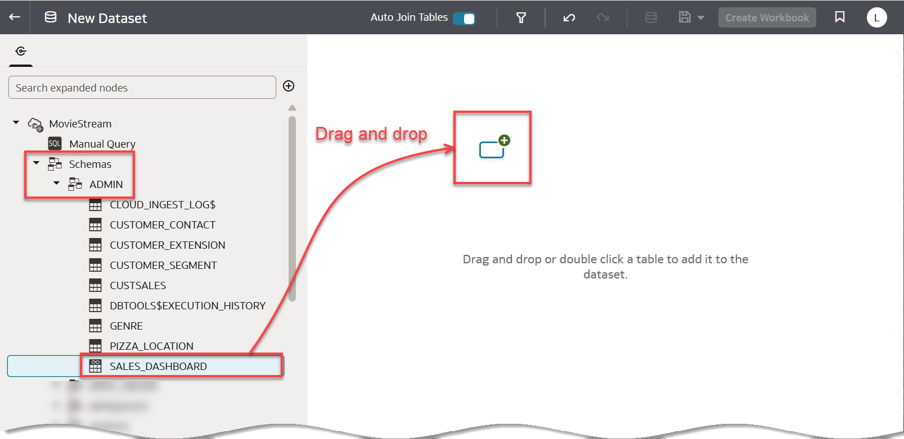
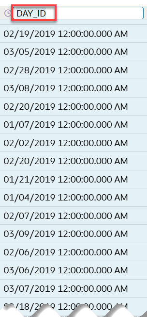
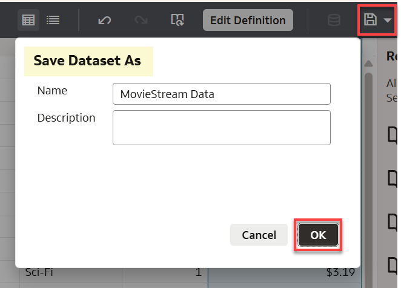
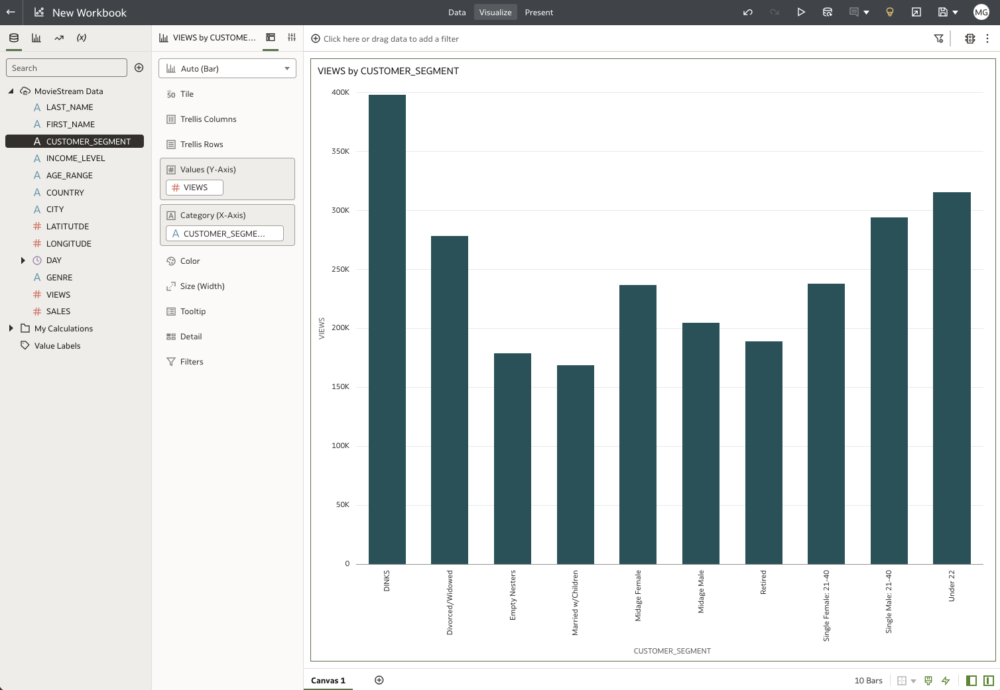

# Develop Self-Service Analytics Cloud Dashboards

## Introduction

This lab walks you through the steps to create data visualizations using Oracle Analytics Cloud (OAC). You will learn how to immediately gain insights and share powerful dashboards to analyze data in your autonomous database.

Estimated Time: 20 minutes

### Objectives
- Learn how to create a simple data visualization project with Oracle Analytics Cloud
- Learn how to access and gain insights from data in the Autonomous Database

### Prerequisites
- This lab requires creation of an Oracle Analytics Cloud instance, or the use of an OAC instance provided by your instructor.
- This lab requires completion of the Provision Autonomous Database lab in the Contents menu on the left.

## Task 1: Create a view by executing this script in SQL Worksheet

Create a `SALES_DASHBOARD` view that you will use to create your analytic dashboard. You can conveniently access the browser-based SQL Worksheet directly from your ADW or ATP console.

[](include:adb-goto-sql-worksheet.md)

3. In a SQL Worksheet, copy and execute the following script.  

    ```
    <copy>
    create or replace view sales_dashboard as
    select
      ce.last_name,
      ce.first_name,
      cs.short_name as customer_segment,
      c.day_id,
      g.name genre,
      m.title,
      m.budget,
      m.gross,
      m.year as released,
      m.cast,
      m.crew,
      m.awards,
      m.nominations,
      1 as views,
      actual_price as sales        
    from customer_extension ce, custsales c, genre g, movie m, customer_segment cs
    where ce.cust_id = c.cust_id
    and g.genre_id = c.genre_id
      and m.movie_id = c.movie_id
      and ce.segment_id = cs.segment_id;
    </copy>
    ```

   

## Task 2: Create credentials to connect Oracle Analytics Cloud to your autonomous database

As ADW and ATP accept only secure connections to the database, you need to download a wallet file containing your credentials first. The wallet can be downloaded from the database instance's **Database Details** page.

1. In your database's instance Database Details page, click **DB Connection**.

    

2. Use the **Database Connection** dialog to download client credentials.
    - Select a wallet type. For this lab, select **Instance Wallet**. This wallet type is for a single database only; this provides a database-specific wallet.
    - Click **Download wallet**.

    

    > **Note:** Oracle recommends that you provide a database-specific wallet, using Instance Wallet, to end users and for application use whenever possible. Regional wallets should only be used for administrative purposes that require potential access to all Autonomous Databases within a region.

3. Specify a password of your choice for the wallet. You will need this password when connecting Oracle Analytics Cloud to the database in the next step. Click **Download** to download the wallet file to your client machine.

    > **Note:** If you are prevented from downloading your Connection Wallet, it may be due to your browser's pop-up window blocker. Please disable it or create an exception for Oracle Cloud domains.

    

    In the **Save As** dialog, select a folder on your local PC, and make note of the name and location of the zip file you are downloading. Click **Save** to download the zip file. The Database Connection dialog reappears. Click **Close**.

## Task 3: Create a dataset in OAC

1. Go to the **Instance Details** page of the **Oracle Analytics Cloud** (OAC) instance that you created or that was provided to you. In the **Access Information** section, click the URL to open the OAC application.

    

2. The initial OAC page appears in your browser. Click **Create** in the upper right corner.

    

3. In the **Create** pop-up window, click **Dataset**.

    

4. In the **Create Dataset** dialog, click **Create Connection**.

    

5. In the **Create Connection** dialog, click **Oracle Autonomous Data Warehouse**.

    

6. In the next **Create Connection** dialog, enter the following information:

   | Connection Info       | Entry                                             |  
   | --------------------- | :--------------------------------------------- |
   | Connection Name:      | Type in '**MovieStream**'                             |
   | Description:          | Type in '**MovieStream dashboard**'                   |
   | Client Credentials:   | Click '**Select...**' and select the wallet zip file that you downloaded in Task 2.3. A file with .sso extension will appear in the field.   |
   | Username:             | Insert username created in previous labs, likely **admin**. Same username as SQL Worksheet and SQL Developer credentials. |                                            
   | Password              | Insert password created in previous labs. Same password as SQL Worksheet credentials. |
   |Service Name:          | Scroll the drop-down field and select **myquickstart_high**, or the **high** service level of the database name you specified in the Provision an Autonomous Database lab. |

7. After completing the fields, click **Save**.

    

    > **Note:** If the connection fails to save because you are behind a firewall or on a VPN, you may need to use an alias or shut down the VPN to connect to your ADW database.*

8. In the **New Dataset** page, expand **Schemas > ADMIN** and drag and drop the **SALES_DASHBOARD** view that you previously created onto the palette to add it to the dataset.

    

9. Wait a few minutes for the Sales Dashboard to load, which involves the joining of data from several tables. A large variety of sales information will appear in the dashboard. Use the horizontal and vertical scrollbars to view this collection of movie data.

    

10. Note the 2 tabs at the bottom of the dashboard. The dashboard opens by default in the **Join Diagram** tab. Click the **SALES\_DASHBOARD** tab to see the dashboard with the ability to filter and choose from an options menu for each card in the dashboard. **MARTY, I DON'T UNDERSTAND WHY IT STARTS FROM "Join Diagram" TAB, AND NOT JUST SHOW THE "SALES\_DASHBOARD" TAB**.

    

11. On the right side of the dashboard, note the list of recommended columns to filter the data. Also in each card of the dashboard, you can click the card's heading to expose a 3-dotted ellipsis menu of **Options**. For example, in the **DAY_ID** card, the Options menu lets you extract elements such as **Day**.

    

12. You can use the **Options** menu to hide a column.

    

13. You can also use the **Options** menu to rename a column label.

    

14. You can use the **Options** menu to change how you wish to treat a column. For example, here we use the **Treat As** setting to change the **RELEASED** column to serve as an **attribute**, rather than as a **measure**.

    

15. When you are done setting up filters and other options, save the dataset using the **Save** icon in the upper right corner.

    

## Task 4: Create a workbook and explore the data in your dataset

No matter what your role is in the organization, access to data timely can provide greater insights to improve the performance of your business. Whether you’re creating a data warehouse or a data mart for yourself or others, Autonomous Data Warehouse is making it far simpler than ever before. Easy, fast, and elastic. This small project demonstrates this. This is how business users would interact with the Autonomous Data Warehouse.

1. You will now create a very simple OAC workbook visualization project to finish this lab. When you saved the dataset, a **Create Workbook** button appeared in the upper right corner. Click **Create Workbook**.

      

2. The **New Workbook** page appears, on which you can drag and drop data to add a filter.

      

3. Drag and drop **VIEWS** onto the palette.

      

4. Next drag and drop **GENRE** onto the palette. Based upon this data, Oracle Analytics Cloud will choose a default visualization. In this example, OAC chose **Bar** as the Auto Visualization. You can choose among several dozen other diagram types from the Auto Visualization drop-down menu. In this example, the icon for **Stacked Bar** is about to be chosen.

    

5. Try some of the different diagram types and dragging different MovieStream tables onto the palette. In this example, GENRE has been dragged from **Category (X-Axis)** into the **Color** palette, **CUSTOMER_SEGMENT** has been dragged into **Category (X-Axis)**, and the **Bar** Auto Visualization has been changed to **Stacked Bar**.

    

6. When you are done building your workbook, click **Save** in the upper right corner.

 At this point, with very few steps, you now have something that can further bring your data to life and you can begin to make some data-driven decisions. As you share this with others, more people will want to gain access to and benefit from the data. To enable this, the Oracle Autonomous Database in ADW or ATP is easy to use, fast, elastic, and will be able to quickly scale to meet your growing data and user base.

## Want to learn more?

See the [documentation](https://docs.oracle.com/en/cloud/paas/autonomous-data-warehouse-cloud/user/create-reports-analytics.html#GUID-30A575A6-2CAD-4A8A-971E-2F751C8E6F90) on working with analytics and visualization of data in your Oracle Autonomous Database.

## **Acknowledgements**

- **Author** - Richard Green, Principal Developer, Database User Assistance; Marty Gubar, ADB Product Management
- **Last Updated By/Date** - Richard Green, August 2022
