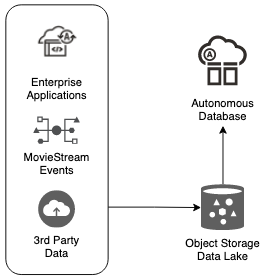
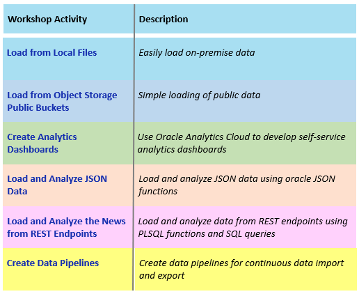

# Introduction

## About this Workshop

The labs in this workshop walk you through all the steps to get started using **Oracle Autonomous AI Database**. First, you will create an Oracle Autonomous AI Database instance. Then, you will practice several methods for loading data from a variety of locations and in different formats, using Autonomous AI Database tools and APIs. You will analyze the data with SQL and build analytics dashboards using Oracle Analytics Cloud.

Estimated Workshop Time: 1.5 hours

<if type="odbw">If you would like to watch us do the workshop, click [here](https://youtu.be/otS5PvJcxMQ).
</if>

**Oracle MovieStream** is a fictitious movie streaming service - similar to those that you currently subscribe to. They face challenges that are typical to many organizations across industries. MovieStream must:
* Gain a better understanding of their customers to ensure that they love the service  
* Offer the right products to the right customers at the right price  
* Grow the business to become a dominant player in the streaming business
* and much, much more

Oracle Cloud provides an amazing platform to productively deliver secure, insightful, scalable and performant solutions. MovieStream designed their solution leveraging the world class Oracle Autonomous AI Database and Oracle Cloud Infrastructure (OCI) Data Lake services. Their data architecture is following the Oracle Reference Architecture [Enterprise Data Warehousing - an Integrated Data Lake](https://docs.oracle.com/en/solutions/oci-curated-analysis/index.html#GUID-7FF7A024-5EB0-414B-A1A5-4718929DC7F2) - which is used by Oracle customers around the world. It's worthwhile to review the architecture so you can understand the value of integrating the **data lake** and **data warehouse** - as it enables you to answer more complex questions using all your data.

In this workshop, we'll start with two key components of MovieStream's architecture. MovieStream is storing their data across Oracle Object Storage and Autonomous AI Database. Data is captured from various sources into a landing zone in object storage. This data is then processed (cleansed, transformed and optimized) and stored in a gold zone on object storage. Once the data is curated, it is loaded into an Autonomous AI Database where it is analyzed by many (and varied) members of the user community.

## Objectives
- Provision a new Oracle Autonomous AI Database instance
- Load data from files on your local computer
- Load data from object storage buckets
- Use Oracle Analytics Cloud to create compelling dashboards from your data set
- Load and analyze JSON collections
- Load the latest news from a public REST service and run a sentiment analysis of that news
- Create data pipelines for continuous data import and export

### **Prerequisites**

This workshop requires an Oracle Cloud account. You may use your existing account or create one in the following lab.

> **Note**: Oracle Analytics Cloud (OAC) is not available with Oracle Cloud Free Tier (Always Free), nor is it supported in Oracle LiveLabs Sandbox hosted environments. If you run this workshop using an Always Free database or LiveLabs Sandbox environment, you can view Labs 1 and 5 on provisioning and using OAC, and later practice these steps on Oracle Autonomous AI Databases in your organization's tenancy.

Let's begin! If you need to create an account, please click **Get Started** in the **Contents** menu on the left. Otherwise, if you have an existing account, click **Lab 1: Provision Autonomous AI Database**.

## Want to Learn More?

- [Oracle Autonomous AI Database Serverless Documentation](https://docs.oracle.com/en/cloud/paas/autonomous-data-warehouse-cloud/index.html)

## Acknowledgements

- **Author:** Nilay Panchal, ADB Product Management
- **Last Updated By/Date:** Lauran L. Serhal, October 2025

Data about movies in this workshop were sourced from Wikipedia.

Copyright (C) 2025, Oracle Corporation.

Permission is granted to copy, distribute and/or modify this document
under the terms of the GNU Free Documentation License, Version 1.3
or any later version published by the Free Software Foundation;
with no Invariant Sections, no Front-Cover Texts, and no Back-Cover Texts.
A copy of the license is included in the section entitled [GNU Free Documentation License](https://oracle-livelabs.github.io/adb/shared/adb-15-minutes/introduction/files/gnu-free-documentation-license.txt)
