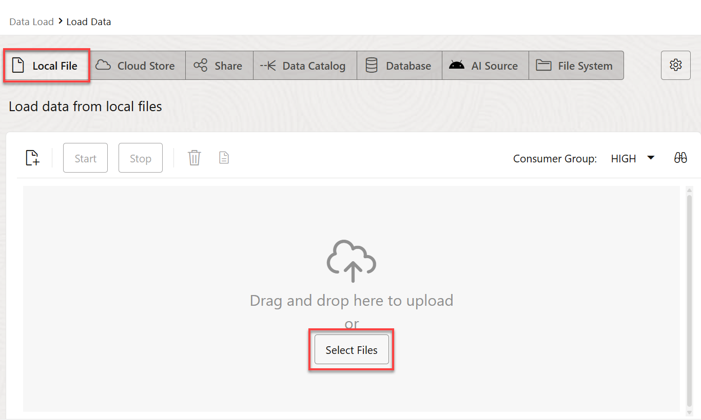
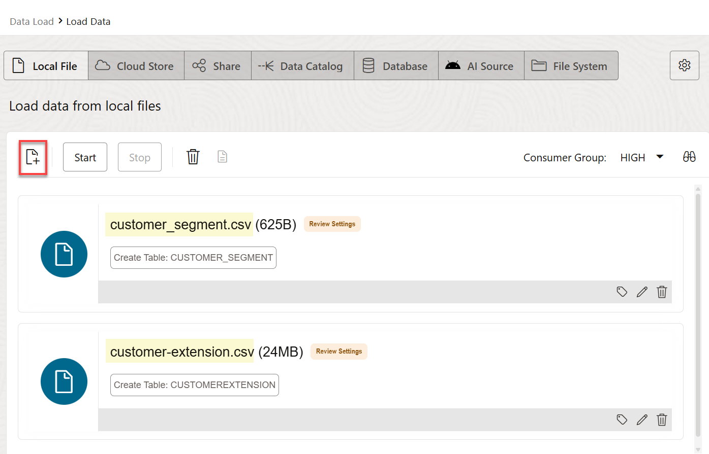
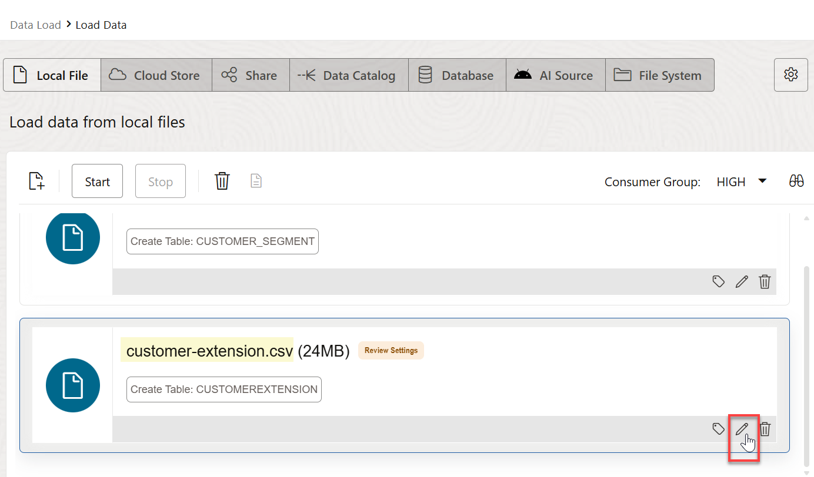
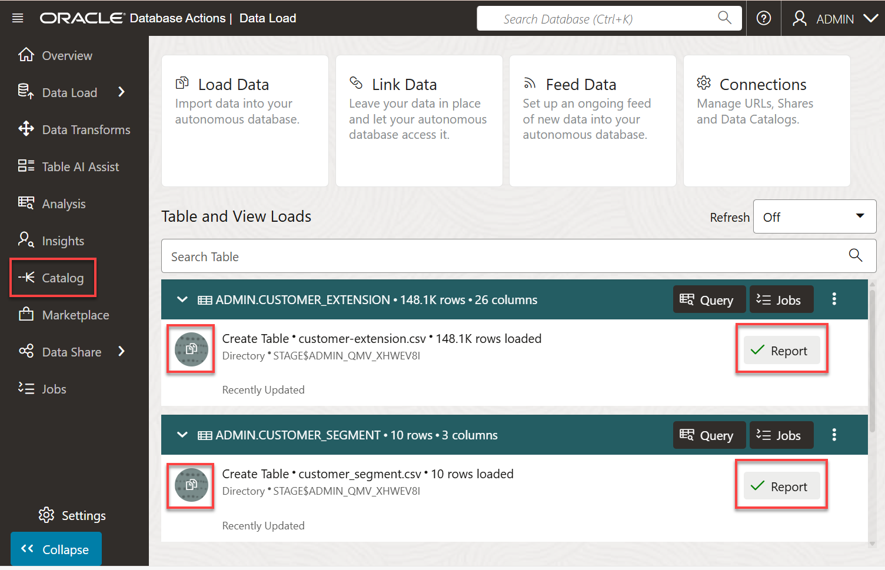
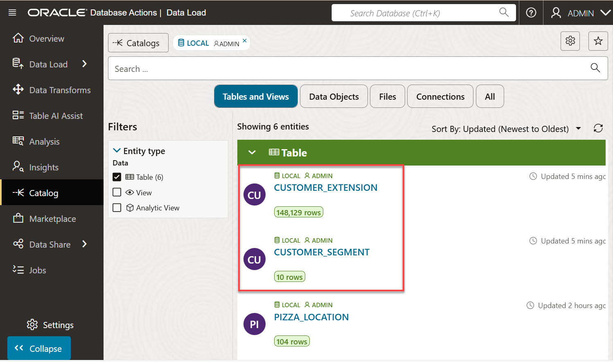
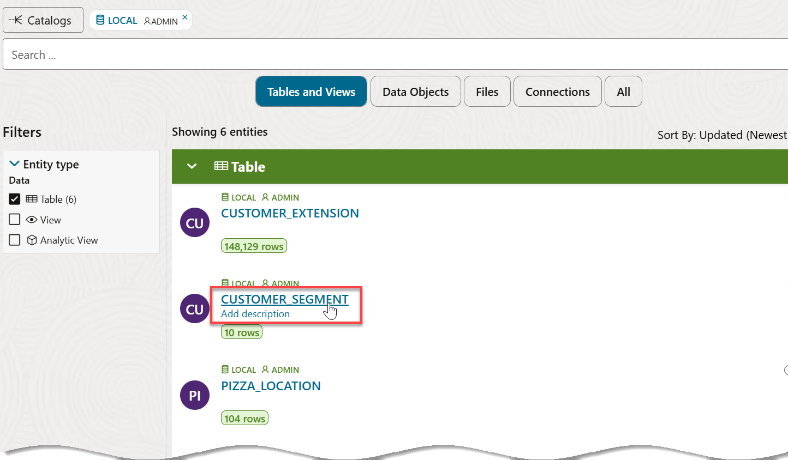
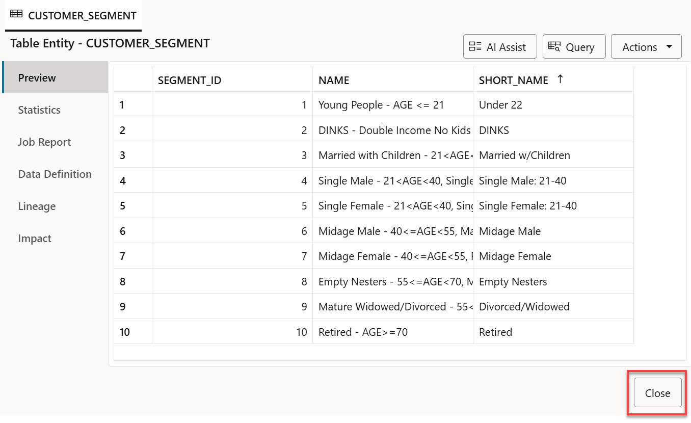
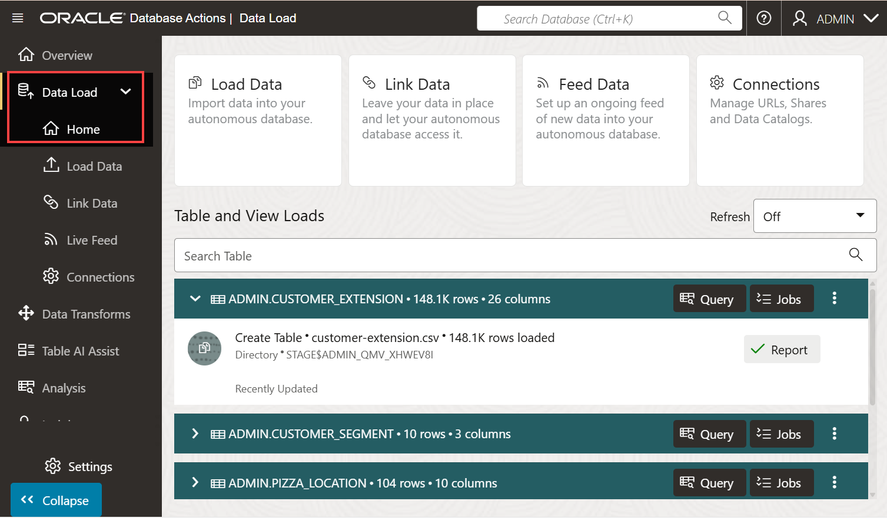

# Load Data from Local Files

## Introduction

In this lab, you will practice multiple methods for loading and linking to data into an Oracle Autonomous AI Database (either Oracle Autonomous AI Lakehouse or Oracle Autonomous AI Transaction Processing	) using the ADB built-in Database Action tools, or using other Oracle and third party data integration tools.

You can also leave data in place in cloud object storage, and link to it from your Autonomous AI Database.

> **Note:** While this lab uses Oracle Autonomous AI Lakehouse, the steps are identical for loading data into an Oracle Autonomous AI Transaction Processing database.

Estimated Time: 10 minutes

Watch the video below for a quick walk-through of the lab.

### Objectives

In this lab, you will:
* Download two **.csv** data files to your local computer from the MovieStream data lake (Oracle Object Storage buckets).
* Navigate to the Data Load utility of Oracle Autonomous AI Database Data Tools.
* Load data from the .csv files to your Autonomous AI Database instance.

### Prerequisites

This lab requires the completion of **Lab 1: Set up the Workshop Environment > Task 3: Create the Autonomous Database Instance**, from the **Contents** menu on the left.

## Task 1: Download Two .csv Files from the MovieStream Data Lake to your Local Computer

Oracle MovieStream is a fictitious movie streaming service - similar to those that to which you currently subscribe. MovieStream is storing (and linking to) their data across Oracle Object Storage and Autonomous AI Database. Data is captured from various sources into a landing zone in object storage. This data is then processed (cleansed, transformed and optimized) and stored in a gold zone on object storage. Once the data is curated, it is loaded into an Autonomous AI Database where it is analyzed by many (and varied) members of the user community.

1. Right-click on each of the links below, and then click **Save link as...** from the context menu to download the files to a folder on your local computer.

    * [Download customer\_segment.csv](https://objectstorage.us-ashburn-1.oraclecloud.com/n/c4u04/b/moviestream_landing/o/customer_segment/customer_segment.csv)
    * [Download customer-extension.csv](https://objectstorage.us-ashburn-1.oraclecloud.com/n/c4u04/b/moviestream_landing/o/customer_extension/customer-extension.csv)

2. Close the Excel files (if they are open) and make a note of your folder location as you will use the two downloaded files in a later task in this lab.

## Task 2: Load Data from the CSV Files Using the Load Data Tool

In this task you will load the two .csv files that you downloaded earlier into two different tables in your Autonomous AI Database instance.

>**Note:** You should be already on the **Data Load** page from the previous lab. 

1. On the **Data Load** page, click the **Load Data** card.

    

2. On the **Load Data** page, the **Local File** button is selected by default. In the **Load data from local files** section, you can either drag and drop files to upload, or click **Select Files** to select the files to upload. Click **Select Files**.

    

3. In the **Open** dialog box, navigate to the directory that contains the two **.csv** files that you downloaded earlier. Select the **`customer_segment.csv`** and **`customer_extension.csv`** files, and then click **Open**. When the upload is complete, the two files are displayed.

    

    >**Note:** If you have an issue uploading both files simultaneously, you can select one file at a time. Select the first downloaded file using step 3. When the file is uploaded, click the **Select Files** icon on the **Load Data** page, and then select the second file.

4.  You will make a small change to the default table name that will be created for the `customer-extension.csv` file. Click the **Settings** (pencil) icon to the right of `customer-extension.csv`.

    

5. The **Load Data from Local File customer-extension.csv** page is displayed. Take a moment to examine the settings. The tool makes intelligent choices for target table name and its properties. Since this is an initial load, accept the default option of **Create Table** to create the target table in your Autonomous AI Database. In the mappings section, you can change the target column names, data types, and length/precision.

    

6. In the **Name** field, change the table name that will be created from **`CUSTOMEREXTENSION`** to **`CUSTOMER_EXTENSION`**. Click **Close** in the lower right corner of the page.

    

7. Click **Start**. 

    

    A **Start Load from Local Files** confirmation dialog box is displayed. Click **Run**.

    

8. When the load job is complete, a green check mark appears next to each table in the Data Load dashboard. Click **Catalog** in the menu on the left.

    

    > **Note:** If the menu on the left is collapsed, click the double arrows icon to expand it so that the label for each icon is displayed.

9. The Catalog displays the two newly created tables, `CUSTOMER_SEGMENT` and `CUSTOMER_EXTENSION`   , at the top of the Data Load dashboard among the other tables that were created earlier.

    

    You can click a table name link to display its data. Click the `CUSTOMER_SEGMENT` table to view the data.

    

    

10. When finished, click **Close**, and then click the **Data Load** in the menu on the left to return to the **Data Load** page.

    

    The **Data Load** page is re-displayed.

You may now proceed to the next lab.

## Learn More

* [Oracle Cloud Infrastructure Documentation](https://docs.cloud.oracle.com/en-us/iaas/Content/GSG/Concepts/baremetalintro.htm)
* [Using Oracle Autonomous AI Database Serverless](https://docs.oracle.com/en/cloud/paas/autonomous-database/adbsa/index.html)

## Acknowledgements

* **Author:** Lauran K. Serhal, Consulting User Assistance Developer
* **Contributors:**
    * Mike Matthews, Autonomous AI Database Product Management
    * Marty Gubar (Retired), Autonomous AI Database Product Management
* **Last Updated By/Date:** Lauran K. Serhal, October 2025

Data about movies in this workshop were sourced from Wikipedia.

Copyright (C) 2025 Oracle Corporation.

Permission is granted to copy, distribute and/or modify this document
under the terms of the GNU Free Documentation License, Version 1.3
or any later version published by the Free Software Foundation;
with no Invariant Sections, no Front-Cover Texts, and no Back-Cover Texts.
A copy of the license is included in the section entitled [GNU Free Documentation License](https://oracle-livelabs.github.io/adb/shared/adb-15-minutes/introduction/files/gnu-free-documentation-license.txt)
