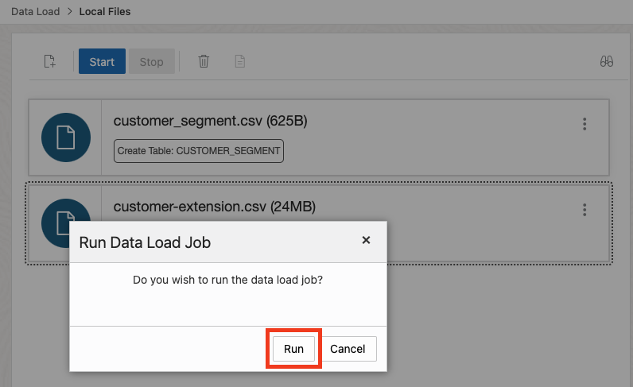
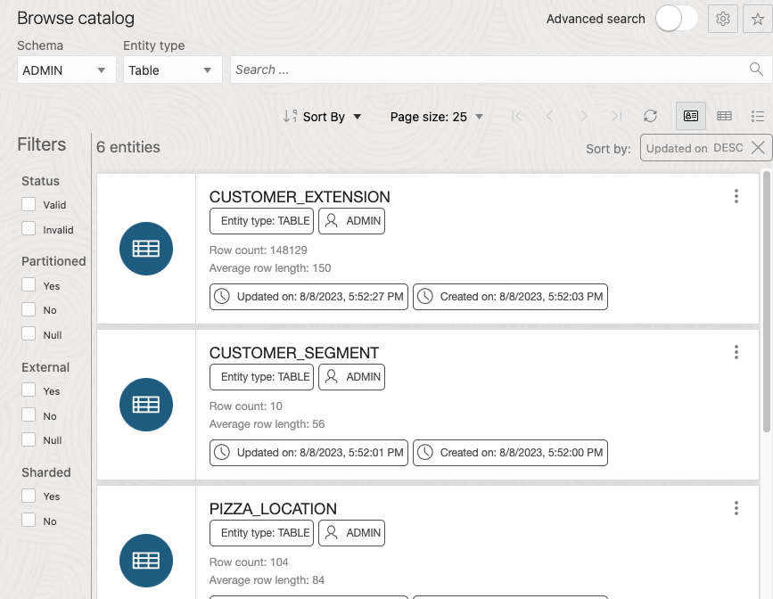

# Load Data from Local Files

## Introduction

This workshop practices six methods for loading data into an Oracle Autonomous Database. In this first data loading lab, you practice loading data from a file on your local computer. You will download to your local computer a small CSV file from the MovieStream data lake on [Oracle Cloud Infrastructure Object Storage](https://www.oracle.com/cloud/storage/object-storage.html), and then load it into your Oracle Autonomous Database instance in preparation for exploration and analysis.

You can load data into your Autonomous Database (either Oracle Autonomous Data Warehouse or Oracle Autonomous Transaction Processing) using the built-in tools as in this lab, or you can use other Oracle and third party data integration tools. With the built-in tools, you can load data:

+ from files in your local device
+ from tables in remote databases
+ from files stored in cloud-based object storage (Oracle Cloud Infrastructure Object Storage, Amazon S3, Microsoft Azure Blob Storage, Google Cloud Storage)

You can also leave data in place in cloud object storage, and link to it from your Autonomous Database.

> **Note:** While this lab uses Oracle Autonomous Data Warehouse, the steps are identical for loading data into an Oracle Autonomous Transaction Processing database.

Estimated Time: 10 minutes

### Objectives

In this lab, you will:
* Download to your local computer a CSV file from the MovieStream data lake
* Navigate to the Data Load utility of Oracle Autonomous Database Data Tools
* Load data from the CSV file to your autonomous database

### Prerequisites

- This lab requires completion of Lab 2, **Provision an Autonomous Database**, in the Contents menu on the left.

## Task 1: Download a CSV file from the MovieStream data lake to your local computer

1. Open a browser window. Copy the following URL to your browser to download the small `customer_segment.csv` file. You can use the **Copy** button in the upper right corner of the URL snippet to conveniently copy the URL to your computer's clipboard:

    ```
    <copy>
    https://objectstorage.us-ashburn-1.oraclecloud.com/n/c4u04/b/moviestream_landing/o/customer_segment/customer_segment.csv
    </copy>
    ```

2. Paste this URL in your browser and press **Enter**. A **Save As** dialog opens. Save the `customer_segment.csv` file to a folder on your local computer's hard drive and make note of the folder location.

## Task 2: Navigate to Database Actions and open the Data Load utility

[](include:adb-goto-data-load-utility.md)

## Task 3: Load data from the CSV file using the Data Load utility

In this task you perform a simple data loading task, to load CSV file data into a table in your autonomous database.

1. Leave the default selections, **LOAD DATA** and **LOCAL FILE**, and click **Next**.

    

2. The Local Files page enables you to drag and drop files to upload, or you can select files. Drag the *channels.csv* file from the directory where you downloaded onto the Drag and Drop target. Or select *channels.csv* using the Select Files pop-up dialog.

    

3. When the upload is complete, you could simply click the green arrow **Start** button and click **Run** to run the data load job, but let's modify the data load job slightly. Click the **Settings** button labeled with a pencil symbol.

    

4. A page opens for the local channels.csv file that you will be loading. Take a moment to examine the preview information and loading options. Change the target table name from *CHANNELS* to *CHANNELS_LOCAL*. Since this is an initial load, accept the default option of **Create Table**, which conveniently creates the target table in the ADW database, without the need to predefine the table in SQL. In the mappings section, notice that you can change the target column names and data types. Click **Close** in the lower right corner of the page.

    

5. Notice that the target table name has changed to *CHANNELS_LOCAL*. Click **Start**, and then click **Run** in the confirmation dialog.

    

6. When the load job finishes, a green check mark appears. Click **Data Load** in the breadcrumb in the upper left corner, to return to the **Data Load** page.

    

7. In the **Data Load** page, click **EXPLORE**.

    

8. The Catalog shows the *CHANNELS_LOCAL* table has been successfully created. You can click the table name to see the data.

    

    

This completes the first data loading lab using a CSV file on your local computer. In the next lab, we will load data from object storage public buckets.

Please *proceed to the next lab*.

## Acknowledgements

* **Author** - Rick Green, Principal Developer, Database User Assistance
* **Last Updated By/Date** - Rick Green, July 2022

Data about movies in this workshop were sourced from Wikipedia.

Copyright (C) Oracle Corporation.

Permission is granted to copy, distribute and/or modify this document
under the terms of the GNU Free Documentation License, Version 1.3
or any later version published by the Free Software Foundation;
with no Invariant Sections, no Front-Cover Texts, and no Back-Cover Texts.
A copy of the license is included in the section entitled [GNU Free Documentation License](files/gnu-free-documentation-license.txt)
