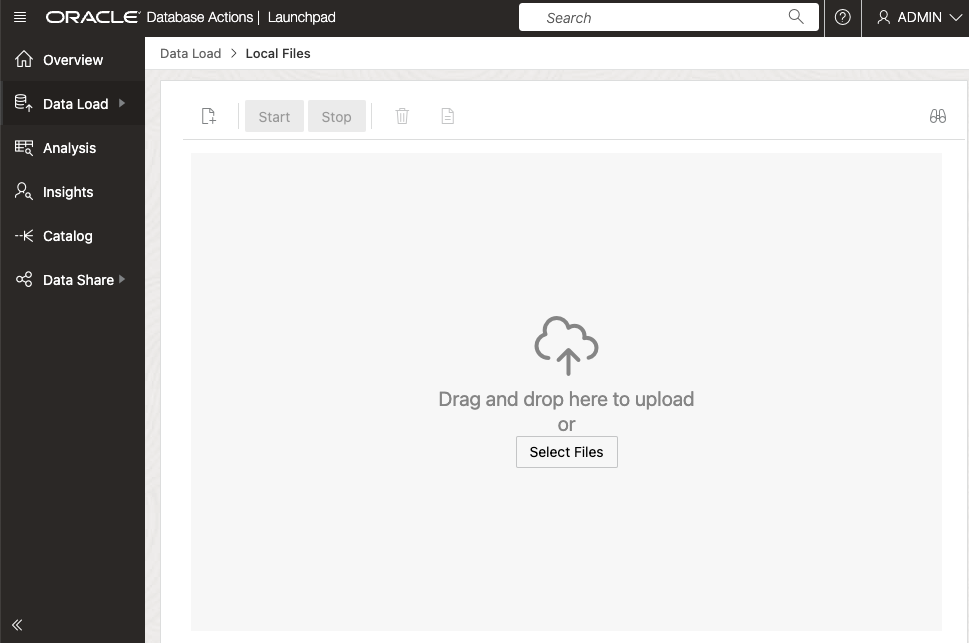
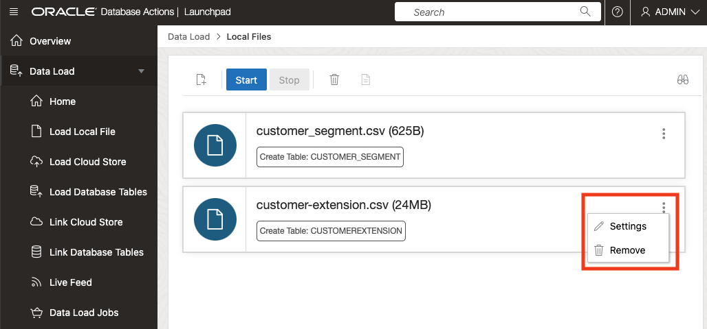
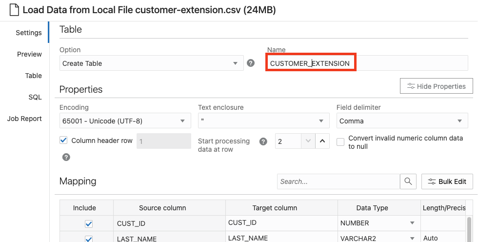
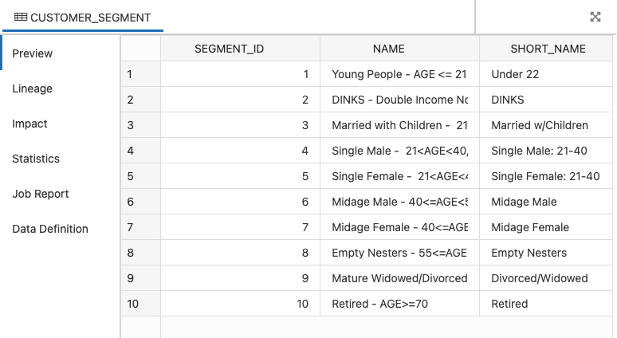

# Load Data from Local Files

## Introduction

This workshop practices multiple methods for loading data into an Oracle Autonomous Database. In this data loading lab, you practice loading data from files on your local computer. You will download to your local computer two CSV files from the MovieStream data lake on [Oracle Cloud Infrastructure Object Storage](https://www.oracle.com/cloud/storage/object-storage.html), and then load them into your Oracle Autonomous Database instance in preparation for exploration and analysis.

You can load data into your Autonomous Database (either Oracle Autonomous Data Warehouse or Oracle Autonomous Transaction Processing) using the built-in tools as in this lab, or you can use other Oracle and third party data integration tools. With the built-in tools, you can load data:

+ from files in your local device
+ from tables in remote databases
+ from files stored in cloud-based object storage (Oracle Cloud Infrastructure Object Storage, Amazon S3, Microsoft Azure Blob Storage, Google Cloud Storage)

You can also leave data in place in cloud object storage, and link to it from your Autonomous Database.

> **Note:** While this lab uses Oracle Autonomous Data Warehouse, the steps are identical for loading data into an Oracle Autonomous Transaction Processing database.

Estimated Time: 10 minutes

### Objectives

In this lab, you will:
* Download to your local computer two CSV files from the MovieStream data lake
* Navigate to the Data Load utility of Oracle Autonomous Database Data Tools
* Load data from the CSV file to your autonomous database

### Prerequisites

- This lab requires completion of lab **Provision an Autonomous Database** found in the Contents menu on the left.

## Task 1: Download CSV files from the MovieStream data lake to your local computer

1. Right-click on the links below and click **Save Link As...** to download the files to your computer.

    * [Download customer\_segment.csv](https://objectstorage.us-ashburn-1.oraclecloud.com/n/c4u04/b/moviestream_landing/o/customer_segment/customer_segment.csv)
    * [Download customer\_extension.csv](https://objectstorage.us-ashburn-1.oraclecloud.com/n/c4u04/b/moviestream_landing/o/customer_extension/customer-extension.csv)

2. Make note of the folder location - you will be using these files in just a minute!

## Task 2: Navigate to Database Actions and open the Data Load utility

## Task 3: Load data from the CSV files using the Data Load utility

In this task you perform a simple data loading task, to load CSV file data into two different tables in your Autonomous Database.

1. Leave the default selections, **LOAD DATA** and **LOCAL FILE**, and click **Next**.

    

2. The Local Files page enables you to drag and drop files to upload, or you can select files. Drag the *customer\_segment.csv* and *customer\_extension.csv* files from the directory where you downloaded onto the Drag and Drop target. Or select the files using the Select Files pop-up dialog.

    

3. When the upload is complete, you could simply click the green arrow **Start** button and click **Run** to run the data load job, but we want to make a small update to the table name for file name *customer\_extension.csv*. Click the **Settings** button labeled with a pencil symbol.

    

4. A page opens for the local *customer\_extension.csv* file that you will be loading. Take a moment to examine the preview information and loading options. Note that the tool makes intelligent choices for target table name and properties.  Since this is an initial load, accept the default option of **Create Table**, which conveniently creates the target table in the Autonomous Database, without the need to predefine the table in SQL. In the mappings section, notice that you can change the target column names and data types.

    Update the table name to **CUSTOMER\_EXTENSION**. Click **Close** in the lower right corner of the page.

    

5. Click the green arrow **Start** button, and then click **Run** in the confirmation dialog.

    

6. When the load job finishes, a green check mark appears for each table. Click **Data Load** in the breadcrumb in the upper left corner, to return to the **Data Load** page.

    

7. In the **Data Load** page, click **EXPLORE**.

    

8. The Catalog shows the *CUSTOMER\_SEGMENT* table has been successfully created. You can click the table name to see the data.

    

    

This completes the lab on loading CSV files from your local computer. 

Please *proceed to the next lab*.

## Acknowledgements

* **Author** - Rick Green, Principal Developer, Database User Assistance
* **Last Updated By/Date** - Rick Green, July 2022

Data about movies in this workshop were sourced from Wikipedia.

Copyright (C) Oracle Corporation.

Permission is granted to copy, distribute and/or modify this document
under the terms of the GNU Free Documentation License, Version 1.3
or any later version published by the Free Software Foundation;
with no Invariant Sections, no Front-Cover Texts, and no Back-Cover Texts.
A copy of the license is included in the section entitled [GNU Free Documentation License](files/gnu-free-documentation-license.txt)
