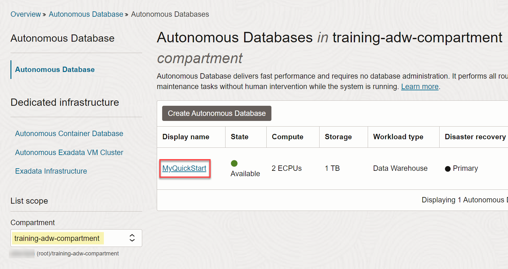
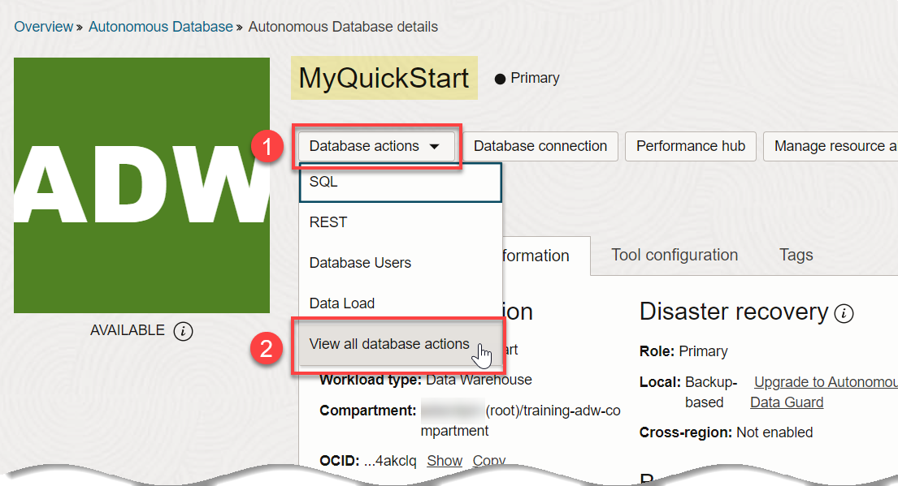
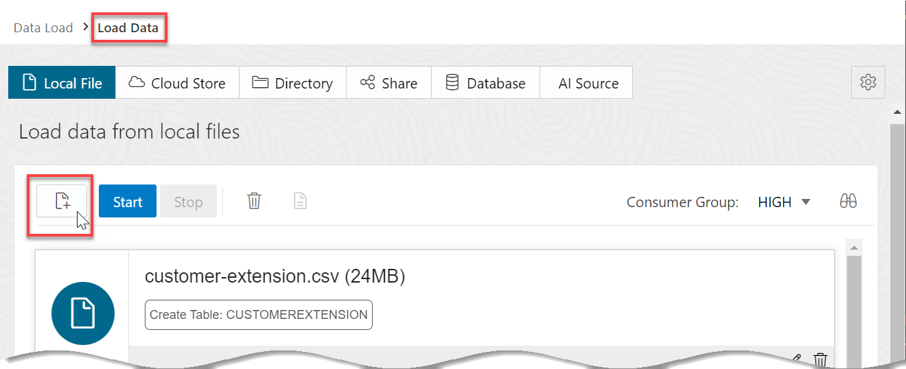
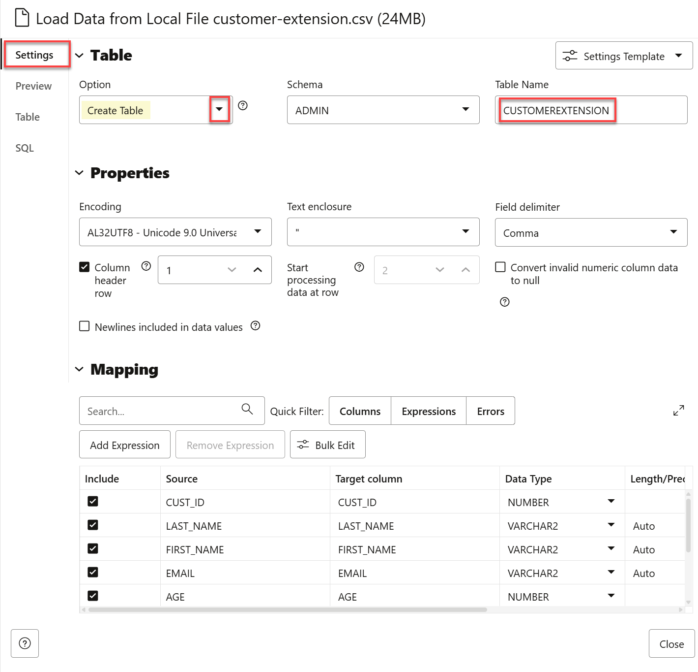
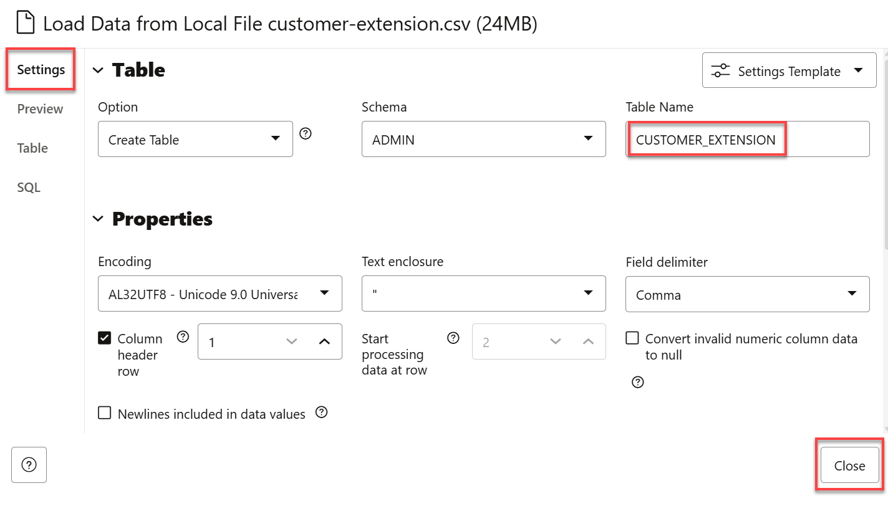
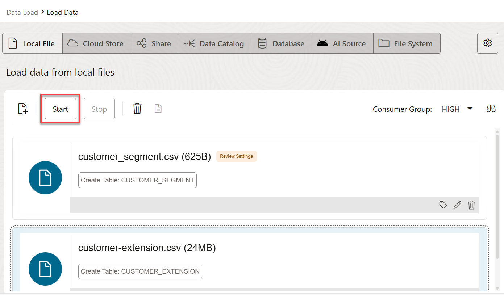
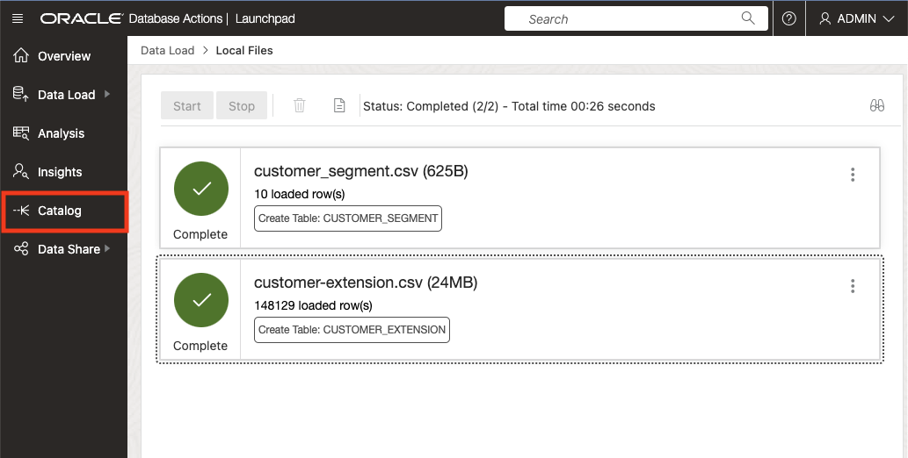
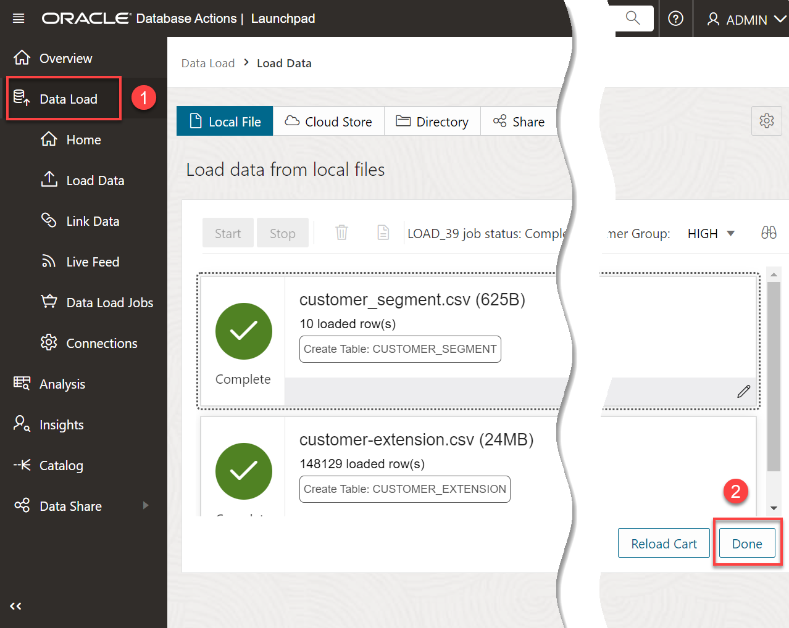

# Load Data from Local Files

## Introduction

In this lab, you will practice multiple methods for loading and linking to data into an Oracle Autonomous Database (either Oracle Autonomous Data Warehouse or Oracle Autonomous Transaction Processing) using the ADB built-in Database Action tools, or using other Oracle and third party data integration tools.

You can also leave data in place in cloud object storage, and link to it from your Autonomous Database.

> **Note:** While this lab uses Oracle Autonomous Data Warehouse, the steps are identical for loading data into an Oracle Autonomous Transaction Processing database.

Estimated Time: 10 minutes

Watch the video below for a quick walk-through of the lab.

### Objectives

In this lab, you will:
* Download two **.csv** data files to your local computer from the MovieStream data lake (Oracle Object Storage buckets).
* Navigate to the Data Load utility of Oracle Autonomous Database Data Tools.
* Load data from the .csv files to your autonomous database instance.

### Prerequisites

This lab requires the completion of **Lab 1: Set up the Workshop Environment > Task 3: Create an Autonomous Data Warehouse Instance**, from the **Contents** menu on the left.

## Task 1: Log in to the Oracle Cloud Console

1. Log in to the **Oracle Cloud Console**, if you are not already logged as the Cloud Administrator. You will complete all the labs in this workshop using this Cloud Administrator. On the **Sign In** page, select your tenancy, enter your username and password, and then click **Sign In**. The **Oracle Cloud Console** Home page is displayed.

## Task 2: Download .csv Files from the MovieStream Data Lake to your Local Computer

Oracle MovieStream is a fictitious movie streaming service - similar to those that to which you currently subscribe. MovieStream is storing (and linking to) their data across Oracle Object Storage and Autonomous Database. Data is captured from various sources into a landing zone in object storage. This data is then processed (cleansed, transformed and optimized) and stored in a gold zone on object storage. Once the data is curated, it is loaded into an Autonomous Database where it is analyzed by many (and varied) members of the user community.

1. Right-click on each of the links below, and then click **Save link as...** from the context menu to download the files to a folder on your local computer.

    * [Download customer\_segment.csv](https://objectstorage.us-ashburn-1.oraclecloud.com/n/c4u04/b/moviestream_landing/o/customer_segment/customer_segment.csv)
    * [Download customer-extension.csv](https://objectstorage.us-ashburn-1.oraclecloud.com/n/c4u04/b/moviestream_landing/o/customer_extension/customer-extension.csv)

2. Close the Excel files and make a note of your folder location as you will use the two downloaded files in a later task in this lab.

## Task 3: Navigate to the Data Load Page

1. Log in to the **Oracle Cloud Console**, if you are not already logged as the Cloud Administrator.

2. Open the **Navigation** menu and click **Oracle Database**. Under **Oracle Database**, click **Autonomous Database**.

3. On the **Autonomous Databases** page, click your ADB instance. Make sure you select the appropriate compartment from the **Compartment** drop-down list in the **List Scope** section.

    

4. On the **Autonomous Database details** page, click the **Database actions** drop-down list, and then click **View all database actions**.

    

5. The **Database Actions Launchpad** Home page is displayed _in a new tab_ in your browser. Scroll-down to the **Data Studio** section, and then click the **DATA LOAD** card.

    

5. The **Data Load** Home page is displayed in a _**new tab in your browser**_.

    

## Task 4: Load Data from the CSV Files Using the LOAD DATA Tool

In this task you will load the two .csv files that you downloaded earlier into two different tables in your Autonomous Database instance.

1. On the **Data Load** page, click the **LOAD DATA** card.

2. On the **Load Data** page, the **Local File** button is selected by default. In the **Load data from local files** section, you can either drag and drop files to upload, or click **Select Files** to select the files to upload. Click **Select Files**.

    

3. In the **Open** dialog box, navigate to the directory that contains the two **.csv** files that you downloaded earlier. Select the **`customer_segment.csv`** and **`customer_extension.csv`** files, and then click **Open**.

    

    >**Note:** If you have an issue uploading both files simultaneously, you can select one file at a time. Select the first downloaded file using step 3. When the file is uploaded, click the **Select Files** icon on the **Load Data** page, and then select the second file.

    

4. When the upload is complete, you will make a small change to the default table name that will be created for the *customer-extension.csv* file. Click the **Settings** (pencil) icon to the right of *customer-extension.csv*.

    

5. The **Load Data from Local File customer-extension.csv** page is displayed. Take a moment to examine the settings. The tool makes intelligent choices for target table name and its properties. Since this is an initial load, accept the default option of **Create Table** to create the target table in your Autonomous Database. In the mappings section, you can change the target column names, data types, and length/precision.

    

7. In the **Name** field, change the table name that will be created from **CUSTOMEREXTENSION** to **CUSTOMER\_EXTENSION**. Click **Close** in the lower right corner of the page.

    

8. Click **Start**. A **Start Load from Local Files** confirmation dialog box is displayed. Click **Run**.

    

9. When the load job is complete, a green check mark appears next to each table. Click **Catalog** in the menu on the left.

    

    > **Note:** If the menu on the left is collapsed, click the double arrows icon to expand it so that the label for each icon is displayed.

    

10. The Catalog displays the two newly created tables: *CUSTOMER\_SEGMENT* and *CUSTOMER\_EXTENSION*.

    

    You can click a table name to display its data. Click the *CUSTOMER\_SEGMENT* table to view the data.

    

11. When finished, click **Close**, and then click the **Data Load** in the menu on the left. Click **Done**.

    

    The **Data Load** page is re-displayed.

This completes the lab on loading .csv files from your local computer to new tables in your ADB instance.

You may now proceed to the next lab.

## Learn More

* [Oracle Cloud Infrastructure Documentation](https://docs.cloud.oracle.com/en-us/iaas/Content/GSG/Concepts/baremetalintro.htm)
* [Using Oracle Autonomous Database Serverless](https://docs.oracle.com/en/cloud/paas/autonomous-database/adbsa/index.html)

## Acknowledgements

* **Author:** Lauran K. Serhal, Consulting User Assistance Developer
* **Contributors:**
    * Mike Matthews, Autonomous Database Product Management
    * Marty Gubar, Autonomous Database Product Management
* **Last Updated By/Date:** Lauran K. Serhal, March 2024

Data about movies in this workshop were sourced from Wikipedia.

Copyright (C) Oracle Corporation.

Permission is granted to copy, distribute and/or modify this document
under the terms of the GNU Free Documentation License, Version 1.3
or any later version published by the Free Software Foundation;
with no Invariant Sections, no Front-Cover Texts, and no Back-Cover Texts.
A copy of the license is included in the section entitled [GNU Free Documentation License](files/gnu-free-documentation-license.txt)
