# Load Data from Object Storage Private Buckets

## Introduction
In this lab, you will load more data from the MovieStream data lake on [Oracle Cloud Infrastructure Object Storage](https://www.oracle.com/cloud/storage/object-storage.html) into your Oracle Autonomous Database instance, in preparation for exploration and analysis.

In the course of this workshop, we are exploring six methods for loading data into an Oracle Autonomous Database. In the previous data loading labs, you loaded data from a file on your local PC and from a **public** object storage bucket. In this 3rd data loading lab, you practice loading data from a **private** object storage bucket. You learn how to set up and use an authentication token and object store credentials to access sensitive data in the private object store. Instead of using the wizard-driven data loading tools of Database Actions, you practice loading data using the DBMS_CLOUD PL/SQL package, the preferred method for load automation.

> **Note:** While this lab uses Oracle Autonomous Data Warehouse, the steps are identical for loading data into an Oracle Autonomous Transaction Processing database.

Estimated Time: 20 minutes

### Objectives

In this lab, you will:
- Download to your local computer a comma-separated value (CSV) file containing a simulation of sensitive customer data
- Create a private OCI Object Storage bucket
- Upload the CSV file to the OCI bucket
- Create an object store auth token
- Define object store credentials for your autonomous database to communicate with the bucket
- Load data from the object store using the DBMS_CLOUD PL/SQL package
- Troubleshoot the data load

### Prerequisites

- This lab requires completion of the lab, **Provision an Autonomous Database**, in the Contents menu on the left.

## Task 1: Download customer data for staging to an object store

First, download a CSV file containing a simulation of sensitive customer retention data. Later, you will stage the file to a private **OCI Object Store** bucket, to populate a table in later tasks.

1. Copy and paste this URL into your browser, and press **ENTER**:

    ```
    <copy>
    https://objectstorage.us-ashburn-1.oraclecloud.com/n/c4u04/b/moviestream_sandbox/o/potential_churners/potential_churners.csv
    </copy>
    ```

2. The browser page will prompt you to download the `potential_churners.csv` file. This file contains customers who will stop or might stop being repeat customers. Choose a folder to save the file and click **Save**.

  

    Make note of where you download the file, as you will upload it to the object store that you define in the next task.

## Task 2: Navigate to OCI Object Storage and create private bucket

In OCI Object Storage, a bucket is the terminology for a container of files.

1. Now you create an OCI Object Storage bucket. From the Autonomous Data Warehouse console, pull out the left side menu from the top-left corner and select **Storage > Buckets**.

    


    

    To learn more about the OCI Object Storage, refer to its [its documentation](https://docs.us-phoenix-1.oraclecloud.com/Content/GSG/Tasks/addingbuckets.htm).

2. You should now be on the **Object Storage & Archive Storage** page. <if type="livelabs">Choose the LiveLabs compartment you were assigned, and click **Create Bucket**:</if><if type="freetier">Choose any compartment to which you have access. In this example, a **training** compartment is chosen. Click **Create Bucket**:</if>

    <if type="livelabs">
    
    </if>
    <if type="freetier">
    
    </if>

<if type="livelabs">
3. **Bucket names must be unique per tenancy and region**; otherwise you will receive an "already exists" message. So include your LiveLabs user login ID, as in **user_id-ADWCLab**. Enter the unique bucket name, leave the default settings, and click the **Create** button.

    
</if>
<if type="freetier">
3. **Bucket names must be unique per tenancy and region**; otherwise you will receive an "already exists" message. Enter the unique bucket name, leave the default settings,  and click the **Create** button.

    
</if>

## Task 3: Upload a file to your OCI Object Storage bucket

Normally, you would likely upload multiple files to an OCI Object Storage bucket. However, to keep this lab simple and quick, you will upload the single file you downloaded in the first task.

1. Click your **bucket name** to open it:

<if type="livelabs">
    

2. Click the **Upload** button:

    
</if>
<if type="freetier">
    

2. Click the **Upload** button:

    
</if>

3. Drag and drop, or click **select files**, to select the `potential_churners.csv` file you downloaded in Task 1. Click **Upload** and wait for the upload to complete:

    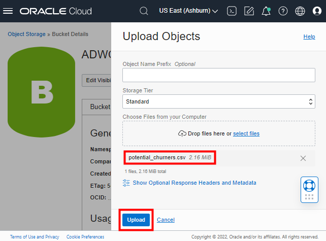

4. When the file finishes uploading, click **Close** at the bottom of the Upload Objects page. The end result should look like this with the file listed under **Objects**:

    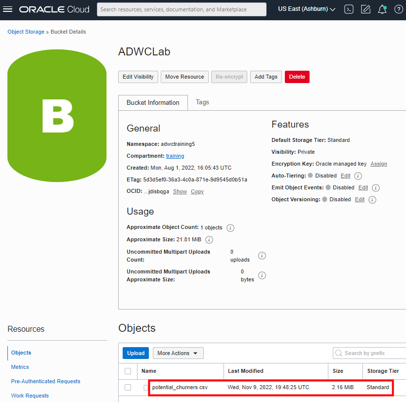

## Task 4: Locate the object store base URL

1. Locate the base URL of the object you just uploaded to your object store. The simplest way to get this URL is to click **View Object Details** in the ellipsis menu to the right of any uploaded file in the object store.

    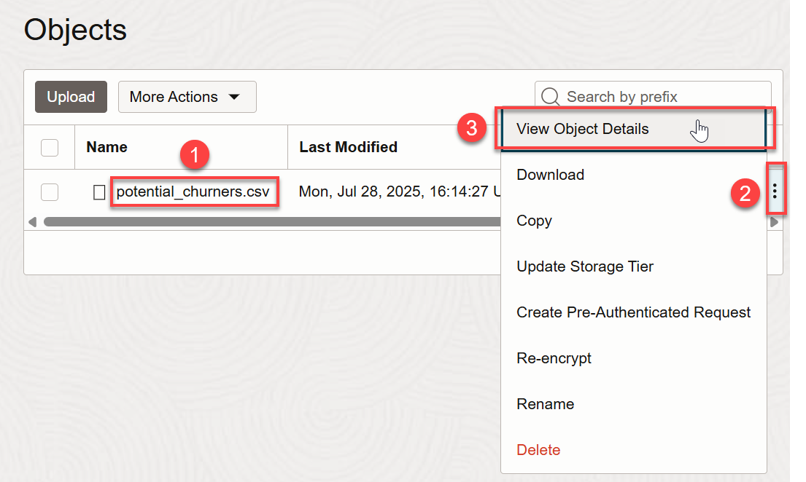

2.  In the **Object Details** page, copy the base URL that points to the location of your files staged in the OCI Object Storage. **Do not include the trailing slash.** Save the base URL in a text notepad. You  will use the base URL in the upcoming tasks. When you are done copying the base URL, click **Cancel** to close the Object Details page.

    

3. Take a look at the URL you copied. In this example, the **region name** is us-ashburn-1, the **Namespace** is a+++++++++ng5, and the **bucket name** is ADWCLab.

    > **Note:** You can construct the URL as here:

    `https://objectstorage.<`**region name**`>.oraclecloud.com/n/<`**namespace name**`>/b/<`**bucket name**`>/o`

## Task 5: Create an object store auth token

To load data from the Oracle Cloud Infrastructure (OCI) Object Storage, you will need an OCI user with the appropriate privileges to read data (or upload) data to the Object Store. The communication between the database and the object store relies on the native URI, and the OCI user Auth Token.

1. In the menu bar at the top, click the **person icon** at the far right. From the drop-down menu, click your **OCI user's name**. This username might have a prefix followed by an email address, for example: `oracleidentitycloudservice/xxxxxxx.xxxxx@xxxxxx.com`.

    

2. In the Identity > Users > User Details page, make note of this username, as you will need it in an upcoming task. At the bottom left side of the page, in the **Resources** section, click **Auth Tokens**.

    

3. Click **Generate Token**.

    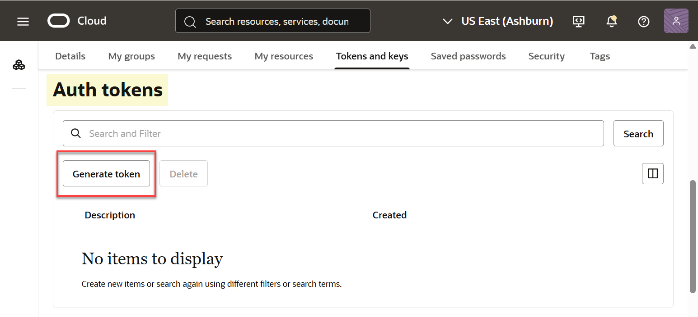

4. Enter a meaningful **description** for the token and click **Generate Token**.

    

5.  The new Auth Token is displayed. Click **Copy** to copy the Auth Token to the clipboard. Save the contents of the clipboard in your text notepad file. You will use it in the next tasks.

    > **Note:** You can't retrieve the Auth Token again after closing the dialog box.

    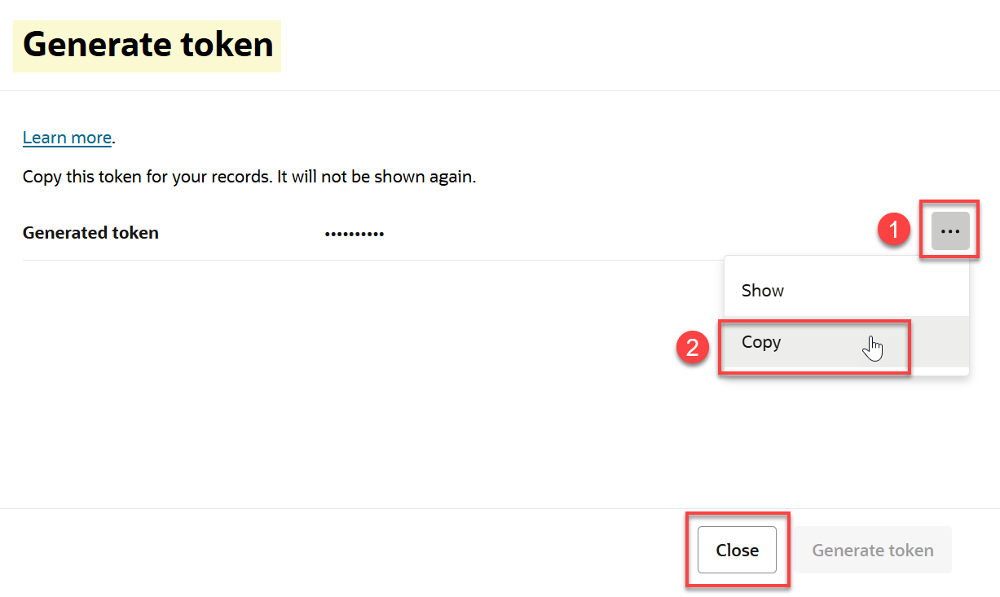

6. Click **Close** to close the Generate Token dialog.

## Task 6: Define a cloud location and create credential using Database Actions DATA LOAD tool

You will load data from the `potential_churners.csv` file you uploaded to your private Oracle Object Store, using the DBMS_CLOUD PL/SQL package. There are two parts to this process and you must perform the first part only once. The two parts are:

+ Set up connection to the Oracle Object Store by defining a cloud location with credential.
+ Load the file using the DBMS_CLOUD PL/SQL package.

First, define a **Cloud Location** to connect to the Oracle Object Store. To begin this process, you need to navigate back to the **DATA LOAD** page of Database Actions.

[](include:adb-goto-data-load-utility.md)

4. On the **Data Load** main page, click the **Cloud Locations** card so you can define a new connection to your object store.

    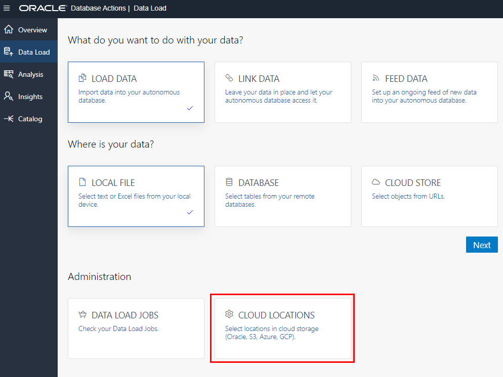

5. Click **Add Cloud Storage**.

    

6. Complete the **Add Cloud Store Location** page.
    + Specify the name **ADWCLab** and a description.
    + Click **Create Credential**. To access data in the Object Store, you need to enable your database user to authenticate itself with the Object Store using your OCI object store account and Auth Token. You do this by creating a private CREDENTIAL object for your user that stores this information encrypted in your Autonomous Data Warehouse. This information is only usable for your user schema.

    + Choose **Oracle** as the cloud store, since you will be loading from your Oracle Object Store bucket.
    + Specify the credential name **OBJ\_STORE\_CRED**.
      **Note:** The credential name must conform to Oracle object naming conventions, which do not allow spaces or hyphens.
    + Specify your Oracle Cloud Infrastructure user name that you identified in Task 5.
    + Copy and paste the Auth Token that you generated in Task 5.
    + Specify the Bucket URI that you recorded in Task 4. Remember to use this general structure, swapping in your own values:

      https://objectstorage.region name.oraclecloud.com/n/namespace name/b/bucket name/o
    + Click **Create**.

    

## Task 7: Load data from the object store using the PL/SQL package, DBMS_CLOUD

As an alternative to the wizard-guided data load that you used in the previous labs, you can use the PL/SQL package `DBMS_CLOUD` directly. This is the preferred choice for any load automation.

The `DBMS_CLOUD` package supports loading data files from the following Cloud sources: Oracle Cloud Infrastructure Object Storage, Oracle Cloud Infrastructure Object Storage Classic, Amazon AWS S3, Microsoft Azure Cloud Storage, and Google Cloud Storage.

This task shows how to load data from Oracle Cloud Infrastructure Object Storage using two of the procedures in the `DBMS_CLOUD` package:

+ **create_credential**: Stores the object store credentials in your Autonomous Data Warehouse schema.
    + You will use this procedure to create object store credentials in your ADW admin schema.
+ **copy_data**: Loads the specified source file to a table. The table must already exist in ADW.
    + You will use this procedure to load tables to your admin schema with data from data files staged in the Oracle Cloud Infrastructure Object Storage cloud service.

1. Now that you've created the Cloud Location to connect to the Oracle Object Store, you're ready to load the `potential_churners.csv` file from your bucket. Navigate back to the main Database Actions Launchpad using the breadcrumb link in the upper left corner.

    

    If you are prompted for username and password, enter the username `admin` and the password you created for `admin` when you created your autonomous database.

2. Under **Development**, click the **SQL** tile to open SQL Worksheet.

  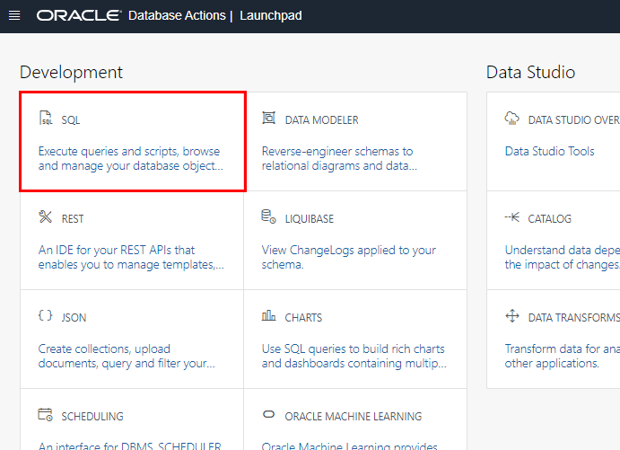

3. Unlike the earlier tasks where the Database Actions DATA LOAD tool gave you the option to automatically create the target Oracle Autonomous Database tables during the data load process, the following steps for loading with the `DBMS_CLOUD` package require you to first create the target tables.

    Connected as your ADMIN user in SQL Worksheet, copy and paste this code snippet to the worksheet, to create the required `potential_churners` table. Take a moment to examine the script. You will first drop any table with the same name before creating the table. Then click the **Run Script** button to run it.

    ```
    <copy>
    DROP TABLE potential_churners;
    CREATE TABLE potential_churners (
    cust_id                 NUMBER NOT NULL,
    will_churn              VARCHAR2(200),
    prob_churn              VARCHAR2(200)
    );
    </copy>
    ```

    > **Note:** Expect to receive *ORA-00942 table or view does not exist* errors during the `DROP TABLE` command for the first execution of the script, but you should not see any other errors.

    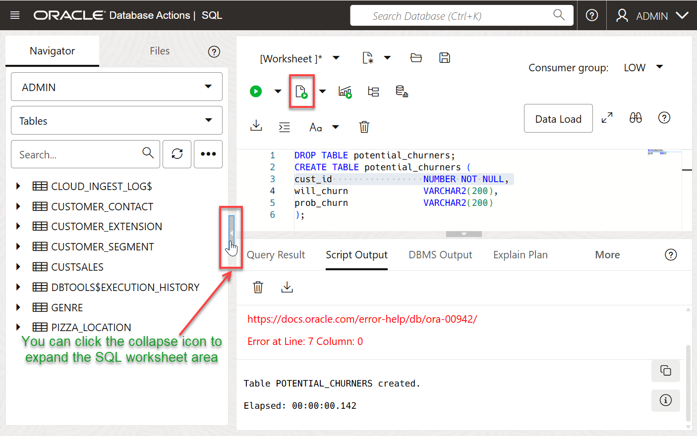

    > **Note:** You do not need to specify anything other than the list of columns when creating tables in the SQL scripts. You can use primary keys and foreign keys if you want, but they are not required.*

4. Download [this code snippet](./files/load_data_without_base_url_v3.txt) to a text editor, for copying the data in the `potential_churners.csv` file you uploaded to the object store bucket, to the target `potential_churners` table you just created in your autonomous database.

5. In the code snippet, after `define file_uri_base =`, replace the example URL with the real object store base URL you copied in Task 4. The top of the file should look similar to the example below:

    ```
    /* In this code snippet, after define file_uri_base =, replace the example URL below with the URL you copied from your file in OCI Object Storage at runtime.
    */
    set define on
    define file_uri_base = 'https://objectstorage.me-dubai-1.oraclecloud.com/n/c4u04/b/LL6570-ADWLab/o'

    begin
     dbms_cloud.copy_data(
        table_name =>'POTENTIAL_CHURNERS',
        credential_name =>'OBJ_STORE_CRED',
        file_uri_list =>'&file_uri_base/potential_churners.csv',
        format =>'{"type" : "csv", "skipheaders" : 1}'
     );
    end;
    /
    ```

6. Copy and paste your edited file to a SQL Worksheet. This script uses the **copy\_data** procedure of the **DBMS\_CLOUD** package to copy the data from the source file to the target table you created before.

7. Run the script.

    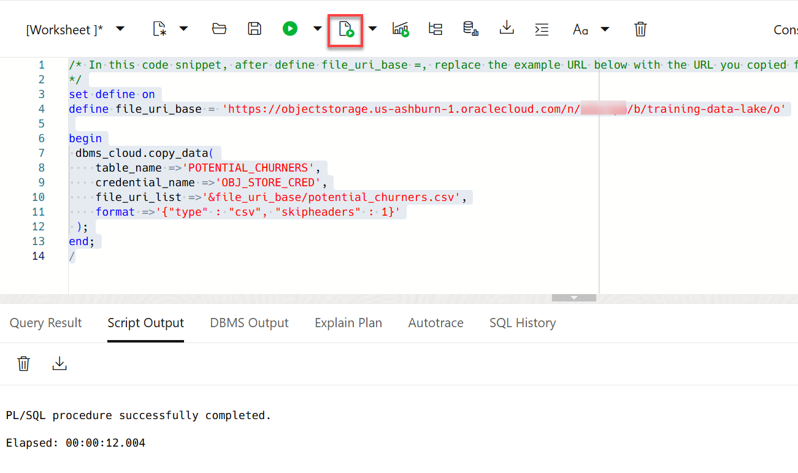

8. You have successfully loaded the `POTENTIAL_CHURNERS` table. While in the SQL Worksheet, you can do a simple query against the table you just loaded. For example, to see the customers who have a greater than 0.8 likelihood of no longer remaining as MovieStream customers, run this query:

    ```
    <copy>
    SELECT * from POTENTIAL_CHURNERS WHERE PROB_CHURN >= 0.8 and WILL_CHURN = 1;
    </copy>
    ```

    

## Task 8: Troubleshoot DBMS_CLOUD data loads

1. Connected as your user in SQL Worksheet, run the following query to look at past and current data loads.
    ```
    $ <copy>select * from user_load_operations;</copy>
    ```
    *Notice how this table lists the past and current load operations in your schema. Any data copy and data validation operation will have backed-up records in your Cloud.*

2. For an example of how to troubleshoot a data load, we will create and try to load a version of the GENRE table, GENRE_DEBUG, that we know will fail because the loading script uses the wrong delimiter. Copy and paste this snippet into your SQL Worksheet and run the snippet:

    ```
    <copy>
    create table genre_debug
       (
         genre_id  number,
         name      varchar2(50)
       );

     begin   
         dbms_cloud.copy_data(
             table_name => 'genre_debug',
             file_uri_list => 'https://objectstorage.us-ashburn-1.oraclecloud.com/n/c4u04/b/moviestream_gold/o/genre/genre.csv',
             format => '{
             			"delimiter":"|",
             			"dateformat":"YYYY-MM-DD",
             			"skipheaders":"1",
             			"ignoreblanklines":"true",
             			"removequotes":"true",
             			"blankasnull":"true",
             			"trimspaces":"lrtrim",
             			"truncatecol":"true",
             			"ignoremissingcolumns":"true"
             			}'
             );
     end;
     /    
    </copy>
    ```

    

3. If you run select * from genre_debug; the result will show that no rows were loaded. What happened? Run the following query to see the load that errored out.

    ```
    <copy>select * from user_load_operations where status='FAILED';</copy>
    ```

    

    A load or external table validation that errors out is indicated by *status=FAILED* in this table. Get the names of the log and bad files for the failing load operation from the column **logfile\_table** and **badfile\_table**. The `logfile_table` column shows the name of the table you can query to look at the *log* of a load operation. The column `badfile_table` shows the name of the table you can query to look at the *rows that got errors* during loading.

4. Query the log and bad tables to see detailed information about an individual load. In this example, the names are `copy$33_log` and `copy$33_bad` respectively.

    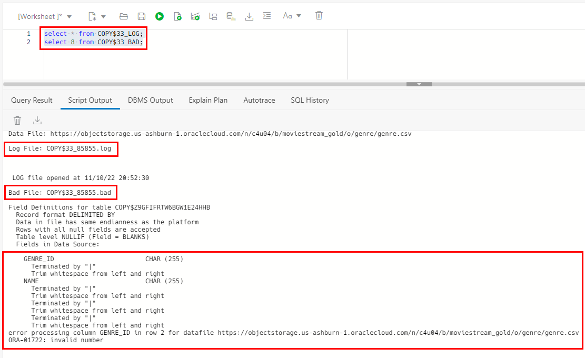    

5. The fields delimiter were specified as "|".

    format => '{

    "delimiter":"|",

    But you can see that the fields are actually terminated by ",". As a result, the load step tried to load the entire line into the genre_id field.
    Let's update the PLSQL call - change the delimiter to a comma:

    format => '{

    "delimiter":",",

6. In the SQL Worksheet, run this corrected version of the load, which uses the comma delimiter:

    ```
    <copy>
    begin   
    dbms_cloud.copy_data(
        table_name => 'genre_debug',
        file_uri_list => 'https://objectstorage.us-ashburn-1.oraclecloud.com/n/c4u04/b/moviestream_gold/o/genre/genre.csv',
        format => '{
        			"delimiter":",",
        			"dateformat":"YYYY-MM-DD",
        			"skipheaders":"1",
        			"ignoreblanklines":"true",
        			"removequotes":"true",
        			"blankasnull":"true",
        			"trimspaces":"lrtrim",
        			"truncatecol":"true",
        			"ignoremissingcolumns":"true"
        			}',
        );
    end;
    /
    </copy>
    ```

7. The PL/SQL procedure will successfully complete.

    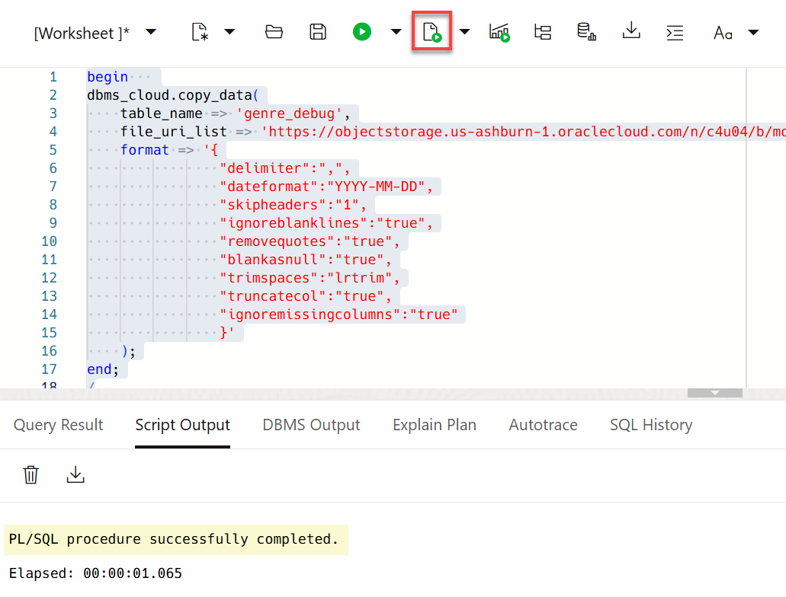

8. View the results by running this query:

    `select * from genre_debug;`

    The GENRE_ID table will now have the loaded data:

    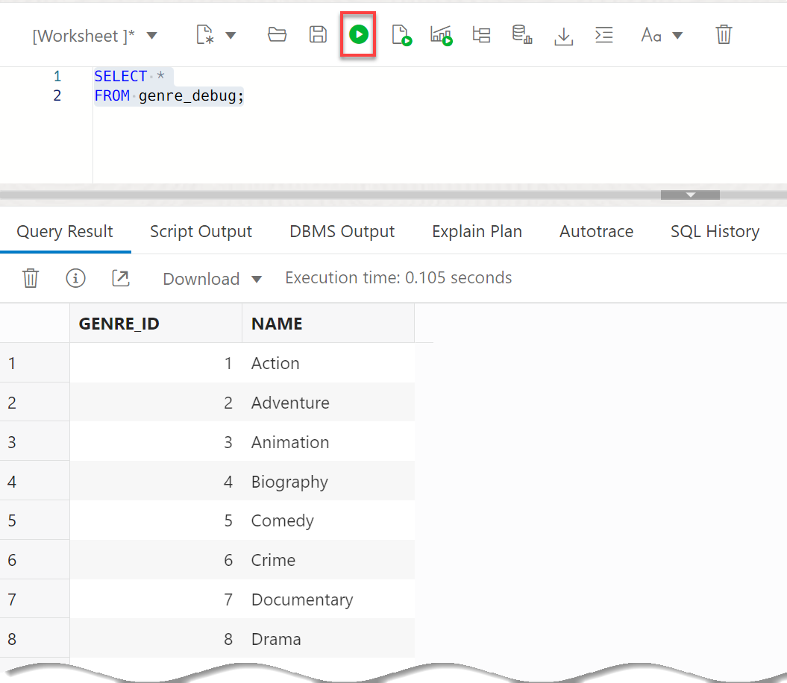

9. To learn more about how to specify file formats, delimiters, reject limits, and more, review the [Autonomous Database Supplied Package Reference](https://docs.oracle.com/en/cloud/paas/autonomous-data-warehouse-cloud/user/dbmscloud-reference.html) and [DBMS_CLOUD Package Format Options](https://docs.oracle.com/en/cloud/paas/autonomous-data-warehouse-cloud/user/format-options.html#GUID-08C44CDA-7C81-481A-BA0A-F7346473B703).

Please *proceed to the next lab*.

## Learn more

For more information about loading data, see the documentation [Load Data from Files in the Cloud](https://www.oracle.com/pls/topic/lookup?ctx=en/cloud/paas/autonomous-data-warehouse-cloud&id=CSWHU-GUID-07900054-CB65-490A-AF3C-39EF45505802).

See the documentation [Loading Data with Autonomous Database](https://docs.oracle.com/en/cloud/paas/autonomous-data-warehouse-cloud/user/load-data.html#GUID-1351807C-E3F7-4C6D-AF83-2AEEADE2F83E) for more methods for loading data with Autonomous Data Warehouse.

## Acknowledgements

* **Author** - Rick Green, Principal Developer, Database User Assistance
* **Last Updated By/Date** - Rick Green, August 2022

Data about movies in this workshop were sourced from Wikipedia.

Copyright (C) Oracle Corporation.

Permission is granted to copy, distribute and/or modify this document
under the terms of the GNU Free Documentation License, Version 1.3
or any later version published by the Free Software Foundation;
with no Invariant Sections, no Front-Cover Texts, and no Back-Cover Texts.
A copy of the license is included in the section entitled [GNU Free Documentation License](files/gnu-free-documentation-license.txt)
