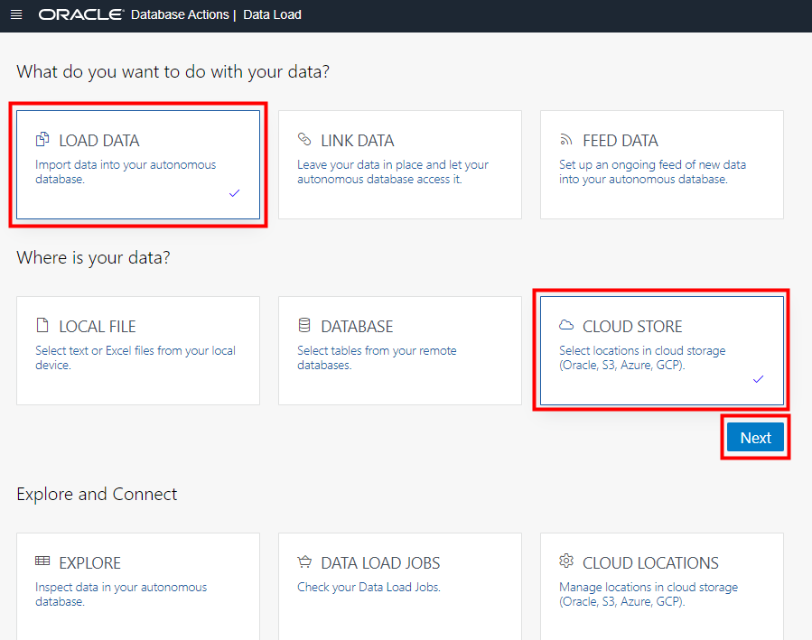
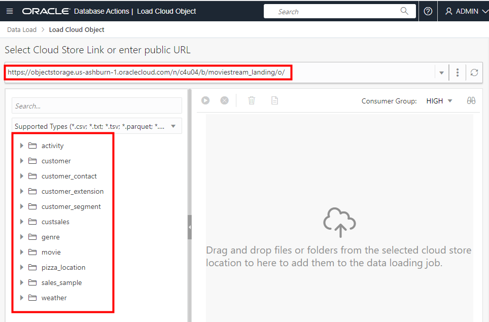
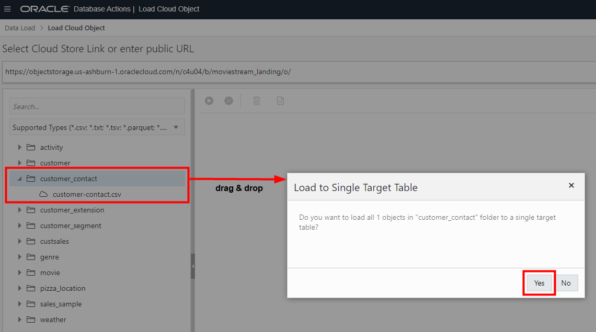
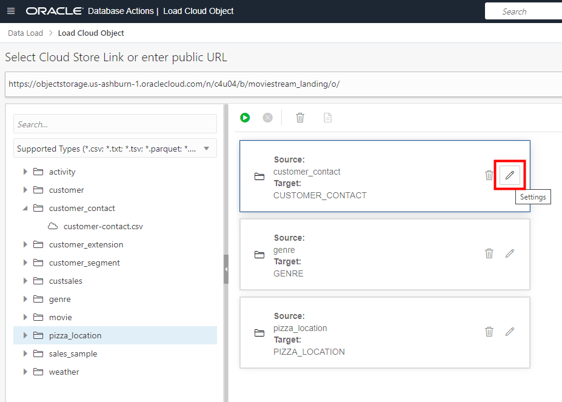
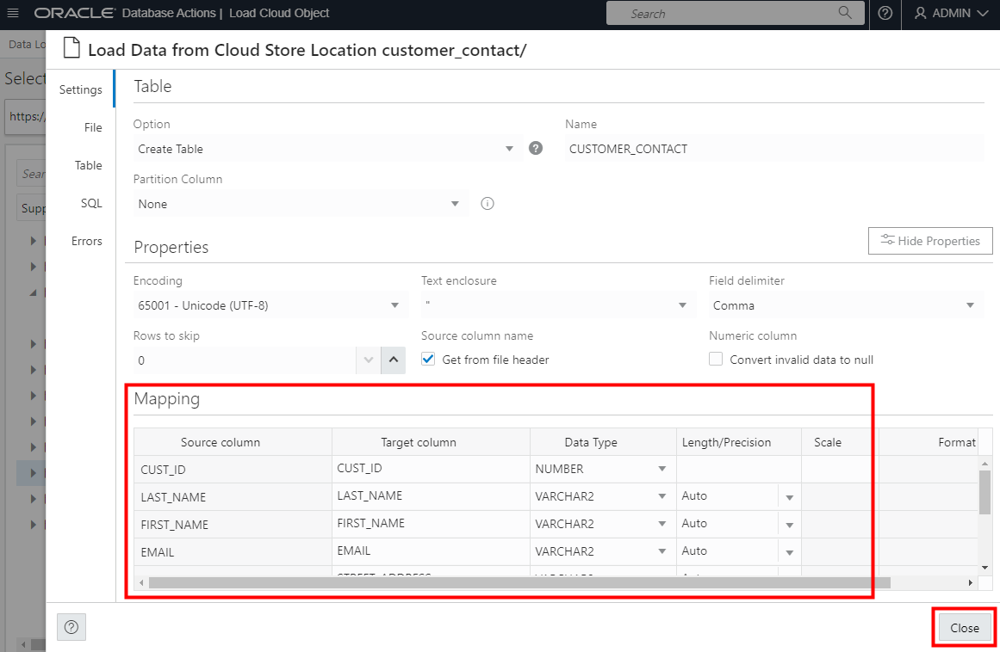
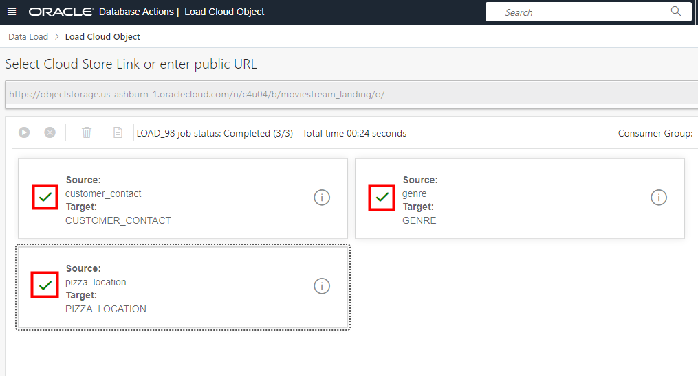

# Load Data from Object Storage Public Buckets

## Introduction

In this lab, you will load and link data from the MovieStream data lake on [Oracle Cloud Infrastructure Object Storage](https://www.oracle.com/cloud/storage/object-storage.html) into an Oracle Autonomous Database instance in preparation for exploration and analysis.

You can load data into your Autonomous Database (either Oracle Autonomous Data Warehouse or Oracle Autonomous Transaction Processing) using the built-in tools as in this lab, or you can use other Oracle and third party data integration tools. With the built-in tools, you can load data:

+ from files in your local device
+ from tables in remote databases
+ from files stored in cloud-based object storage (Oracle Cloud Infrastructure Object Storage, Amazon S3, Microsoft Azure Blob Storage, Google Cloud Storage)

You can also leave data in place in cloud object storage, and link to it from your Autonomous Database.

> **Note:** While this lab uses Oracle Autonomous Data Warehouse, the steps are identical for loading data into an Oracle Autonomous Transaction Processing database.

This workshop explores six methods for loading data into an Oracle Autonomous Database. In this 2nd data loading lab, we practice loading data from public object storage buckets.

Estimated Time: 10 minutes

### Objectives

In this lab, you will:
* Navigate to the Data Load utility of Oracle Autonomous Database Data Tools
* Learn how to load data from public object storage buckets using Data Tools built-in to Oracle Autonomous Database

### Prerequisites

- This lab requires completion of Lab 2, **Provision an Autonomous Database**, in the Contents menu on the left.

## Task 1: Navigate to Database Actions and open the Data Load utility

[](include:adb-goto-data-load-utility.md)

## Task 2: Load data from files in public Object Storage buckets using Database Actions tools

In this section we will perform some simple data loading tasks, to load in CSV files from public object storage buckets into tables in our autonomous database.

1. Under **What do you want to do with your data?** select **LOAD DATA**, and under **Where is your data?** select **CLOUD STORE**, then click **Next**

    

2. The **Load Cloud Object** page appears. Use this page to drag and drop tables from the public object storage bucket to the data loading job.

> **Note:** Your browser might have cached the URL of the public object storage bucket that you accessed in the previous lab, when you downloaded the `customer_segment.csv` file. If so, the URL will automatically appear filled in, and you will see a list of folders containing files. However, if the URL field is blank and there is no list of folders, copy and paste the following link into the URL field, after which the folders will appear:

    ```
    <copy>
    https://objectstorage.us-ashburn-1.oraclecloud.com/n/c4u04/b/moviestream_landing/o
    </copy>
    ```

You will see a list of folders on the left side from which you can drag and drop to the data loading job.



3. You will select three folders. First, drag the **customer\_contact** folder over to the right hand pane. Note that a dialog box appears asking if you want to load all the files in this folder to a single target table. In this case, the folder has only a single file, `customer-contact.csv`. However, you do want to load this into a single table, so click **Yes**.

    

4. Next, drag the **genre** folder over to the right hand pane. Again, click **Yes** to load all files into a single table.

5. Now, drag the **pizza\_location** folder over to the right hand pane. Again, click **Yes** to load all files into a single table.

6. Click the pencil icon for the **customer\_contact** load task to view the settings for this task.

    

7. In the settings viewer, you can see the list of columns and data types that will be created from the csv file. They all look correct, so click **Close** to close the settings viewer.

    

8. Click the pencil icon for the **genre** task to view its settings. This should show just two columns to be created - **GENRE\_ID** and **NAME**. Click **Close** to close the settings viewer.

9. Click the pencil icon for the **pizza\_location** task to view its settings. This should show ten columns to be created, starting with **PIZZA\_LOC\_ID**. Click **Close** to close the settings viewer.

10. Now click the **Start** button to run the data load job.

    

    The job should take about 20 seconds to run.

11. Check that all 3 data load cards have green tick marks in them, indicating that the data load tasks have completed successfully. Then click **Done** to exit the DATA LOAD tool and return to the Database Actions Launchpad.

    

This completes the data loading lab using public object storage data. In the next lab, we will load data using private object storage data.

Please *proceed to the next lab*.

## Acknowledgements

* **Author** - Mike Matthews and Marty Gubar, Autonomous Database Product Management
* **Contributors** -  Rick Green, Principal Developer, Database User Assistance
* **Last Updated By/Date** - Rick Green, July 2022

Data about movies in this workshop were sourced from Wikipedia.

Copyright (C) Oracle Corporation.

Permission is granted to copy, distribute and/or modify this document
under the terms of the GNU Free Documentation License, Version 1.3
or any later version published by the Free Software Foundation;
with no Invariant Sections, no Front-Cover Texts, and no Back-Cover Texts.
A copy of the license is included in the section entitled [GNU Free Documentation License](files/gnu-free-documentation-license.txt)
