# Use Oracle Machine Learning and AutoML UI to predict customer churn

## Introduction

#### Video preview

<!--[](youtube:iK2T6iKaYqQ)-->

Analyzing past performance lets you know customers who have already been lost. Let's get in front of this problem and predict those that are at risk using in database analytics.

In this lab, you will use Oracle Machine Learning (OML) in Autonomous Database to identify customers with a higher likelihood of churning from **Oracle MovieStream** streaming services. You will first use OML AutoML UI to create a customer churn model. Then, you will use OML Notebooks to score customers using both SQL and Python.

Estimated Time: 30 minutes

Watch the video below for a quick walk-through of the lab.
[Use OML to predict customer churn](videohub:1_vdehd0fz)

### About OML

In this lab, we will learn more about the Autonomous Database's built-in [Oracle Machine Learning](https://www.oracle.com/goto/machinelearning) components, including:
- Oracle Machine Learning Notebooks - see [OML Notebooks documentation](https://docs.oracle.com/en/database/oracle/machine-learning/oml-notebooks/index.html).
- Oracle Machine Learning AutoML UI - see [OML AutoML UI documentation](https://docs.oracle.com/en/database/oracle/machine-learning/oml-automl-ui/index.html).
- Oracle Machine Learning for Python - see [OML4Py documentation](https://docs.oracle.com/en/database/oracle/machine-learning/oml4py/index.html).

### Objectives

In this lab, you will:
- Create an **Oracle Machine Learning user** for the Autonomous Database instance
- With this new user, load **past churn behavior data** from an OCI Object Storage location
- Access **Oracle Machine Learning UI** provided with Oracle Autonomous Database
- Use **OML AutoML UI** to build a high-quality machine model that can help predict future churn by customers
- Use the machine learning model to score the list of customers and predict their likelihood to churn in the future
- (Optionally) register the model in Oracle Analytics Cloud, and use it to score in a new Data Flow

### Prerequisites

## Task 1: Create a new Database user and access its DB Actions

1. If you have the Database Actions for the **ADMIN** user still open, look for the **Administration** section, and you will find _Database Users_. Click to open the interface for managing users.
    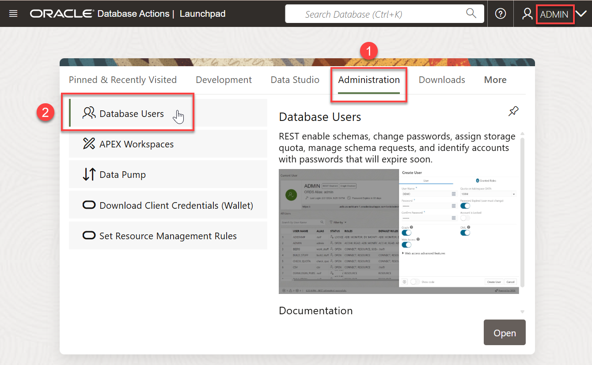


>  Alternatively, you can navigate from the Autonomous Database console, by selecting the option **Database Users** from the _Database Actions_ pull-down menu.
    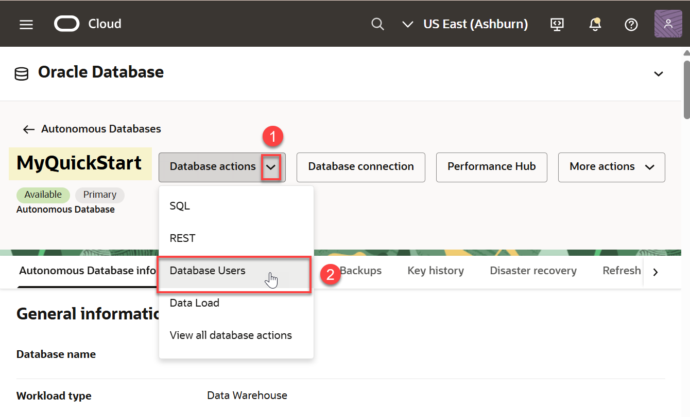

2. In the Database Users interface that opens, click on **Create User**
    

3. Create a new user called **OMLUSER** with the following features:
- Type a password and confirm it.  The password must be between 12 and 30 characters long and must include at least one uppercase letter, one lowercase letter, and one numeric character, and cannot contain the username.
- Check "OML"
- Check "Web Access"
- Select "UNLIMITED" for quota on tablespace DATA.

Click _Create User_ to create the user.
    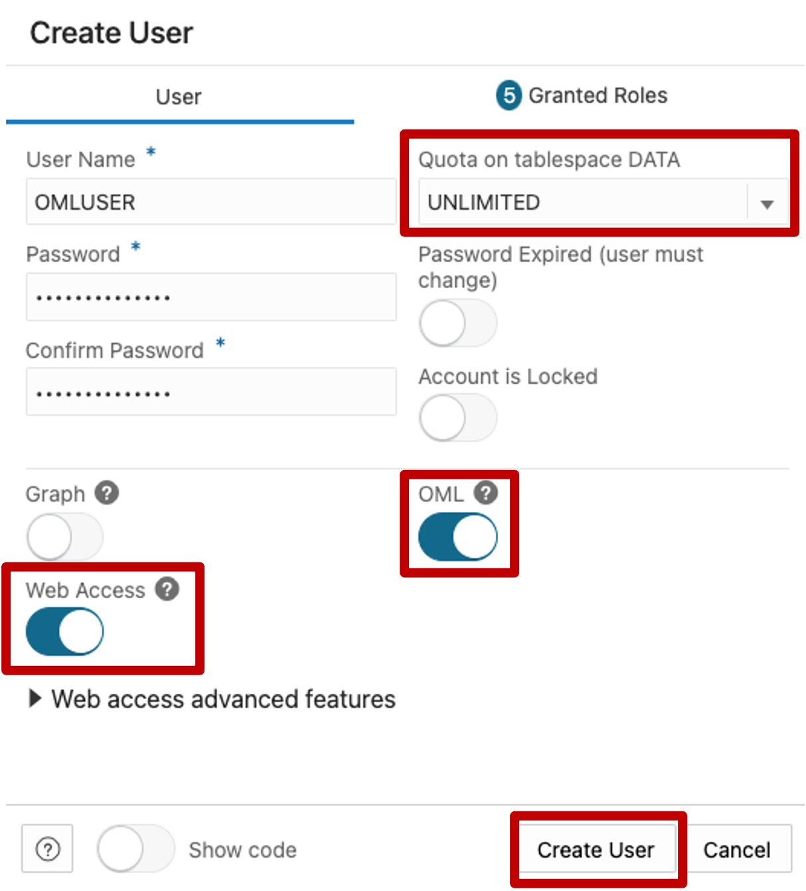

4. Once the user is created, it is going to be shown with the details.  We want to go to that specific user's DB Actions in order to load data directly to it.  Click on the indicated button to open the link to the user's DB Actions.
    

5. You will be asked for the user and password for the OMLUSER.  Note that in the URL itself in the browser you can see that this is the specific DB Actions link for that user.  

Enter **OMLUSER** and the password you just created to sign in.
    

## Task 2: Load the data we will use to work with Oracle Machine Learning

1. Inside the DB Actions of the OMLUSER, under the **Data Studio** section, select _Data Load_ and click to open the interface.
    

2. Inside the **Data Load** section, select _Load Data_.
    

3. Select the _Cloud Store_ button and the following Public Object Storage bucket address in the field indicated:
```
    <copy>
    https://objectstorage.us-ashburn-1.oraclecloud.com/n/c4u04/b/moviestream_landing/o
```
 

4. From the list of the folders on the left, drag **moviestrean_data** to the right panel, and confirm that you want to "to a single target table" when asked.
    

5. You should see the following.  Click on _Start_ to begin loading the data, and then _Run_ to confirm that you wish to start the load.  It should take a few seconds.
    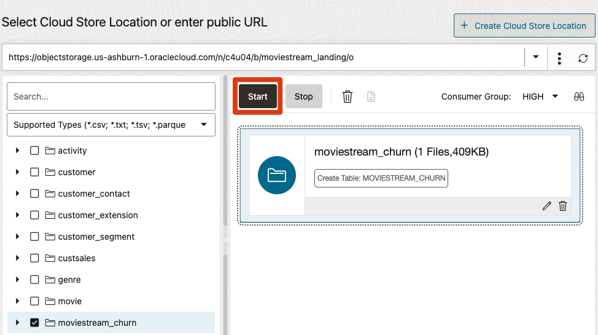

6. Once loaded, the screen will show you the successful load. Now click on the "Database Actions" text in the top section of the screen to go back to the main menu. 
    

## Task 3: Navigate to Oracle Machine Learning UI

1. Before we continue, let's see a brief explanation on how we should define **CHURN** in our business

- Defining customer churn for MovieStream
    To understand customer behavior, we need to look at both geo-demographic information and transactional patterns. For transactional data, we need to summarize customers' transactions by month for each type of transaction that we would like to explore. This type of summarization is required because machine learning algorithms need a single input row per customer, with each attribute reflected in a table column.

    A Data Engineer and a Data Scientist worked together to process and transform the data that exists in the **CUSTSALES** Oracle Database table. This table contains historical customer transactions for every movie streamed, including payment and discounts, and can help us identify customer preferences and usage of the service. To aggregate the data, with *one customer per row* (which is a data layout required by Machine Learning), they worked with the *date* information of the transactions to determine the customer behavior over time.

    Defining what *customer churn* means can be very complex. For our example, the agreement between the business team and the data scientist was:
    - A customer has "churned" if they had 1) *zero movie streams in the last available month of data* and 2) streamed movies every month during 13 months before a *buffer* month (detailed below).
    - In contrast to churners, "non-churners" are customers who have *streamed movies for 13 consecutive months including the last available month of data*.

    The following diagram shows the process we will use, including a *buffer* month that represents the time needed to be able to *act* on the knowledge that a customer is about to leave. Predicting the *probability that a customer is going to leave exactly right now* does not help preparing a customer retention campaign, since there is a lot of processing involved in updating customer data at the end of a day before one can do scoring, excluding customers that have a *DO NOT CONTACT* exception. Also, processing offers and other processes in sync with all other divisions of the enterprise will always take time.  

    

    In addition, *a customer churning today probably made that decision a while ago*. This means that our machine learning model needs to be able to detect any change in behavior from at least a month ago. This is the reason for the buffer of 1 month in the process.


1. We will access Oracle Machine Learning UI from the Database Actions menu, by going to the **Development** section, and clicking on Oracle Machine Learning.

    

2. Log in in as **OMLUSER** with the password you created.

    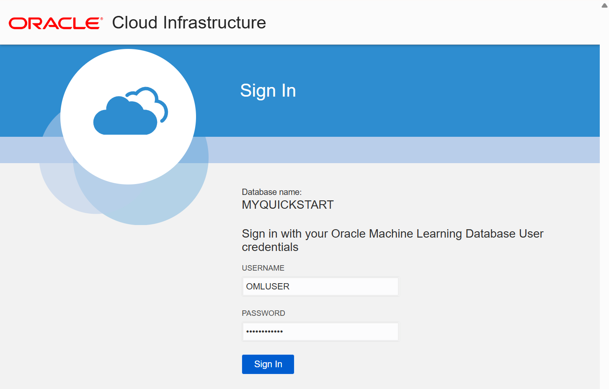

3. You are now in the OML landing page. This page takes you to tutorials, model creation, notebooks and more. We'll now create a new machine learning model using **AutoML UI**:  

    Click **AutoML** on the Quick Actions menu:

    

## Task 4: Create a new AutoML Experiment

1. Create a new AutoML Experiment

   An AutoML Experiment will generate a machine learning model. Let's create a new experiment by clicking the **Create** button as indicated below.

    

2. Name the experiment.

    Give the new experiment a **name** and an optional description.  Then select the experiment's data source by clicking on the **magnifying glass icon** at the right of the **Data Source**:
    

    Previously, we prepared a `MOVIESTREAM_CHURN` table containing numerous attributes that should be helpful in predicting churn. 

    In the **Select Table** menu, leave the `SCHEMA` selection as `OMLUSER`, and on the right side scroll down to search for the `MOVIESTREAM_CHURN` table. Alternatively, type `CHURN` in the search box at the bottom of the list to filter the table list. Select the `MOVIESTREAM_CHURN` table and click the **OK** button.

    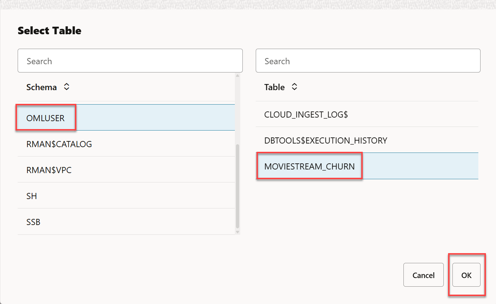

3. Back on the **Experiment** page, the **Data Source** name is populated with our selection.  It should look like this.
       


4. Scroll down in the **Experiment** page until you see the **Features** section. A list of the attributes available in the table is displayed. Please note that there is a **scroll bar** for the list itself at the right, next to the **Std Dev** statistic.
    

5. Define the Prediction Target, Case ID and Experiment Settings.

    Scroll to the top-right part of the **Experiments** page to identify the field that we want to predict. Click the drop-down in the **Predict** field. Scroll to and select the target attribute named `IS_CHURNER`. You can also start typing the target attribute in the `Search` box to quickly filter the values.

    

    Repeat the process with the **Case ID** pull-down menu selection, choosing column `CUST_ID` as the unique customer identifier. The final result should look like the image below:

    

    On the left side, just under **Data Source**, you'll find that **Classification** is the selected **Prediction Type**. This is selected because AutoML detected that our **Predict** column, or `TARGET` attribute, has only two distinct values and therefore is a binary classification problem. The other prediction type, **Regression**, is not appropriate for our problem.

6.  Use Additional Settings to customize processing.

    Expand the **Additional Settings** section by clicking the triangle next to its name. The default values for **Maximum Top Models** is **5**, but we will reduce that to **3** in order to make processing a bit faster for this workshop. Also, increase the **Database Service Level** to **HIGH**. Read more about Service Levels with OML AutoML UI in [this Blog Post](https://blogs.oracle.com/machinelearning/oml-automl-ui-4-things-you-can-do-that-affect-performance).

      Make sure your selections look like the following:

    

    We are going to leave the **Algorithms** selections as is, which means that OML AutoML will try each of these algorithms to find the best one for our situation.  The ability to select which algorithms to use is useful in case a specific Industry Regulator or business requirement dictates that a certain algorithm cannot be used.
    
    

    Scroll down to see the Features listing.  Let's exclude the customer names (First and Last) from the input attributes, as it does not make business sense to use those in this case.  We do not expect that a name or last name would make any sense to have an impact on the customer's likelihood to churn.

    Start by typing _NAME_ in the search box, and then **uncheck** the boxes next to the two features shown.
    


    We are now ready to start the Experiment.

## Task 5: Run the Experiment and explore the results.

1. Start the Experiment.

   Click the **Start** button at the top of the screen, then select **Faster Results**. This selection speeds processing as OML AutoML UI will search for models on a reduced hyperparameter search space.

    

    As a reference point, we expect this **Experiment** to run to completion on a **Classification** task using **Balanced Accuracy** as the metric, and using **Maximum Top Models of 3** in about **2 or 3 minutes**.

    > **NOTE:** If you choose different settings for your own Experiment, a larger number of models, or even run it at **Best Accuracy** instead of **Faster Results**, a longer running time might be required, and a different "best" algorithm might be chosen. In that case, your results might differ slightly from the screens below, but will still be valid and correct based on your settings.

    You will see a floating **Progress** indicator while the **Experiment** is running. The progress indicator shows the status of each of the Experiment's steps and an approximate time that it has been running.
    

    The performance of OML AutoML UI is impacted by your Autonomous Database configuration. As explained in [this blog post](https://blogs.oracle.com/machinelearning/oml-automl-ui-4-things-you-can-do-that-affect-performance), several components may affect the performance, including the base number of Autonomous Database CPUs and whether or not auto scaling has been enabled.

2. Check the results.
   Once the process completes, you will note that the **running icon** on the top right changes to indicate it is **Completed**. The **Balanced Accuracy** chart will show the increased accuracy over time as the models were tested, and the **Leader Board** will present the different algorithms that were chosen, and their respective **Model Names**.

    In the following screen we can see that the top 3 algorithms chosen were a **Random Forest**, a **Decision Tree** and a **Support Vector Machine**. By default they receive randomly generated unique **Model Names**.
    

    After an **Experiment** run is completed, the **Features** grid displays an additional column **Importance**. This feature importance indicates the overall level of sensitivity of prediction to a particular feature. Hover your cursor over the graph to view the value of importance. The value is always depicted in the range 0 to 1, with values closer to 1 being more important.

    Scroll down to see the **Features** section. You will also note a **Search** box at the top right of this section, which is important given that there are 56 features (58 minus the ID and Target).

    In this **Experiment**, the attributes with the highest **overall importance** are:  AGE (customer age), GENDER (customer gender), AVG\_NTRANS\_M3\_5 (average number of transactions in the previous quarter), CREDIT\_BALANCE, YRS\_RESIDENCE (how many years the customer has lived in the same address), GENRE\_WAR (how many movies of Genre War has the customer watched in the last year),  GENRE\_THRILLER, EDUCATION (customer level of education) and GENRE\_FAMILY. 
    

    > **Note:** this importance value is **not** related to any particular model, but it shows an overall value to give us an idea of potentially which attributes would be important.

    
3. Understand model performance.
   
   Scrolling up to the **Leader Board** section, we can click the **Random Forest** unique model name to open the diagnostics. Click on the Decision Tree **Model Name** link in blue.

    > **NOTE**: The exact random model name is unique to your model, with the two first characters representing the algorithm, so when you run this it will not appear as *RF\_BFC8837FEA* like the one below.

    

    A new floating window opens, showing the **Prediction Impacts** sorted from larger to smaller. This time the attributes are listed in the order of impact that they have on this specific model in its formulation to predict churn.

    

    In this model, the most important features include geo-demographic attributes like AGE, GENDER and EDUCATION, as well as  behavioral attributes like GENRE\_THRILLER, AVG\_NTRANS\_M3\_5 (average number of transactions in the previous quarter) and others with some lesser impact.

    After reviewing the impacts, click the **Confusion Matrix** tab to visualize the result of the assessment of the model on a **Test Set** of data chosen by AutoML for this test.

    

    > **Note:** As s reference, the original Dataset contains 50% of Churners and 50% of a selection of the Non-churners.

    In the **Confusion Matrix** we can see that, in the **Test Set** this particular Random Forest model was able to correctly identify __93.03%__ of the future customer behaviors (the green diagonals, 64.81% + 28.22%).  

    The model incorrectly thought that __5.92%__ of the test dataset were going to churn (Predicted: 1), but they actually did not (Actual: 0).  This is actually not that bad for marketing purposes, since we would be sending offers to these customers when they might be staying with us anyway.

    The model also thought that __1.05%__ of the customers would not churn (Predict: 0) but they actually did (Actual: 1).  This type of error is more dangerous in churn management, since your model is not capable of identifying these customers as churners when they indeed would have been, and should be monitored over time.

## Task 6: Prepare the model for scoring and deployment

 In preparation for scoring via SQL, we will want to rename the model, from the original randomly assigned name to something you can relate to your project.

1. We will **Rename** the model, which will allows us to run the scoring via SQL later. With the model row selected (indicated by a light blue highlight in the row), click the **Rename** button.

      

    Give your model a new name.  We suggest **`CHURN_PRED`**.

    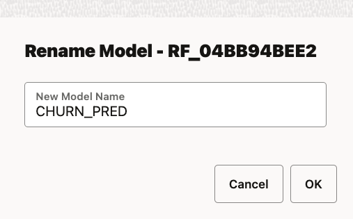  

    It should show up in the **Leader Board** with the new name in a few seconds.

    

    Now we are ready for scoring customers using SQL by using that model name.

## Task 7: Score customers with Python and SQL using the model

 You can import a notebook from a local disk or from a remote location if you provide the URL. A notebook named **Scoring Customers with Churn Model.dsnb** contains all the steps for scoring data with Python and SQL using the **CHURN_PRED** model that was just created. In this task, you will first download the **Scoring Customers with Churn Model** OML notebook to your local machine, and then import this notebook into OML.

1. Click the button below to download the __Scoring Customers with Churn Model.dsnb__ OML notebook file to your computer:

    <a href="files/Scoring Customers with Churn Model.dsnb" class="tryit-button" style="background-color:maroon">Download notebook</a>

    Go to the main notebooks EA listing by clicking on the "three lines" OML Navigation button on the upper left of the screen, and then select **Notebooks EA**.

    

2. Click the **Import** button and navigate to the folder where you just downloaded the notebook **Scoring\_customers\_with\_Churn\_Model.json** file.

    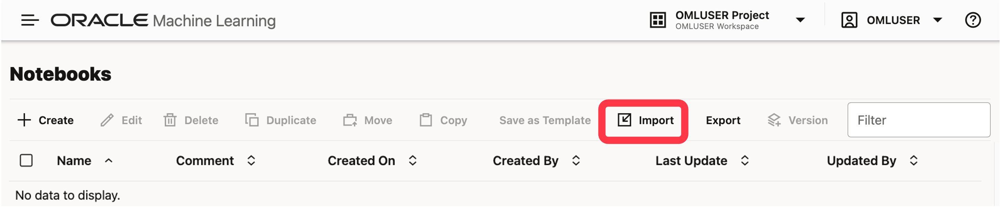

    Click **Open** to load the notebook into your environment.

    After successfully importing the notebook, you will see a new notebook called **Scoring customers with Churn Model** in the list of Notebooks.

3. Open and run the notebook.

    Open the notebook by clicking **Scoring customers with Churn Model**.

    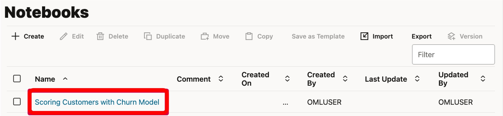

    You will see that the notebook server starts and loads the notebook. You should see the beginning of the notebook, as shown below.

    > **Note:** You might be asked to click __Allow Run__ in the paragraphs that contain MarkDown code.  It is safe to do so in this case.

    

    We will follow the notes and instructions in the notebook, but before we do, and to make sure the entire environment is ready, we will run the entire notebook by clicking at the top of the screen, on the icon that looks like a **play button** next to the notebook name, like indicated in the image below.

    

    In the menu that pops open, confirm that you do want to run the entire Notebook by clicking the **Confirm** button.

    The entire run is expected to take around 10 seconds, depending on the resources available.
    

    > **Note:** Looking at the bottom right on each paragraph you will see how long ago it was run the last time.  Confirm that it says _a few minutes ago_ or _a few seconds ago_


4. In Python load the Random Forest model and create a new TABLE
   
    Scrolling down the Notebook body, the first large section with code is using __Python__ to create proxy connections to the dataset **MOVIESTREAM_DATA**, to the Random Forest model, and then using the _predict_ function to request the Database to score the dataset, generating an **Inference** for the future customer likelihood to Churn.
    
    

    The second section of the __Python__ code is organizing the columns and reordering them to generate the expected **Probability to Churn** and whether a customer **Will Churn** (which in this case is '1' whenever the probability is over 50%, or '0' otherwise).  In addition to that the usage of the _.materialize()_ function is making the Database write a permanent table from the original temporary one created by the prediction process, so others in the team can query that table.

    

5. In SQL let's run a dynamic scoring with the model
   
    If we scroll down to the **SQL** section, we see basically two main steps. There is one paragraph that deletes a table named `LATEST_POTENTIAL_CHURNERS` if it exists (in case we wanted to experiment later with SQL).
    
    The second paragraph uses SQL to create a new table based on the `PREDICTION` and `PREDICTION_PROBABILITY` capabilities of Oracle SQL enabled by OML.  These are unique features in SQL for in-Database Dynamic Machine Learning Inference.   These functions can score any table that contains the columns necessary for computing the Probability.
    
    > **Note:** Oracle Machine Learning is resilient to missing data, and it can return a Probability computation even if there are missing data in some columns by replacing missing data using different techniques. 
    
    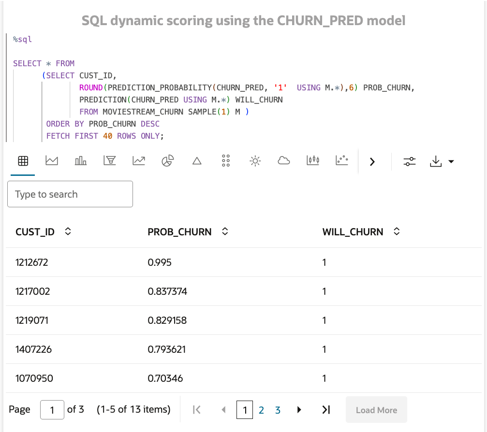

    Please note that the following `SELECT` statement can be run by any Application connecting to this Autonomous Database instance through `JDBC`, and the scoring will be returned.

    Also remember that you need to change the name of the model being used from `CHURN_PRED` to something else if you decided to use a different name when you were doing the **Rename** of the model in **Step 1** of **Task 6**.

    ```
    <copy>
    SELECT * FROM
      (SELECT CUST_ID,
              PREDICTION(CHURN_PRED USING M.*) WILL_CHURN,
              ROUND(PREDICTION_PROBABILITY(CHURN_PRED, '1'  USING M.*),6) PROB_CHURN
              FROM MOVIESTREAM_CHURN M)
    ORDER BY PROB_CHURN DESC;
    ```

  The **SQL** code that follows the dynamic scoring is just showing the table created and materialized by **Python**.  It is showing a small sample for a feeling of what to expect from the output of this process.

    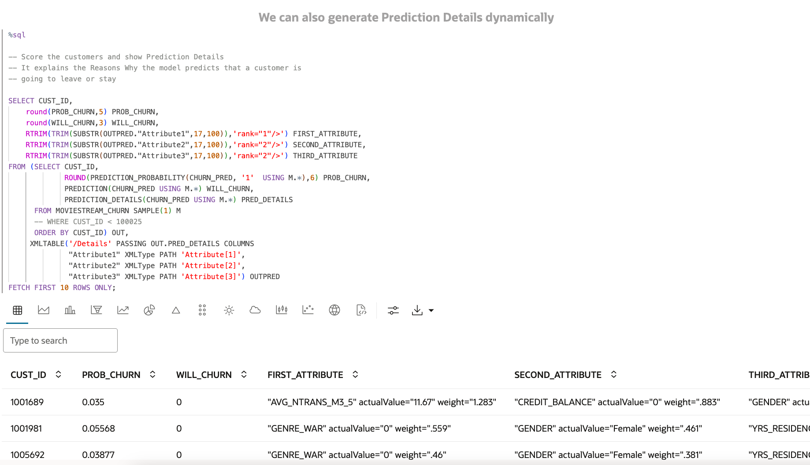

  You can scroll to the right and see more columns, or select the other pages of customers as well.

**CONGRATULATIONS!!!**

You now have deployed a new table called `LATEST_POTENTIAL_CHURNERS` containing each customer's likelihood to churn and the decision (will the customer churn or not?) suggested by the Machine Learning model.

Now other professionals can take advantage of both the deployment you have just made in order to contact the customers at risk with an offer, as well as use your SQL Scoring code to put the model into production and run the scoring in batch every time there is a new refresh of the data, be it hourly, daily, weekly, or monthly.


## Task 8: Bonus content - additional model quality metrics

1. Let's return to the OML AutoML Experiment results. Click the three-line menu at the top of the Oracle Machine Learning, and then click **AutoML Experiments** in the menu that opens.  
   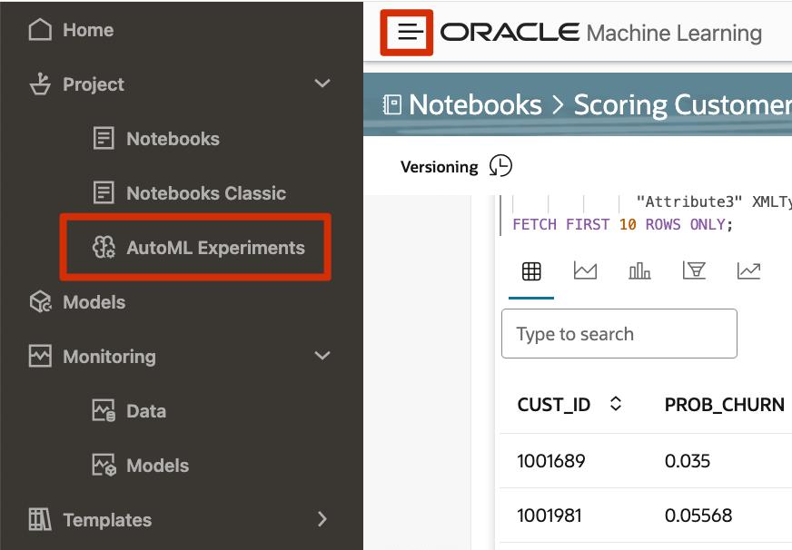

   
2. The list of experiments will open. Click on the experiment we named before _Detect potential churners_.
   

3. Go to the leaderboard section, and click on the row of the **CHURN_PRED** model to highlight it in light blue.  Then click on the _Metrics_ button to open a selection of additional model quality metrics, and select Accuracy and ROC AUC (Area under the ROC curve).
   Close the menu in the top right **X** when ready.

    

    The new metrics will be displayed for each model and would enable you to compare and sort the list of models by each type of metric as desired (by clicking on the column name).

    

## Task 9: Bonus content - auto-generated OML4Py notebook

   We can create an OML4Py auto-generated notebook with the model selected in the Leaderboard, that will contain all the steps necessary to recreate that model, including all hyperparameter settings.

1. While highlighting the row of the **CHURN_PRED** model, click the **Create Notebook** button.  Accept the default name given and click __OK__ .

       

2. After it is created, a pop-up note will appear at the bottom of the screen.  Click "Open Notebook"
    
    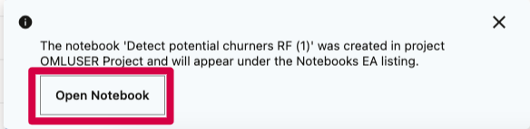   

3. Let's run the entire Notebook so it will be easier to read.  Click on the _play button_ at the top, next to the Notebook name. The first section shows details of when the model was created, the username, input data, predict, algorithm and other details.
    
    > **Note:** You might be asked to click **Allow Run** in the paragraphs that contain MarkDown code. It is safe to do so in this case.
   
       

4. Scroll down in the notebook to see the first section.  It is preparing a query that will include only the columns that were found to have significance to this particular model, and then it will create a proxy object to the data.
   
        

5. The second section is building the input dataset and then creating the Random Forest model from scratch, showing the exact hyperparameters used to build the original model created via AutoML UI.  It also allows experts to make additional adjustments. The model is built using the _fit()_ function.
   
        

6. The next section illustrates the output of the model just created, by showing the model details.  Scroll down for more model details.
   
        

7. The last sections show how to score (generate inference) of customers, and verify the model quality as well using the open-source sklearn package from Python. 
   
        

## Task 10: Bonus content - deploy the model to an OML Service REST endpoint
   We will deploy the selected model from the AutoML UI directly to a REST endpoint that is hosted by **Oracle Machine Learning Services**, and it is provided at no extra cost to all **Autonomous Database** customers.  Only the CPU consuemd while actually scoring via REST would be charged, so there is no additional infrastructure needed for the model's REST API to be exposed.

1. Let's return to the OML AutoML Experiment results. Click the three-line menu at the top of the Oracle Machine Learning, and then click **AutoML Experiments** in the menu that opens.  
   
   
2. The list of experiments will open. Click on the experiment we named before _Detect potential churners_.
   

3. Go to the leaderboard section, and click on the row of the **CHURN_PRED** model to highlight it in light blue.  Then click on the _Deploy_ button to open a menu with the details of the deployment.  Fill the information like indicated below:
    - **(optional) Comment:** RF model to detect customer Churn
    - **URI:**  churn_pred
    - **Version:**  1.0
    - **Namespace:**  OML_MODELS
  
   Check the _Shared_ box, and click **OK**.
   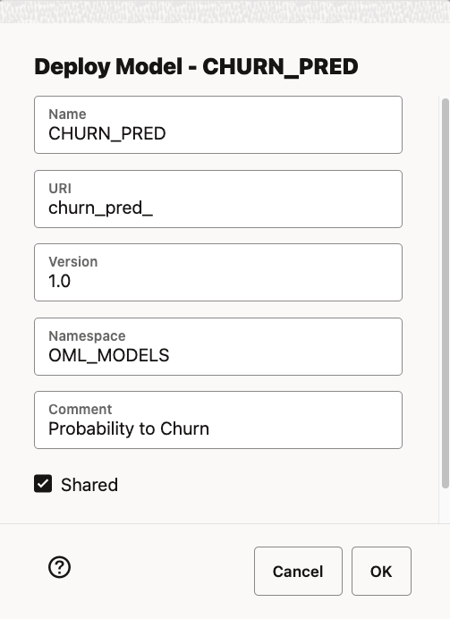

4. Let's navigate to the OML Models interface. Click the three-line menu at the top of the Oracle Machine Learning, and then click **Models** in the menu that opens. 
   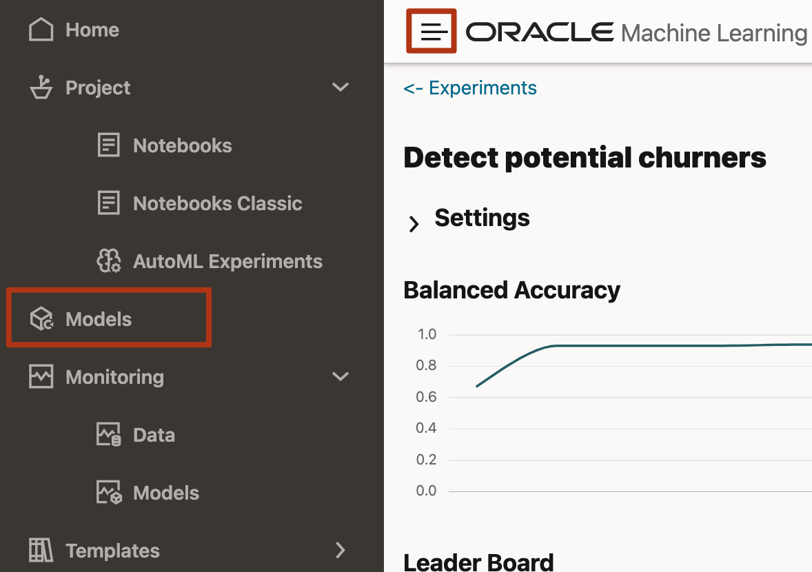

5. The models we have built so far are available in the Database, and listed here.  We are interested on the Deployment we just did, so let's go into that by clicking on _Deployments_.
   

6. The list of deployments is shown. In our case we have done only one, so it is shown.  Under URI the name of the deployment is the one we gave it when deploying it.
   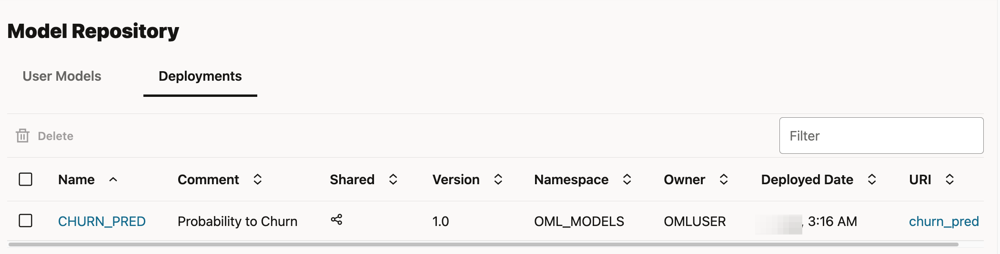

7. Let's now check the deployed model's Metadata.  Click on the **CHURN_PRED** under __Name__. The metadata contains the details about the model, what mining function it uses, the expected inputs that it requires and the output labels that it produces.
   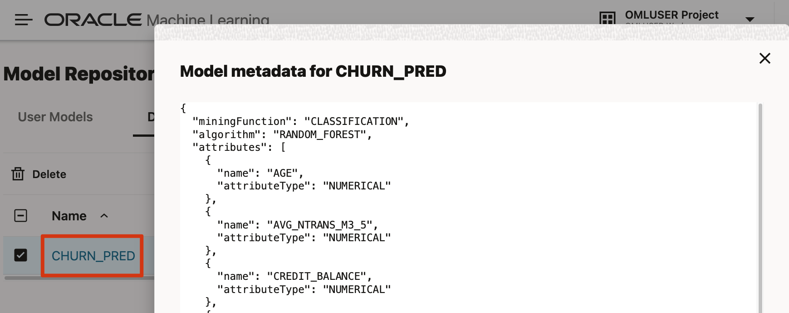

8. Let's now check the deployed model's **REST endpoint Open API specification**, by clicking its name under the URI. The Open API specification contains the details about how to access the model via REST, gives the server details, and specifies the expected inputs and the output labels that it produces, as well as available options.
   

9. We are ready to deploy the Churn Model to an Application via REST. Back in the Database Actions menu, scroll down to find the Related Services section to find the specific address for your own model, since these are unique to each Autonomous Database instance.
   When developing Applications that can pass the information needed to get a score of the models, the OML Services REST API can return a sub-second score for a mini-batch of records, or you can request an asynchronous call for batch scoring as well.  
   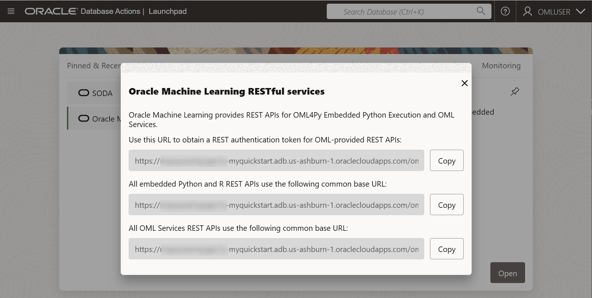

   For more details on how to use the deployed model and Oracle Machine Learning Services capabilities, make sure to look at that Lab in the [Oracle Machine Learning Fundamentals on Oracle Autonomous Database](https://apexapps.oracle.com/pls/apex/r/dbpm/livelabs/view-workshop?wid=922) workshop, which shows you how to use REST clients to access the model and more.

## Learn more

* [Oracle Machine Learning product information](https://oracle.com/goto/machinelearning)
* [LiveLabs: Introduction to Oracle Machine Learning for Python](https://apexapps.oracle.com/pls/apex/r/dbpm/livelabs/view-workshop?wid=786)
* [LiveLabs: Get started with Oracle Machine Learning fundamentals on Autonomous Database](https://apexapps.oracle.com/pls/apex/r/dbpm/livelabs/view-workshop?wid=922)
* [Get started with Oracle Machine Learning Services REST APIs](https://docs.oracle.com/en/database/oracle/machine-learning/omlss/index.html)
* [Subscribe to the AskTOM Oracle Machine Learning Office Hours](https://asktom.oracle.com/pls/apex/asktom.search?office=6801#sessionss)
* [Oracle Machine Learning AutoML UI Demo](https://www.youtube.com/watch?v=yJGsfU9cmt0)
* [Oracle Machine Learning for Python Demo](https://youtu.be/P861m__PEMQ)

## Acknowledgements
* **Author** - Marcos Arancibia, Oracle Autonomous Database Product Management
* **Contributors** -  Mark Hornick, Marty Gubar, Kevin Lazarz, Nilay Panchal, Jayant Sharma, Jie Liu, Sherry LaMonica, Richard Green
* **Last Updated By/Date** - Marcos Arancibia, February 2024
