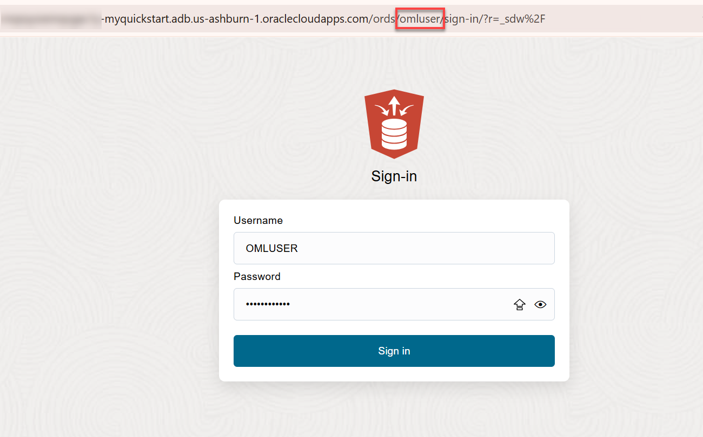
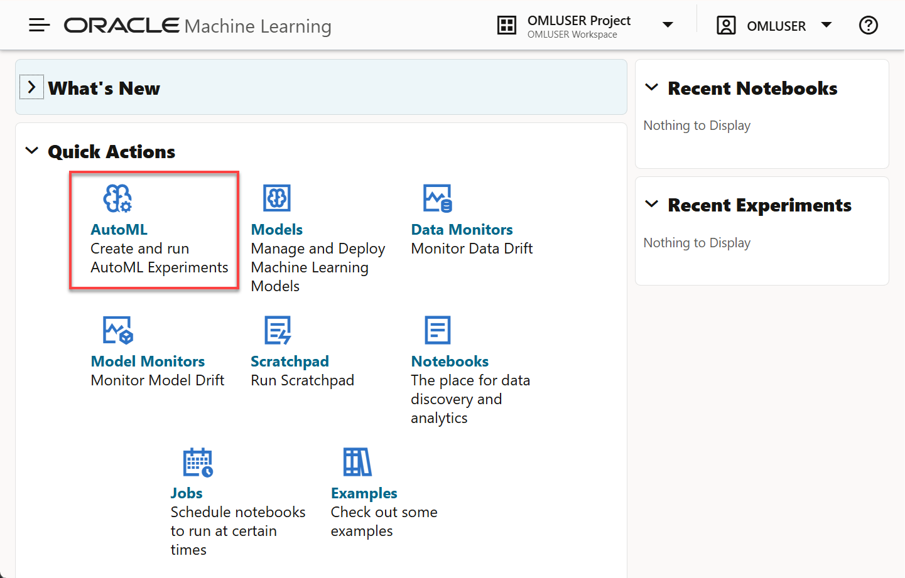
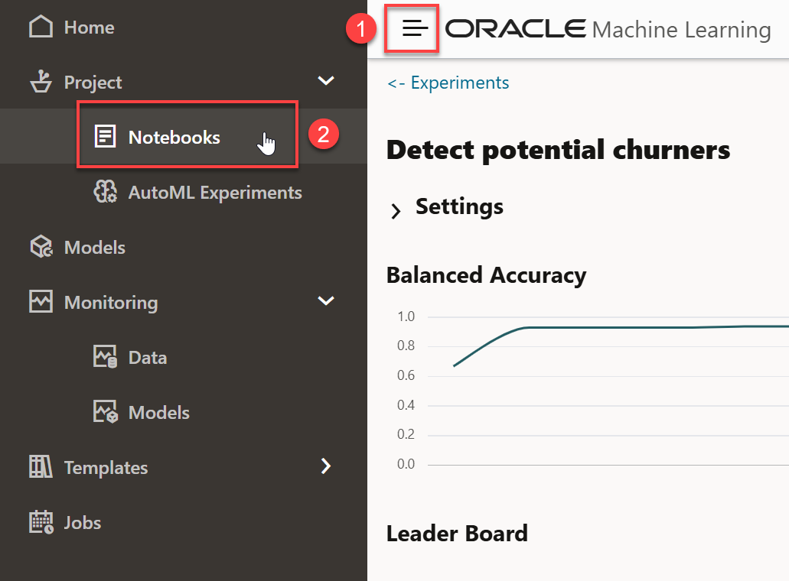

# Use Oracle Machine Learning and AutoML UI to predict customer churn

## Introduction

#### Video preview

<!--[](youtube:iK2T6iKaYqQ)-->

Analyzing past performance lets you know customers who have already been lost. Let's get in front of this problem and predict those that are at risk using in database analytics.

In this lab, you will use Oracle Machine Learning (OML) in Autonomous AI Database to identify customers with a higher likelihood of churning from **Oracle MovieStream** streaming services. You will first use OML AutoML UI to create a customer churn model. Then, you will use OML Notebooks to score customers using both SQL and Python.

Estimated Time: 30 minutes

Watch the video below for a quick walk-through of the lab.
[Use OML to predict customer churn](videohub:1_vdehd0fz)

### About OML

In this lab, we will learn more about the Autonomous AI Database's built-in [Oracle Machine Learning](https://www.oracle.com/goto/machinelearning) components, including:
- For information about Oracle Machine Learning Notebooks, see the [OML Notebooks documentation](https://docs.oracle.com/en/database/oracle/machine-learning/oml-notebooks/index.html).
- For information about Oracle Machine Learning AutoML UI, see [OML AutoML UI documentation](https://docs.oracle.com/en/database/oracle/machine-learning/oml-automl-ui/index.html).
- For information about Oracle Machine Learning for Python, see [OML4Py documentation](https://docs.oracle.com/en/database/oracle/machine-learning/oml4py/index.html).

### Objectives

In this lab, you will:
- Create an **Oracle Machine Learning user** for the Autonomous AI Database instance
- With this new user, load **past churn behavior data** from an OCI Object Storage location
- Access **Oracle Machine Learning UI** provided with Oracle Autonomous AI Database
- Use **OML AutoML UI** to build a high-quality machine model that can help predict future churn by customers
- Use the machine learning model to score the list of customers and predict their likelihood to churn in the future
- (Optionally) register the model in Oracle Analytics Cloud, and use it to score in a new Data Flow

### Prerequisites

<if type="freetier">

- You must have run `Lab 2: Provision an Autonomous AI Database`
- You must have ADMIN access to Database Actions (required to create a new user)

## Task 1: Create a new Database user and access its DB Actions

1. If you have the Database Actions for the **`ADMIN`** user still open, click the **Administration** tab, and then click the **Database Users** tab. 

    

    The **User Management** page is displayed.

    Alternatively, you can navigate to the **User Management** page from the **Autonomous AI Databases** page. Click your **MyQuickStart** database name. On the **MyQuickStart** page, click the **Database Actions** drop-down menu, and then select **Database Users**.

2. On the **User Management** page, click **Create User**.

    

3. Create a new user using the following information. 
    - **User Name:** `OMLUSER`
    - **Password:** Enter and confirm a password such as **`Training4OML`**. The password must be between 12 and 30 characters long and must include at least one uppercase letter, one lowercase letter, and one numeric character, and cannot contain the username. 
    - **Quota on tablespace DATA:** `UNLIMITED`
    - **OML:** Enable this slider.
    - **REST, GraphQL, MongoDB API, and Web Access:** Enable this slider.

        

4. Click **Create User**. The new `OMLUSER` user is displayed on the **User Management** page. 

    

    >**Note:** If the `OMLUSER` user section doesn't show any details which includes the URL to access its Database Actions, click the **Reload** icon.

    

5. We want to go to that specific user's Database Actions in order to load data directly into it.  Click on the **Open in a new tab** icon to open the link to the user's Database Actions.

6. On the **Sign-in** page, enter your username and password for the user `OMLUSER`, and then click **Sign-in**. Note that the in the browser reflects that it is the Database Actions URL for the `OMLUSER` user. 

    

    The Database Actions Launchpad for the `OMLUSER` user is displayed.

    

## Task 2: Load the data we will use to work with Oracle Machine Learning

1. Click the **Data Studio** tab, and then click the **Data Load** tab.

    

2. On the **Data Load** Dashboard, click the **Load Data** tile.

    

3. On the **Load Data** page, click the **Cloud Store** tab to select objects from URLs or cloud store links.

    

4. Copy the following object storage URL and paste it in the **Select Cloud Store Location or enter public URL** field. The **`moviestream_landing`** Oracle Object Storage bucket that contains the data is located in a different tenancy than yours, **`c4u04`**; therefore, you will use the following URL. 


    ```
    <copy>
    https://objectstorage.us-ashburn-1.oraclecloud.com/n/c4u04/b/moviestream_landing/o
    </copy>
    ```
 
    

5. A list of the folders in the selected Object Storage bucket is displayed on left side section of the page. You can drag and drop the desired folders from this public bucket from this section to the data linking job section on the right.

    

6. Drag **`moviestrean_churn`** and drop it onto the data loading job canvas. A **Load to Single Target Table** dialog box is displayed to prompt you whether or not you want to load all objects in this folder matching `.csv` to a single target table. Click **Yes**.
    
    

    The **`moviestrean_churn`** target table to be created for the selected `.csv` file is displayed in the data loading job section.

7. Click **Start** to create the **`moviestrean_churn`** table and load it with data from the **`moviestrean_churn.csv`** file.

    

8. A **Start Load from Cloud Store** message is displayed. Click **Run**. The **`moviestrean_churn`** table is created. 

    

9. Click the **Database Actions** text in the banner to navigate to the Launchpad. 

    

## Task 3: Navigate to Oracle Machine Learning UI
</if>

<if type="ocw24sandbox">

- You must have your LiveLabs sandbox deployed
- You will need the URLs to the OML UI provided with the Instructions

## Task 1: Navigate to Oracle Machine Learning UI
</if>


<if type="livelabs">

- You must have your LiveLabs sandbox deployed
- You will need the URLs to the OML UI provided with the Instructions

## Task 1: Navigate to Oracle Machine Learning UI
</if>

  Before we continue, let's see a brief explanation on how we should define **CHURN** in our business

- Defining customer churn for MovieStream
    To understand customer behavior, we need to look at both geo-demographic information and transactional patterns. For transactional data, we need to summarize customers' transactions by month for each type of transaction that we would like to explore. This type of summarization is required because machine learning algorithms need a single input row per customer, with each attribute reflected in a table column.

    A Data Engineer and a Data Scientist worked together to process and transform the data that exists in the **`CUSTSALES`** Oracle Database table. This table contains historical customer transactions for every movie streamed, including payment and discounts, and can help us identify customer preferences and usage of the service. To aggregate the data, with *one customer per row* (which is a data layout required by Machine Learning), they worked with the *date* information of the transactions to determine the customer behavior over time.

    Defining what *customer churn* means can be very complex. For our example, the agreement between the business team and the data scientist was:
    - A customer has "churned" if they had 1) *zero movie streams in the last available month of data* and 2) streamed movies every month during 13 months before a *buffer* month (detailed below).
    - In contrast to churners, "non-churners" are customers who have *streamed movies for 13 consecutive months including the last available month of data*.

    The following diagram shows the process we will use, including a *buffer* month that represents the time needed to be able to *act* on the knowledge that a customer is about to leave. Predicting the *probability that a customer is going to leave exactly right now* does not help preparing a customer retention campaign, since there is a lot of processing involved in updating customer data at the end of a day before one can do scoring, excluding customers that have a *DO NOT CONTACT* exception. Also, processing offers and other processes in sync with all other divisions of the enterprise will always take time.  

    

    In addition, *a customer churning today probably made that decision a while ago*. This means that our machine learning model needs to be able to detect any change in behavior from at least a month ago. This is the reason for the buffer of 1 month in the process.

<if type="freetier">
1. From the Database Actions Launchpad, click the **Development** tab, and then click the **Machine Learning** tab.

    

</if>

<if type="ocw24sandbox">
1. We will access Oracle Machine Learning UI from the LiveLabs Instructions Login Info.  
   
    If you have not done so yet, make sure to click on *Launch Workshop* under *My Reservations*.

    

    Click on *View Login Info* (1).  In the window that opens, click on *Copy value* for the `Database User Password` (2) and then click on the link for the *OML UI* (3).

    

    You will be taken to the Login page for Oracle Machine Learning UI.
</if>


<if type="livelabs">
1. We will access Oracle Machine Learning UI from the LiveLabs Instructions Login Info.  
   
    If you have not done so yet, make sure to click on *Launch Workshop* under *My Reservations*.

    

    Click on *View Login Info* (1).  In the window that opens, click on *Copy value* for the `Database User Password` (2) and then click on the link for the *OML UI* (3).

    

    You will be taken to the Login page for Oracle Machine Learning UI.
</if>


2. On the **Sign In** page, enter your username, **`OMLUSER`**, and the password that you chose.

<if type="ocw24sandbox">
    Remember to paste the Password you just copied, which is AAbbcc123456. 
</if>

<if type="livelabs">
    Remember to paste the Password you just copied, which is AAbbcc123456. 
</if>

   

3. The Oracle Machine Learning Home page is displayed. You can use this page to access tutorials, create models and notebooks, and more. We'll now create a new machine learning model using the **AutoML UI**. In the **Quick Actions** section, click **AutoML**.

    

    The **AutoML Experiments** page is displayed.

<if type="freetier">
## Task 4: Create a new AutoML Experiment
</if>

<if type="ocw24sandbox">
## Task 2: Create a new AutoML Experiment
</if>

<if type="livelabs">
## Task 2: Create a new AutoML Experiment
</if>

1. Create a new AutoML Experiment. An AutoML Experiment will generate a machine learning model. Click **+ Create**.

    

2. Enter a name for the new experiment and an optional description.  Next, click **Data Source** search icon (magnifying glass) to select the experiment's data source.

    

    Previously, we prepared the `MOVIESTREAM_CHURN` table which contains numerous attributes that should be helpful in predicting churn. 

    In the **Select Table** dialog box, make sure the `OMLUSER` schema is selected. In the **Table** section, select the `MOVIESTREAM_CHURN` table, and then click **OK**.

    

    The **Create Experiment** page is re-displayed. 

    


4. Scroll down the page to the **Features** section. A list of the attributes available in the table is displayed. 

    >**Note:** Use the **scroll bar** next to the **`Std Dev`** statistics column to see the entire list. 

    

5. Define the Prediction Target, Case ID, and Experiment Settings. Scroll up the page to the **Predict** drop-down list. Select the `IS_CHURNER` target attribute.

    

6. Define the **Case ID**. Click the drop-down list and select `CUST_ID` as the unique customer identifier.

    

    On the left side, just under **Data Source**, you'll find that **Classification** is the selected **Prediction Type**. This is selected because AutoML detected that our **Predict** column, or `TARGET` attribute, has only two distinct values and therefore is a binary classification problem. The other prediction type, **Regression**, is not appropriate for our problem.

6.  Expand the **Additional Settings** section to customize processing. The default values for **Maximum Top Models** is **5**, but we will reduce that to **3** in order to make processing a bit faster for this workshop. Also, increase the **Database Service Level** to **HIGH**. Read more about Service Levels with OML AutoML UI in [this Blog Post](https://blogs.oracle.com/machinelearning/oml-automl-ui-4-things-you-can-do-that-affect-performance).

    

    We are going to leave the **Algorithms** selections as is, which means that OML AutoML will try each of these algorithms to find the best one for our situation.  The ability to select which algorithms to use is useful in case a specific Industry Regulator or business requirement dictates that a certain algorithm cannot be used.
    
    

    Scroll down to the **Features** list. Let's exclude the customer names (First and Last) from the input attributes, as it does not make business sense to use those in this case.  We do not expect that the name to have an impact on the customer's likelihood to churn.

    Start by typing `Name` in the search box, and then **uncheck** the two checkboxes.
    


    We are now ready to start the Experiment.

<if type="freetier">
## Task 5: Run the Experiment and explore the results.
</if>

<if type="ocw24sandbox">
## Task 3: Run the Experiment and explore the results.
</if>

<if type="livelabs">
## Task 3: Run the Experiment and explore the results.
</if>

1. Start the Experiment. Click the **Start** drop-down list, and then select **Faster Results**. This selection speeds processing as OML AutoML UI will search for models on a reduced hyperparameter search space.

    

    This **Experiment** should complete on a **Classification** task using **Balanced Accuracy** as the metric, and using **Maximum Top Models of 3** in about **2 or 3 minutes**.

    > **NOTE:** If you choose different settings for your own Experiment, a larger number of models, or even run it at **Best Accuracy** instead of **Faster Results**, a longer running time might be required, and a different "best" algorithm might be chosen. In that case, your results might differ slightly from the screens below, but will still be valid and correct based on your settings.

    You will see a floating **Progress** indicator while the **Experiment** is running. The progress indicator shows the status of each of the Experiment's steps and an approximate time that it has been running.

    

    The performance of OML AutoML UI is impacted by your Autonomous AI Database configuration. As explained in [this blog post](https://blogs.oracle.com/machinelearning/oml-automl-ui-4-things-you-can-do-that-affect-performance), several components may affect the performance, including the base number of Autonomous AI Database CPUs and whether or not auto scaling has been enabled.

2. Check the results.
   Once the process completes, you will note that the **Running** status on the top right changes to **Completed**. The **Balanced Accuracy** chart will show the increased accuracy over time as the models were tested, and the **Leader Board** will present the different algorithms that were chosen, and their respective **Model Names**.

    In the following screen we can see that the top 3 algorithms chosen were a **Random Forest**, a **Decision Tree** and a **Support Vector Machine**. By default they receive randomly generated unique **Model Names**.

    

    After an **Experiment** run is completed, the **Features** grid displays an additional column **Importance**. This feature importance indicates the overall level of sensitivity of prediction to a particular feature. Hover your cursor over the graph to view the value of importance. The value is always depicted in the range 0 to 1, with values closer to 1 being more important.

    Scroll down to see the **Features** section. You will also note a **Search** box at the top right of this section, which is important given that there are 56 features (58 minus the ID and Target).

    In this **Experiment**, the attributes with the highest **overall importance** are:  `AGE` (customer age), `GENDER` (customer gender), `AVG_NTRANS_M3_5` (average number of transactions in the previous quarter), `CREDIT_BALANCE`, `YRS_RESIDENCE` (how many years the customer has lived in the same address), `GENRE_WAR` (how many movies of Genre War has the customer watched in the last year),  `GENRE_THRILLER`, `EDUCATION` (customer level of education) and `GENRE_FAMILY`.

    

    > **Note:** this importance value is **not** related to any particular model, but it shows an overall value to give us an idea of potentially which attributes would be important.

    
3. Scroll up to the **Leader Board** section, you can click the **Random Forest** unique model name to open the diagnostics. Click on the Decision Tree **Model Name** link in blue.

    > **NOTE**: The exact random model name is unique to your model, with the two first characters representing the algorithm, so when you run this the name will be different than the **`RF_F4138CA9E7`** shown in the following screen capture.

    

    A new floating window opens, showing the **Prediction Impacts** tab sorted from larger to smaller. This time the attributes are listed in the order of impact that they have on this specific model in its formulation to predict churn.

    

    In this model, the most important features include geo-demographic attributes like `AGE`, `GENDER` and `EDUCATION`, as well as  behavioral attributes like `GENRE_THRILLER`, `AVG_NTRANS_M3_5` (average number of transactions in the previous quarter) and others with some lesser impact.

    After reviewing the impacts, click the **Confusion Matrix** tab to visualize the result of the assessment of the model on a **Test Set** of data chosen by AutoML for this test.

    

    >**Note:** The original Dataset contains 50% of Churners and 50% of a selection of the Non-churners.

    In the **Confusion Matrix** we can see that, in the **Test Set** this particular Random Forest model was able to correctly identify __93.03%__ of the future customer behaviors (the green diagonals, 64.81% + 28.22%).  

    The model incorrectly thought that __5.92%__ of the test dataset were going to churn (Predicted: 1), but they actually did not (Actual: 0).  This is actually not that bad for marketing purposes, since we would be sending offers to these customers when they might be staying with us anyway.

    The model also thought that __1.05%__ of the customers would not churn (Predict: 0) but they actually did (Actual: 1).  This type of error is more dangerous in churn management, since your model is not capable of identifying these customers as churners when they indeed would have been, and should be monitored over time.

<if type="freetier">
## Task 6: Prepare the model for scoring and deployment
</if>

<if type="livelabs">
## Task 4: Prepare the model for scoring and deployment
</if>

<if type="ocw24sandbox">
## Task 4: Prepare the model for scoring and deployment
</if>

 In preparation for scoring via SQL, we will want to rename the model, from the original randomly assigned name to something you can relate to your project.

1. We will **Rename** the model, which will allows us to run the scoring via SQL later. In the **Leader Board** section, with the model row selected (indicated by a light blue highlight in the row), click **Rename**.

      

    Rename the model to **`CHURN_PRED`**, and then click **OK**.

      

    The new name should appear in the **Leader Board** in a few seconds.

    

    Now we are ready for scoring customers using SQL by using that model name.

<if type="freetier">
## Task 7: Score customers with Python and SQL using the model
</if>

<if type="livelabs">
## Task 5: Score customers with Python and SQL using the model
</if>

<if type="ocw24sandbox">
## Task 5: Score customers with Python and SQL using the model
</if>

 You can import a notebook from a local disk or from a remote location if you provide the URL. A notebook named **`Scoring Customers with Churn Model.dsnb`** contains all the steps for scoring data with Python and SQL using the **`CHURN_PRED`** model that was just created. In this task, you will first download the **Scoring Customers with Churn Model** OML notebook to your local machine, and then import this notebook into OML.

1. Click the button below to download the __`Scoring Customers with Churn Model.dsnb`__ OML notebook file to your computer:

    <a href="files/Scoring Customers with Churn Model.dsnb" class="tryit-button" style="background-color:maroon">Download notebook</a>

2. Click the Navigation menu on the upper left of the screen, and then select **Notebooks**.

    

    The **Notebooks** page is displayed.

3. Click **Import** and navigate to the folder where you downloaded the **`Scoring_customers_with_Churn_Model.json`** file, and then click **Open** in the **Open** dialog box (on a MS-Windows machine). 

    

    The **`Scoring customers with Churn Model`** is displayed in the list of Notebooks.

    

4. Click the notebook name to open it.

    You will see that the notebook server starts and loads the notebook. You should see the beginning of the notebook, as shown below.

    > **Note:** You might be asked to click __Allow Run__ in the paragraphs that contain MarkDown code.  It is safe to do so in this case.

    

5. We will follow the notes and instructions in the notebook, but before we do, and to make sure the entire environment is ready, we will run the entire notebook. Click the **Run Paragraphs** icon at the top of the screen next to the notebook name. In the **Run all paragraphs?** dialog box, click **Confirm**.

    

    The entire run is expected to take around 10 seconds, depending on the resources available.

    

    > **Note:** Looking at the bottom right on each paragraph you will see how long ago it was run the last time.  Confirm that it says _a few minutes ago_ or _a few seconds ago_

6. In Python load the Random Forest model and create a new TABLE
   
    Scrolling down the Notebook body, the first large section with code is using __Python__ to create proxy connections to the dataset **`MOVIESTREAM_DATA`**, to the Random Forest model, and then using the _predict_ function to request the Database to score the dataset, generating an **Inference** for the future customer likelihood to Churn.
    
    

    The second section of the __Python__ code is organizing the columns and reordering them to generate the expected **Probability to Churn** and whether a customer **Will Churn** (which in this case is '1' whenever the probability is over 50%, or '0' otherwise).  In addition to that the usage of the _.materialize()_ function is making the Database write a permanent table from the original temporary one created by the prediction process, so others in the team can query that table.

    

7. Oracle Machine Learning can generate Prediction Details dynamically

    This feature allows us to get, for every customer scored, the top "N" `Reasons Why` the model predicted that the customer is a `0` (non-Churner) or `1` (Churner).

    For example, the first row indicates that CUST_ID = 1031800 was predicted to be a *Non-Churner* (`0`) and the most important Features that were the reason for such prediction are:
    - Feature 1: AGE = 57 with relative weight of 4.142
    - Feature 2: `AVG_NTRANS_M3_5` = 5.67 with relative weight of 0.168
    - Feature 3: GENRE_WAR = 1
    And you can continue looking at the other Features by scrolling to the right.

    This means that the most important reasons why this person was identified as a *Non-Churner* by the model have to do with their age, their average number of transactions in the last quarter, the number of movies of the genre WAR, among others.

     
   
    
8. In SQL let's review the table created by Python and run a dynamic scoring with the model
   
    If we scroll down to the **SQL** section, we see basically two main steps. There is one paragraph that deletes a table named `LATEST_POTENTIAL_CHURNERS` if it exists (in case we wanted to experiment later with SQL).
    
    In the first paragraph, we can see that we can query the table that was `materialized` via the Python code above.

    


    The second paragraph uses SQL to create a new table based on the `PREDICTION` and `PREDICTION_PROBABILITY` capabilities of Oracle SQL enabled by OML.  These are unique features in SQL for in-Database Dynamic Machine Learning Inference.   These functions can score any table that contains the columns necessary for computing the Probability.
    
    > **Note:** Oracle Machine Learning is resilient to missing data, and it can return a Probability computation even if there are missing data in some columns by replacing missing data using different techniques. 
    
    

    Please note that the following `SELECT` statement can be run by any Application connecting to this Autonomous AI Database instance through `JDBC`, and the scoring will be returned.

    Also remember that you need to change the name of the model being used from `CHURN_PRED` to something else if you decided to use a different name when you were doing the **Rename** of the model in **Step 1** of **Task 6**.

    ```
    <copy>
    SELECT * FROM
      (SELECT CUST_ID,
              PREDICTION(CHURN_PRED USING M.*) WILL_CHURN,
              ROUND(PREDICTION_PROBABILITY(CHURN_PRED, '1'  USING M.*),6) PROB_CHURN
              FROM MOVIESTREAM_CHURN M)
    ORDER BY PROB_CHURN DESC;
    ```

    The **SQL** code that follows the dynamic scoring is showing how to get the Prediction Details, this time via SQL, that gives us the `Reasons Why` each customer was predicted the way they were.
 
    For example, the first row indicates that CUST_ID = 1001689 was predicted to be a *Non-Churner* (`0`), since his probability to Churn was 3.5% (0.035), and the most important Features that were the reason for such prediction are:
    - Feature 1: `AVG_NTRANS_M3_5` = 11.67 with relative weight of 1.283
    - Feature 2: CREDIT_BALANCE = 0 with relative weight of 0.883
    - Feature 3: related to the customer GENDER
    And you can continue looking at the other Features by scrolling to the right.

    This means that the most important reasons why this person was identified as a *Non-Churner* by the model have to do with their age, their average number of transactions in the last quarter, the number of movies of the genre WAR, among others.
    

  You can scroll to the right and see more details, or select the other pages of customers as well.

**CONGRATULATIONS!!!**

You now have deployed a new table called `LATEST_POTENTIAL_CHURNERS` containing each customer's likelihood to churn and the decision (will the customer churn or not?) suggested by the Machine Learning model.

Now other professionals can take advantage of both the deployment you have just made in order to contact the customers at risk with an offer, as well as use your SQL Scoring code to put the model into production and run the scoring in batch every time there is a new refresh of the data, be it hourly, daily, weekly, or monthly.

<if type="freetier">
## Task 8: Bonus content - additional model quality metrics
</if>

<if type="livelabs">
## Task 6: Bonus content - additional model quality metrics
</if>

<if type="ocw24sandbox">
## Task 6: Bonus content - additional model quality metrics
</if>

1. Let's return to the OML AutoML Experiment results. Click the Navigation menu at the top of the Oracle Machine Learning, and then click **AutoML Experiments** in the context menu.

   

   
2. The list of experiments is displayed on the **AutoML Experiments** page. Click the  **Detect potential churners** experiment.

   

3. Go to the **Leader Board** section, and click on the row for the **`CHURN_PRED`** model to highlight it in light blue. 

    

4. Click **Metrics**. The **Select Additional Metrics** list of additional model quality metrics is displayed. Select **Accuracy** and **ROC AUC** (Area under the ROC curve). Next, close the list. Click the **X** control.

    

    The new metrics will be displayed for each model and would enable you to compare and sort the list of models by each type of metric as desired (by clicking on the column name).

    

<if type="freetier">
## Task 9: Bonus content - auto-generated OML4Py notebook
</if>

<if type="livelabs">
## Task 7: Bonus content - auto-generated OML4Py notebook
</if>

<if type="ocw24sandbox">
## Task 7: Bonus content - auto-generated OML4Py notebook
</if>

   We can create an OML4Py auto-generated notebook with the model selected in the Leaderboard, that will contain all the steps necessary to recreate that model, including all hyperparameter settings.

1. While highlighting the row of the **`CHURN_PRED`** model, click **Create Notebook**

    


2. Accept the default name, and then click **OK**.

       

3. The notebook is created. A message box is displayed at the bottom of the screen. Click **Open Notebook**.
    
       

4. Let's run the entire Notebook so it will be easier to read. Click the **Run Paragraphs** icon at the top of the screen, next to the Notebook name. A **Run all paragraphs** dialog box is displayed. Click **Confirm**. 
    
    > **Note:** You might be asked to click **Allow Run** in the paragraphs that contain Markdown code. It is safe to do so in this case.
   
       

    The first section shows details of when the model was created, the username, input data, predict, algorithm and other details.

       

5. Scroll down in the notebook to see the next section. It is preparing a query that will include only the columns that were found to have significance to this particular model, and then it will create a proxy object to the data.
   
        

6. The second section is building the input dataset and then creating the Random Forest model from scratch, showing the exact hyperparameters used to build the original model created via AutoML UI.  It also allows experts to make additional adjustments. The model is built using the _fit()_ function.
   
        

7. The next section illustrates the output of the model just created, by showing the model details.  Scroll down for more model details.
   
        

8. The last sections show how to score (generate inference) of customers, and verify the model quality as well using the open-source sklearn package from Python. 
   
        

<if type="freetier">
## Task 10: Bonus content - deploy the model to an OML Service REST endpoint
</if>

<if type="livelabs">
## Task 8: Bonus content - deploy the model to an OML Service REST endpoint
</if>

<if type="ocw24sandbox">
## Task 8: Bonus content - deploy the model to an OML Service REST endpoint
</if>

   We will deploy the selected model from the AutoML UI directly to a REST endpoint that is hosted by **Oracle Machine Learning Services**, and it is provided at no extra cost to all **Autonomous AI Database** customers.  Only the CPU consumed while actually scoring via REST would be charged, so there is no additional infrastructure needed for the model's REST API to be exposed.

1. Let's return to the OML AutoML Experiment results. Click the Navigation menu at the top of the Oracle Machine Learning page, and then click **AutoML Experiments** in the menu.

   
   
2. The **AutoML Experiments** page displays the available experiments. Click the **`Detect potential churners`** experiment.

   

3. Scroll down to the **Leader Board** section, and click the **`CHURN_PRED`** row to highlight it in light blue. 

    

4. Click **Deploy**. The **Deploy Model - CHURN_PRED** dialog box is displayed with the details of the deployment. Specify the following information:
    - **Name:** Accept the default name, `CHURN_PRED`.
    - **URI:**  `churn_pred`
    - **Version:**  1.0
    - **Namespace:**  `OML_MODELS`
    - **(optional) Comment:** Profitability to Churn
    - **Shared checkbox:** Select it.
    
   

5. Click **OK**. The **Detect potential churners** experiment is displayed.

6. Let's navigate to the OML Models interface. Click the Navigation menu at the top of the Oracle Machine Learning page, and then click **Models** in the menu.

   

7. The **Models** page is displayed. All the models that we have built are available in the Database, and are listed here. We are interested in the Deployment that we just did. Click **Deployments**.

   

8. The list of deployments is shown. In our case we have done only one. The URI column shows the deployment name that we assigned.

   

9. Let's now check the deployed model's Metadata. Click **`CHURN_PRED`** in the **Name** column. The **Model metadata for CHURN_PRED** metadata is displayed. It contains the details about the model, the mining function it uses, the expected inputs that it requires, and the output labels that it produces. Close the list.

   

10. Let's now check the deployed model's **Open API Specification for CHURN_PRED**. Click the `churn_pred` in the URI column. The Open API specification contains the details about how to access the model via REST, gives the server details, and specifies the expected inputs and the output labels that it produces, as well as available options. Close the list when you're done.

   

11. We are ready to deploy the Churn Model to an Application via REST. On the Database   Actions Launchpad, click the **Related Services** tab, and then click the **Oracle Machine Learning RESTful services** tab to find the specific address for your own model, since these are unique to each Autonomous AI Database instance.

    

   When developing Applications that can pass the information needed to get a score of the models, the OML Services REST API can return a sub-second score for a mini-batch of records, or you can request an asynchronous call for batch scoring as well.  
   
   

   For more details on how to use the deployed model and Oracle Machine Learning Services capabilities, make sure to look at that Lab in the [Oracle Machine Learning Fundamentals on Oracle Autonomous AI Database](https://livelabs.oracle.com/pls/apex/dbpm/r/livelabs/view-workshop?wid=922) workshop, which shows you how to use REST clients to access the model and more.

## Learn more

* [Get started with Oracle Machine Learning Services REST APIs](https://docs.oracle.com/en/database/oracle/machine-learning/omlss/index.html)
* [Subscribe to the AskTOM Oracle Machine Learning Office Hours](https://asktom.oracle.com/pls/apex/asktom.search?office=6801#sessionss)
* [Oracle Machine Learning for Python Demo](https://youtu.be/P861m__PEMQ)

## Acknowledgements
* **Author:** Marcos Arancibia, Oracle Autonomous AI Database Product Management
* **Contributors:** Mark Hornick, Kevin Lazarz, Nilay Panchal, Jayant Sharma, Jie Liu, Sherry LaMonica, Lauran K. Serhal
* **Last Updated By/Date:** Lauran K. Serhal, October 2025

Data about movies in this workshop were sourced from Wikipedia.

Copyright (C) 2025 Oracle Corporation.

Permission is granted to copy, distribute and/or modify this document
under the terms of the GNU Free Documentation License, Version 1.3
or any later version published by the Free Software Foundation;
with no Invariant Sections, no Front-Cover Texts, and no Back-Cover Texts.
A copy of the license is included in the section entitled [GNU Free Documentation License](https://oracle-livelabs.github.io/adb/shared/adb-15-minutes/introduction/files/gnu-free-documentation-license.txt)
