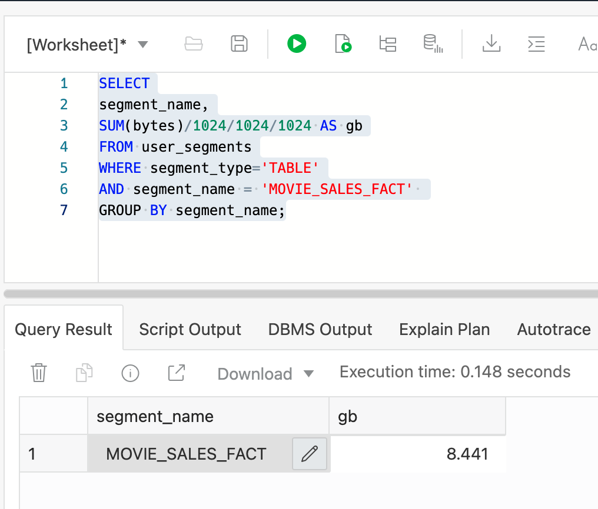
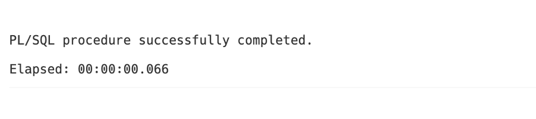
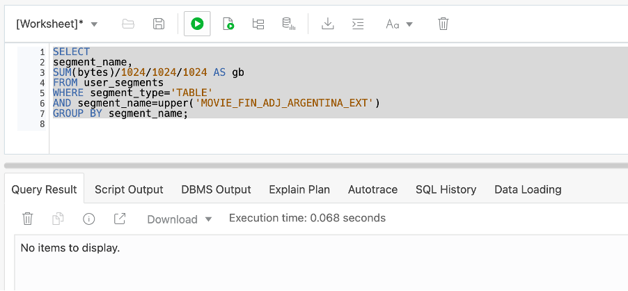
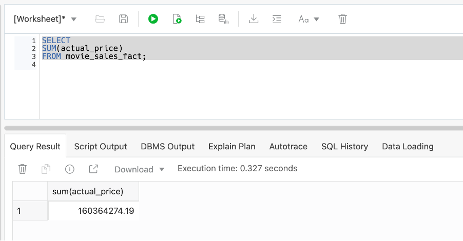


# Updating the Sales Data

## Introduction

Autonomous Database automatically manages the data storage process for you, so there are no settings to monitor or tweak. You simply load your data, update your data and let Autonomous Database efficiently manage how that data is stored. You will update the movie sales data using MERGE.

Estimated Lab Time: 25 minutes

### Objectives

In this lab, you will:

*   Determine how much space the movie sales table is consuming.
*   Create an external table.
*   Determine how much space the external table is consuming.
*   Update the movie sales data using MERGE.
*   Confirm the very small increase in space usage after updating the data using MERGE.
*   Create additional external tables.

### Prerequisites

This lab assumes you have:

- Added a data integrity constraint in the previous lab.

## Overview 
MovieStream is a global business with finance departments distributed around the world. Each of these periodically generates a number of financial adjustments for customers in their respective countries. In practice, these will come in at various times and will need to be processed one-by-one. In this section we are going to process all the regional adjustment files altogether but it is important to bear in mind that each would usually be processed immediately on arrival (and therefore individually) so that we can always get the most up-to-date information from our warehouse. Below we will run the update process by creating an external table for each country’s adjustment file and then run the corresponding merge to update the sales data.

The files for this data load process are stored in a series of regional buckets. Use one of the following **URI strings** in the next step based on the closest location to the region where you have created your ADW.

*For example, if your ADW is located in our UK-London data center then you would select the first regional URI string for "Europe, Middle East, Africa" which is for a public bucket located in the London data center: 'https://objectstorage.uk-london-1.oraclecloud.com/n/dwcsprod/b/moviestream_data_load_workshop_20210709/o/'*

<div style="margin-left: 80px;">
<br>
<table class="wrapped relative-table confluenceTable" style="width: 100.0%;">
	<colgroup>
		<col style="width: 12.019421%;"/>
        <col style="width: 12.019421%;"/>
		<col style="width: 45.07344%;"/>
	</colgroup>
	<tbody>
		<tr>
			<th colspan="1" class="confluenceTh">Geographical Region</th>
            <th colspan="1" class="confluenceTh">Location</th>
			<th colspan="1" class="confluenceTh">Regional URI String</th>
		</tr>
		<tr>
			<td colspan="1" class="confluenceTd">Europe, Middle East, Africa</td>
            <td colspan="1" class="confluenceTd">London</td>
			<td class="confluenceTd">
                https://objectstorage.uk-london-1.oraclecloud.com/n/dwcsprod/b/moviestream_data_load_workshop_20210709/o<br>
            </td>
		</tr>
		<tr>
			<td colspan="1" class="confluenceTd"></td>
            <td colspan="1" class="confluenceTd">Frankfurt</td>
			<td class="confluenceTd">
                https://objectstorage.eu-frankfurt-1.oraclecloud.com/n/dwcsprod/b/moviestream_data_load_workshop_20210709/o
            </td>
		</tr>
		<tr>
			<td colspan="1" class="confluenceTd">Americas</td>
            <td colspan="1" class="confluenceTd">Phoenix</td>
			<td colspan="1" class="confluenceTd">
                https://objectstorage.us-phoenix-1.oraclecloud.com/n/dwcsprod/b/moviestream_data_load_workshop_20210709/o<br>
            </td>
		</tr>
		<tr>
			<td colspan="1" class="confluenceTd"></td>
            <td colspan="1" class="confluenceTd">Ashburn</td>
			<td colspan="1" class="confluenceTd">
                https://objectstorage.us-ashburn-1.oraclecloud.com/n/dwcsprod/b/moviestream_data_load_workshop_20210709/o
            </td>
		</tr>
		<tr>
			<td colspan="1" class="confluenceTd">Japan</td>
            <td colspan="1" class="confluenceTd">Tokyo</td>
			<td colspan="1" class="confluenceTd">https://objectstorage.ap-tokyo-1.oraclecloud.com/n/dwcsprod/b/moviestream_data_load_workshop_20210709/o</td>
		</tr>
		<tr>
			<td colspan="1" class="confluenceTd">Asia &amp; Oceania</td>
            <td colspan="1" class="confluenceTd">Mumbai</td>
			<td colspan="1" class="confluenceTd">https://objectstorage.ap-mumbai-1.oraclecloud.com/n/dwcsprod/b/moviestream_data_load_workshop_20210709/o</td>
		</tr>
	</tbody>
</table>
<br>
</div>

**Note** : In the steps below we will use the same SQL feature used in the earlier data loading lab that allows us to define some variables to simplify this data merge process.
<br><br>

## Task 1: - Finding Out Space Usage for the Movie Sales Data

1. To find out how much space our movie sales table (movie\_sales\_fact) is consuming, we can run the following query our SQL worksheet

    ```
    <copy>SELECT
    segment_name,
    SUM(bytes)/1024/1024/1024 AS gb
    FROM user_segments
    WHERE segment_type='TABLE'
    AND segment_name = 'MOVIE_SALES_FACT'
    GROUP BY segment_name;
		</copy>
    ```

2. This will return something similar to the results shown below: 8.441 GB.

    

<br><br>

## Task 2: Creating The Staging Table For Argentina's Adjustments

1. Copy and paste the following code into your SQL worksheet - you can get the correct regional URI from the table in the overview section:

    ```
    <copy>define uri_ms_oss_bucket = 'paste_in_your_regional_uri_string_between_the_single_quotes';
    define csv_format_string = '{"type":"csv","skipheaders":"1"}';
    define adj_column_names = '"ORDER_NUM" INTEGER,"COUNTRY" VARCHAR2(256),"DISCOUNT_PERCENT" NUMBER,"ACTUAL_PRICE" NUMBER';</copy>
    ```

		**Note**: in the above set of commands we have added an additional variable that contains the definitions of the columns within the table that we are going to create. Notice how using these variables makes the data loading code very easy to understand!

2. Copy and paste the following code into your SQL worksheet and then run the code:

    ```
    <copy>BEGIN
    dbms_cloud.create_external_table (
    table_name => 'MOVIE_FIN_ADJ_argentina_EXT',
    format =>  '&csv_format_string',
    column_list => '&adj_column_names',
    file_uri_list => '&uri_ms_oss_bucket/d801_movie_sales_finance_adj_argentina.csv'
    );END;
    /</copy>
    ```

3.  In the script output window, you should see the following which indicates that our new external table has been successfully created:

    

4. To validate the external table, we can use the following command:

    ```
    <copy>BEGIN
    DBMS_CLOUD.VALIDATE_EXTERNAL_TABLE (table_name => 'MOVIE_FIN_ADJ_ARGENTINA_EXT');
    END;
    /</copy>
    ```

5. The validation process should only take a few seconds and return a successfully completed message:

    

6. This shows us that the data we are going to query is OK. Therefore, we can use the following query to count how many rows are in the staging table:

    ```
    <copy>SELECT COUNT(*) FROM movie_fin_adj_argentina_ext;</copy>
    ```

7. This should show that we have 1,036 financial adjustments to process, as shown below:

    
<br><br>

## Task 3: How Much Space Is The Staging Table Using?

1. To find out how much space our new external table is consuming, we can run the following query in our SQL worksheet:

    ```
    <copy>SELECT
    segment_name,
    SUM(bytes)/1024/1024/1024 AS gb
    FROM user_segments
    WHERE segment_type='TABLE'
    AND segment_name=upper('MOVIE_FIN_ADJ_ARGENTINA_EXT')
    GROUP BY segment_name;</copy>
    ```

2. This will return zero rows into our results window:

    

    This means that our table is not consuming any space within our database.
<br><br>

## Task 4: Updating The Movie Sales Data Using MERGE

1. Copy and paste the command below in SQL worksheet and run it:
    ```
    <copy>MERGE INTO movie_sales_fact a
		USING (
			SELECT order_num,
			discount_percent,
			actual_price
		FROM movie_fin_adj_argentina_ext) b
		ON ( a.order_num = b.order_num )
		WHEN MATCHED THEN
		UPDATE
		SET a.discount_percent = b.discount_percent,
		a.actual_price = b.actual_price;
		COMMIT;</copy>
    ```


2.  The update process should take about 2-3 seconds and then return the usual successfully completed message:

    

3. Let's run the same simple query again to validate that our financial adjustments file has been successfully processed. Copy and paste the following query into your SQL worksheet:

    ```
    <copy>SELECT
    SUM(actual_price)
    FROM movie_sales_fact;</copy>
    ```

4. This shows that our revenue has gone down slightly since we are now reporting a figure of $160,364,274.19 (vs. the previous value of $160,365,556.83):

    

<br><br>

## Task 5: Finding Out Space Usage For The Movie Sales Data

1.  Now we can run the same space calculation query in our SQL worksheet.

    ```
    <copy>SELECT
    segment_name,
    SUM(bytes)/1024/1024/1024 AS gb
    FROM user_segments
    WHERE segment_type='TABLE'
    AND segment_name='MOVIE_SALES_FACT'
    GROUP BY segment_name;</copy>
    ```

2. This will return something similar to the results shown below: 8.504 GB. This is a very, very slight increase in space usage! The previous value was 8.441 GB.

    

<br><br>

## Task 6: – Adding External Tables For Other Country-Based Adjustments

#### Overview
We have processed the financial adjustments for Argentina. Now we are going to process the adjustments from the other countries using the same approach. (Don't forget to use the 'Copy' button to make it easier to copy and paste the code below into the SQL Worksheet).


1.  Now we are ready to load the remaining files containing the adjustments to our sales data. Use the following code to create the remaining tables for the other adjustments data files which reuses the subsitution variables created earlier in this lab.

    **Note**: the definitions for the substitution variables (csv\_format\_string, adj\_column\_names and uri\_ms\_oss\_bucket) can be found in the first part of Step 2 - Creating The Staging Table.

    ```
    <copy>BEGIN
	dbms_cloud.create_external_table (
	table_name => 'MOVIE_FIN_ADJ_Austria_EXT',
	format =>  '&csv_format_string',
	column_list => '&adj_column_names',
	file_uri_list => '&uri_ms_oss_bucket/d801_movie_sales_finance_adj_austria.csv');

	dbms_cloud.create_external_table (
	table_name => 'MOVIE_FIN_ADJ_belarus_EXT',
	format =>  '&csv_format_string',
	column_list => '&adj_column_names',
	file_uri_list => '&uri_ms_oss_bucket/d801_movie_sales_finance_adj_belarus.csv');

	dbms_cloud.create_external_table (
	table_name => 'MOVIE_FIN_ADJ_brazil_EXT',
	format =>  '&csv_format_string',
	column_list => '&adj_column_names',
	file_uri_list => '&uri_ms_oss_bucket/d801_movie_sales_finance_adj_brazil.csv');

	dbms_cloud.create_external_table (
	table_name => 'MOVIE_FIN_ADJ_canada_EXT',  
	format =>  '&csv_format_string',
	column_list => '&adj_column_names',
	file_uri_list => '&uri_ms_oss_bucket/d801_movie_sales_finance_adj_canada.csv');

	dbms_cloud.create_external_table (
	table_name => 'MOVIE_FIN_ADJ_chile_EXT',
	format =>  '&csv_format_string',
	column_list => '&adj_column_names',
	file_uri_list => '&uri_ms_oss_bucket/d801_movie_sales_finance_adj_chile.csv');

	dbms_cloud.create_external_table (
	table_name => 'MOVIE_FIN_ADJ_china_EXT',
	format =>  '&csv_format_string',
	column_list => '&adj_column_names',
	file_uri_list => '&uri_ms_oss_bucket/d801_movie_sales_finance_adj_china.csv');

	dbms_cloud.create_external_table (
	table_name => 'MOVIE_FIN_ADJ_egypt_EXT',
	format =>  '&csv_format_string',
	column_list => '&adj_column_names',
	file_uri_list => '&uri_ms_oss_bucket/d801_movie_sales_finance_adj_egypt.csv');

	dbms_cloud.create_external_table (
	table_name => 'MOVIE_FIN_ADJ_finland_EXT',
	format =>  '&csv_format_string',
	column_list => '&adj_column_names',
	file_uri_list => '&uri_ms_oss_bucket/d801_movie_sales_finance_adj_finland.csv');

	dbms_cloud.create_external_table (
	table_name => 'MOVIE_FIN_ADJ_france_EXT',
	format =>  '&csv_format_string',
	column_list => '&adj_column_names',
	file_uri_list => '&uri_ms_oss_bucket/d801_movie_sales_finance_adj_france.csv');

	dbms_cloud.create_external_table (
	table_name => 'MOVIE_FIN_ADJ_germany_EXT',
	format =>  '&csv_format_string',
	column_list => '&adj_column_names',
	file_uri_list => '&uri_ms_oss_bucket/d801_movie_sales_finance_adj_germany.csv');

	dbms_cloud.create_external_table (
	table_name => 'MOVIE_FIN_ADJ_greece_EXT',
	format =>  '&csv_format_string',
	column_list => '&adj_column_names',
	file_uri_list => '&uri_ms_oss_bucket/d801_movie_sales_finance_adj_greece.csv');

	dbms_cloud.create_external_table (
	table_name => 'MOVIE_FIN_ADJ_hungary_EXT',
	format =>  '&csv_format_string',
	column_list => '&adj_column_names',
	file_uri_list => '&uri_ms_oss_bucket/d801_movie_sales_finance_adj_hungary.csv');

	dbms_cloud.create_external_table (
	table_name => 'MOVIE_FIN_ADJ_india_EXT',
	format =>  '&csv_format_string',
	column_list => '&adj_column_names',
	file_uri_list => '&uri_ms_oss_bucket/d801_movie_sales_finance_adj_india.csv');

	dbms_cloud.create_external_table (
	table_name => 'MOVIE_FIN_ADJ_indonesia_EXT',
	format =>  '&csv_format_string',
	column_list => '&adj_column_names',
	file_uri_list => '&uri_ms_oss_bucket/d801_movie_sales_finance_adj_indonesia.csv');

	dbms_cloud.create_external_table (
	table_name => 'MOVIE_FIN_ADJ_israel_EXT',
	format =>  '&csv_format_string',
	column_list => '&adj_column_names',
	file_uri_list => '&uri_ms_oss_bucket/d801_movie_sales_finance_adj_israel.csv');

	dbms_cloud.create_external_table (
	table_name => 'MOVIE_FIN_ADJ_italy_EXT',
	format =>  '&csv_format_string',
	column_list => '&adj_column_names',
	file_uri_list => '&uri_ms_oss_bucket/d801_movie_sales_finance_adj_italy.csv');

	dbms_cloud.create_external_table (
	table_name => 'MOVIE_FIN_ADJ_japan_EXT',
	format =>  '&csv_format_string',
	column_list => '&adj_column_names',
	file_uri_list => '&uri_ms_oss_bucket/d801_movie_sales_finance_adj_japan.csv');

	dbms_cloud.create_external_table (
	table_name => 'MOVIE_FIN_ADJ_jordan_EXT',
	format =>  '&csv_format_string',
	column_list => '&adj_column_names',
	file_uri_list => '&uri_ms_oss_bucket/d801_movie_sales_finance_adj_jordan.csv');

	dbms_cloud.create_external_table (
	table_name => 'MOVIE_FIN_ADJ_kazakhstan_EXT',
	format =>  '&csv_format_string',
	column_list => '&adj_column_names',
	file_uri_list => '&uri_ms_oss_bucket/d801_movie_sales_finance_adj_kazakhstan.csv');

	dbms_cloud.create_external_table (
	table_name => 'MOVIE_FIN_ADJ_kenya_EXT',
	format =>  '&csv_format_string',
	column_list => '&adj_column_names',
	file_uri_list => '&uri_ms_oss_bucket/d801_movie_sales_finance_adj_kenya.csv');

	dbms_cloud.create_external_table (
	table_name => 'MOVIE_FIN_ADJ_madagascar_EXT',
	format =>  '&csv_format_string',
	column_list => '&adj_column_names',
	file_uri_list => '&uri_ms_oss_bucket/d801_movie_sales_finance_adj_madagascar.csv');

	dbms_cloud.create_external_table (
	table_name => 'MOVIE_FIN_ADJ_malaysia_EXT',
	format =>  '&csv_format_string',
	column_list => '&adj_column_names',
	file_uri_list => '&uri_ms_oss_bucket/d801_movie_sales_finance_adj_malaysia.csv');

	dbms_cloud.create_external_table (
	table_name => 'MOVIE_FIN_ADJ_mexico_EXT',
	format =>  '&csv_format_string',
	column_list => '&adj_column_names',
	file_uri_list => '&uri_ms_oss_bucket/d801_movie_sales_finance_adj_mexico.csv');

	dbms_cloud.create_external_table (
	table_name => 'MOVIE_FIN_ADJ_mozambique_EXT',
	format =>  '&csv_format_string',
	column_list => '&adj_column_names',
	file_uri_list => '&uri_ms_oss_bucket/d801_movie_sales_finance_adj_mozambique.csv');

	dbms_cloud.create_external_table (
	table_name => 'MOVIE_FIN_ADJ_netherlands_EXT',
	format =>  '&csv_format_string',
	column_list => '&adj_column_names',
	file_uri_list => '&uri_ms_oss_bucket/d801_movie_sales_finance_adj_netherlands.csv');

	dbms_cloud.create_external_table (
	table_name => 'MOVIE_FIN_ADJ_new_zealand_EXT',
	format =>  '&csv_format_string',
	column_list => '&adj_column_names',
	file_uri_list => '&uri_ms_oss_bucket/d801_movie_sales_finance_adj_new_zealand.csv');

	dbms_cloud.create_external_table (
	table_name => 'MOVIE_FIN_ADJ_pakistan_EXT',
	format =>  '&csv_format_string',
	column_list => '&adj_column_names',
	file_uri_list => '&uri_ms_oss_bucket/d801_movie_sales_finance_adj_pakistan.csv');

	dbms_cloud.create_external_table (
	table_name => 'MOVIE_FIN_ADJ_paraguay_EXT',
	format =>  '&csv_format_string',
	column_list => '&adj_column_names',
	file_uri_list => '&uri_ms_oss_bucket/d801_movie_sales_finance_adj_paraguay.csv');

	dbms_cloud.create_external_table (
	table_name => 'MOVIE_FIN_ADJ_peru_EXT',
	format =>  '&csv_format_string',
	column_list => '&adj_column_names',
	file_uri_list => '&uri_ms_oss_bucket/d801_movie_sales_finance_adj_peru.csv');

	dbms_cloud.create_external_table (
	table_name => 'MOVIE_FIN_ADJ_poland_EXT',
	format =>  '&csv_format_string',
	column_list => '&adj_column_names',
	file_uri_list => '&uri_ms_oss_bucket/d801_movie_sales_finance_adj_poland.csv');

	dbms_cloud.create_external_table (
	table_name => 'MOVIE_FIN_ADJ_portugal_EXT',
	format =>  '&csv_format_string',
	column_list => '&adj_column_names',
	file_uri_list => '&uri_ms_oss_bucket/d801_movie_sales_finance_adj_portugal.csv');

	dbms_cloud.create_external_table (
	table_name => 'MOVIE_FIN_ADJ_romania_EXT',
	format =>  '&csv_format_string',
	column_list => '&adj_column_names',
	file_uri_list => '&uri_ms_oss_bucket/d801_movie_sales_finance_adj_romania.csv');

	dbms_cloud.create_external_table (
	table_name => 'MOVIE_FIN_ADJ_russian_federation_EXT',
	format =>  '&csv_format_string',
	column_list => '&adj_column_names',
	file_uri_list => '&uri_ms_oss_bucket/d801_movie_sales_finance_adj_russian_federation.csv');

	dbms_cloud.create_external_table (
	table_name => 'MOVIE_FIN_ADJ_saudi_arabia_EXT',
	format =>  '&csv_format_string',
	column_list => '&adj_column_names',
	file_uri_list => '&uri_ms_oss_bucket/d801_movie_sales_finance_adj_saudi_arabia.csv');

	dbms_cloud.create_external_table (
	table_name => 'MOVIE_FIN_ADJ_serbia_EXT',
	format =>  '&csv_format_string',
	column_list => '&adj_column_names',
	file_uri_list => '&uri_ms_oss_bucket/d801_movie_sales_finance_adj_serbia.csv');

	dbms_cloud.create_external_table (
	table_name => 'MOVIE_FIN_ADJ_singapore_EXT',
	format =>  '&csv_format_string',
	column_list => '&adj_column_names',
	file_uri_list => '&uri_ms_oss_bucket/d801_movie_sales_finance_adj_singapore.csv');

	dbms_cloud.create_external_table (
	table_name => 'MOVIE_FIN_ADJ_somalia_EXT',
	format =>  '&csv_format_string',
	column_list => '&adj_column_names',
	file_uri_list => '&uri_ms_oss_bucket/d801_movie_sales_finance_adj_somalia.csv');

	dbms_cloud.create_external_table (
	table_name => 'MOVIE_FIN_ADJ_south_korea_EXT',
	format =>  '&csv_format_string',
	column_list => '&adj_column_names',
	file_uri_list => '&uri_ms_oss_bucket/d801_movie_sales_finance_adj_south_korea.csv');

	dbms_cloud.create_external_table (
	table_name => 'MOVIE_FIN_ADJ_thailand_EXT',
	format =>  '&csv_format_string',
	column_list => '&adj_column_names',
	file_uri_list => '&uri_ms_oss_bucket/d801_movie_sales_finance_adj_thailand.csv');

	dbms_cloud.create_external_table (
	table_name => 'MOVIE_FIN_ADJ_turkey_EXT',
	format =>  '&csv_format_string',
	column_list => '&adj_column_names',
	file_uri_list => '&uri_ms_oss_bucket/d801_movie_sales_finance_adj_turkey.csv');

	dbms_cloud.create_external_table (
	table_name => 'MOVIE_FIN_ADJ_ukraine_EXT',
	format =>  '&csv_format_string',
	column_list => '&adj_column_names',
	file_uri_list => '&uri_ms_oss_bucket/d801_movie_sales_finance_adj_ukraine.csv');

	dbms_cloud.create_external_table (
	table_name => 'MOVIE_FIN_ADJ_united_kingdom_EXT',
	format =>  '&csv_format_string',
	column_list => '&adj_column_names',
	file_uri_list => '&uri_ms_oss_bucket/d801_movie_sales_finance_adj_united_kingdom.csv');

	dbms_cloud.create_external_table (
	table_name => 'MOVIE_FIN_ADJ_united_states_EXT',
	format =>  '&csv_format_string',
	column_list => '&adj_column_names',
	file_uri_list => '&uri_ms_oss_bucket/d801_movie_sales_finance_adj_united_states.csv');

	dbms_cloud.create_external_table (
	table_name => 'MOVIE_FIN_ADJ_uruguay_EXT',
	format =>  '&csv_format_string',
	column_list => '&adj_column_names',
	file_uri_list => '&uri_ms_oss_bucket/d801_movie_sales_finance_adj_uruguay.csv');

	dbms_cloud.create_external_table (
	table_name => 'MOVIE_FIN_ADJ_uzbekistan_EXT',
	format =>  '&csv_format_string',
	column_list => '&adj_column_names',
	file_uri_list => '&uri_ms_oss_bucket/d801_movie_sales_finance_adj_uzbekistan.csv');

	dbms_cloud.create_external_table (
	table_name => 'MOVIE_FIN_ADJ_venezuela_EXT',
	format =>  '&csv_format_string',
	column_list => '&adj_column_names',
	file_uri_list => '&uri_ms_oss_bucket/d801_movie_sales_finance_adj_venezuela.csv');
	END;
	/
	</copy>
    ```


2. To simplify the process of running the update for each of our country files, we can create a simple procedure, using a very rich built-in language called PL/SQL, to automate the update process. Copy and paste and run the following code to create a new stored procedure:

    ```
    <copy>
    CREATE OR REPLACE PROCEDURE RUN_ADJ (letter_in IN VARCHAR2) AUTHID CURRENT_USER
    IS
    ddl_string VARCHAR2(4000);
    BEGIN
    ddl_string := 'MERGE INTO movie_sales_fact a USING
		 (SELECT order_num, discount_percent, actual_price
			 FROM movie_fin_adj_'||letter_in||'_ext)
		 b ON ( a.order_num = b.order_num )
		 WHEN MATCHED THEN UPDATE SET a.discount_percent = b.discount_percent,
		 a.actual_price = b.actual_price';
	EXECUTE IMMEDIATE ddl_string;
    EXECUTE IMMEDIATE 'commit';
    END;
    /
    </copy>
    ```

3. Now copy, paste and run the following code to run the additional merge statements:

    ```
    <copy>
	BEGIN run_adj('austria'); END;
	/
	BEGIN run_adj('belarus'); END;
	/
	BEGIN run_adj('brazil'); END;
	/
	BEGIN run_adj('canada'); END;
	/
	BEGIN run_adj('chile'); END;
	/
	BEGIN run_adj('china'); END;
	/
	BEGIN run_adj('egypt'); END;
	/
	BEGIN run_adj('finland'); END;
	/
	BEGIN run_adj('france'); END;
	/
	BEGIN run_adj('germany'); END;
	/
	BEGIN run_adj('greece'); END;
	/
	BEGIN run_adj('hungary'); END;
	/
	BEGIN run_adj('india'); END;
	/
	BEGIN run_adj('indonesia'); END;
	/
	BEGIN run_adj('israel'); END;
	/
	BEGIN run_adj('italy'); END;
	/
	BEGIN run_adj('japan'); END;
	/
	BEGIN run_adj('jordan'); END;
	/
	BEGIN run_adj('kazakhstan'); END;
	/
	BEGIN run_adj('kenya'); END;
	/
	BEGIN run_adj('madagascar'); END;
	/
	BEGIN run_adj('malaysia'); END;
	/
	BEGIN run_adj('mexico'); END;
	/
	BEGIN run_adj('mozambique'); END;
	/
	BEGIN run_adj('netherlands'); END;
	/
	BEGIN run_adj('new_zealand'); END;
	/
	BEGIN run_adj('pakistan'); END;
	/
	BEGIN run_adj('paraguay'); END;
	/
	BEGIN run_adj('peru'); END;
	/
	BEGIN run_adj('poland'); END;
	/
	BEGIN run_adj('portugal'); END;
	/
	BEGIN run_adj('romania'); END;
	/
	BEGIN run_adj('russian_federation'); END;
	/
	BEGIN run_adj('saudi_arabia'); END;
	/
	BEGIN run_adj('serbia'); END;
	/
	BEGIN run_adj('singapore'); END;
	/
	BEGIN run_adj('somalia'); END;
	/
	BEGIN run_adj('south_korea'); END;
	/
	BEGIN run_adj('thailand'); END;
	/
	BEGIN run_adj('turkey'); END;
	/
	BEGIN run_adj('ukraine'); END;
	/
	BEGIN run_adj('united_kingdom'); END;
	/
	BEGIN run_adj('united_states'); END;
	/
	BEGIN run_adj('uruguay'); END;
	/
	BEGIN run_adj('uzbekistan'); END;
	/
	BEGIN run_adj('venezuela'); END;
	/
	</copy>
    ```

4. The above code should take approximately 4-5 minutes to complete (around 10 seconds per country). The primary key, which was created earlier, helps the database to quickly and efficiently locate the records that need to be updated by each MERGE statement. When the code finishes, the Script Output window will show something similar to the following:

  

5. Let's run the same simple query again to validate that our financial adjustment files have been successfully processed. Copy and paste the following query into your SQL worksheet:

    ```
    <copy>SELECT
    SUM(actual_price)
    FROM movie_sales_fact;</copy>
    ```
    This now shows that our revenue has changed slightly since we are now reporting a figure of $160,306,035.62 vs. the original value of $160,365,556.83.

    

6. Now we can run the same space calculation query in our SQL worksheet:

    ```
    <copy>SELECT
    segment_name,
    SUM(bytes)/1024/1024/1024 AS gb
    FROM user_segments
    WHERE segment_type='TABLE'
    AND segment_name=upper('MOVIE_SALES_FACT')
    GROUP BY segment_name;</copy>
    ```

7. This will return something similar to the results shown below: 8.504GB vs. the original value of 8.441 GB. This is a very, very slight increase in space usage!

    
<br><br>

## Summary

Why is the lab important? This is a real-world scenario for the majority of data warehouse projects. Your data warehouse platform needs to efficiently manage updates to your data. The Oracle Database is built around a storage model that was designed from the start to efficiently manage data updates since will always be a must-have requirement for all data management projects.

Obviously, Autonomous Database automatically manages the data storage process for you so there are no settings to monitor or tweak. You simply load your data, update your data, and let Autonomous Database efficiently manage how that data is stored.

## Next Steps

- Experiment with using `DBMS_CLOUD.COPY_DATA` with your own data.

- Review the [Oracle Autonomous Database documentation for DBMS_CLOUD](https://docs.oracle.com/en/cloud/paas/autonomous-database/adbsa/dbms-cloud-subprograms.html#GUID-9428EA51-5DDD-43C2-B1F5-CD348C156122)

- Look at the new [LiveLabs workshop for the Database Actions data loading tools which are built into Autonomous Database](https://livelabs.oracle.com/pls/apex/dbpm/r/livelabs/view-workshop?wid=789)

## Want to Learn More?

[Click here](https://docs.oracle.com/en/cloud/paas/autonomous-database/adbsa/load-data.html#GUID-1351807C-E3F7-4C6D-AF83-2AEEADE2F83E) for more information about how to load data into Autonomous Database. 

Please *proceed to the next lab*.

## **Acknowledgements**

* **Author** - Keith Laker, ADB Product Management
* **Adapted for Cloud by** - Richard Green, Principal Developer, Database User Assistance
* **Last Updated By/Date** - Brianna Ambler, July 2021
