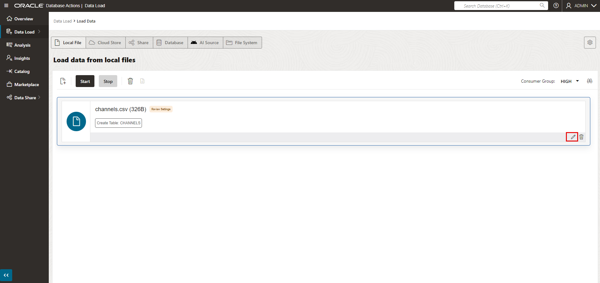
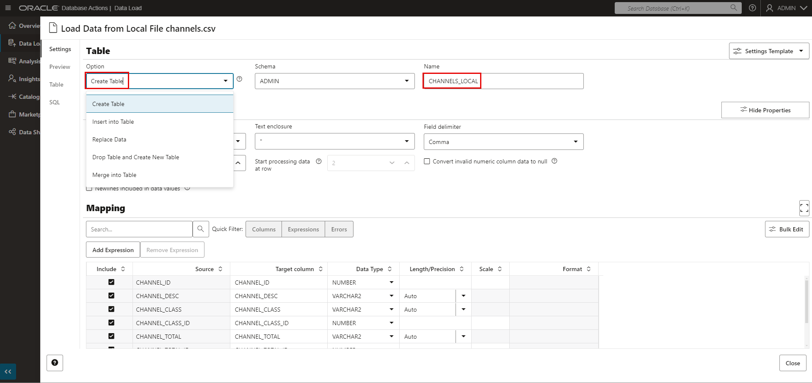
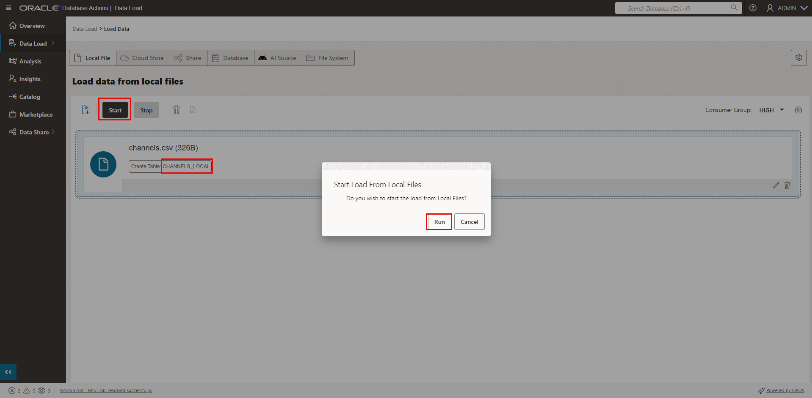
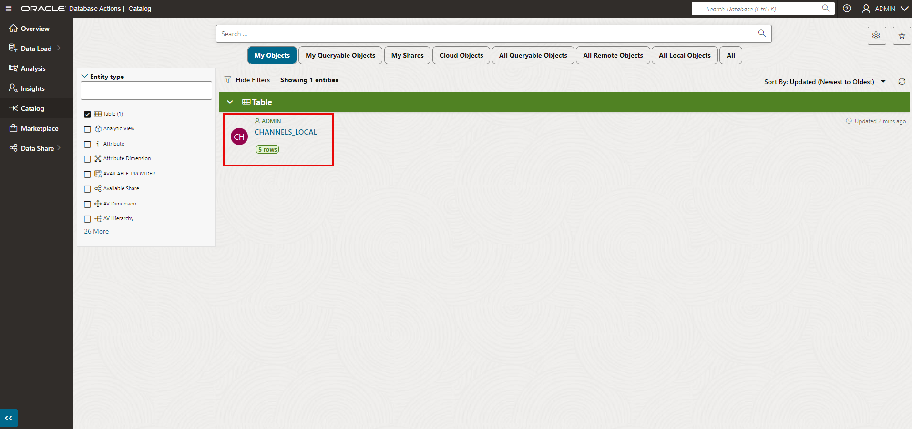
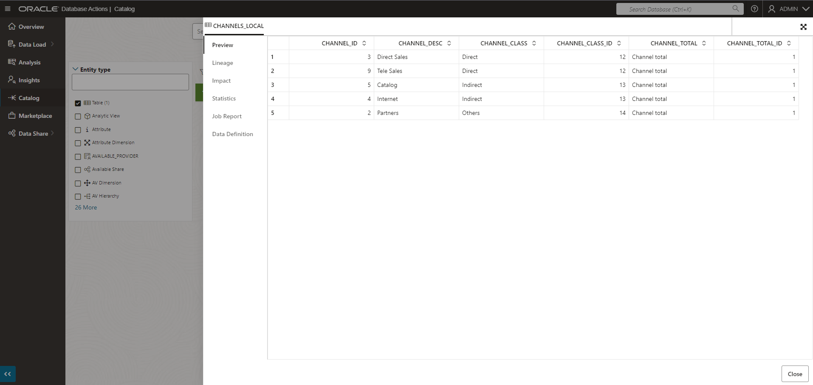
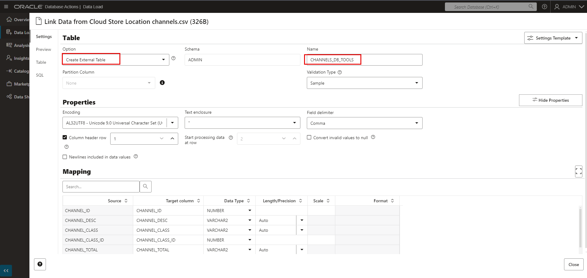

/* DELETE THIS FILE IN THE NEXT RELEASE - PLEASE USE ADB-LOADING-CONDITIONAL.MD FILE INSTEAD AND SPECIFY THE VERSION YOU WANT IN YOUR MANIFEST:
{
    "title": "Lab 3: Load Data",
    "description": "Load data into ADB",
    "type": "freetier",
    "filename": "https://raw.githubusercontent.com/oracle/learning-library/master/data-management-library/autonomous-database/shared/adb-loading/adb-loading-conditional.md"
},
# Load Data into an Autonomous Database Instance

## Introduction

In this lab, you will create and load an Oracle Autonomous Database table with sample data from your local file system, upload files to the Oracle Cloud Infrastructure (OCI) Object Storage, create and load tables with data from the files on the OCI Object Storage, and troubleshoot data loads with errors.

You can load data into your new autonomous database (Autonomous Data Warehouse [ADW] or Autonomous Transaction Processing [ATP]) using Oracle Database tools, and Oracle and 3rd party data integration tools. You can load data:

+ from files in your local device, or
+ from tables in remote databases, or
+ from files stored in cloud-based object storage (Oracle, S3, Azure, Google)

> **Note:** While this lab uses ADW, the steps are identical for loading data into an ATP database.

Estimated Time: 30 minutes

### Objectives

-   Learn how to create and load an ADW table with sample data from your local file system
-   Learn how to upload files to the OCI Object Storage
-   Learn how to define object store credentials for your autonomous database
-   Learn how to load data from the Object Store
-   Learn how to troubleshoot data loads

In Tasks 1 and 2, you will create one ADW table, **CHANNELS_LOCAL**, and load it with sample data from your *local file system*. In the remaining tasks, you will create and load several ADW tables with sample data that you stage to an *OCI Object Store*.

### You Will Practice Three Loading Methods
- **Loading Method 1**: Create and load one ADW table with sample data from your *local file system*, using the Database Actions DATA LOAD tool.
- **Loading Method 2**: Create and load two ADW tables with sample data that you stage in an *OCI Object Store*, using the Database Actions DATA LOAD tool.
- **Loading method 3**: Create ADW tables using SQL Worksheet and load them with sample data that you stage in an *OCI Object Store*, using the PL/SQL *`DBMS_CLOUD`* package.

### Prerequisites:

- This lab requires completion of the Provision Autonomous Database lab in the Contents menu on the left.

## Task 1: Download Sample Data for Loading from Local File

1. For this task, you will download a .csv file containing CHANNELS information to your local computer, then use it to populate a CHANNELS_LOCAL table in your ADW database in the next task.  Click <a href="https://objectstorage.us-ashburn-1.oraclecloud.com/p/VEKec7t0mGwBkJX92Jn0nMptuXIlEpJ5XJA-A6C9PymRgY2LhKbjWqHeB5rVBbaV/n/c4u04/b/livelabsfiles/o/data-management-library-files/channels.csv" target="\_blank">here</a> to download the sample channels.csv file, saving it to a directory on your local computer.

## Task 2: Load Local Data Using the Database Actions DATA LOAD Tool

1. In your database's details page, click the **Database Actions** button.

    

2.  A sign-in page opens for Database Actions. For this lab, simply use your database instance's default administrator account, **Username - admin**, and click **Next**. Enter the administrator **Password** you specified when creating the database. Click **Sign in**.

    

3. The Database Actions page opens. In the **Data Tools** section, click **DATA LOAD**.

    

4. Leave the default selections, **LOAD DATA** and **LOCAL FILE**, and click **Next**.

    

5. The Local Files page allows you to drag and drop files to upload, or you can select files. Drag the *channels.csv* file from the directory where you downloaded onto the Drag and Drop target. Or select *channels.csv* using the Select Files pop-up dialog.

    

6. When the upload is complete, you could simply click the green arrow **Start** button and click **Run** to run the data load job, but let's modify the data load job slightly. Click the **Settings** button that is labeled with a pencil symbol.

    

7. A page opens for the local channels.csv file that you will be loading. Take a moment to examine the preview information and loading options. Change the target table name from *CHANNELS* to *CHANNELS_LOCAL*. Since this is an initial load, accept the default option of **Create Table**, which conveniently creates the target table in the ADW database, without the need to predefine the table in SQL. In the mappings section, notice that you can change the target column names and data types. Click **Close** in the lower right corner of the page.

    

8. Notice that the target table name has changed to *CHANNELS_LOCAL*. Click **Start**, and then click **Run** in the confirmation dialog.

    

9. When the load job finishes, a green check mark appears. Click **Data Load** in the breadcrumb in the upper left corner, to return to the **Data Load** page.

    

10. In the **Data Load** page, click **EXPLORE**.

    

11. The Catalog shows the *CHANNELS_LOCAL* table has been successfully created. You can click the table name to see the data.

    

    


## Task 3: Download Sample Data for Staging to Object Store

In Tasks 1 and 2, you downloaded a channels.csv file to your local computer and used the Database Actions DATA LOAD tool to create and load an ADW table. Now, you will download a zip file containing data files that you will stage to an *OCI Object Store*, to populate a number of tables in subsequent tasks.

1. Click <a href="https://objectstorage.us-ashburn-1.oraclecloud.com/p/VEKec7t0mGwBkJX92Jn0nMptuXIlEpJ5XJA-A6C9PymRgY2LhKbjWqHeB5rVBbaV/n/c4u04/b/livelabsfiles/o/data-management-library-files/adb_sample_data_files.zip" target="\_blank">**here to download a zip file of the sample source files**</a> that you will upload to an object store that you will be defining. Unzip it to a directory on your local computer.

## Task 4: Navigate to Object Storage and Create Bucket

In OCI Object Storage, a bucket is the terminology for a container of multiple files.

1. Now you set up the OCI Object Store. From the Autonomous Data Warehouse console, pull out the left side menu from the top-left corner and select **Storage > Buckets**.

  

  *To learn more about the OCI Object Storage, refer to its <a href="https://docs.us-phoenix-1.oraclecloud.com/Content/GSG/Tasks/addingbuckets.htm" target="\_blank">documentation</a>*

2. You should now be on the **Object Storage** page. Choose any compartment to which you have access.  In this example, a **training** compartment is chosen.

    

3. Click the **Create Bucket** button:

    

4. **Bucket names must be unique per tenancy and region**; otherwise you will receive an "already exists" message. Enter the unique bucket name and click the **Create** button.

    

## Task 5: Upload Files to Your OCI Object Store Bucket

1. Click your **bucket name** to open it:

    

2. Click the **Upload** button:

    

3. Drag and drop, or click  **select files**,  to select all the files downloaded in Task 3. Click **Upload** and wait for the upload to complete:

    

4. When all of the files finish uploading, click **Close** at the bottom of the Upload Objects page. The end result should look like this with all files listed under **Objects**:

    

## Task 6: Object Store URL

1. Locate the base URL of the objects in your object store. The simplest way to get this URL is to click **View Object Details** in the ellipsis menu to the right of any uploaded file in the Object Store.

    

2.  Copy the base URL that points to the location of your files staged in the OCI Object Storage. *Do not include the trailing slash.* Save the base URL in a text notepad. You  will use the base URL in the upcoming tasks.

    

3. Take a look at the URL you copied. In this example above, the **region name** is us-ashburn-1, the **Namespace** is a+++++++++ng5, and the **bucket name** is ADWCLab.

    *Note: The URL can also be constructed as below:*

    `https://objectstorage.<`**region name**`>.oraclecloud.com/n/<`**namespace name**`>/b/<`**bucket name**`>/o`

## Task 7: Creating an Object Store Auth Token

To load data from the Oracle Cloud Infrastructure (OCI) Object Storage, you will need an OCI user with the appropriate privileges to read data (or upload) data to the Object Store. The communication between the database and the object store relies on the native URI, and the OCI user Auth Token.

1. In the menu bar at the top, click the **person icon** at the far right. From the drop-down menu, click your **user's name** (this username could be an email address).

    

    

    *Note: If you don't see your user name in the drop-down menu, you might be a "federated" user. In that case, go instead to the menu on the left side and open Users. Federated users are “federated” from another user service, whether it is an Active Directory LDAP type service or users from the older OCI Classic.*

2. Make note of this username, as you will need it in an upcoming task. At the bottom left side of the page, in the **Resources** section, click **Auth Tokens**.

    

3. Click **Generate Token**.

    

4. Enter a meaningful **description** for the token and click **Generate Token**.

    

5.  The new Auth Token is displayed. Click **Copy** to copy the Auth Token to the clipboard. Save the contents of the clipboard in your text notepad file. You will use it in the next tasks. *Note: You can't retrieve the Auth Token again after closing the dialog box.*

    

6. Click **Close** to close the Generate Token dialog.

## Task 8: Loading Data from the Object Store using Database Actions DATA LOAD Tool

In the first part of this lab, you loaded data from a file that you located on your local computer. In this part of the lab, you are going to load some more data, but this time you will load data from 2 of the files you uploaded to the Oracle Object Store. There are two parts to this process and the first part only needs to be performed once. The two parts are:

+ Set up connection to the Oracle Object Store.
+ Load the files.

1. First, define a **Cloud Location** to connect to the Oracle Object Store. To begin this process you need to navigate back to the **Data Load** page. In your ADW Finance Mart database's details page, click the **Database Actions** button.

    

2.  The sign-in page opens for Database Actions. For this lab, simply use your database instance's default administrator account, **Username - admin**, and click **Next**. Enter the administrator **Password** you specified when creating the database. Click **Sign in**.

    

3. The Database Actions page opens. In the **Data Tools** section, click **DATA LOAD**.

    

4. On the **Data Load** main page, click the **Cloud Locations** card so you can define a new connection to your object store.

    

5. Click **Add Cloud Storage**.

    

6. Complete the **Add Cloud Storage** page.
    + Specify the name **ADWCLab** and a description.
    + Choose **Oracle** as the cloud store, since you will be loading from your Oracle Object Store bucket.
    + Specify the URI and bucket that you recorded in Task 6.
    + Use the default **Create Credential** setting. Specify the credential name **OBJ\_STORE\_CRED**.
    In order to access data in the Object Store, you have to enable your database user to authenticate itself with the Object Store using your OCI object store account and Auth Token. You do this by creating a private CREDENTIAL object for your user that stores this information encrypted in your Autonomous Data Warehouse. This information is only usable for your user schema.
    + Specify your Oracle Cloud Infrastructure user name.
    + Copy and paste the Auth Token that you generated in Task 7. Click **Create**.

    

7. Now that you've created the Cloud Location to connect to the Oracle Object Store, you're ready to load data files from your bucket. Navigate back to the main Data Load page again using the breadcrumb link in the upper left corner. Click the two cards for **LOAD DATA** from **CLOUD STORAGE** and then click the **Next** button.

    

8. Now you see a file browser-like view of your Object Store. Let's practice the easy drag-and-drop method of loading files by multi-selecting the `channels.csv` and `countries.csv` files in the left part of the screen. Drag and drop these files onto the canvas on the right.

    

9. As before, you can edit the properties of your new data load job by clicking the **pencil** button on the right-hand side of the card. Click the **pencil** button for the `channels.csv` and `countries.csv` tables.

    

10. You can use this page to quickly review the properties sheet and make any changes to column names or data types. Since this is an initial load, accept the default option of **Create Table**, which conveniently creates the target table in the ADW database, without the need to predefine the table in SQL.

    - For `channels.csv`, change the target table name to **CHANNELS\_DB\_TOOLS**.
    - For `countries.csv`, change the target table name to **COUNTRIES\_DB\_TOOLS**.

    

11. As soon as you are satisfied with the format, you can close the form and then click the **green arrow** button to start your data load job.

    

**Note:** The target tables loaded up to this point were for practice using the Database Tools user interface. In the next task, you will load a set of tables that will be used in subsequent labs.

## Task 9: Loading Data from the Object Store Using the PL/SQL Package, DBMS_CLOUD

As an alternative to the wizard-guided data load, you can use the PL/SQL package `DBMS_CLOUD` directly. This is the preferred choice for any load automation.

For the fastest data loading experience, Oracle recommends uploading the source files to a cloud-based object store, such as *Oracle Cloud Infrastructure Object Storage*, before loading the data into your ADW or ATP database.

To load data from files in cloud storage into your Oracle Autonomous Database, use the PL/SQL `DBMS_CLOUD` package. The `DBMS_CLOUD` package supports loading data files from the following Cloud sources: Oracle Cloud Infrastructure Object Storage, Oracle Cloud Infrastructure Object Storage Classic, Amazon AWS S3, Microsoft Azure Cloud Storage, and Google Cloud Storage.

This task shows how to load data from Oracle Cloud Infrastructure Object Storage using two of the procedures in the `DBMS_CLOUD` package:

+ **create_credential**: Stores the object store credentials in your Autonomous Data Warehouse schema.
    + You will use this procedure to create object store credentials in your ADW admin schema.
+ **copy_data**: Loads the specified source file to a table. The table must already exist in ADW.
    + You will use this procedure to load tables to your admin schema with data from data files staged in the Oracle Cloud Infrastructure Object Storage cloud service.

***Note:*** If you skipped Task 8, in which you create a credential for object store access, please use your username and auth token from Task 7 and run the `create_credential` procedure to create a credential. You can <a href="https://docs.oracle.com/en/cloud/paas/autonomous-database/adbsa/dbms-cloud-subprograms.html#GUID-742FC365-AA09-48A8-922C-1987795CF36A" target="\_blank">click here</a> to read the documentation on how to create a credential. If you performed Task 8, proceed with the following:

1. Click on the SQL tile to open SQL web developer.

  

2. Unlike the previous steps where the Database Actions DATA LOAD tool gave you the option to automatically create the target Oracle Autonomous Database tables during the data load process, the following steps for loading with the `DBMS_CLOUD` package require you to first create the target tables.

    - Connected as your ADMIN user in SQL Worksheet, copy and paste <a href="./files/create_tables.txt" target="\_blank">this code snippet to create the required tables</a> to the worksheet. Take a moment to examine the script. You will first drop any tables with the same name before creating tables. Then click the **Run Script** button to run it.

    - It is expected that you may get *ORA-00942 table or view does not exist* errors during the `DROP TABLE` commands for the first execution of the script, but you should not see any other errors.

    

    *Note that you do not need to specify anything other than the list of columns when creating tables in the SQL scripts. You can use primary keys and foreign keys if you want, but they are not required.*

3. Download <a href="./files/load_data_without_base_url_v2.txt" target="\_blank">this code snippet</a> to a text editor.

4. Replace `<bucket URI>` in the code with the base URL you copied in Task 6.  The top of the file should look similar to the example below:

    ```
    /* Replace <bucket URI> below with the URL you copied from your files in OCI Object Storage at runtime.
    */
    set define on
    define file_uri_base = 'https://objectstorage.me-dubai-1.oraclecloud.com/n/c4u04/b/LL6570-ADWLab/o'

    begin
     dbms_cloud.copy_data(
        table_name =>'CHANNELS',
        credential_name =>'OBJ_STORE_CRED',
        file_uri_list =>'&file_uri_base/chan_v3.dat',
        format => json_object('ignoremissingcolumns' value 'true', 'removequotes' value 'true')
     );
    end;
    /
    ...
    ```

5.  Copy and paste your edited file to a SQL Worksheet. This script uses the **copy\_data** procedure of the **DBMS\_CLOUD** package to copy the data from the source files to the target tables you created before.

6.  Run the script.

    

7.  You have successfully loaded the sample tables. You can now run any sample query in the <a href="https://docs.oracle.com/database/122/DWHSG/part-relational-analytics.htm#DWHSG8493" target="\_blank">relational analytics</a> section of the Oracle documentation. For example, to analyze the cumulative amount sold for specific customer IDs in a quarter in 2000, you could run the query in <a href="./files/query_tables.txt" target="\_blank">this code snippet</a> using the Run Script button.   <a href="https://docs.oracle.com/en/database/oracle/oracle-database/12.2/dwhsg/introduction-data-warehouse-concepts.html#GUID-452FBA23-6976-4590-AA41-1369647AD14D" target="\_blank">Click Here</a> to read more about Data Warehousing.

    

## Task 10: Troubleshooting DBMS_CLOUD data loads

1. Connected as your user in SQL Worksheet, run the following query to look at past and current data loads.
    ```
    $ <copy>select * from user_load_operations;</copy>
    ```
    *Notice how this table lists the past and current load operations in your schema.  Any data copy and data validation operation will have backed-up records in your Cloud.*

2. For an example of how to troubleshoot a data load, we will attempt to load a data file with the wrong format (chan\_v3\_error.dat).  Specifically, the default separator is the | character, but the channels_error.csv file uses a semicolon instead.  To attempt to load bad data, copy and paste <a href="./files/load_data_with_errors.txt" target="\_blank">this code snippet</a> to a SQL Worksheet and run the script as your user in SQL Worksheet. Specify the URL that points to the **chan\_v3\_error.dat** file. Use the URL that you have copied and saved in Task 6. Expect to see "Reject limit" errors when loading your data this time.

    

3. Run the following query to see the load that errored out.
    ```
    <copy>select * from user_load_operations where status='FAILED';</copy>
    ```

    

    A load or external table validation that errors out is indicated by *status=FAILED* in this table. Get the names of the log and bad files for the failing load operation from the column **logfile\_table** and **badfile\_table**. The `logfile_table` column shows the name of the table you can query to look at the *log* of a load operation. The column `badfile_table` shows the name of the table you can query to look at the *rows that got errors* during loading.

4. Query the log and bad tables to see detailed information about an individual load. In this example, the names are `copy$21_log` and `copy$21_bad` respectively.

        

5.  To learn more about how to specify file formats, delimiters, reject limits, and more, review the <a href="https://docs.oracle.com/en/cloud/paas/autonomous-data-warehouse-cloud/user/dbmscloud-reference.html" target="\_blank"> Autonomous Database Supplied Package Reference </a> and <a href="https://docs.oracle.com/en/cloud/paas/autonomous-data-warehouse-cloud/user/format-options.html#GUID-08C44CDA-7C81-481A-BA0A-F7346473B703" target="\_blank"> DBMS_CLOUD Package Format Options </a>

Please *proceed to the next lab*.

## Want to Learn More?

For more information about loading data, see the documentation [Loading Data from Files in the Cloud](https://www.oracle.com/pls/topic/lookup?ctx=en/cloud/paas/autonomous-data-warehouse-cloud&id=CSWHU-GUID-07900054-CB65-490A-AF3C-39EF45505802).

Click [here](https://docs.oracle.com/en/cloud/paas/autonomous-data-warehouse-cloud/user/load-data.html#GUID-1351807C-E3F7-4C6D-AF83-2AEEADE2F83E) for documentation on loading data with Autonomous Data Warehouse.

## **Acknowledgements**

- **Author** - Nilay Panchal, ADB Product Management
- **Adapted for Cloud by** - Richard Green, Principal Developer, Database User Assistance
- **Last Updated By/Date** - Richard Green, November 2021
