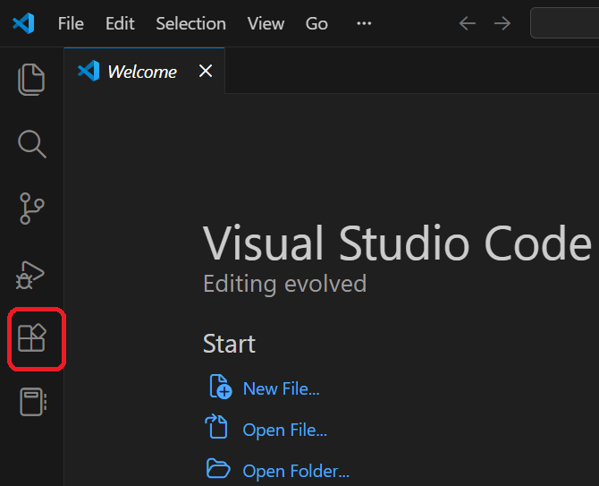
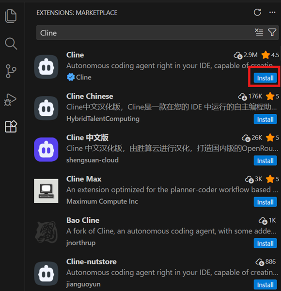
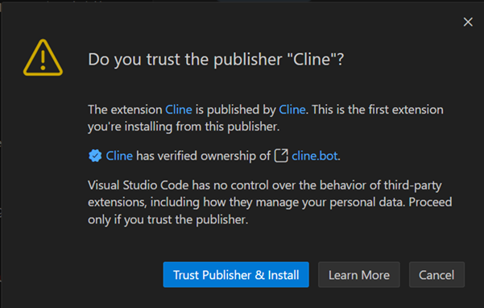
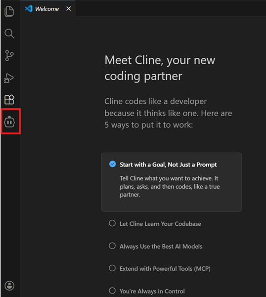
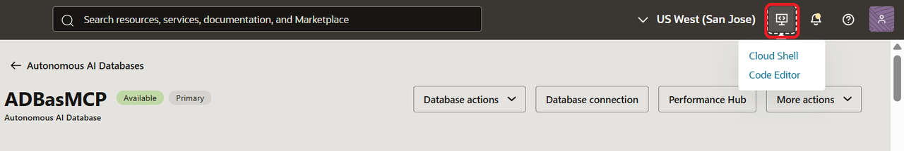
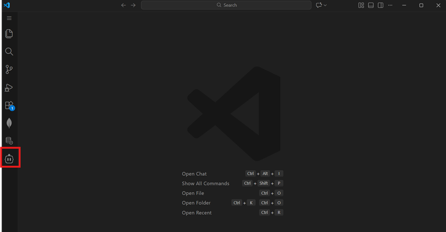
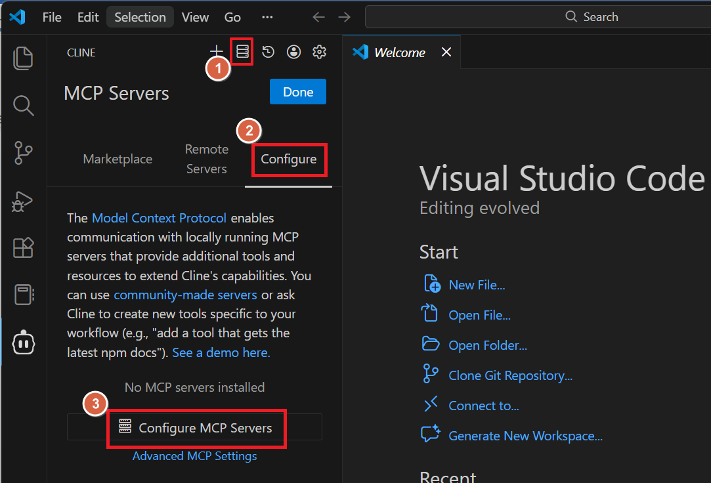

# Configure Cline in Visual Studio Code to Use MCP Server

## Introduction

In the previous lab, you used Claude Desktop to call database tools exposed through the MCP Server.

Cline is a Visual Studio Code extension that enables seamless connection and interaction with Oracle MCP (Model Context Protocol) servers, making it easier for developers to manage, test, and call AI models and tools from within their development environment.

In this lab, you will learn how to set up and use Visual Studio Code with the Cline extension as another MCP client. You generate a bearer token, configure MCP connectivity, and verify that Cline can load and process the same database tools created earlier.

This lab demonstrates how different AI clients connect to the same MCP-enabled database instance.

Estimated Time:x

### Objectives

In this lab, you will:

* Install Visual Studio Code (if not already installed) 
* Install and configure the Cline extension
* Generate a bearer token for authentication using cURL
* Configure Cline to securely connect to your Autonomous AI Database MCP Server
* Verify that Cline loads available database tools 
* Select and manage tool access through Cline extension

### Prerequisites

- This lab requires completion of Lab 1 through Lab 3 in the **Contents** menu on the left.
- cURL or similar applications such as  or Cloud Editor available in OCI to run cURL command.

## Task 1:  Install Visual Studio Code 

If you already have Visual Studio Code installed on your system, proceed to Task 2.

If Visual Studio Code is not installed, follow the instructions below to install it. Install Visual Studio Code on your computer based on your operating system — Windows or Mac. Choose from:

#### For Windows:

1. Go to the official [download page](https://code.visualstudio.com/download)
2. Download the Windows installer (.exe file).
3. Run the installer and follow the instructions in the setup wizard.
4. Once installed, launch Visual Studio Code.

#### For macOS:

1. Go to the official [download page](https://code.visualstudio.com/download)
2. Download the macOS installer (`.dmg` file).
3. Open the `.dmg` file and drag Visual Studio Code into your **Applications** folder.
4. Launch Visual Studio Code from **Applications**.

## Task 2: Install the Cline Extension

In this task, you will install the Cline extension in Visual Studio Code.

1. In Visual Studio Code, click the Extensions icon. 
  
2. In the **Activity Bar** (or use Ctrl+Shift+X) search for **Cline**.
  
3. Click **Install** next to the Cline extension.
4. If prompted, click **Trust Publisher & Install**. 
  
5. Once installed, the Cline extension icon appears in the Activity Bar. 
  
6. Click the Cline icon and confirm the interface loads without error.
7. Optionally, if this is your first time using Cline, open the extension to complete creating a Cline account by following the prompts on the screen.

## Task 3: Generate a Bearer Token Using cURL

To authenticate with the MCP server, you must obtain a bearer token through an HTTP POST request to the OAuth 2.1 token endpoint of your Autonomous AI Database.
1. Generate bearer token in your terminal:

  **On Windows:**
    Open Command Prompt

  **On macOS:**
    Open Terminal

2. Use the following cURL command, replacing placeholders with your actual values.

  ```
  <copy>
  curl --location 'https://dataaccess.adb.{region-identifier}.oraclecloudapps.com/adb/auth/v1/databases/{database-ocid}/token' \
    --header 'Content-Type: application/json' \
    --header 'Accept: application/json' \
    --data '{
      "grant_type": "password",
      "username": "<db-username>",
      "password": "<db-password>"
    }'
  </copy>
  ```

  - Replace {region-identifier} with your Oracle Cloud region. For example, if your database instance is in Chicago region, the region-identifier is `us-chicago-1`.
  - Replace {database-ocid} with your database’s OCID of your Autonomous AI Database
  - Replace `<db-username>` and `<db-password>` with your database schema user credentials:
    - Username: **sales\_user** 
    - Password: **QwertY#19\_95**

  > **Note:** You can also use the Cloud Shell or Cloud Editor available in OCI to run your cURL command directly. These environments come with cURL already installed and configured, making it convenient if local setup is not available or if you prefer to run commands securely in your cloud environment. 

3. Run the cURL command in Command Prompt (Windows), Terminal (macOS), or another CLI tool.
4. The response contains `access_token` and `refresh_token`. Copy and store the `access_token` value in a text editor.

  > **Note:** 
  - Bearer tokens are valid for 1 hour. Bearer tokens expire after approximately one hour. If you receive a 401 error, generate a new token and update the MCP configuration.
  - Keep your credentials secure and do not share tokens publicly.
  - You may also generate tokens using Postman or similar tools.


## Task 4: Configure MCP Server in Cline Using Bearer Token

1. Return to Cline extension in Visual Studio Code. Click the Cline icon in the Activity Bar. 

2. If prompted, login to your Cline account by following the prompts on the screen.
3. Click **MCP Servers** and click the **Configure** tab to add or modify a server connection. 

4. Click **Configure MCP Servers**. This opens up `cline_mcp_settings.json` file in Visual Studio Code.
5. Use the following example as a template for MCP server configuration and replace the code in `cline_mcp_setting.json`. Provide your actual values in the placeholders:
    ```
    <copy>
    {
      "mcpServers": {
        "OpsDatabase": {
          "timeout": 300,
          "type": "streamableHttp",
          "url": "https://dataaccess.adb.{region-identifier}.oraclecloudapps.com/adb/mcp/v1/databases/{database-ocid}",
          "headers": {
            "Authorization": "Bearer <your-token>"
          }
        }
      }
    }
    </copy>
    ```

    Replace with your actual values:
    - {region-identifier} with your Oracle Cloud region. For example, if your database instance is in Chicago region, the `region-identifier` is `us-chicago-1`.
    - {database-ocid} with the OCID of your Autonomous AI Database that you copied in **Lab 2**.
    - `<your-token>` with the `access_token` you copied in **Task 3**.
  
6. **Save** the file and close it.
7. Close Visual Studio Code.
8. Reopen it.
9. Open Cline again → Click **MCP Servers** icon → Click **Configure** tab.
10. Cline extension may ask to authenticate. If prompted, complete the authentication process to enable full functionality of the extension. 

11. Restart Visual Studio Code if necessary.
12. Return to the MCP Servers **Configure** tab, you should now see **OpsDatabase** listed and running indicated with a *Green* light.

13. Expand **OpsDatabase** to view the tools created in **Lab 3** are visible displaying tools, parameters, and definitions.

14. Click **Done** in the top right of the configuration screen to close the screen and return to the Cline chat panel.


You have now configured two MCP clients:

 - Claude Desktop
 - Cline in Visual Studio Code

Both clients connect to the same Autonomous AI Database MCP Server and load the same set of database tools that were created for `hrm_user` and `sales_user`.

In the next lab, you will use Cline to process natural language prompts and review tool calls within Visual Studio Code.

## Quiz
```quiz score
Q: What authentication method does Cline use to connect to the MCP Server?
- Basic authentication
- API key in URL
* OAuth bearer token
- Kerberos ticket
>Cline connects to the MCP Server using an OAuth bearer token that is included in the Authorization header.

Q: Where is the bearer token added in the MCP configuration?
- Query parameter in the URL
- Body of the JSON configuration
- Transport type field
* Authorization header
>The bearer token must be placed in the Authorization header.

Q: After updating the MCP configuration with a new token, what should you do next?

- Refresh the browser
* Save and restart Visual Studio Code
- Reinstall Node.js
- Delete the MCP server
>Save the configuration file and Visual Studio Code must be restarted so Cline reloads the updated configuration.
```

You may now proceed to the next lab.

## Troubleshooting
If Cline does not connect to the MCP Server or tools do not load.

*Issue 1: Streamable HTTP error – 401*

Review the following checks:
```
Streamable HTTP error: Server returned 401 after successful authentication
```
**Cause**

The bearer token has expired or is invalid.

Bearer tokens are valid for approximately one hour.

**Solution**
1. Generate a new token using the OAuth endpoint. Refer to Task 3.
2. Replace the Authorization header value in the MCP configuration. Refer to Task 4.
3. Restart Visual Studio Code.
4. Retry connection.


*Issue 2: Fetch Failed*

**Cause**

The MCP URL is incorrect or using HTTP instead of HTTPS.

**Solution**

Use:
```
https://dataaccess.adb.<region>.oraclecloudapps.com
```
Not:
```
http://
oraclecloud.com
```

*Issue 3: Tools Do Not Appear*

Check the Following:

1. MCP Server is enabled (Lab 2).
2. Free-form tag shows:
```
{"name":"mcp_server","enable":true}
```
3. You are using the correct schema user.
4. Tools were created successfully in Lab 3.
5. Token was generated using the same schema user.
6. Restart Cline after verification.

*Issue 4: Token Generated but Connection Still Fails*

Check the following:

1. Port 443 is open.
2. Corporate firewall is not blocking outbound HTTPS.
3. VPN or proxy configuration is correct.
4. `npx -v` works in terminal.

## Learn More

[Configuring MCP-Compliant clients](https://docs.oracle.com/en/cloud/paas/autonomous-database/serverless/adbsb/use-mcp-server.html#GUID-B540AEF5-FB92-4091-9519-289C1B52B690)

## Acknowledgements

* **Authors:** Sarika Surampudi, Principal User Assistance Developer; Dhanish Kumar, Senior Member of Technical Staff
* **Contributors:** Chandrakanth Putha, Senior Product Manager; Mark Hornick, Senior Director, Machine Learning and AI Product Management


Copyright (c) 2026 Oracle Corporation.

Permission is granted to copy, distribute and/or modify this document
under the terms of the GNU Free Documentation License, Version 1.3
or any later version published by the Free Software Foundation;
with no Invariant Sections, no Front-Cover Texts, and no Back-Cover Texts.
A copy of the license is included in the section entitled [GNU Free Documentation License](https://oracle-livelabs.github.io/adb/shared/adb-15-minutes/introduction/files/gnu-free-documentation-license.txt)
