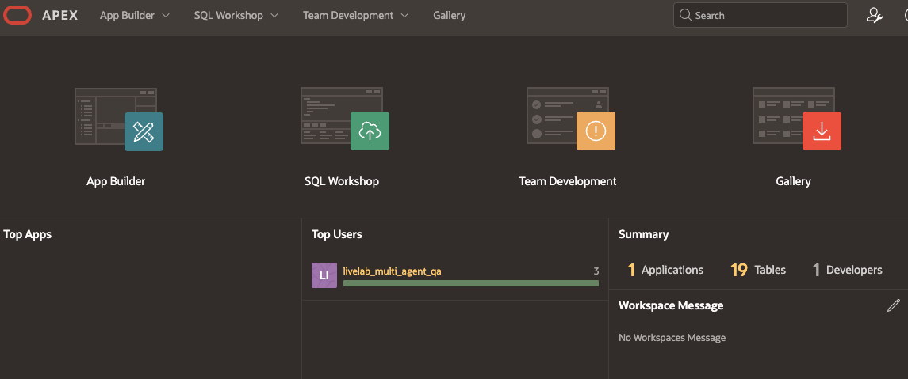
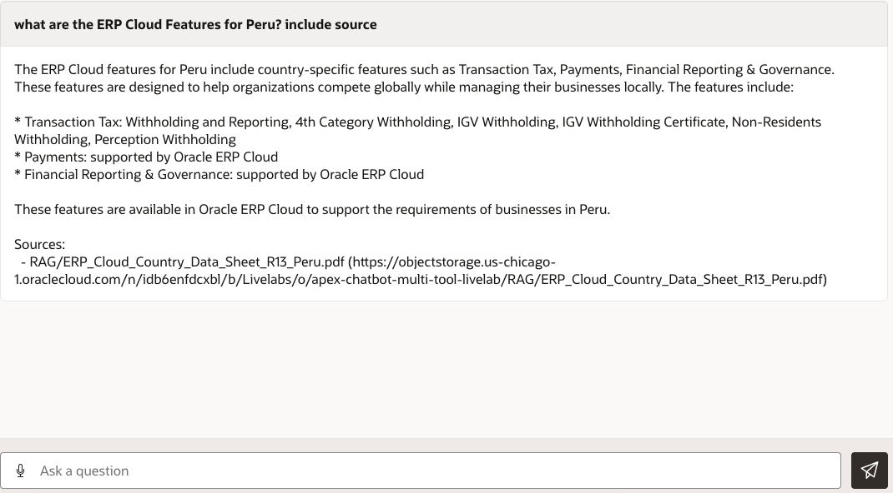

# Demo Multitool Select AI chatbot


## Introduction

This lab will take you thru the steps for demonstrating each tool of the Multitool Select AI chatbot.

Estimated Time: 15 minutes


### Objectives

In this lab, you will:

* Send sample prompts to the chatbot
* Observe the response

### Prerequisites (Optional)

This lab assumes you have:
* All previous labs successfully completed


 
## Task 1: Login to the chatbot

1. From within the Apex workspace, navigate to the applications by drilling thru the number next to the Applications title under Summary.

     

2. Find the ATOM 23AI Chat_clone application and click the run Application button.

     

3. Login the chatbot using the application credentials created in Lab 1, Task 4.
     

## Task 2: Prompt Examples

1. Type in the following prompt: 

    Paste the Text:

    ```text
        <copy>
          Make a short report on the country with proprietary info    
        </copy>
    ```

     


2. Type in the following prompt: 


    Paste the Text:

    ```text
        <copy>
          What’s the weather in Sau Paolo 
        </copy>
    ```

     

3. Type in the following prompt: 

    Paste the Text:

    ```text
        <copy>
          which country has proprietary info and what is the weather there?
        </copy>
    ```

     

4. Type in the following prompt: 

    Paste the Text:

    ```text
        <copy>
          what are the ERP Cloud Features for Peru? include source
        </copy>
    ```

     
