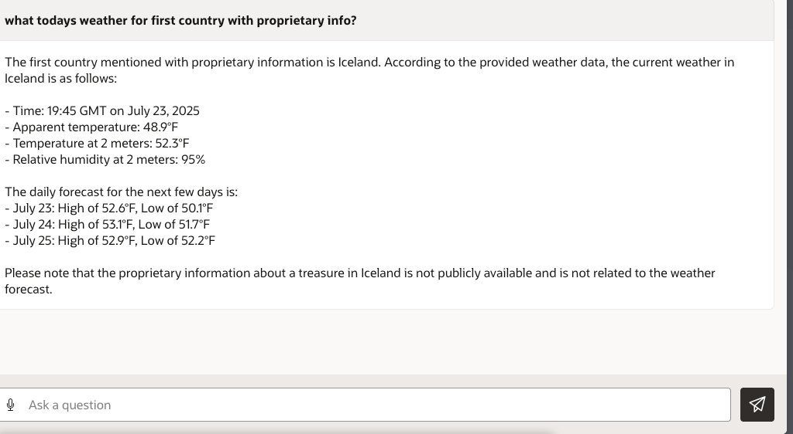

# Introduction

## About this Workshop

In this workshop, you will learn how to use APEX Workflows with Select AI to create a multi-tool select AI chatbot. The LLM chatbot will have following tools: Natural Language to Structured Query Language (NL2SQL), Retrieval Augmented Generation (RAG) and the Open-Meteo weather API. Each tool is called via PL/SQL all within the same database.

 **Autonomous Database Select AI (Select AI)**
Use natural language to interact with your database and LLMs through SQL to enhance user productivity and develop AI-based applications. Select AI simplifies and automates using generative AI, whether generating, running, and explaining SQL from a natural language prompt, using retrieval augmented generation with vector stores, generating synthetic data, or chatting with the LLM

 **Autonomous Database Select AI (Select AI)** with **Retrieval Augmented Generation (RAG)** Select AI with RAG augments your natural language prompt by retrieving content from your specified vector store using semantic similarity search. This reduces hallucinations by using your specific and up-to-date content and provides more relevant natural language responses to your prompts.

> **NOTE:** This workshop requires access to a Large Language Model (LLM). You can use LLMs from OCI GenAI, OpenAI, Azure, or Google Gemini. If you want to use OCI GenAI, ensure that your tenancy is subscribed to one of the following regions (at the time the workshop was last updated): **US Midwest (Chicago)**, **Germany Central (Frankfurt)**, **UK South (London)**, **Brazil East (Sao Paulo)**, or **Japan Central (Osaka)** regions in order to run this workshop. See the [OCI documentation](https://docs.oracle.com/en-us/iaas/Content/Identity/Tasks/managingregions.htm) for more details. For the current list of regions with **Generative AI**, see [Regions with Generative AI](https://docs.oracle.com/en-us/iaas/Content/generative-ai/overview.htm).

Estimated Workshop Time: 1 hours 30 minutes (This estimate is for the entire workshop - it is the sum of the estimates provided for each of the labs included in the workshop.)

### Objectives

In this workshop, you will learn how to:
* Provision Autonomous Database 23AI
* Setup prebuilt APEX Chatbot Application 
* Implement APEX Workflows
* Demonstrate Prompts on APEX Multi-Tool Chatbot

 

 

## Learn More

* [Autonomous Database Select AI](https://www.oracle.com/autonomous-database/select-ai/)

## Acknowledgements
* **Author** - Jadd Jennings, Principal Cloud Architect
* **Contributors** -  Kaushik Kundu, Master Principal Cloud Architect
* **Last Updated By/Date** -  Jadd Jennings, July 2025
