# Setup APEX Chatbot App workflows


## Introduction

This lab will take you thru the necessary steps for updating the workflow activities that integrate tools for the APEX Chatbot. The tools integrated are NL2SQL, RAG and the Mateo weather API. The NL2SQL tools allow for the use of natural language to query an apex sample dataset consisting of a listing of countries and with an extra column  to prove tool usage. The RAG tool is powered by a vector search on pdf documents related to country specific ERP Cloud features. The Mateo weather api is an open-source weather api that provides weather forecasts for any location, see https://open-meteo.com/ for more info. The chatbot uses a system prompt to decide which tools are needed for the user prompt.


Estimated Time: 15 minutes

### About Oracle APEX Workflows

Oracle APEX Workflow provides basic workflow capabilities for APEX developers.

A workflow is the automation of a business process where documents, information, or tasks move from one participant to another, following a set of procedural rules.

APEX workflows provide the following capabilities:
- Workflow Versions for managing both a development and an active version of a workflow
- Workflow Definitions, including parameters, variables, activities, connections, and participants
- a visual Workflow Designer for creating and authoring sequential workflows
- a Workflow Console for monitoring and administering workflows
- a Workflow Runtime Engine for running workflow instances


### Objectives

In this lab, you will:

* Update the Workflow activities for the workflow of the imported chatbot app
* Activate the workflow

### Prerequisites (Optional)


This lab assumes you have:
* An Oracle Cloud account
* All previous labs successfully completed

## Learn More


* [About APEX Workflows](https://docs.oracle.com/en/database/oracle/apex/24.1/htmdb/about-workflows.html)

 
## Task 1: Open the prebuilt APEX workflow

1. From within the APEX workspace, navigate to App Builder.

     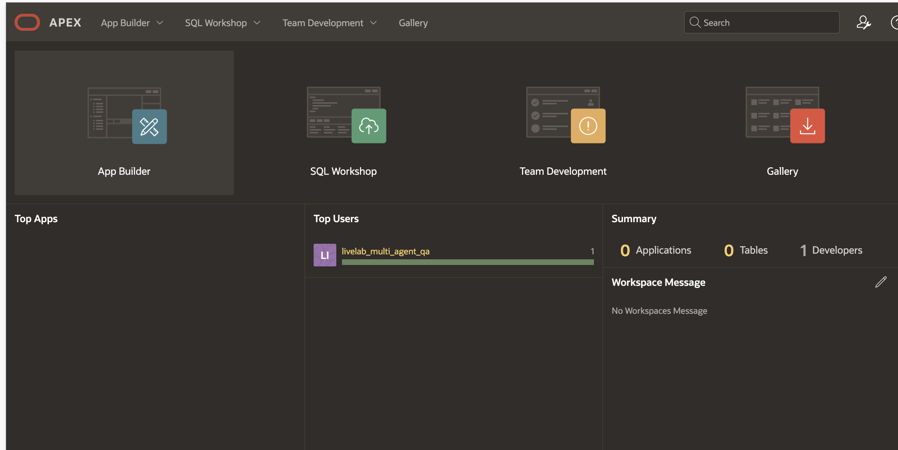

2. Click the ATOM 23AI Chat_clone app button.

     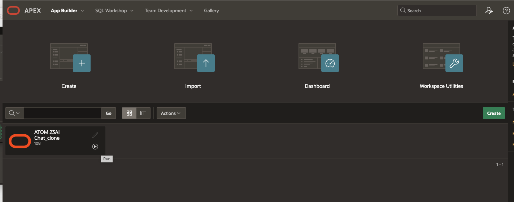

3. Click the Shared Components button.

     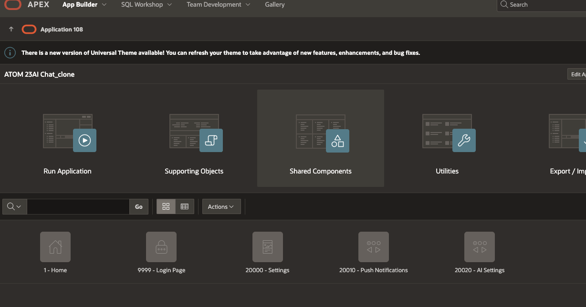

4. Click the Workflows link under Workflows and Automations.

     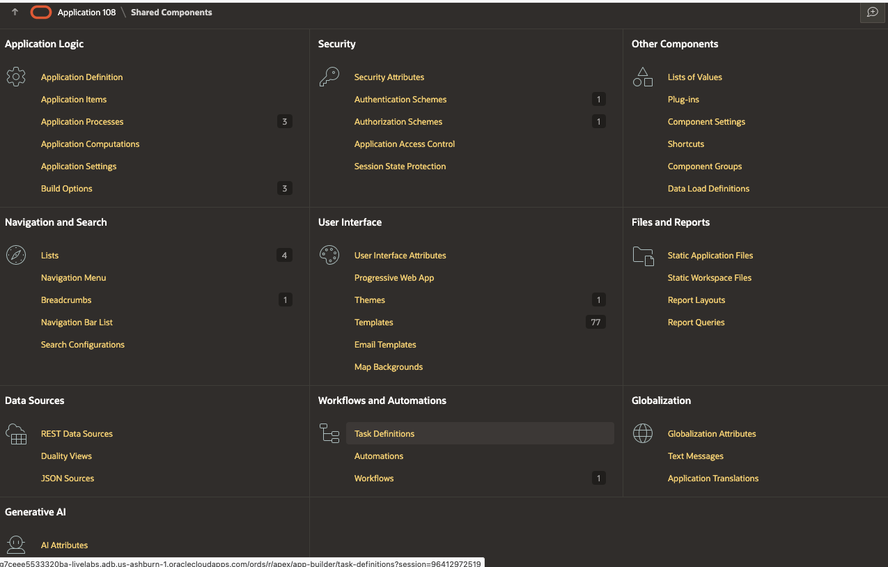

5. Open the ToolCallingWorkflow via the workflow link.

     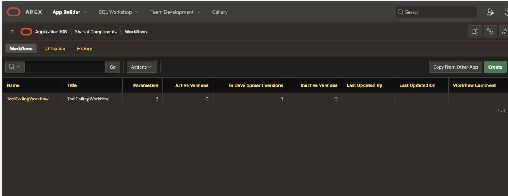

## Task 2: Add Select AI tools to the APEX Workflow Activities

1. Expand the Workflows tree on the left, select RAG tool and edit the PL/SQL source.

     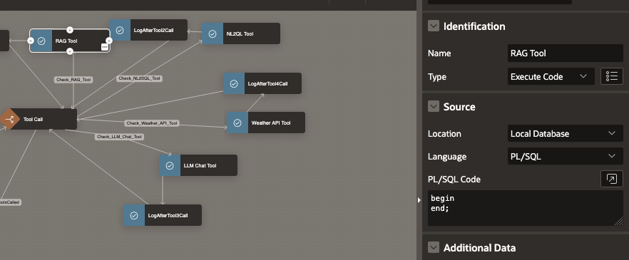

2. Copy the SQL below into the source, validate and save.

    Paste the PL/SQL:

    ```text
        <copy>
                declare
            c_response clob;
            c_sql clob;
            l_has_summary number;
            l_prompt varchar2(4000);
            v_profile_name varchar2(100);
            v_summary_profile_name varchar2(100);
            v_tools_left number;
            
            begin    
            INSERT INTO WORKFLOW_LOG (STEP, STARTTIME, PARAMETERS)
            SELECT 'Tool 1:Get the AI profile for this prompt '
                ,SYSTIMESTAMP
                ,':APP_USER_IN:' || :APP_USER_IN || ' |V_PROMPT:' || :V_PROMPT 
            FROM DUAL;

            v_profile_name := 'GENAI_VECTOR_APEX'; 
            
            INSERT INTO WORKFLOW_LOG (STEP, STARTTIME, PARAMETERS)
            SELECT 'Tool 1:Generate response using prompt and profiles'
                ,SYSTIMESTAMP
                ,'v_profile_name:' || v_profile_name || ' |V_PROMPT:' || :V_PROMPT 
            FROM DUAL;

            c_response := dbms_cloud_ai.generate(
                            prompt => :V_PROMPT,
                            action => 'narrate',
                            profile_name => 'GENAI_VECTOR_APEX'
                            );

            c_sql := '';

            -- Generate a summary?
            select count(*)
            into l_has_summary
            from ADB_CHAT_CONVERSATIONS
            where id = :CONV_ID 
            and summary is not null;

            if l_has_summary = 0 then
                -- Yes! Generate the summary b/c one does not exist.
                -- get a profile to generate the response. 
                v_summary_profile_name:= 'GENAI';

                if v_summary_profile_name is null then
                    l_prompt := 'Untitiled conversation';            
                else
                    l_prompt := dbms_cloud_ai.generate(
                                prompt => 'Rewrite as a short title : '||:WORKFLOW_PROMPT,
                                action => 'chat',
                                profile_name => v_summary_profile_name
                            );

                end if;
                
                update ADB_CHAT_CONVERSATIONS set summary = l_prompt
                where id = :CONV_ID and summary is null;
            
            end if;

            INSERT INTO WORKFLOW_LOG (STEP, STARTTIME, PARAMETERS)
            SELECT 'Tool 1: check for other tool calls'
                ,SYSTIMESTAMP
                ,':CONV_ID' || :CONV_ID || 'v_profile_name:' || v_profile_name || ' |V_PROMPT:' || :V_PROMPT  || ' c_sql:' || c_sql 
            FROM DUAL;
            
            :RAG_TOOL := 'false';

            UPDATE ADB_CHAT_CONVERSATIONS_TOOLS
            SET TOOL_APPLIED = 1
            WHERE CONVERSATION_ID = :CONV_ID
            AND    TOOL_ID = 1;

            v_tools_left := 0;

            SELECT COUNT(*) INTO v_tools_left
            FROM ADB_CHAT_CONVERSATIONS_TOOLS
            WHERE CONVERSATION_ID = :CONV_ID
            AND  TOOL_APPLIED = 0;

            IF v_tools_left > 0 THEN
            
                c_response := dbms_cloud_ai.generate(
                                prompt => 'Rewrite to 2000 characters or less and remove anything about weather not available and keep any source references: '|| c_response,
                                action => 'chat',
                                profile_name => 'GENAI'
                            );

                :V_PROMPT :=  :V_PROMPT || ' also use the following which attempts to partially answer the prompt: ' || substr(c_response,1,3000);
                    INSERT INTO WORKFLOW_LOG (STEP, STARTTIME, PARAMETERS)
                    SELECT 'Tool 1: UPDATE V_PROMPT'
                        ,SYSTIMESTAMP
                        ,':CONV_ID' || :CONV_ID || ' |V_PROMPT:' || :V_PROMPT || ' |c_response '  
                    FROM DUAL; 
            ELSE
                INSERT INTO ADB_CHAT_PROMPTS (conv_id, profile_name, prompt, response, asked_on, showsql) 
                VALUES (:CONV_ID, v_profile_name, :WORKFLOW_PROMPT, c_response, systimestamp, c_sql);
                INSERT INTO WORKFLOW_LOG (STEP, STARTTIME, PARAMETERS)
                    SELECT 'Tool 1: INSERT INTO ADB_CHAT_PROMPTS'
                        ,SYSTIMESTAMP
                        ,':CONV_ID ' || :CONV_ID || ' |WORKFLOW_PROMPT:' || :WORKFLOW_PROMPT || ' |c_response ' 
                    FROM DUAL;
            END IF;
        end;

        </copy>
    ```

     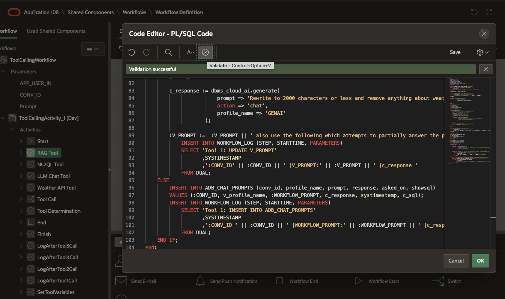

8. Select the NLSQL tool, edit the PL/SQL source, copy the SQL below into the source, validate and save the PL/SQL.

    Paste the PL/SQL:

    ```text
        <copy>
        declare  
            c_response clob;
            c_sql clob;
            l_has_summary number;
            l_prompt varchar2(4000);
            v_profile_name varchar2(100);
            v_summary_profile_name varchar2(100);
            v_tools_left number;
            
        begin

            INSERT INTO WORKFLOW_LOG (STEP, STARTTIME, PARAMETERS)
            SELECT 'Tool 2:Get the AI profile for this prompt'
                ,SYSTIMESTAMP
                ,':APP_USER_IN:' || :APP_USER_IN || ' |WORKFLOW_PROMPT:' || :WORKFLOW_PROMPT  
            FROM DUAL;
        
            v_profile_name := 'GENAI_SQL_APEX';
            
            INSERT INTO WORKFLOW_LOG (STEP, STARTTIME, PARAMETERS)
            SELECT 'Tool 2:Generate response using prompt and profiles'
                ,SYSTIMESTAMP
                ,'v_profile_name:' || v_profile_name || ' |V_PROMPT:' || :V_PROMPT  
            FROM DUAL;

            commit;
        
            c_sql := dbms_cloud_ai.generate(
                            prompt => :V_PROMPT,
                            action => 'showsql',
                            profile_name => 'GENAI_SQL_APEX',
                            attributes =>
                                '{
                                    "comments": true
                                }'
                            );

            -- Generate with narrate only if c_sql has value 
            if (c_sql is not null) then
                c_response := dbms_cloud_ai.generate(
                                prompt => :V_PROMPT,
                                action => 'narrate',
                                profile_name => 'GENAI_SQL_APEX',
                                attributes =>
                                '{
                                    "comments": true
                                }'
                                );
                c_response := dbms_cloud_ai.generate(
                                prompt => 'Rewrite to 1000 tokens or less and remove anything about weather not available and keep any source references:  '|| c_response,
                                action => 'chat',
                                profile_name => 'GENAI'
                            );
            end if;

            INSERT INTO WORKFLOW_LOG (STEP, STARTTIME, PARAMETERS, RESPONSE, showsql) 
            SELECT 'Tool 2: AFTER Generate response using prompt and profiles'
                    ,SYSTIMESTAMP
                    ,'v_profile_name:' || v_profile_name || ' |V_PROMPT:' || :V_PROMPT ||   'length(c_response):' || length(c_response)
                    ,c_response
                    ,c_sql 
            FROM DUAL;

            commit;
            -- Generate a summary?
            select count(*)
            into l_has_summary
            from ADB_CHAT_CONVERSATIONS
            where id = :CONV_ID 
            and summary is not null;
            

            if l_has_summary = 0 then
                -- Yes! Generate the summary b/c one does not exist.
                -- get a profile to generate the response. 
                v_summary_profile_name:= 'GENAI_SQL_APEX';

                if v_summary_profile_name is null then
                    l_prompt := 'Untitiled conversation';            
                else
                    l_prompt := dbms_cloud_ai.generate(
                                prompt => 'Rewrite as a short title : '||:WORKFLOW_PROMPT,
                                action => 'chat',
                                profile_name => 'GENAI'
                            );

                end if;
                
                update ADB_CHAT_CONVERSATIONS set summary = l_prompt
                where id = :CONV_ID and summary is null;
            
            end if;
        
            INSERT INTO WORKFLOW_LOG (STEP, STARTTIME, PARAMETERS)
            SELECT 'Tool 2: check for other tool calls'
                ,SYSTIMESTAMP
                ,':CONV_ID' || :CONV_ID || 'v_profile_name:' || v_profile_name || ' |V_PROMPT:' || :V_PROMPT || ' c_sql:' || c_sql 
            FROM DUAL;
            
            COMMIT;
        
            :DATABASE_TOOL := 'false';


            UPDATE ADB_CHAT_CONVERSATIONS_TOOLS
            SET TOOL_APPLIED = 1
            WHERE CONVERSATION_ID = :CONV_ID
            AND    TOOL_ID = 2;

            v_tools_left := 0;
            
            SELECT COUNT(*) INTO v_tools_left
            FROM ADB_CHAT_CONVERSATIONS_TOOLS
            WHERE CONVERSATION_ID = :CONV_ID
            AND  TOOL_APPLIED = 0;

            IF v_tools_left > 0 THEN
                :V_PROMPT :=  :V_PROMPT || ' also use the following which may partially answer the prompt: ' || c_response;
                    INSERT INTO WORKFLOW_LOG (STEP, STARTTIME, PARAMETERS, RESPONSE, showsql) 
                    SELECT 'Tool 2: UPDATE V_PROMPT'
                        ,SYSTIMESTAMP
                        ,':CONV_ID ' || :CONV_ID || ' |V_PROMPT:' || :V_PROMPT 
                        ,c_response
                        , c_sql
                    FROM DUAL;
                    COMMIT;
            ELSE
                    INSERT INTO WORKFLOW_LOG (STEP, STARTTIME, PARAMETERS)
                    SELECT 'Tool 2: INSERT INTO ADB_CHAT_PROMPTS'
                        ,SYSTIMESTAMP
                        ,':CONV_ID ' || :CONV_ID || ' |WORKFLOW_PROMPT:' || :WORKFLOW_PROMPT || ' |c_response ' 
                    FROM DUAL;
            
                    INSERT INTO ADB_CHAT_PROMPTS (conv_id, profile_name, prompt, response, asked_on, showsql) 
                    VALUES (:CONV_ID, v_profile_name, :WORKFLOW_PROMPT, c_response, systimestamp, c_sql);
                    COMMIT;
            END IF;
        end;

        </copy>
    ```

    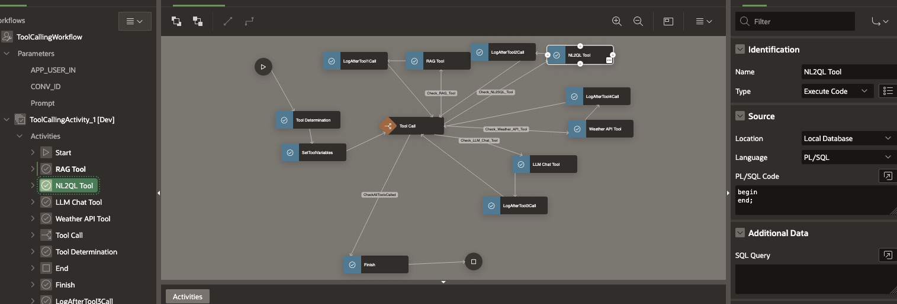
    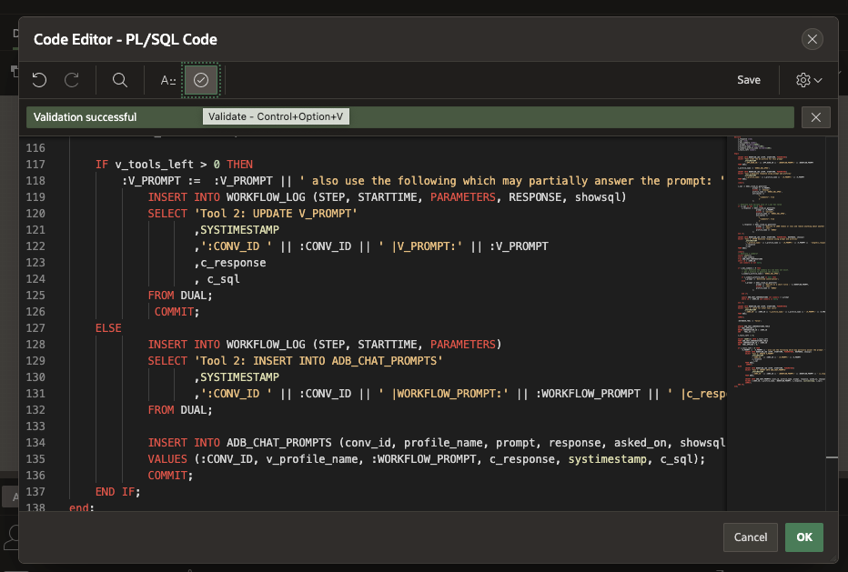

9. Select the LLM Chat tool, edit the PL/SQL source, copy the SQL below into the source, validate and save the PL/SQL.

    Paste the PL/SQL:

    ```text
        <copy>

        declare 
            c_response clob;
            c_sql clob;
            l_has_summary number;
            l_prompt varchar2(4000);
            v_profile_name varchar2(100);
            v_summary_profile_name varchar2(100);
            v_tools_left number;
        begin
        
            INSERT INTO WORKFLOW_LOG (STEP, STARTTIME, PARAMETERS)
            SELECT 'Tool 3:Get the AI profile for this prompt'
                ,SYSTIMESTAMP
                ,':APP_USER_IN:' || :APP_USER_IN || ' |V_PROMPT:' || :V_PROMPT  
            FROM DUAL;

        
            v_profile_name := 'GENAI'; 
            
            INSERT INTO WORKFLOW_LOG (STEP, STARTTIME, PARAMETERS)
            SELECT 'Tool 3:Generate response using prompt and profiles'
                ,SYSTIMESTAMP
                ,'v_profile_name:' || v_profile_name || ' |V_PROMPT:' || :V_PROMPT  
            FROM DUAL;

            COMMIT;

            c_response := dbms_cloud_ai.generate(
                                prompt =>  :V_PROMPT,
                                action => 'chat',
                                profile_name => 'GENAI'
                            );

            -- Generate a summary?
            select count(*)
            into l_has_summary
            from ADB_CHAT_CONVERSATIONS
            where id = :CONV_ID 
            and summary is not null;
            

            if l_has_summary = 0 then
                -- Yes! Generate the summary b/c one does not exist.
                -- get a profile to generate the response. 
                v_summary_profile_name:= 'GENAI';

                if v_summary_profile_name is null then
                    l_prompt := 'Untitiled conversation';            
                else
                    l_prompt := dbms_cloud_ai.generate(
                                prompt => 'Rewrite as a short title : '||:V_PROMPT,
                                action => 'chat',
                                profile_name => 'GENAI'
                            );

                end if;
                
                update ADB_CHAT_CONVERSATIONS set summary = l_prompt
                where id = :CONV_ID and summary is null;
            
            end if;

            INSERT INTO WORKFLOW_LOG (STEP, STARTTIME, PARAMETERS)
            SELECT 'Tool 3: check for other tool calls'
                ,SYSTIMESTAMP
                ,':CONV_ID' || :CONV_ID || 'v_profile_name:' || v_profile_name || ' |V_PROMPT:' || :V_PROMPT ||  ' c_sql:' || c_sql 
            FROM DUAL;
            
        
            
        
            :LLM_TOOL := 'false';

            UPDATE ADB_CHAT_CONVERSATIONS_TOOLS
            SET TOOL_APPLIED = 1
            WHERE CONVERSATION_ID = :CONV_ID
            AND    TOOL_ID = 3;

            v_tools_left := 0;
            
            SELECT COUNT(*) INTO v_tools_left
            FROM ADB_CHAT_CONVERSATIONS_TOOLS
            WHERE CONVERSATION_ID = :CONV_ID
            AND  TOOL_APPLIED = 0;

        COMMIT;

            c_response := dbms_cloud_ai.generate(
                                prompt => 'Rewrite to 2000 characters or less and remove anything about weather not available and keep any source references:  '|| c_response,
                                action => 'chat',
                                profile_name => 'GENAI'
                            );
        COMMIT;                  
            IF v_tools_left > 0 THEN
                :V_PROMPT :=  :V_PROMPT || ' also using this information ' || c_response;
                    INSERT INTO WORKFLOW_LOG (STEP, STARTTIME, PARAMETERS)
                    SELECT 'Tool 3: UPDATE V_PROMPT'
                        ,SYSTIMESTAMP
                        ,':CONV_ID ' || :CONV_ID || ' |V_PROMPT:' || :V_PROMPT || ' |c_response ' || c_response
                    FROM DUAL;
            ELSE
                INSERT INTO ADB_CHAT_PROMPTS (conv_id, profile_name, prompt, response, asked_on, showsql) 
                VALUES (:CONV_ID, v_profile_name, :WORKFLOW_PROMPT, c_response, systimestamp, c_sql);

                INSERT INTO WORKFLOW_LOG (STEP, STARTTIME, PARAMETERS)
                    SELECT 'Tool 3: INSERT INTO ADB_CHAT_PROMPTS'
                        ,SYSTIMESTAMP
                        ,':CONV_ID ' || :CONV_ID || ' |WORKFLOW_PROMPT:' || :WORKFLOW_PROMPT || ' |c_response ' 
                    FROM DUAL;
            END IF;
        end;

        </copy>
    ```

    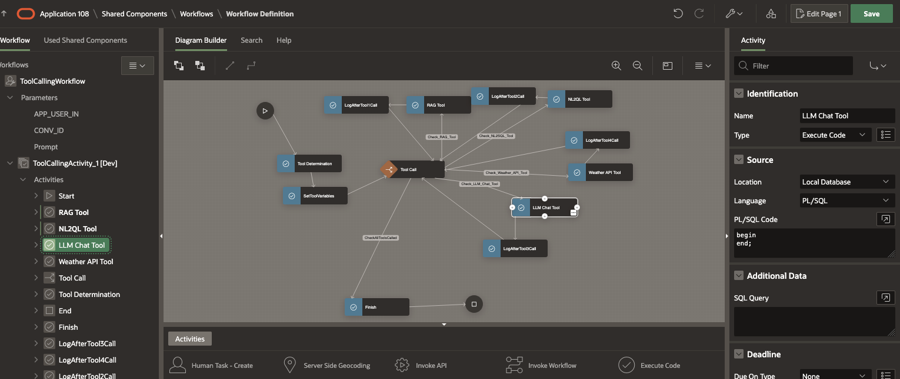
    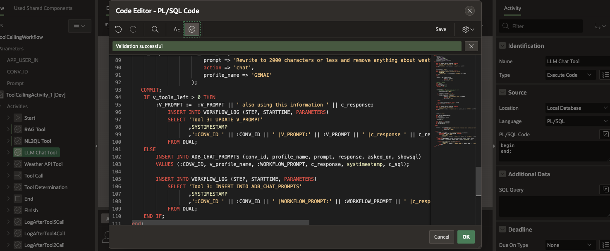


10. Select the Weather API tool, edit the PL/SQL source, copy the SQL below into the source, validate and save the PL/SQL.

    Paste the PL/SQL:

    ```text
        <copy>
declare
    c_response clob;
    c_sql clob;
    l_has_summary number;
    l_prompt varchar2(4000);
    v_profile_name varchar2(100);
    v_summary_profile_name varchar2(100);
    v_tools_left number;
    v_weather_JSON varchar2(3500); 
    v_latitude_value  varchar2(200);
    v_longitude_value varchar2(200);
    v_p_url  varchar2(500);
begin


/**
** Find Longitude of place in prompt and store
** Find Latitude of place in prompmt and store
**/ 

    INSERT INTO WORKFLOW_LOG (STEP, STARTTIME, PARAMETERS)
    SELECT 'Tool 4:Get the AI profile for this prompt '
        ,SYSTIMESTAMP
        ,':APP_USER_IN:' || :APP_USER_IN || ' |V_PROMPT:' || :V_PROMPT 
    FROM DUAL;

    -- Get the AI profile for this prompt. It will choose from the list of profiles that were selected by the user

    v_profile_name := 'GENAI'; 

    INSERT INTO WORKFLOW_LOG (STEP, STARTTIME, PARAMETERS)
    SELECT 'Tool 4:Generate response using prompt and profiles'
        ,SYSTIMESTAMP
        ,'v_profile_name:' || v_profile_name || ' |V_PROMPT:' || :V_PROMPT  
    FROM DUAL;

commit;
 
SELECT REGEXP_SUBSTR(DBMS_CLOUD_AI.GENERATE(
    prompt => 'Return only 5/6 characters, I need the latitude from the first location of the following prompt only return in number format examples: 10 or 10.45
        Prompt: ' || :V_PROMPT,--:WORKFLOW_PROMPT,
    profile_name => 'GENAI',
    action       => 'chat') , '[+-]?([0-9]*[.])?[0-9]+')
INTO v_latitude_value
FROM dual;

INSERT INTO WORKFLOW_LOG (STEP, STARTTIME, PARAMETERS)
SELECT 'Tool 4:Latitude'
        ,SYSTIMESTAMP
        ,'v_profile_name:' || v_profile_name || ' |v_latitude_value:' || v_latitude_value
FROM DUAL;

commit;

SELECT REGEXP_SUBSTR(DBMS_CLOUD_AI.GENERATE(

    prompt => 'Return only 5/6 characters, I need the longitude from the first location of the following prompt only return in number format examples: 10 or 10.45
        Prompt: ' || :V_PROMPT,--:WORKFLOW_PROMPT,
    profile_name => 'GENAI',
    action       => 'chat'), '[+-]?([0-9]*[.])?[0-9]+')
INTO v_longitude_value
FROM dual;

INSERT INTO WORKFLOW_LOG (STEP, STARTTIME, PARAMETERS)
SELECT 'Tool 4:longitude'
        ,SYSTIMESTAMP
        ,'v_profile_name:' || v_profile_name || ' |v_longitude_value:' || v_longitude_value
FROM DUAL;

commit;

select apex_web_service.make_rest_request(
    p_url            => 'https://api.open-meteo.com/v1/forecast?latitude=' || v_latitude_value || '&longitude=' || v_longitude_value || '&daily=temperature_2m_max,temperature_2m_min' || '&' || 'current=apparent_temperature,temperature_2m,relative_humidity_2m' || '&' || 'forecast_days=3' || '&' || 'temperature_unit=fahrenheit',
    p_http_method    => 'GET'),
    'https://api.open-meteo.com/v1/forecast?latitude=' || v_latitude_value || '&longitude=' || v_longitude_value || '&daily=temperature_2m_max,temperature_2m_min' || '&' || 'current=apparent_temperature,temperature_2m,relative_humidity_2m' || '&' || 'forecast_days=3' || '&' || 'temperature_unit=fahrenheit'
    as p_url
INTO v_weather_JSON, v_p_url
FROM dual;

INSERT INTO WORKFLOW_LOG (STEP, STARTTIME, PARAMETERS, SHOWSQL)
SELECT 'Tool 4: Weather URL/JSON'
        ,SYSTIMESTAMP
        ,'v_profile_name:' || v_profile_name || ' |v_p_url:' || v_p_url
        ,v_weather_JSON
FROM DUAL;

commit;

/**with latitude 
as
(
SELECT DBMS_CLOUD_AI.GENERATE(

    prompt => 'I need the latitude from the first location of the following prompt only return one number 
        Prompt: ' || :V_PROMPT,--:WORKFLOW_PROMPT,
    profile_name => 'GENAI',
    action       => 'chat') as latitude_value
    FROM dual
),
longitude 
as
(
SELECT DBMS_CLOUD_AI.GENERATE(

    prompt => 'I need the longitude from the first location of the following prompt only return one number 
        Prompt: ' || :V_PROMPT,--:WORKFLOW_PROMPT,
    profile_name => 'GENAI',
    action       => 'chat') as longitude_value
    FROM dual
),
weatherCall
as
(
select apex_web_service.make_rest_request(
    p_url            => 'https://api.open-meteo.com/v1/forecast?latitude=' || latitude_value || '&longitude=' || longitude_value || '&daily=temperature_2m_max,temperature_2m_min' || '&' || 'current=apparent_temperature,temperature_2m,relative_humidity_2m' || '&' || 'forecast_days=3' || '&' || 'temperature_unit=fahrenheit',
    p_http_method    => 'GET') weatherJSON,
    latitude_value,
    longitude_value,
    'https://api.open-meteo.com/v1/forecast?latitude=' || latitude_value || '&longitude=' || longitude_value || '&daily=temperature_2m_max,temperature_2m_min' || '&' || 'current=apparent_temperature,temperature_2m,relative_humidity_2m' || '&' || 'forecast_days=3' || '&' || 'temperature_unit=fahrenheit'
    as p_url
from latitude,longitude  
)
SELECT DBMS_CLOUD_AI.GENERATE(
                            prompt => :V_PROMPT || ' use this weather info: ' || weatherJSON,
                            profile_name => 'GENAI',
                            action       => 'chat')
      ,weatherJSON
      ,latitude_value
      ,longitude_value
      ,p_url
INTO c_response, v_weather_JSON, v_latitude_value, v_longitude_value, v_p_url
FROM weatherCall;
*/

SELECT DBMS_CLOUD_AI.GENERATE(
                            prompt => :V_PROMPT || ' use this weather info: ' || v_weather_JSON,
                            profile_name => 'GENAI',
                            action       => 'chat')
INTO c_response
FROM DUAL


commit;

    INSERT INTO WORKFLOW_LOG (STEP, STARTTIME, PARAMETERS) 
    SELECT 'Tool 4: Weather Prompt Done'
        ,SYSTIMESTAMP
        ,'v_profile_name:' || v_profile_name || ' |V_PROMPT:' || :V_PROMPT  

    FROM DUAL;

commit;

    -- Generate a summary?
    select count(*)
    into l_has_summary
    from ADB_CHAT_CONVERSATIONS
    where id = :CONV_ID 
    and summary is not null;

    if l_has_summary = 0 then
        -- Yes! Generate the summary b/c one does not exist.
        -- get a profile to generate the response. 
        v_summary_profile_name:= 'GENAI';

        if v_summary_profile_name is null then
            l_prompt := 'Untitiled conversation';            
        else
            l_prompt := dbms_cloud_ai.generate(
                        prompt => 'Rewrite as a short title : '||:WORKFLOW_PROMPT,
                        action => 'chat',
                        profile_name => v_summary_profile_name
                    );

        end if;

        update ADB_CHAT_CONVERSATIONS set summary = l_prompt
        where id = :CONV_ID and summary is null;

    end if;

    INSERT INTO WORKFLOW_LOG (STEP, STARTTIME, PARAMETERS)
    SELECT 'Tool 4: check for other tool calls'
        ,SYSTIMESTAMP
        ,':CONV_ID' || :CONV_ID || 'v_profile_name:' || v_profile_name || ' |V_PROMPT:' || :V_PROMPT  || ' c_sql:' || c_sql 
    FROM DUAL;

    :WEATHER_TOOL := 'false';

    UPDATE ADB_CHAT_CONVERSATIONS_TOOLS
    SET TOOL_APPLIED = 1
    WHERE CONVERSATION_ID = :CONV_ID
    AND    TOOL_ID = 4;

    v_tools_left := 0;

    SELECT COUNT(*) INTO v_tools_left
    FROM ADB_CHAT_CONVERSATIONS_TOOLS
    WHERE CONVERSATION_ID = :CONV_ID
    AND  TOOL_APPLIED = 0;

    IF v_tools_left > 0 THEN

        c_response := dbms_cloud_ai.generate(
                        prompt => 'Rewrite to 3000 characters or less and remove anything about weather not available and keep any source references:  '|| c_response,
                        action => 'chat',
                        profile_name => 'GENAI'
                    );

        :V_PROMPT :=  :V_PROMPT || ' use this weather information: ' || substr(c_response,1,3000);
            INSERT INTO WORKFLOW_LOG (STEP, STARTTIME, PARAMETERS)
            SELECT 'Tool 4: UPDATE V_PROMPT'
                ,SYSTIMESTAMP
                ,':CONV_ID' || :CONV_ID || ' |V_PROMPT:' || :V_PROMPT || ' |c_response '  
            FROM DUAL;

    ELSE

        INSERT INTO ADB_CHAT_PROMPTS (conv_id, profile_name, prompt, response, asked_on, showsql) 
        VALUES (:CONV_ID, v_profile_name, :WORKFLOW_PROMPT, c_response, systimestamp, c_sql);
        INSERT INTO WORKFLOW_LOG (STEP, STARTTIME, PARAMETERS)
            SELECT 'Tool 4: INSERT INTO ADB_CHAT_PROMPTS'
                ,SYSTIMESTAMP
                ,':CONV_ID ' || :CONV_ID || ' |WORKFLOW_PROMPT:' || :WORKFLOW_PROMPT || ' |c_response ' 
            FROM DUAL;

    END IF;

end;
        </copy>
    ```
    
    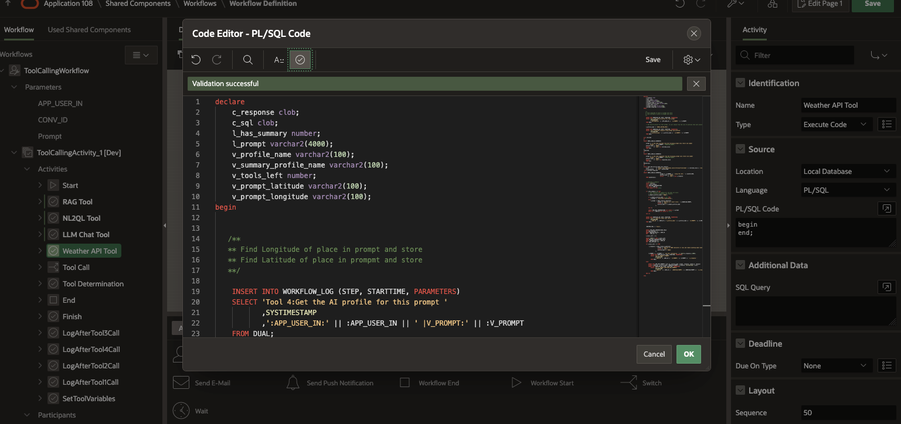

You may proceed to the next lab

## Acknowledgements


* **Author**
    * **Jadd Jennings**, Principal Cloud Architect, NACIE

* **Last Updated By/Date**
    * **Jadd Jennings**, Principal Cloud Architect, NACIE, July 2025