# Setup APEX Chatbot App


## Introduction

This lab will take you through the steps needed to: apply necessary grant privileges for the APEX workspace, install sample data, import the prebuilt APEX Chatbot and install the remaining pl/sql for the APEX Chatbot.

Estimated Time: 30 minutes

### About Privileges and Roles

Authorization permits users to access, process, or alter data; it also creates limitations on user access or actions.

The limitations placed on (or removed from) users can apply to objects such as schemas, entire tables, or table rows.

A user privilege is the right to run a particular type of SQL statement, or the right to access an object that belongs to another user, run a PL/SQL package, and so on. The types of privileges are defined by Oracle Database.

Roles are created by users (usually administrators) to group together privileges or other roles. They are a way to facilitate the granting of multiple privileges or roles to users. In addition to granting roles to users and other roles, you can assign roles to programs by using code based access control (CBAC).


### Objectives

In this lab, you will:

* grant required db privileges for the APEX workspace
* install APEX Sample data
* import a prebuilt APEX chatbot app 
* apply pl/sql scripts for APEX chatbot app


### Prerequisites (Optional)


This lab assumes you have:
* An Oracle Cloud account
* All previous labs successfully completed


## Learn More


* [Configuring Privilege and Role Authorization](https://docs.oracle.com/en/database/oracle/oracle-database/23/dbseg/configuring-privilege-and-role-authorization.html)
 
## Task 1: Grant privileges for APEX workspace schema


1. Open the service detail page for your Autonomous Database instance in the OCI console.  

   Then click on **Database Actions** and select **SQL**. 

   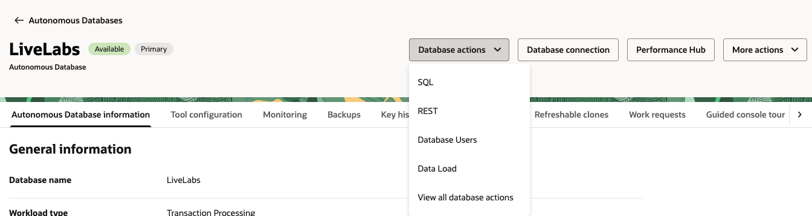

2. Make sure to be logged in as Admin and execute the seven SQL statements below to grant the necessary roles for the schema created in Lab 1 and be sure the correct schema is referenced similar to screenshot.
 
    Paste the PL/SQL:

    ```text
        <copy>
            GRANT EXECUTE ON DBMS_LOCK TO <SCHEMA NAME HERE>;

            GRANT EXECUTE ON DBMS_CLOUD_AI TO  <SCHEMA NAME HERE>;

            GRANT EXECUTE ON DBMS_CLOUD_PIPELINE TO  <SCHEMA NAME HERE>;

            GRANT EXECUTE ON DBMS_CLOUD TO  <SCHEMA NAME HERE>; 

        </copy>
    ```

   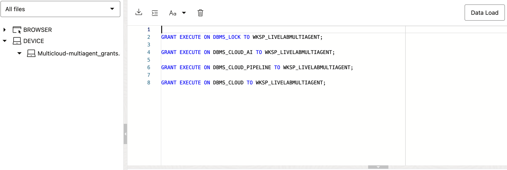

 
## Task 2: Download prebuilt APEX Chatbot and install APEX sample data


1. Download the prebuilt APEX chatbot application.

    a. [apex_chatbot_workflows.sql](https://objectstorage.us-chicago-1.oraclecloud.com/n/idb6enfdcxbl/b/Livelabs/o/apex-chatbot-multi-tool-livelab%2Fapex_chatbot_workflows.sql)


2. Login into the workspace using the name and credentials you created in Lab 1.

    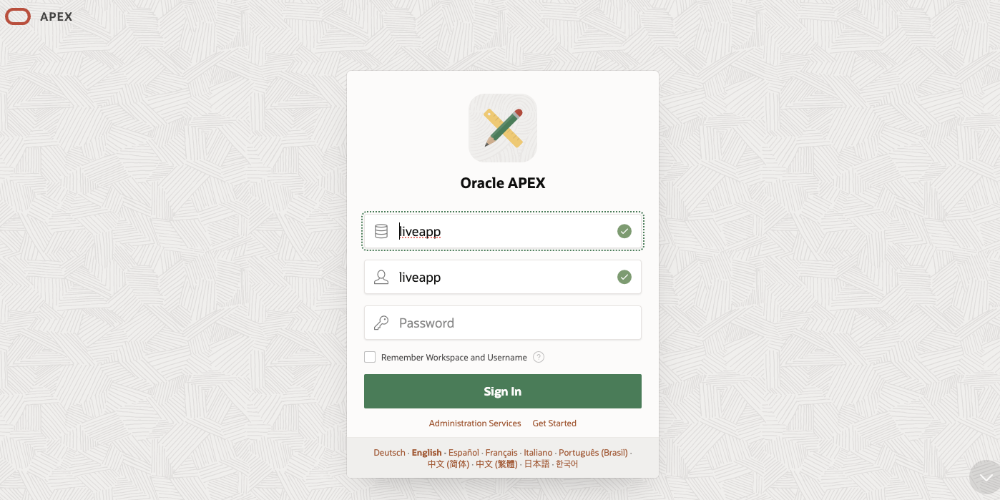


3. Open the sample datasets utility.

    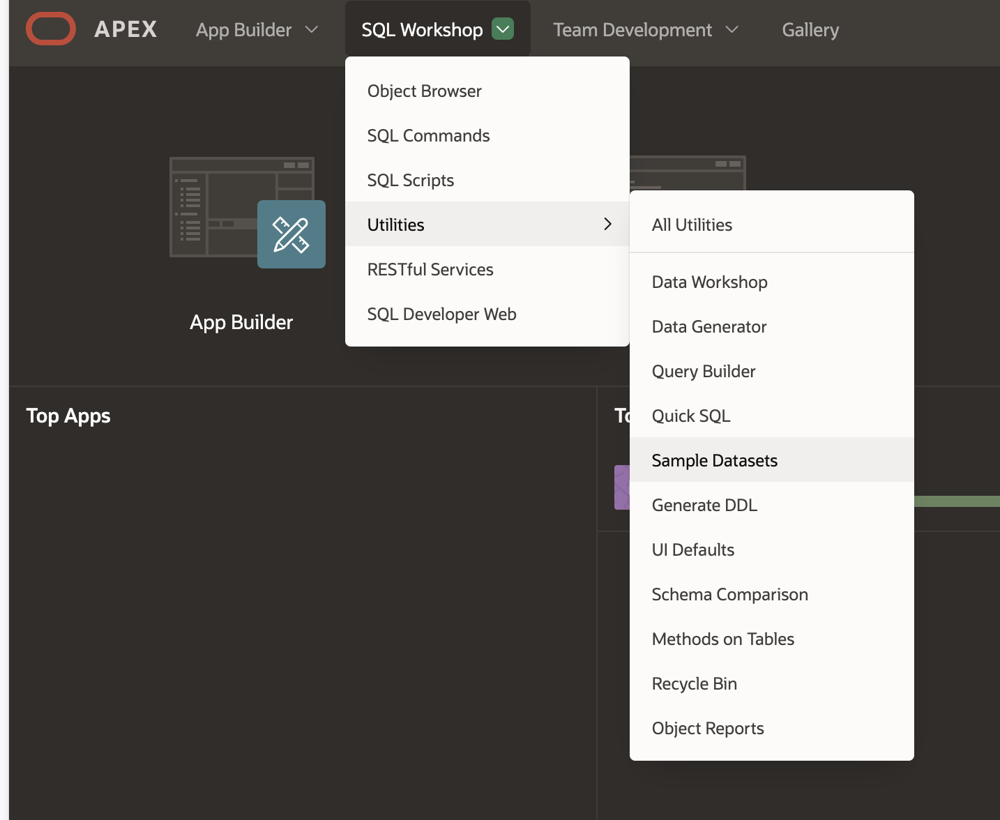


4. Find the Countries row, click the install button and than click the install dataset button.
    
    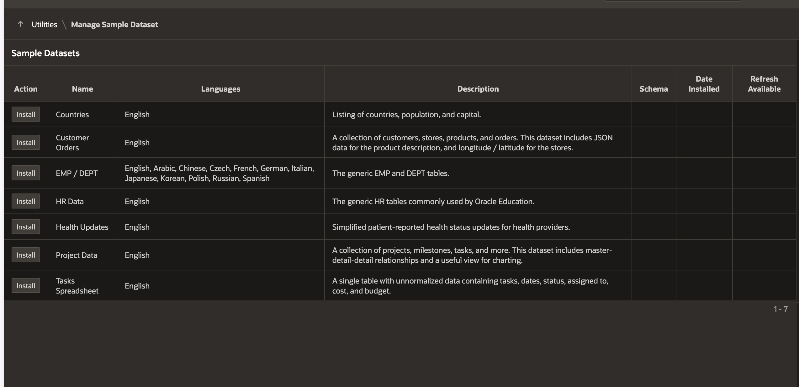
    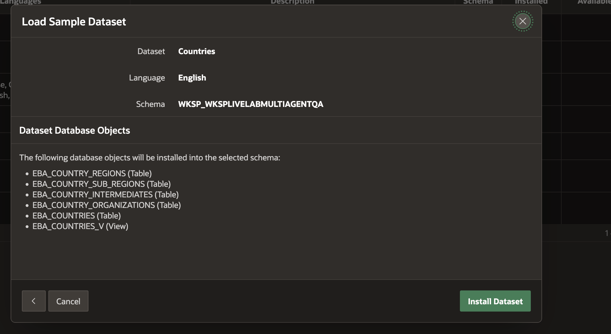

5. After the sample dataset installs, the Countries install button should now be an Update button.
    
    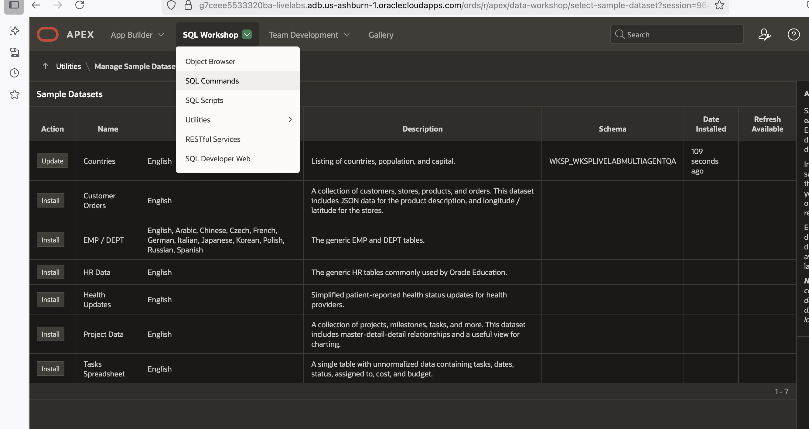

## Task 3: Import prebuilt APEX Application

1. From the workspace home screen click the App Builder button.

    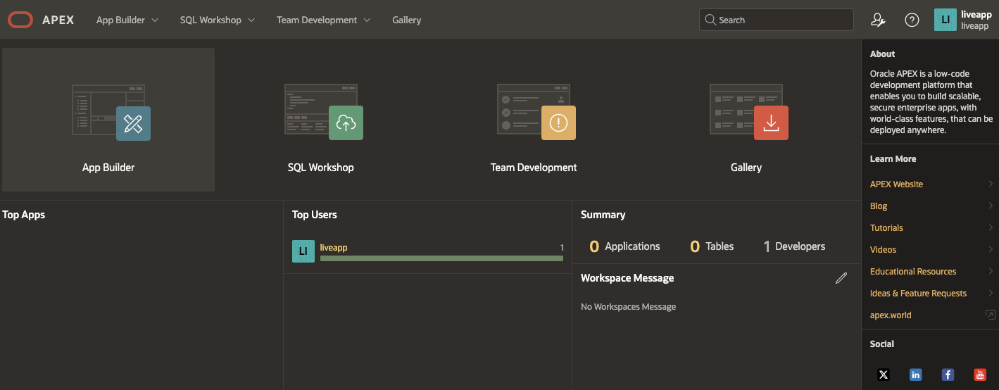

3. Click the import button.

    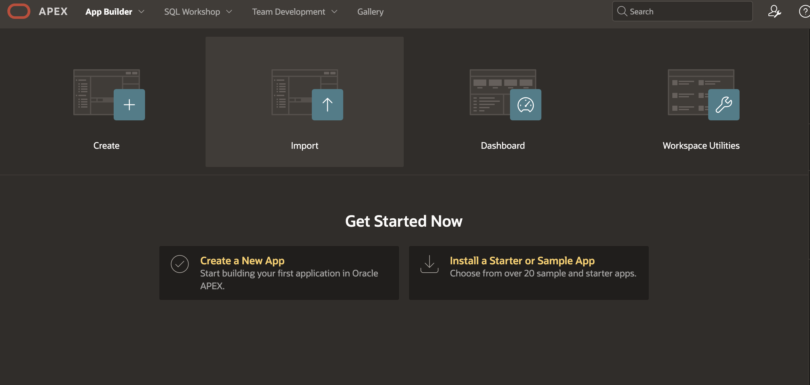

4. Import the prebuilt APEX app from task 1.

    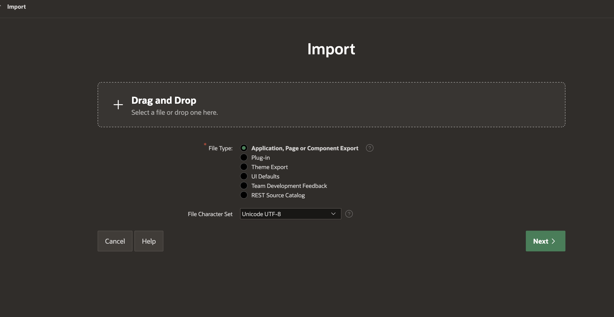
    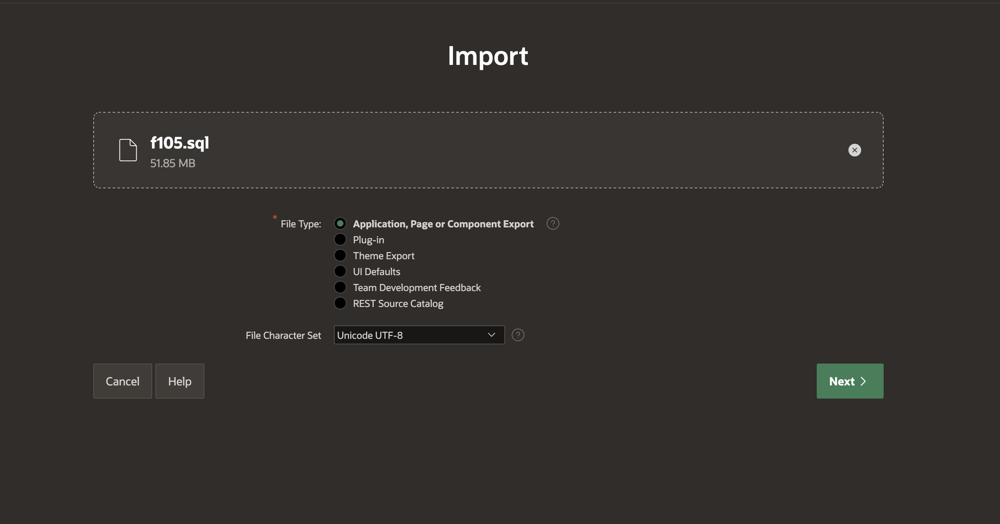

5. Click the next button.

  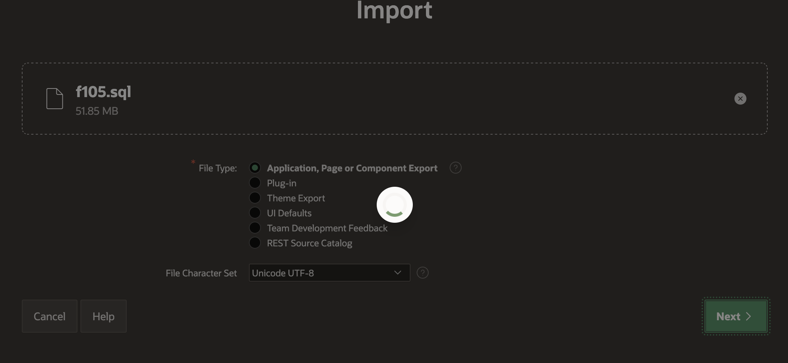
 
6. Click the install supporting objects button.

  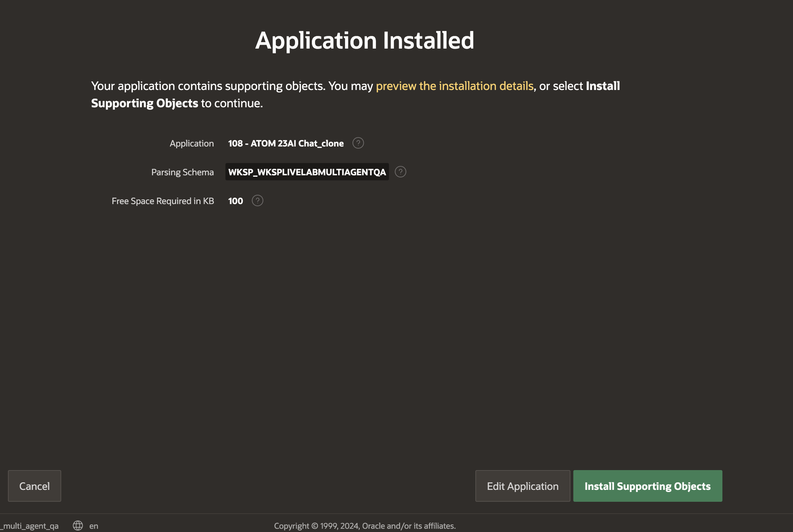
  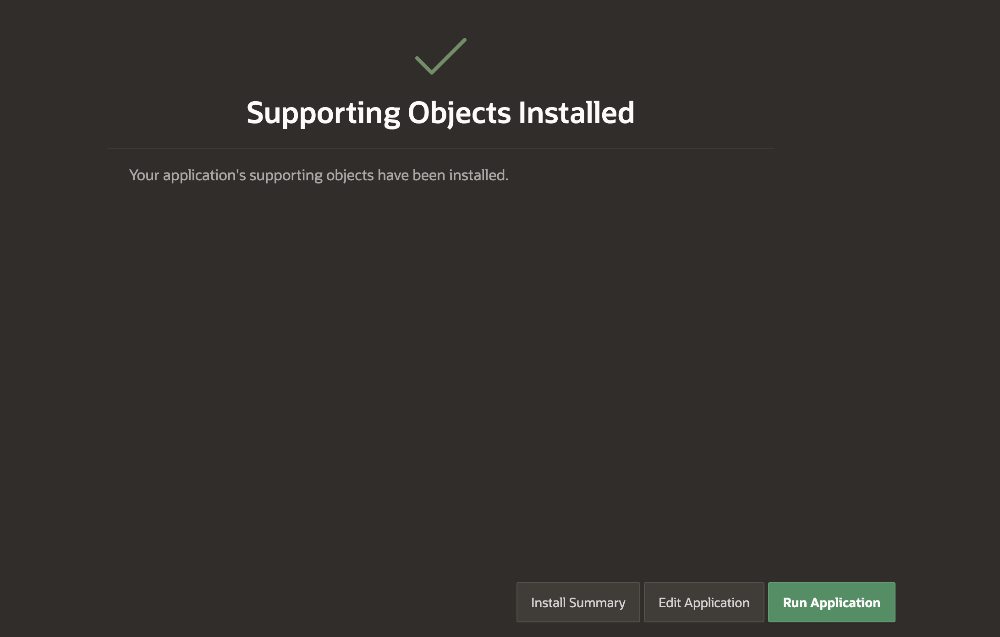


## Task 4: Install PL/SQL for APEX Chatbot app


1. Open SQL Commands, from SQL Workshop drop down.


  

2. Copy SQL below to load tool table.

    Paste the PL/SQL:

    ```text
        <copy>
        INSERT INTO ADB_CHAT_TOOL (ID, TOOL_NAME, TOOL_DESCRIPTION)
            SELECT 1, 'OCI Object Storage','Vectorized PDF Files of ERP Cloud Country Data Sheets. Holds information about ERP Cloud features for different countries.'
        UNION SELECT 2, 'Database','database of countries with a column for Proprietary Information.'
        UNION SELECT 3, 'Large Language Model','Large Language Model LLM'
        UNION SELECT 4, 'Meteo Weather API','Weather API that will return weather in JSON format for given location'

        </copy>
    ```
  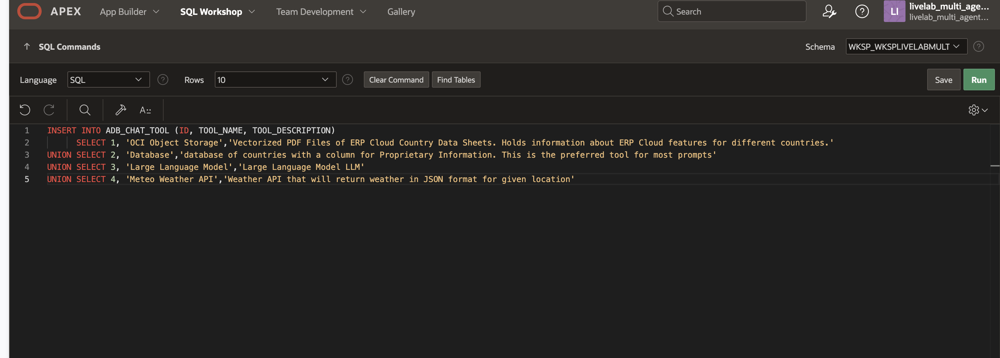

3. Copy SQL below to create OCI Credentials, use credentials created in Lab 1, Task 1.

    Paste the PL/SQL:

    ```text
        <copy>
            BEGIN                                                                         
            DBMS_CLOUD.CREATE_CREDENTIAL(                                               
                credential_name => 'APEX_GENAI_CRED',                                          
                user_ocid       => '<UPDATE HERE>',
                tenancy_ocid    => '<UPDATE HERE>',
                private_key     => '<UPDATE HERE>',
                fingerprint     => '<UPDATE HERE>'
            );
            END;
        </copy>
    ```
  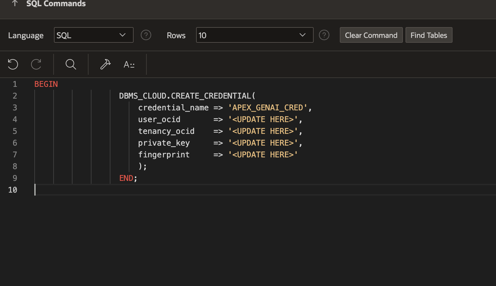

4. Copy the SQL below to add the PROPRIETARY column to the EBA_COUNTRIES TABLE, be sure to update for your schema name.

    Paste the PL/SQL:

    ```text
        <copy>
        alter table "<UPDATE HERE>"."EBA_COUNTRIES" add
        ("PROPRIETARY" VARCHAR2(1000));
        </copy>
    ```

    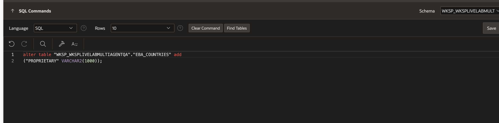

5. Copy the SQL below to add comments on PROPRIETARY column, be sure to update for your schema name.

    Paste the PL/SQL:

    ```text
        <copy>
        comment on column "<UPDATE HERE>"."EBA_COUNTRIES"."PROPRIETARY"
        is 'This columns is private info we have on the country it is proprietary information.';
        </copy>
    ```

     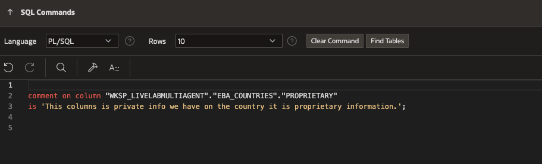

6. Copy the SQL below to update values for specific rows in the EBA_COUNTRIES table.

    Paste the PL/SQL:

    ```text
        <copy>
            BEGIN

            UPDATE EBA_COUNTRIES
            SET PROPRIETARY = 'A treasure is buried here'
            WHERE NAME = 'Iceland';

            UPDATE EBA_COUNTRIES
            SET PROPRIETARY = 'a map for the treasure is hidden here'
            WHERE NAME = 'Peru';

            END;
        </copy>
    ```

     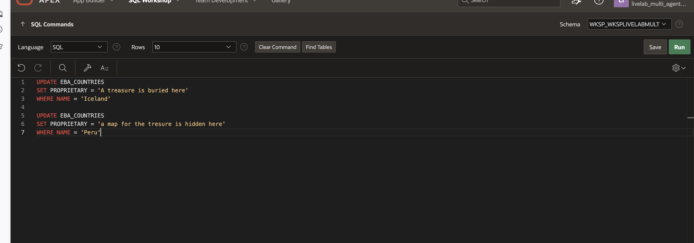

7.  Create profile for LLM, RAG, NL2SQL and Vector Index, be sure to update for the workspace schema name (where it says UPDATE HERE).

    Paste the PL/SQL:

    ```text
        <copy>
        BEGIN        
                                                                 
        DBMS_CLOUD_AI.CREATE_PROFILE(                                              
        profile_name =>'GENAI',                                                             
        attributes   =>'{
                        "provider": "oci",                                                                   
                        "credential_name": "APEX_GENAI_CRED"
                        }');                                                                  
                                                                    
        DBMS_CLOUD_AI.CREATE_PROFILE(                                              
        profile_name =>'GENAI_SQL_APEX',                                                             
        attributes   =>'{
                        "provider": "oci",                                                                   
                        "credential_name": "APEX_GENAI_CRED",
                        "object_list": [{"owner": "<UPDATE HERE>", "name": "EBA_COUNTRIES"}],
                        "enforce_object_list": "true",
                        "comments": "true"
                        }');                                                                  
                                                                 
        DBMS_CLOUD_AI.CREATE_PROFILE(                                              
        profile_name =>'GENAI_VECTOR_APEX',                                                             
        attributes   =>'{
                        "provider": "oci",                                                                   
                        "credential_name": "APEX_GENAI_CRED",
                        "vector_index_name": "ERP_FEATURES_COUNTRY"
                        }');                                                                  

        DBMS_CLOUD_AI.CREATE_VECTOR_INDEX(
            index_name  => 'ERP_FEATURES_COUNTRY',
            attributes  => '{"vector_db_provider": "oracle",
                            "location": "https://objectstorage.us-chicago-1.oraclecloud.com/n/idb6enfdcxbl/b/Livelabs/o/apex-chatbot-multi-tool-livelab/",
                            "profile_name": "GENAI_VECTOR_APEX",
                            "vector_table_name":"ERP_FEATURES_COUNTRY_VECTOR",
                            "vector_distance_metric": "cosine"
                        }'
            );     
        END;
        </copy>
    ```

     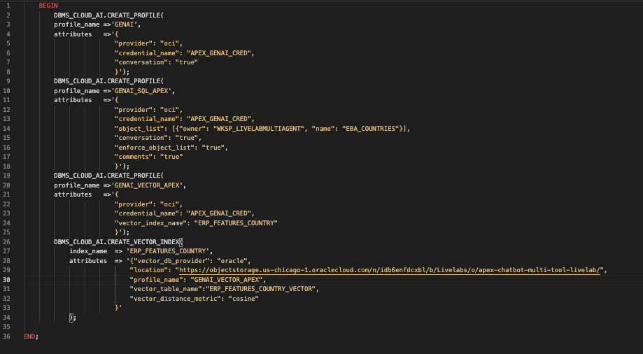

## Acknowledgements


* **Author**
    * **Jadd Jennings**, Principal Cloud Architect, NACIE

* **Contributors**


* **Last Updated By/Date**
    * **Jadd Jennings**, Principal Cloud Architect, NACIE, June 2025