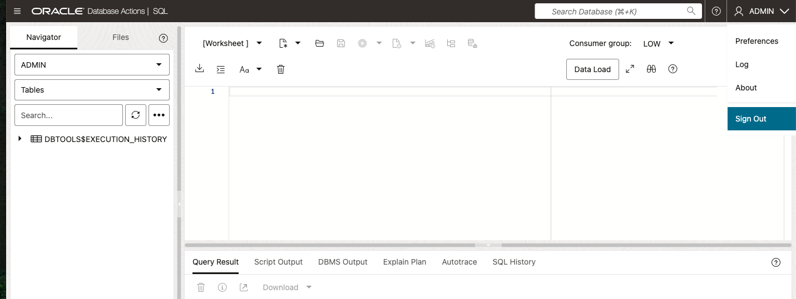
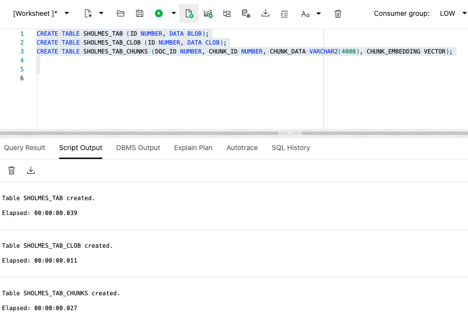

# Generate Data for Graph

## Introduction

This lab walks you through the steps to generate data for a property graph. First you will grant the graph user necessary privileges for the workshop. Next you will load the sample data, ONNX Embedding Models into the database and use the models to vectorize the text into chunks. Also, you will create PL/SQL stored procedures and functions to generate SQL from text using LLM. Finally you will a create DBMS Scheduler job to generate the SQL for each text chunk using a few shot prompt.

Estimated Time: 60 minutes
 

### Objectives

 

In this lab, you will:
* Grant user created in previous lab necessary privileges to finish workshop
* Load textual data into database
* Vectorize the textual data into chunks
* Create PL/SQL procedures/functions to generate SQL from chunks
* Create DBMS Scheduler Job to Generate SQL for each chunk

### Prerequisites (Optional)


This lab assumes you have:
* An Oracle Cloud account
* All previous labs successfully completed


 
## Task 1: Load sample data and ONNX Models for Graph user


1. Open the service detail page for your Autonomous Database instance in the OCI console.  

   Then click on **Database Actions** and select **SQL**. 

   

2. Make sure to be logged in as Admin and execute the seven SQL statements below to grant the necessary roles for the user created in Lab 1 and be sure the correct user name is referenced similar to screenshot.
 
    Paste the PL/SQL:

    ```text
        <copy>
  
            GRANT EXECUTE ON DBMS_CLOUD TO <USERNAME HERE>;
            GRANT EXECUTE ON DBMS_CLOUD_PIPELINE TO <USERNAME HERE>;
            GRANT EXECUTE ON DBMS_CLOUD_AI TO <USERNAME HERE>;
        </copy>
    ```

   

3. Sign out of SQL Developer and sign back into SQL Developer as the graph user (user created in Lab 1)

    

    

4. Execute the SQL below to create a directory, download an onnx embedding model, load in the schema and download text sample data.
  
    Paste the PL/SQL:
    
      ```text
      <copy>
            /**Create directory to hold onnx model and text later on**/
            CREATE OR REPLACE DIRECTORY GRAPHDIR as 'scratch/';

            BEGIN
            /** download onnx model from object storage bucket**/    
            DBMS_CLOUD.GET_OBJECT(
            object_uri => 'https://objectstorage.us-chicago-1.oraclecloud.com/n/idb6enfdcxbl/b/Livelabs/o/onnx-embedding-models/tinybert.onnx',
            directory_name => 'GRAPHDIR');

            /** load onnx model into schema**/    
            DBMS_VECTOR.LOAD_ONNX_MODEL(
                'GRAPHDIR',
                'tinybert.onnx',
                'TINYBERT_MODEL',
                json('{"function":"embedding","embeddingOutput":"embedding","input":{"input":["DATA"]}}')
              );

            /** load sample data **/
            DBMS_CLOUD.GET_OBJECT(
            object_uri => 'https://objectstorage.us-chicago-1.oraclecloud.com/n/idb6enfdcxbl/b/Livelabs/o/sample-data/blue.txt',
            directory_name => 'GRAPHDIR');
     
            END;
            /
    </copy>
    ```

  

5. Create cloud credentials and an AI Profile for Graph User. Type the following sql code in the worksheet area and update with API Key configurations in four places. Update for user_ocid, tenancy_ocid, private_key, and fingerprint. Each value can be found in Lab 1, Task 2, Steps 3/4. Click the run script button and check the script output to make sure it completed successfully.
        

    Paste the PL/SQL:

    ```text
        <copy>
                  BEGIN                                                                         
                  DBMS_CLOUD.CREATE_CREDENTIAL(                                               
                      credential_name => 'GENAI_GRAPH_CRED',                                          
                      user_ocid       => '<UPDATE HERE>',
                      tenancy_ocid    => '<UPDATE HERE>',
                      private_key     => '<UPDATE HERE>',
                      fingerprint     => '<UPDATE HERE>'
                      );
                  END;
        </copy>
    ```

    

6. Clear the worksheet area and run the script below. 

    Paste the PL/SQL:

    ```text
        <copy>
                BEGIN                                                                        
                  DBMS_CLOUD_AI.CREATE_PROFILE(                                              
                      profile_name =>'GENAI_GRAPH',                                                             
                      attributes   =>'{"provider": "oci",                                                                   
                        "credential_name": "GENAI_GRAPH_CRED",
                        "conversation" : "true"
                      }');                                                                  
                END;
        </copy>
    ```

     


  7.  Optional, run SQL query to make sure the appropriate files exist (tinybert.onnx, blue.txt).


      Paste the PL/SQL:

      ```text
      <copy>
                SELECT * FROM DBMS_CLOUD.LIST_FILES('GRAPHDIR');
      </copy>
      ```
    
  

## Task 2: Vectorize sample data into chunks


  1. Create 3 tables to be used in vectorization process, make sure each table gets created.

      Paste the PL/SQL:

      ```text
      <copy>
          DROP TABLE IF EXISTS SHOLMES_TAB; 
          CREATE TABLE SHOLMES_TAB (ID NUMBER, DATA BLOB);
          DROP TABLE IF EXISTS SHOLMES_TAB_CLOB; 
          CREATE TABLE SHOLMES_TAB_CLOB(ID NUMBER, DATA CLOB);
          DROP TABLE IF EXISTS SHOLMES_TAB_CHUNKS; 
          CREATE TABLE SHOLMES_TAB_CHUNKS (DOC_ID NUMBER, CHUNK_ID NUMBER, CHUNK_DATA VARCHAR2(4000), CHUNK_EMBEDDING VECTOR);
      </copy>
      ```

  

  2. Run PL/SQL below to create the vector chunks.


      Paste the PL/SQL:

      ```text
      <copy>
            INSERT INTO SHOLMES_TAB VALUES(1, TO_BLOB(BFILENAME('GRAPHDIR', 'BLUE.TXT')));
            INSERT INTO SHOLMES_TAB_CLOB SELECT ID, TO_CLOB(DATA) FROM SHOLMES_TAB;
            INSERT INTO SHOLMES_TAB_CHUNKS
            SELECT DT.ID DOC_ID, ET.EMBED_ID CHUNK_ID, ET.EMBED_DATA CHUNK_DATA, TO_VECTOR(ET.EMBED_VECTOR) CHUNK_EMBEDDING 
            FROM
                 SHOLMES_TAB_CLOB DT
                ,DBMS_VECTOR_CHAIN.UTL_TO_EMBEDDINGS(
                                                    DBMS_VECTOR_CHAIN.UTL_TO_CHUNKS(DBMS_VECTOR_CHAIN.UTL_TO_TEXT(DT.DATA)
                                                                                    ,json('{"split":"sentence","normalize":"all"}')
                                                                                    )
                                                    ,json('{"provider":"database", "model":"tinybert_model"}')
                                                    )T
                ,JSON_TABLE(
                              T.COLUMN_VALUE
                            ,'$[*]' COLUMNS (EMBED_ID NUMBER PATH '$.embed_id'
                                            ,EMBED_DATA VARCHAR2(4000) PATH '$.embed_data'
                                            ,EMBED_VECTOR CLOB PATH '$.embed_vector')
                            ) ET;
                COMMIT;
      </copy>
      ```

  

  3. Test that all the previous steps worked by running a vector search on the sample data.

      Paste the PL/SQL:

      ```text
      <copy>
            SELECT doc_id, chunk_id, chunk_data
            FROM sholmes_tab_chunks
            ORDER BY vector_distance(chunk_embedding , vector_embedding(TINYBERT_MODEL using 'Who stole the blue carbuncle?' as data), COSINE)
            FETCH FIRST 20 ROWS ONLY;
      </copy>
      ```

  

## Task 3: Send chunks to LLM with DBMS_Scheduler job

  1.  Create PL/SQL function that generates SQL based on prompt question with chunk of text sample data.

      Paste the PL/SQL:

      ```text
      <copy>
            CREATE OR REPLACE FUNCTION extract_graph (text_chunk CLOB) RETURN CLOB IS
            BEGIN
            RETURN DBMS_CLOUD_AI.GENERATE(prompt => '
            You are a top-tier algorithm designed for extracting information in structured formats to build a knowledge graph.
            Your task is to identify the entities and relations requested with the user prompt from a given text.
            You must generate the output in a JSON format containing a list with JSON objects.
            Each object should have the keys: "head", "head_type", "relation", "tail", and "tail_type".
            The "head" key must contain the text of the extracted entity with one of the types from the provided list in the
            user prompt.\n
            Attempt to extract as many entities and relations as you can. Maintain Entity Consistency: When extracting
            entities, it''s vital to ensure consistency.
            If an entity, such as "John Doe", is mentioned multiple times in the text but is referred to by different names
            or pronouns (e.g., "Joe", "he"), always use the most complete identifier for that entity.
            The knowledge graph should be coherent and easily understandable, so maintaining consistency in entity references
            is crucial.\n
            IMPORTANT NOTES:\n
            - Don''t add any explanation and text.
            The output should be formatted as a JSON instance that conforms to the JSON schema below.\n\n
            As an example, for the schema {"properties": {"foo": {"title": "Foo", "description": "a list of strings", "type":
            "array", "items": {"type": "string"}}}, "required": ["foo"]}\n
            the object {"foo": ["bar", "baz"]} is a well-formatted instance of the schema. The object {"properties": {"foo":
            ["bar", "baz"]}} is not well-formatted.\n\n
            Here is the output schema:\n\n
            {"properties":
            {"head": {"description": "extracted head entity like Oracle, Apple, John. Must use human-readable unique
            identifier.", "title": "Head", "type": "string"},
            "head_type": {"description": "type of the extracted head entity like Person, Company, etc", "title": "Head
            Type", "type": "string"},
            "relation": {"description": "relation between the head and the tail entities", "title": "Relation", "type":
            "string"},
            "tail": {"description": "extracted tail entity like Oracle, Apple, John. Must use human-readable unique
            identifier.", "title": "Tail", "type": "string"},
            "tail_type": {"description": "type of the extracted tail entity like Person, Company, etc", "title": "Tail
            Type", "type": "string"}},
            "required": ["head", "head_type", "relation", "tail", "tail_type"]
            }\n
            Examples:
            [{"text": "Adam is a software engineer in Oracle since 2009, and last year he got an award as the Best Talent",
            "head": "Adam",
            "head_type": "Person",
            "relation": "WORKS_FOR",
            "tail": "Oracle",
            "tail_type": "Company"},
            {"text": "Adam is a software engineer in Oracle since 2009, and last year he got an award as the Best Talent",
            "head": "Adam",
            "head_type": "Person",
            "relation": "HAS_AWARD",
            "tail": "Best Talent",
            "tail_type": "Award"},
            {"text": "Microsoft is a tech company that provide several products such as Microsoft Word",
            "head": "Microsoft Word",
            "head_type": "Product",
            "relation": "PRODUCED_BY",
            "tail": "Microsoft",
            "tail_type": "Company"},
            {"text": "Microsoft Word is a lightweight app that accessible offline",
            "head": "Microsoft Word",
            "head_type": "Product",
            "relation": "HAS_CHARACTERISTIC",
            "tail": "lightweight app",
            "tail_type": "Characteristic"},
            {"text": "Microsoft Word is a lightweight app that accessible offline",
            "head": "Microsoft Word",
            "head_type": "Product",
            "relation": "HAS_CHARACTERISTIC",
            "tail": "accessible offline",
            "tail_type": "Characteristic"}]
            Input text:\n\n' || text_chunk,
            profile_name => 'GENAI_GRAPH',
            action => 'chat'
            );
            END;  
      </copy>
      ```

  

  2.  Use PL/SQL to create staging table and stored procedure. The stored procedure will call the function and load results into the table.

      Paste the PL/SQL:

      ```text
      <copy>
            DROP TABLE IF EXISTS GRAPH_EXTRACTION_STAGING; 
            CREATE TABLE GRAPH_EXTRACTION_STAGING(CHUNK_ID NUMBER, RESPONSE CLOB);
            CREATE OR REPLACE PROCEDURE "LOAD_EXTRACT_TABLE" 
            AS
            BEGIN
            DECLARE
              x NUMBER := 0;
            BEGIN

              --Loop thru chunks that have not been added to the staging table but only 10 times
              FOR text_chunk IN (SELECT c.chunk_id, c.chunk_data 
                                FROM  sholmes_tab_chunks c 
                                LEFT JOIN  GRAPH_EXTRACTION_STAGING S ON S.CHUNK_ID  = c.chunk_id
                                WHERE s.chunk_id IS NULL AND
                                c.CHUNK_ID > 0 AND c.CHUNK_ID <= 1000
                                ORDER BY c.CHUNK_ID)
              LOOP
                  x := x + 1;
                  --Execute function to send prompt to Gen AI and Insert response into staging table
                  INSERT INTO  GRAPH_EXTRACTION_STAGING (CHUNK_ID, RESPONSE)
                  SELECT text_chunk.chunk_id, extract_graph(text_chunk.chunk_data) as response FROM dual;
                  EXIT  WHEN X > 10;
              END LOOP;
              END;
            END;
            /
      </copy>
      ```

  

  3.  Use PL/SQL to create a DBMS_SCHEDULER job that will execute the previously created stored procedure in the background every 2 minutes. Once PL/SQL job is enabled it will keep running until all chunks of text are processed, this should take about 30 mins. See next step to check progress.

      Paste the PL/SQL:

      ```text
      <copy>  
              BEGIN
                SYS.DBMS_SCHEDULER.CREATE_JOB ( 
                          job_name => 'runExtractStagingStoredProcedure',
                          job_type => 'STORED_PROCEDURE',
                          job_action => 'LOAD_EXTRACT_TABLE'
                      ); 
            END;
            /
            DECLARE 
                Startjob TIMESTAMP;
                endjob TIMESTAMP;
            BEGIN 
              Startjob := CURRENT_TIMESTAMP;
              endjob := Startjob + 1/24;

              SYS.DBMS_SCHEDULER.SET_ATTRIBUTE( 
                    name => 'runExtractStagingStoredProcedure',
                    attribute => 'START_DATE',
                    value => Startjob
                );
              SYS.DBMS_SCHEDULER.SET_ATTRIBUTE( 
                    name => 'runExtractStagingStoredProcedure',
                    attribute => 'REPEAT_INTERVAL',
                    value => 'FREQ=MINUTELY; INTERVAL=2'
                );
              SYS.DBMS_SCHEDULER.SET_ATTRIBUTE( 
                    name => 'runExtractStagingStoredProcedure',
                    attribute => 'END_DATE',
                    value => endjob
                );

              SYS.DBMS_SCHEDULER.enable(name => 'runExtractStagingStoredProcedure'); 
            END;
            /
      </copy>
      ```      

  


  4.  Execute the PL/SQL to check how many chunks of text need to be processed, make sure the number returned is zero before proceeding to the next lab.

      Paste the PL/SQL:

      ```text
      <copy>  
              SELECT count(*)  AS "Chunks of Text to Send"
              FROM  sholmes_tab_chunks c 
              LEFT JOIN  GRAPH_EXTRACTION_STAGING S ON S.CHUNK_ID  = c.chunk_id
              WHERE s.chunk_id IS NULL
      </copy>
      ```      


## Acknowledgements


* **Author**
    * **Jadd Jennings**, Principal Cloud Architect, NACIE

* **Contributors**
    * **Melliyal Annamalai**,  Distinguished Product Manager
    * **Eduard Cuba**,  Senior Member of Technical Staff


* **Last Updated By/Date**
    * **Jadd Jennings**, Principal Cloud Architect, NACIE, May 2025