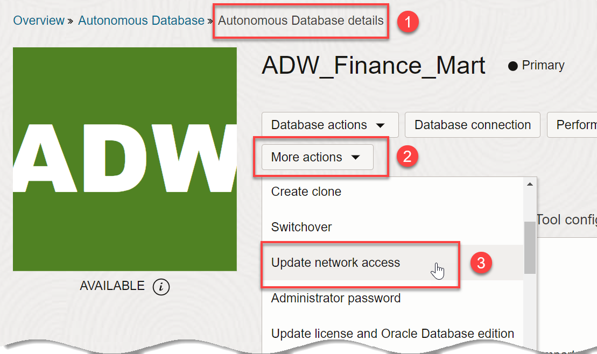

# Public and Private Network Access in Autonomous Database

## Introduction

This lab reviews the 3 options for configuring secure network access to your Oracle Autonomous Database, focusing on how to easily choose the option that restricts access to a private endpoint within an OCI VCN.

When you provisioned your autonomous database at the beginning of this workshop, you chose from the 3 options for configuring secure network access to your Oracle Autonomous Database:
* Secure access from everywhere
* Secure access from allowed IPs and VCNs only
* Private endpoint access only

### **Secure access from everywhere**
In the provisioning lab, you were instructed to choose the default option, **Secure access from everywhere**. This option allows users who have your database credentials to access the database from the public or private internet.

### **Secure access from allowed IPs and VCNs only**
This second option limits access by using **access control lists (ACLs)**. Specifying an access control list blocks all IP addresses that are not in the ACL list from accessing the database. After you specify an access control list, the Autonomous Database only accepts connections from addresses on the access control list and the database rejects all other client connections.

### **Private endpoint access only**
This third option is the focus of this lab.

You can specify that Autonomous Database uses a private endpoint inside your Virtual Cloud Network (VCN) in your tenancy. You can configure a private endpoint during provisioning or during cloning of your Autonomous Database, or you can switch to using a private endpoint in an existing database that uses a public endpoint. This allows you to keep all traffic to and from your database off of the public internet.

Specifying the virtual cloud network configuration allows traffic only from the virtual cloud network you specify and blocks access to the database from all public IPs or VCNs. This allows you to define security rules with Security Lists or at the Network Security Group (NSG) level to specify ingress/egress for your Autonomous Database instance. Using a private endpoint and defining Security Lists or NSGs allows you to control traffic to and from your Autonomous Database instance.

> **Note**: For simplicity, this lab uses the `ADMIN` user you created when provisioning your autonomous database. In an actual workplace environment, you will need to create a user group and add an Oracle Cloud account to the group, and define an IAM policy for the group to enable adding a private endpoint. When you configure private endpoints at your workplace, see the documentation [Configure network access with private endpoints](https://docs.oracle.com/en/cloud/paas/autonomous-database/adbsa/private-endpoints-autonomous.html#GUID-60FE6BFD-B05C-4C97-8B4A-83285F31D575).

You can perform this lab in Oracle's free tier with trial credits, in your own tenancy using a paid Oracle Cloud account, or in an Oracle-provided environment, such as LiveLabs.

Estimated Lab Time: 10 minutes

### Objectives

In this lab, you will:

- Change the network access of your existing Autonomous Database to private endpoint access only
- Prove that the Autonomous Database can no longer be accessed from a public IP address

### Prerequisites

This lab assumes you have:

- Obtained an Oracle Cloud account and signed in to the Oracle Cloud Infrastructure Console at `https://cloud.oracle.com`
- Performed the previous lab on provisioning an Oracle Autonomous Database

## Task 1: Change the network access to private endpoint access only
In the provisioning lab, you chose the default option, **Secure access from everywhere**. Now you will see how to restrict access to your autonomous database using the **Private endpoint access only** option.

1. Go back to your database's **Autonomous Database details** page. From the **More actions** drop-down list, select **Update network access**.

    

2. In the **Update network access** dialog, select **Private endpoint access only**. This expands the Virtual cloud network private access configuration area. When you select Private endpoint access only, this only allows connections from the specified private network (VCN), from peered VCNs, and from on-prem networks connected to your VCN.

    

3. If you had access to a virtual cloud network, you would select the virtual cloud network and optionally a subnet. Click **Show advanced options**. You can optionally enter a custom **Private IP address**. You can optionally enter a **Hostname prefix**. **Network Security Groups** (NSGs) allow you to optionally control inbound and outbound traffic.

    

4. You would then click **Update** and wait for the update to finish.

## Task 2: Test that the private endpoint restricts access

1. If you had changed your database's access type from **Secure access from everywhere** to **Private endpoint access only**, you would be able to go back to the SQL Developer connection that you defined in Lab 3, Task 4 and attempt to connect. Connection would fail now that you have restricted access only to a private endpoint, without having configured a private endpoint.

    

2. To learn how to configure network access with private endpoints, see the documentation link in the **Want to Learn More?** section below. Here is a screenshot of a successful SQL Developer connection from a VM lying in the same virtual cloud network (VCN):

    

## Want to Learn More?

The following links provide documentation about configuring network access with access control lists (ACLs) and with private endpoints:

- [Configure network access with access control lists (ACLs)](https://docs.oracle.com/en/cloud/paas/autonomous-database/adbsa/access-control-rules-autonomous.html#GUID-483CD2B4-5898-4D27-B74E-6735C32CB58C)
- [Configure network access with private endpoints](https://docs.oracle.com/en/cloud/paas/autonomous-database/adbsa/private-endpoints-autonomous.html#GUID-60FE6BFD-B05C-4C97-8B4A-83285F31D575)

## Acknowledgements

- **Author** - Rick Green, Principal User Assistance Developer, Database Development
- **Last Updated By/Date** - Rick Green, August 2023
