# Provision an Oracle Autonomous Database (ADW and ATP)

## Introduction

This lab walks you through the steps to get started using the Oracle Autonomous Database (Autonomous Data Warehouse [ADW] and Autonomous Transaction Processing [ATP]) on Oracle Cloud. In this lab, you will provision a new ADW instance.

>**Note:** While this lab uses ADW, the steps are the same for creating an ATP database.

Estimated Time: 5 minutes

Watch the video below for a quick walk-through of the lab.
[Provision an ADB Instance](videohub:1_qgav6sr7)

### Objectives

In this lab, you will:

-   Learn how to provision a new Autonomous Database

### Prerequisites

- This lab requires completion of the Get Started section in the Contents menu on the left.

## Task 1: Choose ADW or ATP from the services menu

1. Log in to the Oracle Cloud.
2. Once you log in, the cloud services dashboard shows all the services available to you. Click the navigation menu in the upper left to show top level navigation choices.

    > **Note:** You can also directly access your Autonomous Data Warehouse or Autonomous Transaction Processing service in the **Launch resources** section of the dashboard.

    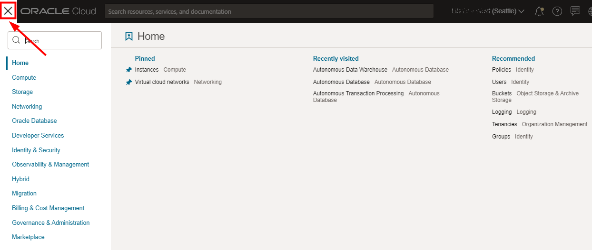
    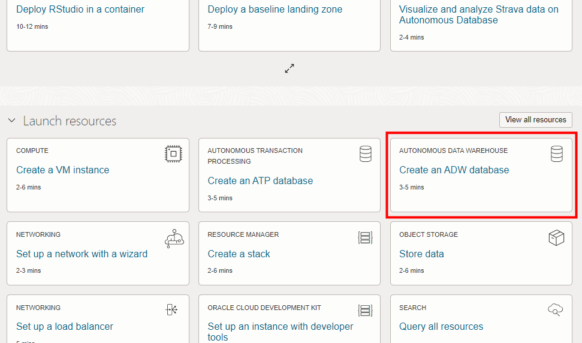

3. The following steps apply similarly to either Autonomous Data Warehouse or Autonomous Transaction Processing. This lab shows provisioning of an Autonomous Data Warehouse database, so click **Oracle Database**, then **Autonomous Data Warehouse**.

    

4. Make sure your Workload Type is __Data Warehouse__ or __All__ to see your Autonomous Data Warehouse instances. Use the __List Scope__ drop-down menu to select a compartment. If you are running the workshop using the Green Button (on a sandbox environment), find the compartment assigned to you shown on your *Reservation Information* page and go to that compartment. Enter the first part of your user name, for example `LL185` in the Search Compartments field to quickly locate your compartment.

    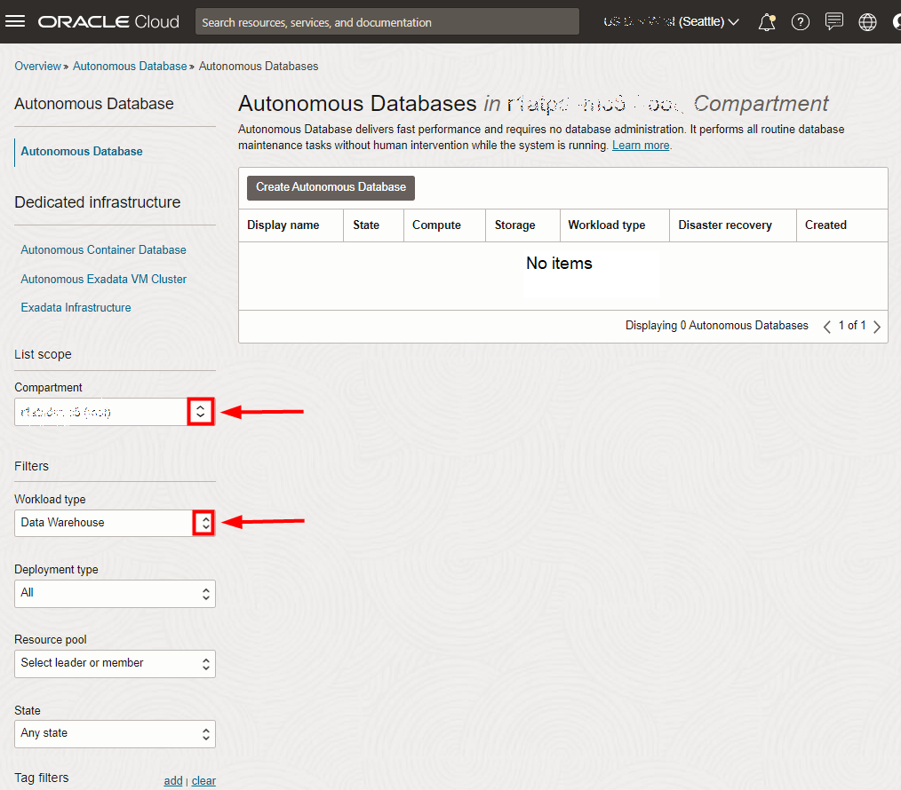

   > **Note:** Avoid the use of the `ManagedCompartmentforPaaS` compartment, as this is an Oracle default used for Oracle Platform Services.
   </if>

5. This console shows that no databases yet exist. If there were a long list of databases, you could filter the list by the **State** of the databases (Available, Stopped, Terminated). You can also sort by __Workload Type__. In this example, __Data Warehouse__ is the workload type.

    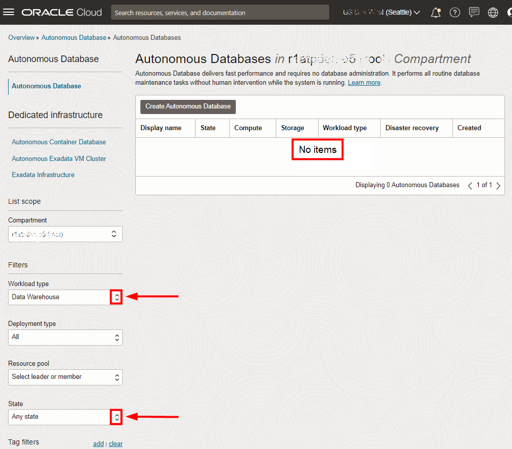

<if type="freetier">
6. If you are using a Free Trial or Always Free account, and you want to use Always Free Resources, you need to be in a region where Always Free Resources are available. You can see your current default **region** in the top, right hand corner of the page.

    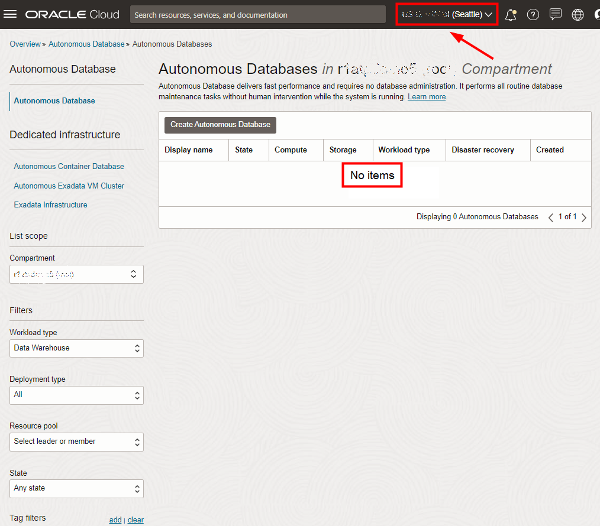
</if>

## Task 2: Create the Oracle Autonomous Database instance

1. Click **Create Autonomous Database** to start the instance creation process.

    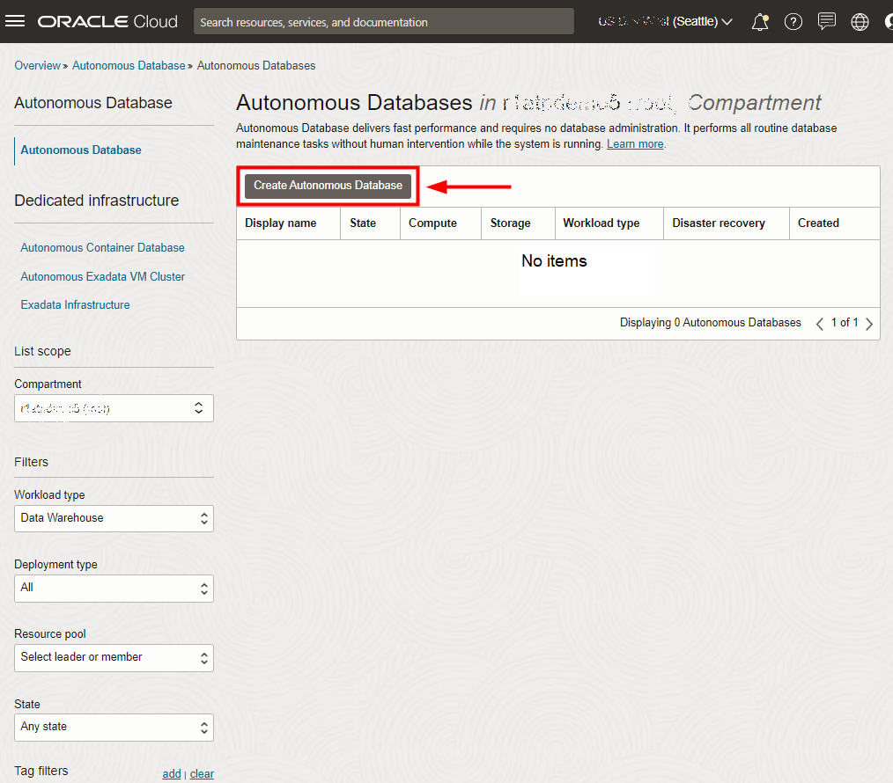

2.  This brings up the __Create Autonomous Database__ screen where you will specify the configuration of the instance.

    <if type="livelabs">
    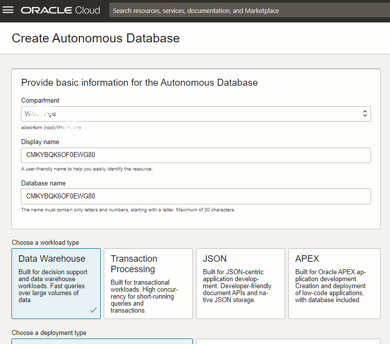
    </if>
    <if type="freetier">
    
    </if>

3. Specify basic information for the autonomous database:

    - __Compartment__ - Choose the compartment assigned to you.
    - __Display Name__ - Enter a memorable name for the database for display purposes. For example, use __ADW\_Finance\_Mart__. (Spaces are not supported.)
    - __Database Name__ - Use letters and numbers only, starting with a letter. Maximum length is 14 characters. (Spaces and underscores are not supported.)
    <if type="livelabs">For example, use __ADWFINANCE__ and **append your user id**. For example, if your user id is **LL-185**, then enter __ADWFINANCE185__
    </if><if type="freetier">For example, use __ADWFINANCE__.</if>

    <if type="livelabs">
    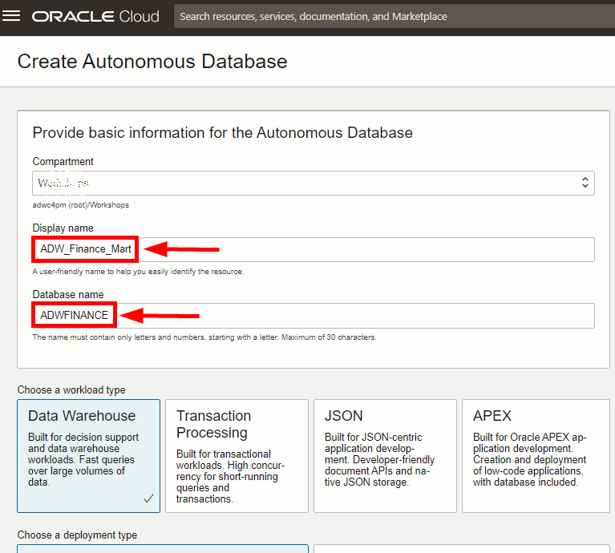
    </if>
    <if type="freetier">
    
    </if>

4. Choose a workload type. Select the workload type for your database from the choices:

    - __Data Warehouse__ - For this lab, choose __Data Warehouse__ as the workload type.
    - __Transaction Processing__ - Or, you could have chosen Transaction Processing as the workload type.

    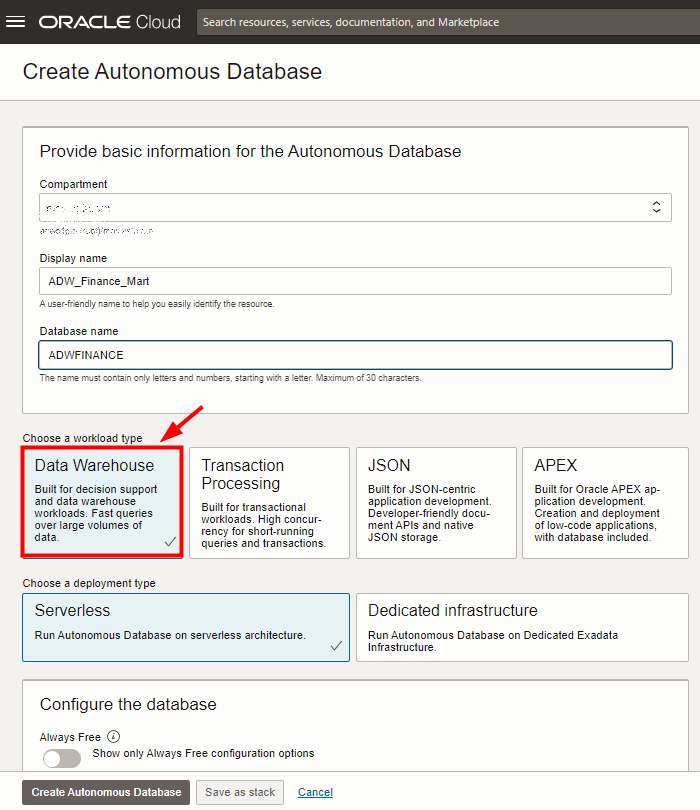

5. Choose a deployment type. Select the deployment type for your database from the choices:

    - __Serverless__ - For this lab, choose __Serverless__ as the deployment type.
    - __Dedicated Infrastructure__ - Or, you could have chosen Dedicated Infrastructure as the deployment type.

    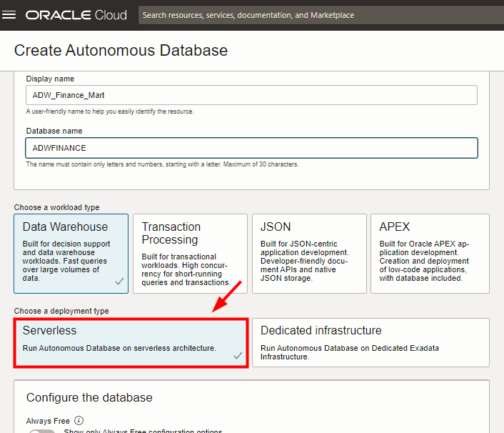

6. Configure the database:
    - __Always Free__ - If your Cloud Account is an Always Free account, or your Cloud Account is a paid account but want to avoid any charges, you can select this option to create an *Always Free autonomous database*. An always free database provides a maximum of 2 ECPUs and 20 GB of storage with Data Warehouse or Transaction Processing workloads. For this lab, we recommend you leave Always Free unchecked.
    - __Choose database version__ - Select a database version from the available versions.
    - __ECPU count__ - Number of CPUs for your service. For this lab, accept the default __2 ECPUs__. If you choose an Always Free database, it provisions always with 2 ECPUs.
    > **Note:** ECPU is the default compute model. If you need to use the legacy OCPU compute model, you can click **Show advanced options**, then click **Change compute model**. See [the documentation](https://docs.oracle.com/en-us/iaas/autonomous-database-serverless/doc/autonomous-compute-models.html) for more about the ECPU and OCPU compute models.

    - __Storage (TB)__ - Select your storage capacity in terabytes. For this lab, specify __1 TB__ of storage. Or, if you choose an Always Free database, it comes with 20 GB of storage.
    - __Compute auto scaling__ - For this lab, keep auto scaling enabled, to enable the system to automatically use up to three times more ECPUs and IO resources to meet workload demand.
    - __Storage auto scaling__ - For this lab, there is no need to enable storage auto scaling, which would allow the system to expand up to three times the reserved storage.

    > **Note:** You cannot scale up/down an Always Free autonomous database.

    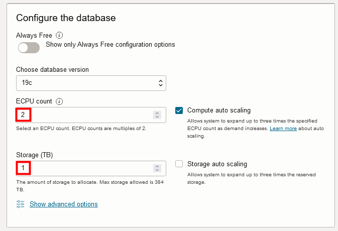

7. Backup retention:
    - __Backup retention__ - For this lab, accept the default 60 days.

    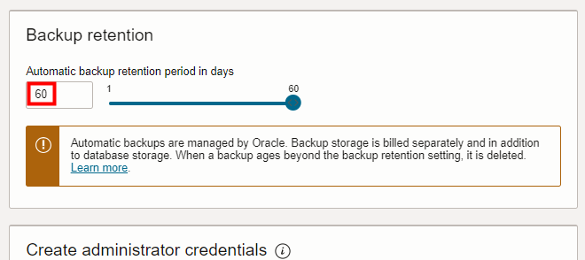

8. Create administrator credentials:

    - __Password and Confirm Password__ - Specify the password for ADMIN user of the service instance. The password must meet the following requirements:
    - The password must be between 12 and 30 characters long and must include at least one uppercase letter, one lowercase letter, and one numeric character.
    - The password cannot contain the username.
    - The password cannot contain the double quote (") character.
    - The password must be different from the last 4 passwords used.
    - The password must not be the same password that you set less than 24 hours ago.
    - Re-enter the password to confirm it. Make a note of this password.

    

9. Choose network access:
    - For this lab, accept the default, **Secure access from everywhere**.
    - If you want to allow traffic only from the IP addresses and VCNs you specify - where access to the database from all public IPs or VCNs is blocked, select **Secure access from allowed IPs and VCNs only** in the Choose network access area.
    - If you want to restrict access to a private endpoint within an OCI VCN, select **Private endpoint access only** in the Choose network access area.
    - If the **Require mutual TLS (mTLS) authentication** option is selected, mTLS will be required to authenticate connections to your Autonomous Database. TLS connections allow you to connect to your Autonomous Database without a wallet, if you use a JDBC thin driver with JDK8 or above. See the [documentation for network options](https://docs.oracle.com/en/cloud/paas/autonomous-database/adbsa/support-tls-mtls-authentication.html#GUID-3F3F1FA4-DD7D-4211-A1D3-A74ED35C0AF5) for options to allow TLS, or to require only mutual TLS (mTLS) authentication.

    

<if type="livelabs">
10. Choose a license type. For this lab, choose __Bring your own license (BYOL)__. The two license types are:
</if>
<if type="freetier">
10. Choose a license type. For this lab, accept the default __License included__. The two license types are:
</if>

    - __Bring your own license (BYOL)__ - Select this type when your organization has existing database licenses.
    - __License included__ - Select this type when you want to subscribe to new database software licenses and the database cloud service.

<if type="livelabs">
    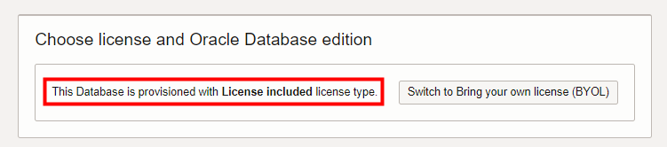
</if>
<if type="freetier">
    
</if>

11. For this lab, do not provide a contact email address. The **Contact Email** field allows you to list contacts to receive operational notices and announcements as well as unplanned maintenance notifications.

    

12. Click __Create Autonomous Database__. If you see an error *Authorization failed or requested resource not found*, it means you are not in the compartment assigned to you. To solve this error, refer to Task 1 -> Step 4 to choose the correct compartment assigned to you, as shown on your *Reservation Information* page.

    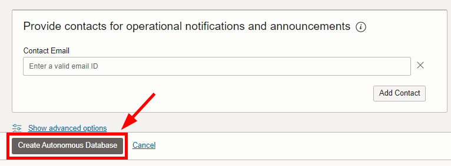

13.  Your instance will begin provisioning. In a few minutes, the state will turn from Provisioning to Available. At this point, your Autonomous Data Warehouse database is ready to use! Have a look at your instance's details here including its name, database version, ECPU count, and storage size.
    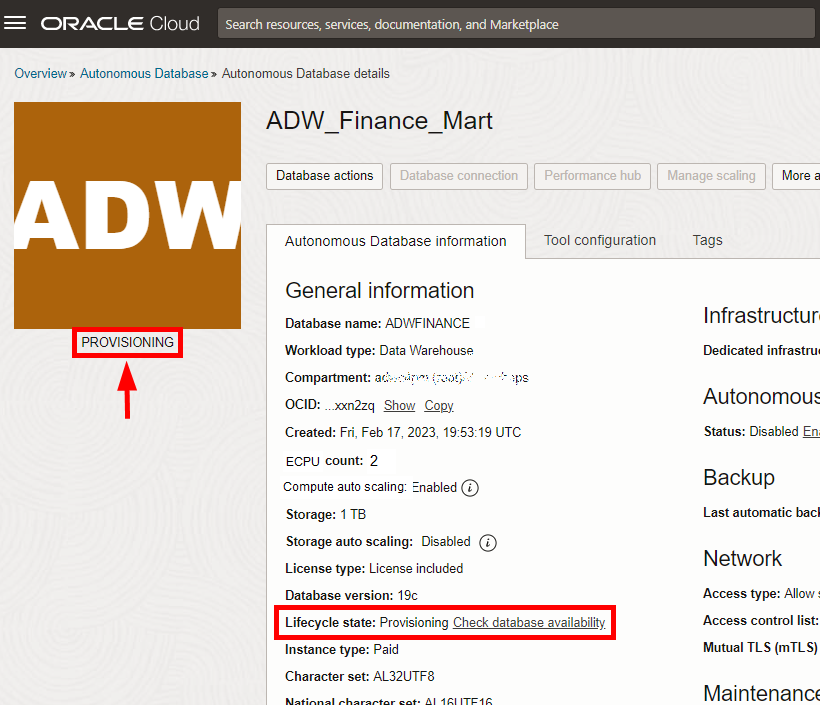

You may now **proceed to the next lab**.

## Learn more

* [Provision Autonomous Database](https://docs.oracle.com/en/cloud/paas/autonomous-database/serverless/adbsb/autonomous-provision.html#GUID-0B230036-0A05-4CA3-AF9D-97A255AE0C08)

## Acknowledgements

- **Author** - Nilay Panchal, Oracle Autonomous Database Product Management
- **Contributors** - Oracle LiveLabs QA Team
- **Last Updated By/Date** - Lauran K. Serhal, April 2024
