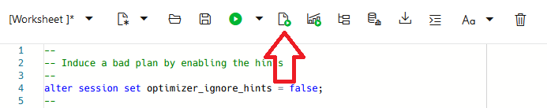
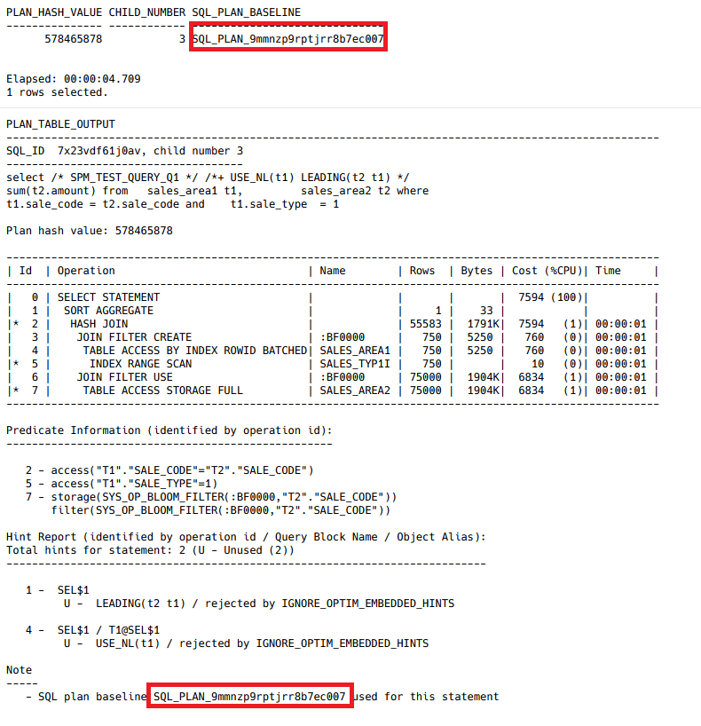
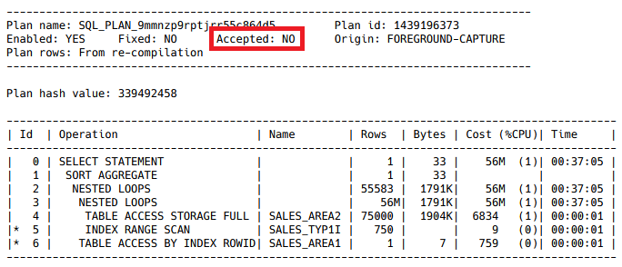

# Execute a Runaway Query Interrupted by DBRM

## Introduction

In this lab you will execute the application query again, but this time you will induce a SQL execution plan that will perform poorly. Database Resource Manager will be configured to terminate a long-running query, and real-time SPM will detect the plan performance regression and repair it using SQL plan baselines.

Estimated Time: 20mins

### Objectives
- Re-execute the application query with a poor plan, observe its interuption with DBRM, and note that real-time SPM repairs the performance regression.

### Prerequisites
This lab assumes you have completed the following:

- Provision an Autonomous Database Instance
- Create an Application Schema
- Execute an Application Query With a Good Plan
- Execute the Application Query, Inducing A Poor Plan
- Execute an Application Query With a Good Plan Again

## Task 1: Run the Application Query (Poor Performance)

1. Run the following query after asking Database Resource Manager to kill SQL taking longer than 15 seconds to execute. It  is *essential* that you use the script button (highlighted). In this case, the *alter session* command will enable the hints and they will induce a bad plan. 

    

    ```
	<copy>
    --
    -- For the sake of this experiment, we'll set the 
    -- maximum run time for a SQL statement to 15 seconds
    --
    BEGIN
        CS_RESOURCE_MANAGER.UPDATE_PLAN_DIRECTIVE(
            consumer_group => 'LOW', 
            elapsed_time_limit => 15);
    END;
    /
    -- 
    -- Induce the bad plan
    --
    alter session set optimizer_ignore_hints = false;
    --
    -- Run the query until it times out
    --
    select /* SPM_TEST_QUERY_Q1 */ /*+ USE_NL(t1) LEADING(t2 t1) */ sum(t2.amount)
    from   sales_area1 t1, 
           sales_area2 t2
    where  t1.sale_code = t2.sale_code
    and    t1.sale_type  = 1;
	</copy>
	```

2. Run the query again, but this time observe that the performance is restored.

    ```
	<copy>
    --
    -- Try to induce a bad plan by enabling the hints, but SPM will save us
    --
    alter session set optimizer_ignore_hints = false;

    select /* SPM_TEST_QUERY_Q1 */ /*+ USE_NL(t1) LEADING(t2 t1) */ sum(t2.amount)
    from   sales_area1 t1, 
           sales_area2 t2
    where  t1.sale_code = t2.sale_code
    and    t1.sale_type  = 1;
	</copy>
	```

3. To tidy up - remove the 15 second time limit. We won't need it for the rest of this lab.

    ```
	<copy>
    BEGIN
       CS_RESOURCE_MANAGER.UPDATE_PLAN_DIRECTIVE(
            consumer_group => 'LOW', 
            elapsed_time_limit => NULL);
    END;
    /
	</copy>
	```

## Task 2: Confirm the SQL Statement Is Using a SQL Plan Baseline

1. Use the following SQL statement to identify which child cursor of the SQL statement is using a SQL plan baseline.

    ```
	<copy>
    select plan_hash_value,child_number, sql_plan_baseline
    from  v$sql 
    where sql_text like 'select /* SPM_TEST_QUERY_Q1 */%'
    and   sql_plan_baseline is not null;
    </copy>
	```

    ```
    PLAN_HASH_VALUE CHILD_NUMBER SQL_PLAN_BASELINE              
    --------------- ------------ ------------------------------ 
      578465878            3 SQL_PLAN_9mmnzp9rptjrr8b7ec007 
    ```

2. The CHILD_NUMBER is usually 1 or three. Pick the appropriate command...
    ```
	<copy>
    --
    -- NOTE! Use the CHILD_NUMBER from above in the cursor_child_no parameter
    -- It may be 3...
    --
    SELECT *
    FROM table(DBMS_XPLAN.DISPLAY_CURSOR(sql_id=>'7x23vdf61j0av', cursor_child_no=>3));    
    --
    -- Or, it may be 1
    --
    SELECT *
    FROM table(DBMS_XPLAN.DISPLAY_CURSOR(sql_id=>'7x23vdf61j0av', cursor_child_no=>1));    
    </copy>
	```    

3. Note that a SQL plan baseline is used.

    

## Task 3: View Diagostic Information

1. View diagnostic information.

    ```
    <copy>
    --
    -- 'worse' means that a plan that's just been executed is worse than a plan in ASTS
    -- 'better' means that a plan that's just been executed is better than a plan in ASTS
    -- 'normal' means a plan changed has been spotted and is being verified against a plan in ASTS
    -- 'reverse' means a reverse verification check is being made to ensure the plan
    --           previously chosen from ASTS out-performs the previously-rejected new plan
    --
    select  p.plan_name, 
            p.sql_handle, 
            p.foreground_last_verified, 
            pfspm.status result, 
            pfspm.ver verify_type
    from dba_sql_plan_baselines p,
        XMLTABLE(
            '/notes'
            passing xmltype(p.notes)
            columns
                fg_spm          XMLType   path 'fg_spm') pf,
        XMLTABLE(
            '/fg_spm'
            passing pf.fg_spm
            columns
                ver             VARCHAR2(8)    path 'ver',
                status          VARCHAR2(8)    path 'status') pfspm
    where notes is not null
    and sql_text like 'select /* SPM_TEST_QUERY_Q1%'
    order by p.foreground_last_verified
    ;
	</copy>
    ```

2. Diagnostic information output.

    ```
    PLAN_NAME                      SQL_HANDLE           FOREGROUND_LAST_VERIFIED RESULT VERIFY_TYPE 
    ------------------------------ -------------------- ------------------------ ------ ----------- 
    SQL_PLAN_9mmnzp9rptjrr55c864d5 SQL_99ce9faa6f5cc6f7 2024-12-16T15:42:35Z     worse  normal     

    ```

3. Display Accepted and Non-accepted Plans in SPM

    ```
    <copy>
        select * from table(
            DBMS_XPLAN.DISPLAY_SQL_PLAN_BASELINE (
            sql_handle=>'SQL_99ce9faa6f5cc6f7'));
	</copy>
    ```

4. Note that the poorly-performing nested loops plan has not been accepted.

    
    
## Acknowledgements
* **Author** - Nigel Bayliss, Dec 2024
* **Last Updated By/Date** - Nigel Bayliss, Dec 2024